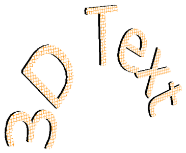

## **Přehled**

Aspose.Slides pro Node.js přes Java může vytvářet, upravovat, zachovávat a vykreslovat 3D formátování ve stylu PowerPointu pro tvary a text. Tento článek pokrývá 3D efekty jako rotace, extruze, zkosení, osvětlení, materiál, gradientové nebo obrázkové výplně a 3D text.

{}
Tento článek se zabývá 3D formátovacími efekty na tvarech a textu v PowerPointu. Nejedná se o vkládání nebo úpravu samostatných 3D modelových souborů. Když exportujete snímek do obrázku, PDF nebo HTML, Aspose.Slides vykreslí tyto 3D efekty do exportovaného 2D výstupu.
{}

## **Koncepty 3D formátování**

Použijte [Shape](https://reference.aspose.com/slides/cs/nodejs-java/aspose.slides/shape/).`getThreeDFormat()` k aplikaci 3D formátování na tvar. Vrácený objekt [ThreeDFormat](https://reference.aspose.com/slides/cs/nodejs-java/aspose.slides/threedformat/) řídí 3D scénu pro tento tvar.

Pro text použijte [TextFrameFormat](https://reference.aspose.com/slides/cs/nodejs-java/aspose.slides/textframeformat/).`getThreeDFormat()`. Tím se aplikuje 3D formátování na textový rámec místo těla tvaru.

Nejdůležitější členové API jsou:

| Člen API | Co řídí | Kdy použít |
|---|---|---|
| [getCamera](https://reference.aspose.com/slides/cs/nodejs-java/aspose.slides/threedformat/#getCamera) | Bod pohledu, přednastavený typ kamery, rotace, zoom a perspektiva. | Otočit objekt ve 3D prostoru nebo použít přednastavený 3D rotaci PowerPointu. |
| [getLightRig](https://reference.aspose.com/slides/cs/nodejs-java/aspose.slides/threedformat/#getLightRig) | Přednastavení světla, směr a rotace světla. | Změnit, jak se na 3D povrchu zobrazují světelné odrazy a stíny. |
| [getMaterial](https://reference.aspose.com/slides/cs/nodejs-java/aspose.slides/threedformat/#getMaterial) a [setMaterial](https://reference.aspose.com/slides/cs/nodejs-java/aspose.slides/threedformat/#setMaterial) | Materiál povrchu, například plochý, matný, plastový nebo kovový. | Nechat stejnou geometrii vypadat plochěji, měkčeji, leskleji nebo kovově. |
| [getExtrusionHeight](https://reference.aspose.com/slides/cs/nodejs-java/aspose.slides/threedformat/#getExtrusionHeight) a [setExtrusionHeight](https://reference.aspose.com/slides/cs/nodejs-java/aspose.slides/threedformat/#setExtrusionHeight) | Jak daleko tvar vyčnívá dozadu od své přední plochy. | Proměnit plochý tvar na viditelně silný 3D objekt. |
| [getExtrusionColor](https://reference.aspose.com/slides/cs/nodejs-java/aspose.slides/threedformat/#getExtrusionColor) | Barva extrudovaných stran. | Zviditelnit hloubku nebo sladit barvu stran s přední výplní. |
| [getDepth](https://reference.aspose.com/slides/cs/nodejs-java/aspose.slides/threedformat/#getDepth) a [setDepth](https://reference.aspose.com/slides/cs/nodejs-java/aspose.slides/threedformat/#setDepth) | Další 3D hloubka používaná PowerPoint 3D formátováním. | Jemně doladit hloubku pro tvary nebo text, zejména v kombinaci s nastavením zkosení a materiálu. |
| [getBevelTop](https://reference.aspose.com/slides/cs/nodejs-java/aspose.slides/threedformat/#getBevelTop) a [getBevelBottom](https://reference.aspose.com/slides/cs/nodejs-java/aspose.slides/threedformat/#getBevelBottom) | Vyvýšené nebo zakulacené hrany na přední a zadní ploše. | Přidat měkčený nebo formovaný okraj místo ostré ploché plochy. |
| [getContourColor](https://reference.aspose.com/slides/cs/nodejs-java/aspose.slides/threedformat/#getContourColor), [getContourWidth](https://reference.aspose.com/slides/cs/nodejs-java/aspose.slides/threedformat/#getContourWidth) a [setContourWidth](https://reference.aspose.com/slides/cs/nodejs-java/aspose.slides/threedformat/#setContourWidth) | Obrys kolem 3D objektu. | Zdůraznit hranice objektu ve vykresleném výstupu. |

## **Vytvoření 3D tvaru**

Tvar obvykle potřebuje čtyři typy nastavení, aby vypadal přesvědčivě 3D:

- Nastavení kamery, protože výchozí pohled zepředu může skrýt extruzi.
- Nastavení světla, protože osvětlení učiní plochy a strany čitelnými.
- Nastavení materiálu, protože povrch ovlivňuje, jak se světlo vykresluje.
- Nastavení extruze nebo hloubky, protože plochý tvar potřebuje tloušťku.

Následující příklad vytvoří obdélník, přidá text na jeho přední plochu, použije 3D formátování, uloží prezentaci jako PPTX a vykreslí snímek do PNG obrázku.

```javascript
const imageScale = 2;

const presentation = new aspose.slides.Presentation();
try {
    const slide = presentation.getSlides().get_Item(0);
    const shape = slide.getShapes().addAutoShape(aspose.slides.ShapeType.Rectangle, 200, 150, 200, 200);
    shape.getTextFrame().setText("3D");
    shape.getTextFrame().getParagraphs().get_Item(0).getParagraphFormat().getDefaultPortionFormat().setFontHeight(64);

    const blueColor = java.getStaticFieldValue("java.awt.Color", "BLUE");
    shape.getFillFormat().setFillType(java.newByte(aspose.slides.FillType.Solid));
    shape.getFillFormat().getSolidFillColor().setColor(blueColor);

    shape.getThreeDFormat().getCamera().setCameraType(aspose.slides.CameraPresetType.OrthographicFront);
    shape.getThreeDFormat().getCamera().setRotation(20, 30, 40);
    shape.getThreeDFormat().getLightRig().setLightType(aspose.slides.LightRigPresetType.Flat);
    shape.getThreeDFormat().getLightRig().setDirection(aspose.slides.LightingDirection.Top);
    shape.getThreeDFormat().setMaterial(aspose.slides.MaterialPresetType.Flat);
    shape.getThreeDFormat().setExtrusionHeight(100);
    shape.getThreeDFormat().getExtrusionColor().setColor(blueColor);

    const thumbnail = slide.getImage(imageScale, imageScale);
    try {
        thumbnail.save("shape_3d.png", aspose.slides.ImageFormat.Png);
    } finally {
        thumbnail.dispose();
    }

    presentation.save("shape_3d.pptx", aspose.slides.SaveFormat.Pptx);
} finally {
    presentation.dispose();
}
```

Vykreslený obrázek snímku zobrazuje obdélník jako silný 3D blok:


## **Otočení tvaru pomocí kamery**

V PowerPointu se 3D rotace nastavuje v panelu 3-D Rotation. Hodnoty rotace X, Y a Z odpovídají rotaci, kterou nastavíte pomocí API kamery.


V Aspose.Slides nastavte typ kamery a rotaci pomocí 3D formátu vráceného metodou `shape.getThreeDFormat()`:

```javascript
shape.getThreeDFormat().getCamera().setCameraType(aspose.slides.CameraPresetType.OrthographicFront);
shape.getThreeDFormat().getCamera().setRotation(20, 30, 40);
```

Použijte kameru, když potřebujete změnit, jak divák vidí objekt. Nemění 2D geometrii tvaru na snímku. Mění 3D pohledový úhel využívaný PowerPointem i Aspose.Slides při vykreslování.

## **Přidání extruze a hloubky**

Extruze způsobí, že tvar vypadá tlustě tím, že se prodlouží za přední plochu. V PowerPointu ovládací prvek hloubky nastavuje tuto viditelnou tloušťku a ovládací prvek barvy nastavuje barvu bočních ploch.


Nastavte výšku extruze pro tloušťku a barvu extruze pro barvu stran:

```javascript
const extrusionColor = java.newInstanceSync("java.awt.Color", 128, 0, 128);

shape.getThreeDFormat().getCamera().setRotation(20, 30, 40);
shape.getThreeDFormat().setExtrusionHeight(100);
shape.getThreeDFormat().getExtrusionColor().setColor(extrusionColor);
```

Použijte nastavení hloubky, když potřebujete přímo pracovat s hodnotou hloubky v PowerPointu nebo kombinovat hloubku se zkosením, materiálem a textovými efekty. V mnoha scénářích tvaru je výška extruze přehlednějším nastavením, protože přímo vyjadřuje viditelnou extruzi.

## **Použití gradientových nebo obrázkových výplní s 3D efekty**

3D formátování je nezávislé na výplni tvaru. Můžete na přední plochu použít jednolitou barvu, gradient, vzor nebo obrázkovou výplň a přitom používat stejné nastavení kamery, světla, materiálu a extruze.

Tento příklad aplikuje gradientovou výplň na tvar a tmavší barvu extruze na strany:

```javascript
const imageScale = 2;

const presentation = new aspose.slides.Presentation();
try {
    const slide = presentation.getSlides().get_Item(0);
    const shape = slide.getShapes().addAutoShape(aspose.slides.ShapeType.Rectangle, 200, 150, 250, 250);
    shape.getTextFrame().setText("3D Gradient");
    shape.getTextFrame().getParagraphs().get_Item(0).getParagraphFormat().getDefaultPortionFormat().setFontHeight(64);

    const blueColor = java.getStaticFieldValue("java.awt.Color", "BLUE");
    const orangeColor = java.getStaticFieldValue("java.awt.Color", "ORANGE");
    shape.getFillFormat().setFillType(java.newByte(aspose.slides.FillType.Gradient));
    shape.getFillFormat().getGradientFormat().getGradientStops().add(0, blueColor);
    shape.getFillFormat().getGradientFormat().getGradientStops().add(100, orangeColor);

    const darkOrangeColor = java.newInstanceSync("java.awt.Color", 255, 140, 0);
    shape.getThreeDFormat().getCamera().setCameraType(aspose.slides.CameraPresetType.OrthographicFront);
    shape.getThreeDFormat().getCamera().setRotation(10, 20, 30);
    shape.getThreeDFormat().getLightRig().setLightType(aspose.slides.LightRigPresetType.Flat);
    shape.getThreeDFormat().getLightRig().setDirection(aspose.slides.LightingDirection.Top);
    shape.getThreeDFormat().setMaterial(aspose.slides.MaterialPresetType.Flat);
    shape.getThreeDFormat().setExtrusionHeight(150);
    shape.getThreeDFormat().getExtrusionColor().setColor(darkOrangeColor);

    const thumbnail = slide.getImage(imageScale, imageScale);
    try {
        thumbnail.save("gradient_3d.png", aspose.slides.ImageFormat.Png);
    } finally {
        thumbnail.dispose();
    }
} finally {
    presentation.dispose();
}
```

Vykreslený výstup zachovává gradient na přední ploše a renderuje extruzi samostatně:


Chcete-li místo toho použít obrázkovou výplň, přidejte obrázek do prezentace a přiřaďte jej jako výplň tvaru:

```javascript
const sourceImage = aspose.slides.Images.fromFile("image.jpg");
let presentationImage;
try {
    presentationImage = presentation.getImages().addImage(sourceImage);
} finally {
    sourceImage.dispose();
}

shape.getFillFormat().setFillType(java.newByte(aspose.slides.FillType.Picture));
shape.getFillFormat().getPictureFillFormat().getPicture().setImage(presentationImage);
shape.getFillFormat().getPictureFillFormat().setPictureFillMode(aspose.slides.PictureFillMode.Stretch);

const darkOrangeColor = java.newInstanceSync("java.awt.Color", 255, 140, 0);
shape.getThreeDFormat().getCamera().setRotation(10, 20, 30);
shape.getThreeDFormat().setExtrusionHeight(150);
shape.getThreeDFormat().getExtrusionColor().setColor(darkOrangeColor);
```

Obrázek se vykreslí na přední ploše, zatímco extruze se vykreslí jako 3D boční plocha:


## **Použití 3D formátování na text**

3D formátování tvaru ovlivňuje tělo tvaru. 3D formátování textu ovlivňuje textový rámec. To je užitečné pro efekty podobné WordArt, kde samotná písmena potřebují extruzi, materiál, osvětlení a nastavení kamery.

Následující příklad vytvoří text se vzorovou výplní, použije transformaci WordArt a nakonfiguruje 3D nastavení na [TextFrameFormat](https://reference.aspose.com/slides/cs/nodejs-java/aspose.slides/textframeformat/):

```javascript
const imageScale = 2;

const presentation = new aspose.slides.Presentation();
try {
    const slide = presentation.getSlides().get_Item(0);
    const shape = slide.getShapes().addAutoShape(aspose.slides.ShapeType.Rectangle, 200, 150, 250, 250);
    shape.getFillFormat().setFillType(java.newByte(aspose.slides.FillType.NoFill));
    shape.getLineFormat().getFillFormat().setFillType(java.newByte(aspose.slides.FillType.NoFill));
    shape.getTextFrame().setText("3D Text");

    const portion = shape.getTextFrame().getParagraphs().get_Item(0).getPortions().get_Item(0);
    portion.getPortionFormat().getFillFormat().setFillType(java.newByte(aspose.slides.FillType.Pattern));
    const darkOrangeColor = java.newInstanceSync("java.awt.Color", 255, 140, 0);
    const whiteColor = java.getStaticFieldValue("java.awt.Color", "WHITE");
    portion.getPortionFormat().getFillFormat().getPatternFormat().getForeColor().setColor(darkOrangeColor);
    portion.getPortionFormat().getFillFormat().getPatternFormat().getBackColor().setColor(whiteColor);
    portion.getPortionFormat().getFillFormat().getPatternFormat().setPatternStyle(java.newByte(aspose.slides.PatternStyle.LargeGrid));

    shape.getTextFrame().getParagraphs().get_Item(0).getParagraphFormat().getDefaultPortionFormat().setFontHeight(128);

    const textFrameFormat = shape.getTextFrame().getTextFrameFormat();
    textFrameFormat.setTransform(java.newByte(aspose.slides.TextShapeType.ArchUp));
    textFrameFormat.getThreeDFormat().setExtrusionHeight(3.5);
    textFrameFormat.getThreeDFormat().setDepth(3);
    textFrameFormat.getThreeDFormat().setMaterial(aspose.slides.MaterialPresetType.Plastic);
    textFrameFormat.getThreeDFormat().getLightRig().setDirection(aspose.slides.LightingDirection.Top);
    textFrameFormat.getThreeDFormat().getLightRig().setLightType(aspose.slides.LightRigPresetType.Balanced);
    textFrameFormat.getThreeDFormat().getLightRig().setRotation(0, 0, 40);
    textFrameFormat.getThreeDFormat().getCamera().setCameraType(aspose.slides.CameraPresetType.PerspectiveContrastingRightFacing);

    const thumbnail = slide.getImage(imageScale, imageScale);
    try {
        thumbnail.save("text_3d.png", aspose.slides.ImageFormat.Png);
    } finally {
        thumbnail.dispose();
    }

    presentation.save("text_3d.pptx", aspose.slides.SaveFormat.Pptx);
} finally {
    presentation.dispose();
}
```

Text se vykreslí jako zakřivené, extrudované 3D písmo:



## **Chování při exportu a vykreslování**

Aspose.Slides zachovává 3D formátování při ukládání do formátů PowerPointu, jako je PPTX. Při vykreslování nebo exportu do formátů s pevnou rozlohou se 3D scéna rasterizuje nebo vykreslí do výstupu jako 2D výsledek. Toto platí, když vykreslujete snímky do [PNG](/slides/cs/nodejs-java/convert-powerpoint-to-png/), exportujete do [PDF](/slides/cs/nodejs-java/convert-powerpoint-to-pdf/), exportujete do [HTML](/slides/cs/nodejs-java/convert-powerpoint-to-html/), nebo generujete snímky pro [video conversion](/slides/cs/nodejs-java/convert-powerpoint-to-video/).

- Exportované obrázky a PDF nejsou interaktivní. Objekt nelze po exportu otáčet divákem.
- Konečný vzhled závisí na kombinaci kamery, světelného rig, materiálu, extruze, výplně a měřítka snímku.
- Pokud potřebujete zkontrolovat zděděné nebo na motivu založené hodnoty formátování, přečtěte si [efektivní vlastnosti tvaru](/slides/cs/nodejs-java/shape-effective-properties/).
- Některé výstupní formáty nemohou uložit editovatelné 3D formátování PowerPointu. V těchto formátech je vizuální výsledek vykreslený, místo aby byl zachován jako editovatelné 3D nastavení.

## **Často kladené dotazy**

**Může Aspose.Slides vytvářet interaktivní 3D prezentace?**  
Aspose.Slides vytváří a vykresluje 3D efekty PowerPointu pro tvary a text. Nevytváří interaktivní 3D scény v exportovaných obrázcích, PDF nebo HTML stránkách, které by mohly divák otáčet. V PPTX zůstává 3D formátování editovatelné v PowerPointu, kde je formát podporován.

**Jaký je rozdíl mezi 3D modelem a 3D efektem?**  
3D model je samostatný 3D objekt vložený do prezentace. 3D efekt je formátování aplikované na běžný PowerPoint tvar nebo text, jako rotace, extruze, zkosení, osvětlení a materiál. Tento článek se zabývá 3D efekty.

**Která nastavení jsou vyžadována pro viditelný 3D tvar?**  
Minimálně nastavte rotaci kamery a buď extruzi, nebo hloubku. V praxi také nastavte světelný rig a materiál, aby vykreslené plochy měly jasné odrazy a stíny.

**Mohu použít 3D efekty jak na tvary, tak na text?**  
Ano. Použijte [Shape](https://reference.aspose.com/slides/cs/nodejs-java/aspose.slides/shape/).`getThreeDFormat()` pro tělo tvaru a [TextFrameFormat](https://reference.aspose.com/slides/cs/nodejs-java/aspose.slides/textframeformat/).`getThreeDFormat()` pro text.

**Objeví se 3D efekty při exportu do obrázků, PDF, HTML nebo video snímků?**  
Ano. Aspose.Slides vykresluje 3D efekty při vytváření obrázků snímků, PDF výstupu, HTML výstupu a snímků používaných pro konverzi videa. Exportovaný výstup obsahuje vykreslený vzhled, nikoli editovatelný 3D objekt.

**Mohu přečíst konečné 3D hodnoty po aplikaci dědičnosti a nastavení motivu?**  
Ano. Použijte API efektivního formátování popsané v [efektivní vlastnosti tvaru](/slides/cs/nodejs-java/shape-effective-properties/) k přečtení konečných hodnot kamery, světelného rig, zkosení a souvisejících 3D hodnot.