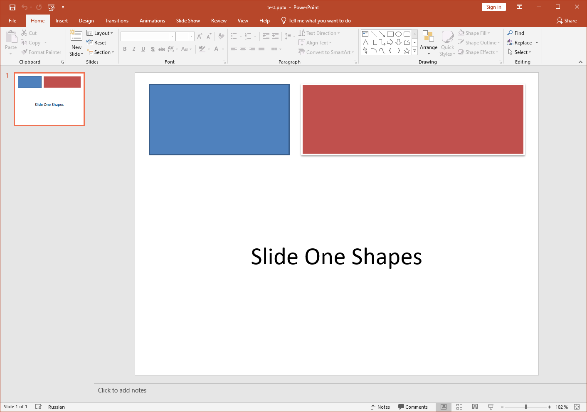

## **Přehled**

Aspose.Slides vám umožňuje převést prezentace PowerPoint do XPS uložením souboru PPT nebo PPTX ve formátu XPS. Tento článek vysvětluje, kdy může být formát XPS užitečný, a ukazuje, jak provést konverzi pomocí Aspose.Slides s výchozím nastavením nebo vlastním nastavením [XpsOptions](https://reference.aspose.com/slides/cs/nodejs-java/aspose.slides/xpsoptions/) .

## **O XPS**

Microsoft vyvinul [XPS](https://docs.fileformat.com/page-description-language/xps/) jako alternativu k [PDF](https://docs.fileformat.com/pdf/). Umožňuje tisk obsahu výstupem souboru, který je velmi podobný PDF. Formát XPS je založen na XML. Rozložení nebo struktura souboru XPS zůstává stejná na všech operačních systémech a tiskárnách. 

## **Kdy použít formát Microsoft XPS**

{} 

Chcete-li vidět, jak Aspose.Slides převádí prezentaci PPT nebo PPTX do formátu XPS, můžete si vyzkoušet [tuto bezplatnou online konverzní aplikaci](https://products.aspose.app/slides/cs/conversion). 

{} 

Pokud chcete snížit náklady na úložiště, můžete převést vaši prezentaci Microsoft PowerPoint do formátu XPS. Tím bude snazší ukládat, sdílet a tisknout vaše dokumenty. 

Microsoft i nadále poskytuje silnou podporu pro XPS ve Windows (dokonce i ve Windows 10), takže můžete zvážit ukládání souborů do tohoto formátu. Pokud pracujete s Windows 8.1, Windows 8, Windows 7 a Windows Vista, může být XPS pro určité operace ve skutečnosti nejlepší volbou. 

- **Windows 8** používá formát OXPS (Open XPS) pro soubory XPS. OXPS je standardizovaná verze původního formátu XPS. Windows 8 poskytuje lepší podporu pro soubory XPS než pro soubory PDF. 
  - **XPS:** Vestavěný prohlížeč/čtečka XPS a funkce tisku do XPS jsou dostupné. 
  - **PDF:** Čtečka PDF je dostupná, ale funkce tisku do PDF chybí. 

- **Windows 7 a Windows Vista** používají původní formát XPS. Tyto operační systémy také poskytují lepší podporu pro soubory XPS než pro PDF. 
  - **XPS:** Vestavěný prohlížeč XPS a funkce tisku do XPS jsou dostupné. 
  - **PDF:** Čtečka PDF chybí. Funkce tisku do PDF chybí. 

|<p>**Vstup PPT(X):**</p><p>****</p>|<p>**Výstup XPS:**</p><p>****</p>|
| :- | :- |

Microsoft nakonec implementoval podporu tisku do PDF pomocí funkce Tisk do PDF ve Windows 10. Dříve uživatelé očekávali, že budou dokumenty tisknout pomocí formátu XPS. 

## **Konverze XPS s Aspose.Slides**

V [**Aspose.Slides for Node.js via Java**](https://products.aspose.com/slides/cs/nodejs-java/) můžete použít metodu [**save**](https://reference.aspose.com/slides/cs/nodejs-java/aspose.slides/Presentation#save-java.lang.String-int-aspose.slides.ISaveOptions-) vystavenou třídou [Presentation](https://reference.aspose.com/slides/cs/nodejs-java/aspose.slides/Presentation) k převodu celé prezentace do dokumentu XPS.

Při převodu prezentace do XPS musíte prezentaci uložit s jedním z následujících nastavení:

- Výchozí nastavení (bez [**XPSOptions**](https://reference.aspose.com/slides/cs/nodejs-java/aspose.slides/xpsoptions))
- Vlastní nastavení (s [**XPSOptions**](https://reference.aspose.com/slides/cs/nodejs-java/aspose.slides/xpsoptions))

### **Převod prezentací do XPS pomocí výchozího nastavení**

Tento ukázkový kód v JavaScriptu ukazuje, jak převést prezentaci do dokumentu XPS pomocí standardních nastavení:

```javascript
// Vytvořte objekt Presentation, který představuje soubor prezentace
var pres = new aspose.slides.Presentation("Convert_XPS.pptx");
try {
    // Ukládání prezentace do dokumentu XPS
    pres.save("XPS_Output_Without_XPSOption.xps", aspose.slides.SaveFormat.Xps);
} finally {
    if (pres != null) {
        pres.dispose();
    }
}
```

### **Převod prezentací do XPS pomocí vlastního nastavení**

Tento ukázkový kód ukazuje, jak převést prezentaci do dokumentu XPS pomocí vlastního nastavení v JavaScriptu:

```javascript
// Vytvořte objekt Presentation, který představuje soubor prezentace
var pres = new aspose.slides.Presentation("Convert_XPS_Options.pptx");
try {
    // Vytvořte instanci třídy XpsOptions
    var options = new aspose.slides.XpsOptions();
    // Uložit MetaFiles jako PNG
    options.setSaveMetafilesAsPng(true);
    // Uložit prezentaci do dokumentu XPS
    pres.save("XPS_Output_With_Options.xps", aspose.slides.SaveFormat.Xps, options);
} finally {
    if (pres != null) {
        pres.dispose();
    }
}
```

## **Časté dotazy**

**Mohu uložit do XPS do proudu místo souboru?**

Ano—Aspose.Slides vám umožňuje exportovat přímo do proudu, což je ideální pro webová API, server‑side pipeline nebo jakýkoli scénář, kde chcete XPS odeslat bez zásahu do souborového systému.

**Přenášejí se skryté snímky do XPS a mohu je vyloučit?**

Ve výchozím nastavení jsou vykresleny pouze běžné (viditelné) snímky. Můžete [zahrnout nebo vyloučit skryté snímky](https://reference.aspose.com/slides/cs/nodejs-java/aspose.slides/xpsoptions/setshowhiddenslides/) prostřednictvím [nastavení exportu](https://reference.aspose.com/slides/cs/nodejs-java/aspose.slides/xpsoptions/) před uložením do XPS, čímž zajistíte, že výstup bude obsahovat přesně stránky, které chcete.