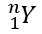

## **Přehled**

PowerPoint ukládá rovnice v jazyce Office Math Markup Language (OMML). S Aspose.Slides pro Node.js přes Java můžete programově vytvářet stejný typ matematického obsahu: zlomky, radikály, funkce, limity, N-ární operátory, matice, pole a formátované matematické bloky.

V PowerPointu uživatelé obvykle přidávají rovnice pomocí **Vložit > Rovnice**:


Výsledkem je editovatelný matematický text na snímku:


Aspose.Slides vytváří tento matematický text pomocí tří hlavních objektů:

- Matematický tvar vytvořený pomocí [addMathShape](https://reference.aspose.com/slides/cs/nodejs-java/aspose.slides/shapecollection/#addMathShape), je tvar, který obsahuje rovnici.
- [MathPortion](https://reference.aspose.com/slides/cs/nodejs-java/aspose.slides/mathportion/) ukládá matematický obsah uvnitř textového rámce tvaru.
- [MathParagraph](https://reference.aspose.com/slides/cs/nodejs-java/aspose.slides/mathparagraph/) obsahuje jeden nebo více objektů [MathBlock](https://reference.aspose.com/slides/cs/nodejs-java/aspose.slides/mathblock/).

Většina níže uvedených příkladů používá [MathematicalText](https://reference.aspose.com/slides/cs/nodejs-java/aspose.slides/mathematicaltext/) a plynulé metody z [MathElementBase](https://reference.aspose.com/slides/cs/nodejs-java/aspose.slides/mathelementbase/), aby byl kód stručný a čitelný.

Pro scénáře exportu do MathML viz [Export Math Equations from Presentations in Node.js via Java](/slides/cs/nodejs-java/exporting-math-equations/).

## **Vytvořit rovnici**

Tento příklad vytvoří matematický tvar a přidá Pythagorovu větu:


```javascript
let presentation = new aspose.slides.Presentation();
try {
    let slide = presentation.getSlides().get_Item(0);

    let mathShape = slide.getShapes().addMathShape(20, 20, 700, 120);
    let mathParagraph = mathShape.getTextFrame().getParagraphs()
            .get_Item(0).getPortions().get_Item(0).getMathParagraph();

    let equation = new aspose.slides.MathematicalText("c")
            .setSuperscript("2")
            .join("=")
            .join(new aspose.slides.MathematicalText("a").setSuperscript("2"))
            .join("+")
            .join(new aspose.slides.MathematicalText("b").setSuperscript("2"));

    mathParagraph.add(equation);

    presentation.save("pythagorean-theorem.pptx", aspose.slides.SaveFormat.Pptx);
} finally {
    presentation.dispose();
}
```

{}
`addMathShape` vytváří tvar, který již obsahuje matematický odstavec. Získejte první `MathPortion`, jeho `MathParagraph` a přidejte do něj matematické bloky nebo matematické elementy.
{}

## **Přidat zlomky**

Použijte [`divide`](https://reference.aspose.com/slides/cs/nodejs-java/aspose.slides/mathelementbase/) k vytvoření zlomku. Můžete vybrat styl zlomku pomocí [MathFractionTypes](https://reference.aspose.com/slides/cs/nodejs-java/aspose.slides/mathfractiontypes/).


```javascript
let presentation = new aspose.slides.Presentation();
try {
    let slide = presentation.getSlides().get_Item(0);

    let mathShape = slide.getShapes().addMathShape(20, 20, 700, 100);
    let mathParagraph = mathShape.getTextFrame().getParagraphs()
            .get_Item(0).getPortions().get_Item(0).getMathParagraph();

    let fraction = new aspose.slides.MathematicalText("1")
            .divide("x", aspose.slides.MathFractionTypes.Skewed);

    mathParagraph.add(new aspose.slides.MathBlock(fraction));

    presentation.save("fraction.pptx", aspose.slides.SaveFormat.Pptx);
} finally {
    presentation.dispose();
}
```

Pro svislý (stacked) zlomek použijte `MathFractionTypes.Bar`:

```javascript
let stackedFraction = new aspose.slides.MathematicalText("x + 1").divide("y - 1", aspose.slides.MathFractionTypes.Bar);
```

## **Přidat radikály**

Použijte [`radical`](https://reference.aspose.com/slides/cs/nodejs-java/aspose.slides/mathelementbase/) k vytvoření druhé odmocniny, kubické odmocniny nebo jiné odmocniny. Aktuální prvek se stane základem a argument určuje stupeň.


```javascript
let presentation = new aspose.slides.Presentation();
try {
    let slide = presentation.getSlides().get_Item(0);

    let mathShape = slide.getShapes().addMathShape(20, 20, 700, 100);
    let mathParagraph = mathShape.getTextFrame().getParagraphs()
            .get_Item(0).getPortions().get_Item(0).getMathParagraph();

    let radical = new aspose.slides.MathematicalText("x")
            .radical("n");

    mathParagraph.add(new aspose.slides.MathBlock(radical));

    presentation.save("radical.pptx", aspose.slides.SaveFormat.Pptx);
} finally {
    presentation.dispose();
}
```

## **Přidat funkce a limity**

Použijte [`asArgumentOfFunction`](https://reference.aspose.com/slides/cs/nodejs-java/aspose.slides/mathelementbase/) nebo [`function`](https://reference.aspose.com/slides/cs/nodejs-java/aspose.slides/mathelementbase/) pro funkce jako `sin(x)`, `log(x)` nebo vlastní názvy funkcí. Pro limity vložte `lim` do [MathLimit](https://reference.aspose.com/slides/cs/nodejs-java/aspose.slides/mathlimit/) nebo použijte [`setLowerLimit`](https://reference.aspose.com/slides/cs/nodejs-java/aspose.slides/mathelementbase/).


```javascript
let presentation = new aspose.slides.Presentation();
try {
    let slide = presentation.getSlides().get_Item(0);

    let mathShape = slide.getShapes().addMathShape(20, 20, 700, 100);
    let mathParagraph = mathShape.getTextFrame().getParagraphs()
            .get_Item(0).getPortions().get_Item(0).getMathParagraph();

    let limit = new aspose.slides.MathematicalText("lim")
            .setLowerLimit("x\u2192\u221E")
            .function("x");

    mathParagraph.add(new aspose.slides.MathBlock(limit));

    presentation.save("functions-and-limits.pptx", aspose.slides.SaveFormat.Pptx);
} finally {
    presentation.dispose();
}
```

Pro vlastní název funkce nastavte název funkce jako aktuální prvek:

```javascript
let customFunction = new aspose.slides.MathematicalText("f").function("x + 1");
```

## **Přidat N-ární operátory a integrály**

Použijte [`nary`](https://reference.aspose.com/slides/cs/nodejs-java/aspose.slides/mathelementbase/) pro součty, sjednocení, průniky a další velké operátory. Použijte [`integral`](https://reference.aspose.com/slides/cs/nodejs-java/aspose.slides/mathelementbase/) pro integrály. Obě metody umožňují nastavit dolní a horní limity.


```javascript
let presentation = new aspose.slides.Presentation();
try {
    let slide = presentation.getSlides().get_Item(0);

    let mathShape = slide.getShapes().addMathShape(20, 20, 700, 120);
    let mathParagraph = mathShape.getTextFrame().getParagraphs()
            .get_Item(0).getPortions().get_Item(0).getMathParagraph();

    let summationBase = new aspose.slides.MathematicalText("x")
            .setSuperscript("k")
            .join(new aspose.slides.MathematicalText("a").setSuperscript("n-k"));

    let summation = summationBase.nary(aspose.slides.MathNaryOperatorTypes.Summation, "k=0", "n");

    mathParagraph.add(new aspose.slides.MathBlock(summation));

    presentation.save("nary-operators.pptx", aspose.slides.SaveFormat.Pptx);
} finally {
    presentation.dispose();
}
```

N-ární operátory slouží pro velké operátory s volitelnými limity. Jednoduché operátory jako `+`, `-` a `=` jsou obvykle přidávány jako `MathematicalText` a spojeny do výrazu.

Pro integrál použijte `integral`:

```javascript
let integralBase = new aspose.slides.MathematicalText("x").join(new aspose.slides.MathematicalText("dx").toBox());
let integral = integralBase.integral(aspose.slides.MathIntegralTypes.Simple, "0", "1");
```

## **Přidat matice**

Použijte [MathMatrix](https://reference.aspose.com/slides/cs/nodejs-java/aspose.slides/mathmatrix/) pro řádky a sloupce. Matice standardně neobsahují závorky, proto je obalte, pokud potřebujete kulaté, hranaté nebo složené závorky.


```javascript
let presentation = new aspose.slides.Presentation();
try {
    let slide = presentation.getSlides().get_Item(0);

    let mathShape = slide.getShapes().addMathShape(20, 20, 700, 120);
    let mathParagraph = mathShape.getTextFrame().getParagraphs()
            .get_Item(0).getPortions().get_Item(0).getMathParagraph();

    let matrix = new aspose.slides.MathMatrix(2, 3);
    matrix.set_Item(0, 0, new aspose.slides.MathematicalText("1"));
    matrix.set_Item(0, 1, new aspose.slides.MathematicalText("x"));
    matrix.set_Item(1, 0, new aspose.slides.MathematicalText("x"));
    matrix.set_Item(1, 1, new aspose.slides.MathematicalText("2"));
    matrix.set_Item(1, 2, new aspose.slides.MathematicalText("y"));

    mathParagraph.add(new aspose.slides.MathBlock(matrix));

    presentation.save("matrix.pptx", aspose.slides.SaveFormat.Pptx);
} finally {
    presentation.dispose();
}
```

## **Přidat pole rovnic**

Použijte [`toMathArray`](https://reference.aspose.com/slides/cs/nodejs-java/aspose.slides/mathelementbase/) , když potřebujete zarovnané rovnice nebo svislý řetězec výrazů.


```javascript
let presentation = new aspose.slides.Presentation();
try {
    let slide = presentation.getSlides().get_Item(0);

    let mathShape = slide.getShapes().addMathShape(20, 20, 700, 140);
    let mathParagraph = mathShape.getTextFrame().getParagraphs()
            .get_Item(0).getPortions().get_Item(0).getMathParagraph();

    let equationArray = new aspose.slides.MathematicalText("x")
            .join("y")
            .toMathArray();

    mathParagraph.add(new aspose.slides.MathBlock(equationArray));

    presentation.save("equation-array.pptx", aspose.slides.SaveFormat.Pptx);
} finally {
    presentation.dispose();
}
```

## **Přidat trigonometrické funkce**

Použijte [`asArgumentOfFunction`](https://reference.aspose.com/slides/cs/nodejs-java/aspose.slides/mathelementbase/) , když je argument aktuální prvek a název funkce je známý.


```javascript
let presentation = new aspose.slides.Presentation();
try {
    let slide = presentation.getSlides().get_Item(0);

    let mathShape = slide.getShapes().addMathShape(20, 20, 700, 100);
    let mathParagraph = mathShape.getTextFrame().getParagraphs()
            .get_Item(0).getPortions().get_Item(0).getMathParagraph();

    let cosine = new aspose.slides.MathematicalText("2x")
            .asArgumentOfFunction(aspose.slides.MathFunctionsOfOneArgument.Cos);

    mathParagraph.add(new aspose.slides.MathBlock(cosine));

    presentation.save("trigonometric-function.pptx", aspose.slides.SaveFormat.Pptx);
} finally {
    presentation.dispose();
}
```

## **Přidat dolní a horní indexy**

Použijte pomocníky pro dolní a horní indexy pro indexy a mocniny. Když mají být indexy vlevo od základny, použijte [`setSubSuperscriptOnTheLeft`](https://reference.aspose.com/slides/cs/nodejs-java/aspose.slides/mathelementbase/) .



```javascript
let presentation = new aspose.slides.Presentation();
try {
    let slide = presentation.getSlides().get_Item(0);

    let mathShape = slide.getShapes().addMathShape(20, 20, 700, 100);
    let mathParagraph = mathShape.getTextFrame().getParagraphs()
            .get_Item(0).getPortions().get_Item(0).getMathParagraph();

    let scripts = new aspose.slides.MathematicalText("Y")
            .setSubSuperscriptOnTheLeft("1", "n");

    mathParagraph.add(new aspose.slides.MathBlock(scripts));

    presentation.save("subscript-superscript.pptx", aspose.slides.SaveFormat.Pptx);
} finally {
    presentation.dispose();
}
```

## **Přidat ohraničovače**

Použijte [`enclose`](https://reference.aspose.com/slides/cs/nodejs-java/aspose.slides/mathelementbase/) , aby byl výraz vložen do ohraničovačů. Můžete také nastavit znak oddělovače pro výrazy v ohraničovačích, které obsahují několik prvků.


```javascript
let presentation = new aspose.slides.Presentation();
try {
    let slide = presentation.getSlides().get_Item(0);

    let mathShape = slide.getShapes().addMathShape(20, 20, 700, 100);
    let mathParagraph = mathShape.getTextFrame().getParagraphs()
            .get_Item(0).getPortions().get_Item(0).getMathParagraph();

    let delimiter = new aspose.slides.MathematicalText("x")
            .join("y")
            .join("z")
            .enclose(java.newChar('<'), java.newChar('>'));
    delimiter.setSeparatorCharacter(java.newChar('|'));

    mathParagraph.add(new aspose.slides.MathBlock(delimiter));

    presentation.save("delimiters.pptx", aspose.slides.SaveFormat.Pptx);
} finally {
    presentation.dispose();
}
```

## **Přidat ohraničený rámeček**

Použijte [`toBorderBox`](https://reference.aspose.com/slides/cs/nodejs-java/aspose.slides/mathelementbase/) , když má být rovnice sama ohraničena rámečkem.


```javascript
let presentation = new aspose.slides.Presentation();
try {
    let slide = presentation.getSlides().get_Item(0);

    let mathShape = slide.getShapes().addMathShape(20, 20, 700, 100);
    let mathParagraph = mathShape.getTextFrame().getParagraphs()
            .get_Item(0).getPortions().get_Item(0).getMathParagraph();

    let boxedEquation = new aspose.slides.MathematicalText("a")
            .setSuperscript("2")
            .join("=")
            .join(new aspose.slides.MathematicalText("b").setSuperscript("2"))
            .join("+")
            .join(new aspose.slides.MathematicalText("c").setSuperscript("2"))
            .toBorderBox();

    mathParagraph.add(new aspose.slides.MathBlock(boxedEquation));

    presentation.save("border-box.pptx", aspose.slides.SaveFormat.Pptx);
} finally {
    presentation.dispose();
}
```

## **Seskupit termíny**

Použijte [`group`](https://reference.aspose.com/slides/cs/nodejs-java/aspose.slides/mathelementbase/) , aby se nad nebo pod výraz vložil znak seskupení. Přidejte limit pro označení seskupených termínů.


```javascript
let presentation = new aspose.slides.Presentation();
try {
    let slide = presentation.getSlides().get_Item(0);

    let mathShape = slide.getShapes().addMathShape(20, 20, 700, 120);
    let mathParagraph = mathShape.getTextFrame().getParagraphs()
            .get_Item(0).getPortions().get_Item(0).getMathParagraph();

    let grouped = new aspose.slides.MathematicalText("x + y")
            .group(java.newChar('\u23DF'), aspose.slides.MathTopBotPositions.Bottom, aspose.slides.MathTopBotPositions.Top)
            .setLowerLimit("any text");

    mathParagraph.add(new aspose.slides.MathBlock(grouped));

    presentation.save("grouped-terms.pptx", aspose.slides.SaveFormat.Pptx);
} finally {
    presentation.dispose();
}
```

## **Formátovat matematické elementy**

Používejte pomocníky pro formátování jen tam, kde objasňují vzorec. Například [`overbar`](https://reference.aspose.com/slides/cs/nodejs-java/aspose.slides/mathelementbase/) umístí čáru nad matematický element.


```javascript
let presentation = new aspose.slides.Presentation();
try {
    let slide = presentation.getSlides().get_Item(0);

    let mathShape = slide.getShapes().addMathShape(20, 20, 700, 100);
    let mathParagraph = mathShape.getTextFrame().getParagraphs()
            .get_Item(0).getPortions().get_Item(0).getMathParagraph();

    let overbar = new aspose.slides.MathematicalText("ABC").overbar();

    mathParagraph.add(new aspose.slides.MathBlock(overbar));

    presentation.save("overbar.pptx", aspose.slides.SaveFormat.Pptx);
} finally {
    presentation.dispose();
}
```

## **Rychlý přehled**

| Úkol | Hlavní API |
| --- | --- |
| Vytvořit matematický text | [MathematicalText](https://reference.aspose.com/slides/cs/nodejs-java/aspose.slides/mathematicaltext/) |
| Kombinovat elementy | [join](https://reference.aspose.com/slides/cs/nodejs-java/aspose.slides/mathelementbase/) |
| Vytvořit zlomky | [divide](https://reference.aspose.com/slides/cs/nodejs-java/aspose.slides/mathelementbase/) |
| Přidat horní nebo dolní index | [setSuperscript](https://reference.aspose.com/slides/cs/nodejs-java/aspose.slides/mathelementbase/), [setSubscript](https://reference.aspose.com/slides/cs/nodejs-java/aspose.slides/mathelementbase/) |
| Přidat funkce | [function](https://reference.aspose.com/slides/cs/nodejs-java/aspose.slides/mathelementbase/), [asArgumentOfFunction](https://reference.aspose.com/slides/cs/nodejs-java/aspose.slides/mathelementbase/) |
| Přidat radikály | [radical](https://reference.aspose.com/slides/cs/nodejs-java/aspose.slides/mathelementbase/) |
| Přidat limity | [setLowerLimit](https://reference.aspose.com/slides/cs/nodejs-java/aspose.slides/mathelementbase/), [setUpperLimit](https://reference.aspose.com/slides/cs/nodejs-java/aspose.slides/mathelementbase/) |
| Přidat skripty vlevo | [setSubSuperscriptOnTheLeft](https://reference.aspose.com/slides/cs/nodejs-java/aspose.slides/mathelementbase/) |
| Přidat součty a integrály | [nary](https://reference.aspose.com/slides/cs/nodejs-java/aspose.slides/mathelementbase/), [integral](https://reference.aspose.com/slides/cs/nodejs-java/aspose.slides/mathelementbase/) |
| Přidat matice | [MathMatrix](https://reference.aspose.com/slides/cs/nodejs-java/aspose.slides/mathmatrix/) |
| Přidat pole rovnic | [toMathArray](https://reference.aspose.com/slides/cs/nodejs-java/aspose.slides/mathelementbase/) |
| Přidat ohraničovače | [enclose](https://reference.aspose.com/slides/cs/nodejs-java/aspose.slides/mathelementbase/) |
| Přidat čáry a rámečky | [overbar](https://reference.aspose.com/slides/cs/nodejs-java/aspose.slides/mathelementbase/), [toBorderBox](https://reference.aspose.com/slides/cs/nodejs-java/aspose.slides/mathelementbase/) |
| Seskupit termíny | [group](https://reference.aspose.com/slides/cs/nodejs-java/aspose.slides/mathelementbase/) |

## **Často kladené otázky**

**Mohu upravit existující rovnici v PowerPointu?**

Ano. Otevřete prezentaci, vyhledejte tvar, který obsahuje `MathPortion`, získejte jeho `MathParagraph` a aktualizujte matematické bloky v tomto odstavci.

**Ukládají se rovnice jako editovatelná matematika v PowerPointu?**

Ano. Při uložení do PPTX Aspose.Slides zapíše rovnici jako editovatelný obsah Office math.

**Mohu exportovat rovnice do LaTeXu?**

Aspose.Slides exportuje matematické rovnice do MathML. Pokud potřebujete LaTeX, nejprve exportujte do MathML a poté převěďte MathML pomocí nástroje, který podporuje požadovaný LaTeX dialekt.