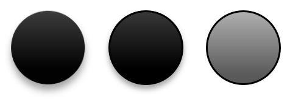

## **Úvod**

Prezentace téma určuje vlastnosti návrhových prvků. Když vyberete téma prezentace, v podstatě volíte konkrétní sadu vizuálních prvků a jejich vlastností.

V PowerPointu téma zahrnuje barvy, [písma](/slides/cs/nodejs-java/powerpoint-fonts/), [styly pozadí](/slides/cs/nodejs-java/presentation-background/) a efekty.


## **Změna barvy tématu**

PowerPoint téma používá konkrétní sadu barev pro různé prvky na snímku. Pokud se vám barvy nelíbí, můžete je změnit aplikací nových barev pro téma. Pro výběr nové barvy tématu poskytuje Aspose.Slides hodnoty v enumeraci [SchemeColor](https://reference.aspose.com/slides/cs/nodejs-java/aspose.slides/SchemeColor).

```javascript
var pres = new aspose.slides.Presentation();
try {
    var shape = pres.getSlides().get_Item(0).getShapes().addAutoShape(aspose.slides.ShapeType.Rectangle, 10, 10, 100, 100);
    shape.getFillFormat().setFillType(java.newByte(aspose.slides.FillType.Solid));
    shape.getFillFormat().getSolidFillColor().setSchemeColor(aspose.slides.SchemeColor.Accent4);
} finally {
    if (pres != null) {
        pres.dispose();
    }
}
```

Takto můžete zjistit efektivní hodnotu výsledné barvy:

```javascript
var fillEffective = shape.getFillFormat().getEffective();
var effectiveColor = fillEffective.getSolidFillColor();
console.log(java.callStaticMethodSync("java.lang.String", "format", "Color [A=%d, R=%d, G=%d, B=%d]", effectiveColor.getAlpha(), effectiveColor.getRed(), effectiveColor.getGreen(), effectiveColor.getBlue()));
```

Pro další demonstraci operace změny barvy vytvoříme další prvek a přiřadíme mu akcentní barvu (z počáteční operace). Poté změníme barvu v tématu:

```javascript
var otherShape = pres.getSlides().get_Item(0).getShapes().addAutoShape(aspose.slides.ShapeType.Rectangle, 10, 120, 100, 100);
otherShape.getFillFormat().setFillType(java.newByte(aspose.slides.FillType.Solid));
otherShape.getFillFormat().getSolidFillColor().setSchemeColor(aspose.slides.SchemeColor.Accent4);
pres.getMasterTheme().getColorScheme().getAccent4().setColor(java.getStaticFieldValue("java.awt.Color", "RED"));
```

Nová barva se automaticky použije na oba prvky.

### **Nastavení barvy tématu z doplňkové palety**

Když použijete transformace luminance na hlavní barvu tématu(1), vzniknou barvy z doplňkové palety(2). Pak můžete tyto barvy tématu nastavit a získat.


**1** - Hlavní barvy tématu  
**2** - Barvy z doplňkové palety.

```javascript
var presentation = new aspose.slides.Presentation();
try {
    var slide = presentation.getSlides().get_Item(0);
    // Akcent 4
    var shape1 = slide.getShapes().addAutoShape(aspose.slides.ShapeType.Rectangle, 10, 10, 50, 50);
    shape1.getFillFormat().setFillType(java.newByte(aspose.slides.FillType.Solid));
    shape1.getFillFormat().getSolidFillColor().setSchemeColor(aspose.slides.SchemeColor.Accent4);
    // Akcent 4, světlejší 80%
    var shape2 = slide.getShapes().addAutoShape(aspose.slides.ShapeType.Rectangle, 10, 70, 50, 50);
    shape2.getFillFormat().setFillType(java.newByte(aspose.slides.FillType.Solid));
    shape2.getFillFormat().getSolidFillColor().setSchemeColor(aspose.slides.SchemeColor.Accent4);
    shape2.getFillFormat().getSolidFillColor().getColorTransform().add(aspose.slides.ColorTransformOperation.MultiplyLuminance, 0.2);
    shape2.getFillFormat().getSolidFillColor().getColorTransform().add(aspose.slides.ColorTransformOperation.AddLuminance, 0.8);
    // Akcent 4, světlejší 60%
    var shape3 = slide.getShapes().addAutoShape(aspose.slides.ShapeType.Rectangle, 10, 130, 50, 50);
    shape3.getFillFormat().setFillType(java.newByte(aspose.slides.FillType.Solid));
    shape3.getFillFormat().getSolidFillColor().setSchemeColor(aspose.slides.SchemeColor.Accent4);
    shape3.getFillFormat().getSolidFillColor().getColorTransform().add(aspose.slides.ColorTransformOperation.MultiplyLuminance, 0.4);
    shape3.getFillFormat().getSolidFillColor().getColorTransform().add(aspose.slides.ColorTransformOperation.AddLuminance, 0.6);
    // Akcent 4, světlejší 40%
    var shape4 = slide.getShapes().addAutoShape(aspose.slides.ShapeType.Rectangle, 10, 190, 50, 50);
    shape4.getFillFormat().setFillType(java.newByte(aspose.slides.FillType.Solid));
    shape4.getFillFormat().getSolidFillColor().setSchemeColor(aspose.slides.SchemeColor.Accent4);
    shape4.getFillFormat().getSolidFillColor().getColorTransform().add(aspose.slides.ColorTransformOperation.MultiplyLuminance, 0.6);
    shape4.getFillFormat().getSolidFillColor().getColorTransform().add(aspose.slides.ColorTransformOperation.AddLuminance, 0.4);
    // Akcent 4, tmavší 25%
    var shape5 = slide.getShapes().addAutoShape(aspose.slides.ShapeType.Rectangle, 10, 250, 50, 50);
    shape5.getFillFormat().setFillType(java.newByte(aspose.slides.FillType.Solid));
    shape5.getFillFormat().getSolidFillColor().setSchemeColor(aspose.slides.SchemeColor.Accent4);
    shape5.getFillFormat().getSolidFillColor().getColorTransform().add(aspose.slides.ColorTransformOperation.MultiplyLuminance, 0.75);
    // Akcent 4, tmavší 50%
    var shape6 = slide.getShapes().addAutoShape(aspose.slides.ShapeType.Rectangle, 10, 310, 50, 50);
    shape6.getFillFormat().setFillType(java.newByte(aspose.slides.FillType.Solid));
    shape6.getFillFormat().getSolidFillColor().setSchemeColor(aspose.slides.SchemeColor.Accent4);
    shape6.getFillFormat().getSolidFillColor().getColorTransform().add(aspose.slides.ColorTransformOperation.MultiplyLuminance, 0.5);
    presentation.save(path + "example_accent4.pptx", aspose.slides.SaveFormat.Pptx);
} finally {
    if (presentation != null) {
        presentation.dispose();
    }
}
```

### **Mapování `SchemeColor` na barvy `ColorScheme`**

Když pracujete s [SchemeColor](https://reference.aspose.com/slides/cs/nodejs-java/aspose.slides/schemecolor/), možná si všimnete, že obsahuje následující hodnoty barev tématu: `Background1`, `Background2`, `Text1` a `Text2`.

Nicméně `Presentation.getMasterTheme().getColorScheme()` vrací [ColorScheme](https://reference.aspose.com/slides/cs/nodejs-java/aspose.slides/colorscheme/), který poskytuje odpovídající barvy jako: `Dark1`, `Dark2`, `Light1` a `Light2`.

Tento rozdíl je jen v názvech. Tyto hodnoty odkazují na stejné sloty barev tématu a mapování je pevné:

* `Text1` = `Dark1`
* `Background1` = `Light1`
* `Text2` = `Dark2`
* `Background2` = `Light2`

Neexistuje žádná dynamická konverze mezi `Text`/`Background` a `Dark`/`Light`. Jedná se jen o alternativní názvy pro stejné barvy tématu.

Rozdíl v názvech pochází z terminologie Microsoft Office. Starší verze Office používaly `Dark 1`, `Light 1`, `Dark 2` a `Light 2`, zatímco novější verze UI zobrazují stejné sloty jako `Text 1`, `Background 1`, `Text 2` a `Background 2`.

## **Změna písma tématu**

Aby bylo možné vybírat písma pro témata a další účely, Aspose.Slides používá tyto speciální identifikátory (podobně jako v PowerPointu):

* **+mn-lt** - Tělo písmo Latin (Minor Latin Font)
* **+mj-lt** - Nadpis písmo Latin (Major Latin Font)
* **+mn-ea** - Tělo písmo East Asian (Minor East Asian Font)
* **+mj-ea** - Nadpis písmo East Asian (Major East Asian Font)

Ukázkový JavaScript kód ukazuje, jak přiřadit latinské písmo k elementu tématu:

```javascript
var shape = pres.getSlides().get_Item(0).getShapes().addAutoShape(aspose.slides.ShapeType.Rectangle, 10, 10, 100, 100);
var paragraph = new aspose.slides.Paragraph();
var portion = new aspose.slides.Portion("Theme text format");
paragraph.getPortions().add(portion);
shape.getTextFrame().getParagraphs().add(paragraph);
portion.getPortionFormat().setLatinFont(new aspose.slides.FontData("+mn-lt"));
```

Ukázkový JavaScript kód ukazuje, jak změnit písmo tématu prezentace:

```javascript
pres.getMasterTheme().getFontScheme().getMinor().setLatinFont(new aspose.slides.FontData("Arial"));
```

Písmo ve všech textových polích bude aktualizováno.

{} 
Možná budete chtít zobrazit [PowerPoint písma](/slides/cs/nodejs-java/powerpoint-fonts/).
{}

## **Změna stylu pozadí tématu**

Ve výchozím nastavení aplikace PowerPoint poskytuje 12 předdefinovaných pozadí, ale v typické prezentaci jsou uložena jen 3 z těchto 12 pozadí. 


Například po uložení prezentace v aplikaci PowerPoint můžete spustit tento JavaScript kód a zjistit počet předdefinovaných pozadí v prezentaci:

```javascript
var pres = new aspose.slides.Presentation("pres.pptx");
try {
    var numberOfBackgroundFills = pres.getMasterTheme().getFormatScheme().getBackgroundFillStyles().size();
    console.log("Number of background fill styles for theme is " + numberOfBackgroundFills);
} finally {
    if (pres != null) {
        pres.dispose();
    }
}
```

{} 
Pomocí vlastnosti [BackgroundFillStyles](https://reference.aspose.com/slides/cs/nodejs-java/aspose.slides/FormatScheme#getBackgroundFillStyles--) ze třídy [FormatScheme](https://reference.aspose.com/slides/cs/nodejs-java/aspose.slides/FormatScheme) můžete přidat nebo získat styl pozadí v tématu PowerPointu.
{} 

Tento JavaScript kód ukazuje, jak nastavit pozadí pro prezentaci:

```javascript
pres.getMasters().get_Item(0).getBackground().setStyleIndex(2);
```

**Průvodce indexem**: 0 znamená žádné vyplnění. Index začíná od 1.

{} 
Možná budete chtít zobrazit [PowerPoint pozadí](/slides/cs/nodejs-java/presentation-background/).
{}

## **Změna efektu tématu**

PowerPoint téma obvykle obsahuje 3 hodnoty pro každé pole stylu. Tato pole jsou sloučena do těchto 3 efektů: jemný, střední a intenzivní. Například toto je výsledek, když jsou efekty aplikovány na konkrétní tvar:



Při použití 3 vlastností ([FillStyles](https://reference.aspose.com/slides/cs/nodejs-java/aspose.slides/FormatScheme#getFillStyles--), [LineStyles](https://reference.aspose.com/slides/cs/nodejs-java/aspose.slides/FormatScheme#getLineStyles--), [EffectStyles](https://reference.aspose.com/slides/cs/nodejs-java/aspose.slides/FormatScheme#getEffectStyles--)) ze třídy [FormatScheme](https://reference.aspose.com/slides/cs/nodejs-java/aspose.slides/FormatScheme) můžete měnit elementy v tématu (dokonce flexibilněji než možnosti v PowerPointu).

```javascript
var pres = new aspose.slides.Presentation("Subtle_Moderate_Intense.pptx");
try {
    pres.getMasterTheme().getFormatScheme().getLineStyles().get_Item(0).getFillFormat().getSolidFillColor().setColor(java.getStaticFieldValue("java.awt.Color", "RED"));
    pres.getMasterTheme().getFormatScheme().getFillStyles().get_Item(2).setFillType(java.newByte(aspose.slides.FillType.Solid));
    pres.getMasterTheme().getFormatScheme().getFillStyles().get_Item(2).getSolidFillColor().setColor(java.getStaticFieldValue("java.awt.Color", "GREEN"));
    pres.getMasterTheme().getFormatScheme().getEffectStyles().get_Item(2).getEffectFormat().getOuterShadowEffect().setDistance(10.0);
    pres.save("Design_04_Subtle_Moderate_Intense-out.pptx", aspose.slides.SaveFormat.Pptx);
} finally {
    if (pres != null) {
        pres.dispose();
    }
}
```

Výsledné změny ve vyplňovací barvě, typu výplně, stínovém efektu atd.:


## **FAQ**

**Mohu aplikovat téma na jednotlivý snímek bez změny masteru?**

Ano. Aspose.Slides podporuje přepsání tématu na úrovni snímku, takže můžete použít lokální téma pouze na tento snímek a zároveň zachovat master téma beze změny (prostřednictvím [SlideThemeManager](https://reference.aspose.com/slides/cs/nodejs-java/aspose.slides/slidethememanager/)).

**Jaký je nejbezpečnější způsob přenést téma z jedné prezentace do druhé?**

[Klonovat snímky](/slides/cs/nodejs-java/clone-slides/) spolu s jejich masterem do cílové prezentace. Tím se zachová původní master, rozvržení a přidružené téma, takže vzhled zůstane konzistentní.

**Jak mohu zobrazit „efektivní“ hodnoty po veškerém dědění a přepsání?**

Použijte „efektivní“ pohledy API [/slides/cs/nodejs-java/shape-effective-properties/] pro téma/barvu/písmo/efekt. Tyto vracejí rozřešené, finální vlastnosti po aplikaci masteru a případných lokálních přepsání.