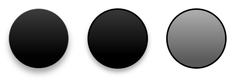

## **Úvod**

Motiv prezentace definuje koordinovanou sadu barev, písem, stylů pozadí, výplní, čar a efektů. Objektům citlivým na motiv se odkazuje na tyto sdílené definice místo ukládání každé vizuální vlastnosti jako pevné hodnoty, takže změna motivu může najednou aktualizovat mnoho objektů.

V Aspose.Slides je motiv na úrovni prezentace dostupný pomocí [Presentation.getMasterTheme](https://reference.aspose.com/slides/cs/nodejs-java/aspose.slides/presentation/getmastertheme/). Prezentace může také obsahovat přepsání motivu na nižších úrovních. Master může přepsat motiv prezentace pomocí [MasterThemeManager.getOverrideTheme](https://reference.aspose.com/slides/cs/nodejs-java/aspose.slides/masterthememanager/), zatímco rozložení nebo jednotlivý snímek může přepsat svůj zděděný motiv pomocí [BaseOverrideThemeManager.getOverrideTheme](https://reference.aspose.com/slides/cs/nodejs-java/aspose.slides/baseoverridethememanager/). V praxi se efektivní motiv pro snímek řeší touto řetězovou dědičností: motiv prezentace, přepsání masteru, přepsání rozložení a přepsání snímku.


Níže uvedené sekce ukazují nejčastější postupy práce s motivem: kontrola motivu, změna barev a písem, kopírování nebo použití motivu, aktualizace stylů pozadí a efektů a čtení efektivních hodnot po vyřešení dědičnosti a přepsání.

## **Prohlédnutí motivu**

Objekt [MasterTheme](https://reference.aspose.com/slides/cs/nodejs-java/aspose.slides/mastertheme/) zpřístupňuje schéma barev motivu, schéma písem a schéma formátů pomocí [MasterTheme.getColorScheme](https://reference.aspose.com/slides/cs/nodejs-java/aspose.slides/mastertheme/), [MasterTheme.getFontScheme](https://reference.aspose.com/slides/cs/nodejs-java/aspose.slides/mastertheme/) a [MasterTheme.getFormatScheme](https://reference.aspose.com/slides/cs/nodejs-java/aspose.slides/mastertheme/). Kontrola těchto kolekcí před jejich změnou je zvláště užitečná, když prezentace pochází z externího zdroje, protože počet a obsah položek stylů se může lišit.

Následující příklad načte hlavní vlastnosti motivu a vypíše, kolik stylů pozadí, výplní, čar a efektů je v motivu uloženo:

```javascript
const aspose = {};
aspose.slides = require("aspose.slides.via.java");

const presentation = new aspose.slides.Presentation("input.pptx");
try {
    const theme = presentation.getMasterTheme();
    console.log("Theme name: " + theme.getName());
    console.log("Accent 1: " + theme.getColorScheme().getAccent1().getColor());
    console.log("Major Latin font: " + theme.getFontScheme().getMajor().getLatinFont().getFontName());
    console.log("Minor Latin font: " + theme.getFontScheme().getMinor().getLatinFont().getFontName());
    console.log("Background fill styles: " + theme.getFormatScheme().getBackgroundFillStyles().size());
    console.log("Fill styles: " + theme.getFormatScheme().getFillStyles().size());
    console.log("Line styles: " + theme.getFormatScheme().getLineStyles().size());
    console.log("Effect styles: " + theme.getFormatScheme().getEffectStyles().size());
} finally {
    presentation.dispose();
}
```

Pokud soubor používá více masterů, nepředpokládejte, že každý snímek má stejný efektivní motiv. Prohlédněte si master přiřazený ke snímku a používejte postup efektivního motivu uvedený později v tomto článku, pokud mohou být přítomna přepsání rozložení nebo snímku.

## **Změna barev motivu**

Výplně, čáry a text citlivé na motiv mohou odkazovat na logickou barvu ze seznamu [SchemeColor](https://reference.aspose.com/slides/cs/nodejs-java/aspose.slides/schemecolor/). Když změníte odpovídající položku v [ColorScheme](https://reference.aspose.com/slides/cs/nodejs-java/aspose.slides/colorscheme/), všechny objekty, které stále odkazují na tuto barvu motivu, jsou vyhodnoceny vůči nové hodnotě. Objektům, které používají přímou RGB barvu, se aktualizace barvy motivu neprojeví.

Následující end‑to‑end příklad vytvoří tvar používající `Accent4`, změní barvu motivu `Accent4` na červenou, uloží prezentaci, znovu ji otevře a vypíše efektivní barvu výplně:

```javascript
const aspose = {};
aspose.slides = require("aspose.slides.via.java");
const java = require("java");

const presentation = new aspose.slides.Presentation();
try {
    const slide = presentation.getSlides().get_Item(0);
    const shape = slide.getShapes().addAutoShape(aspose.slides.ShapeType.Rectangle, 10, 10, 100, 100);
    shape.getFillFormat().setFillType(java.newByte(aspose.slides.FillType.Solid));
    shape.getFillFormat().getSolidFillColor().setSchemeColor(aspose.slides.SchemeColor.Accent4);
    presentation.getMasterTheme().getColorScheme().getAccent4().setColor(java.getStaticFieldValue("java.awt.Color", "RED"));
    presentation.save("theme-color.pptx", aspose.slides.SaveFormat.Pptx);
} finally {
    presentation.dispose();
}

const savedPresentation = new aspose.slides.Presentation("theme-color.pptx");
try {
    const savedSlide = savedPresentation.getSlides().get_Item(0);
    const savedShape = savedSlide.getShapes().get_Item(0);
    const effectiveFill = savedShape.getFillFormat().getEffective();
    console.log("Effective fill color: " + effectiveFill.getSolidFillColor());
} finally {
    savedPresentation.dispose();
}
```

Protože obdélník zůstává propojen s `Accent4`, jeho viditelná barva se po změně motivu stane červenou. Pokud nahradíte schématickou barvu přímou barvou na tvaru, pozdější změny `Accent4` již na tuto výplň nebudou mít vliv.

### **Použití barev z doplňkové palety**

PowerPoint odvozuje světlejší a tmavší varianty z barvy motivu aplikací transformací barev. Aspose.Slides tyto transformace zpřístupňuje pomocí výčtu [ColorTransformOperation](https://reference.aspose.com/slides/cs/nodejs-java/aspose.slides/colortransformoperation/).


**1** – Hlavní barvy motivu.

**2** – Světlejší a tmavší varianty vytvořené z hlavních barev motivu.

Následující příklad vytvoří šest obdélníků založených na `Accent4`, aplikuje na pět z nich transformace jasu a výsledek uloží:

```javascript
const aspose = {};
aspose.slides = require("aspose.slides.via.java");
const java = require("java");

const presentation = new aspose.slides.Presentation();
try {
    const slide = presentation.getSlides().get_Item(0);

    const shape1 = slide.getShapes().addAutoShape(aspose.slides.ShapeType.Rectangle, 10, 10, 50, 50);
    shape1.getFillFormat().setFillType(java.newByte(aspose.slides.FillType.Solid));
    shape1.getFillFormat().getSolidFillColor().setSchemeColor(aspose.slides.SchemeColor.Accent4);

    const shape2 = slide.getShapes().addAutoShape(aspose.slides.ShapeType.Rectangle, 10, 70, 50, 50);
    shape2.getFillFormat().setFillType(java.newByte(aspose.slides.FillType.Solid));
    shape2.getFillFormat().getSolidFillColor().setSchemeColor(aspose.slides.SchemeColor.Accent4);
    shape2.getFillFormat().getSolidFillColor().getColorTransform().add(aspose.slides.ColorTransformOperation.MultiplyLuminance, java.newFloat(0.2));
    shape2.getFillFormat().getSolidFillColor().getColorTransform().add(aspose.slides.ColorTransformOperation.AddLuminance, java.newFloat(0.8));

    const shape3 = slide.getShapes().addAutoShape(aspose.slides.ShapeType.Rectangle, 10, 130, 50, 50);
    shape3.getFillFormat().setFillType(java.newByte(aspose.slides.FillType.Solid));
    shape3.getFillFormat().getSolidFillColor().setSchemeColor(aspose.slides.SchemeColor.Accent4);
    shape3.getFillFormat().getSolidFillColor().getColorTransform().add(aspose.slides.ColorTransformOperation.MultiplyLuminance, java.newFloat(0.4));
    shape3.getFillFormat().getSolidFillColor().getColorTransform().add(aspose.slides.ColorTransformOperation.AddLuminance, java.newFloat(0.6));

    const shape4 = slide.getShapes().addAutoShape(aspose.slides.ShapeType.Rectangle, 10, 190, 50, 50);
    shape4.getFillFormat().setFillType(java.newByte(aspose.slides.FillType.Solid));
    shape4.getFillFormat().getSolidFillColor().setSchemeColor(aspose.slides.SchemeColor.Accent4);
    shape4.getFillFormat().getSolidFillColor().getColorTransform().add(aspose.slides.ColorTransformOperation.MultiplyLuminance, java.newFloat(0.6));
    shape4.getFillFormat().getSolidFillColor().getColorTransform().add(aspose.slides.ColorTransformOperation.AddLuminance, java.newFloat(0.4));

    const shape5 = slide.getShapes().addAutoShape(aspose.slides.ShapeType.Rectangle, 10, 250, 50, 50);
    shape5.getFillFormat().setFillType(java.newByte(aspose.slides.FillType.Solid));
    shape5.getFillFormat().getSolidFillColor().setSchemeColor(aspose.slides.SchemeColor.Accent4);
    shape5.getFillFormat().getSolidFillColor().getColorTransform().add(aspose.slides.ColorTransformOperation.MultiplyLuminance, java.newFloat(0.75));

    const shape6 = slide.getShapes().addAutoShape(aspose.slides.ShapeType.Rectangle, 10, 310, 50, 50);
    shape6.getFillFormat().setFillType(java.newByte(aspose.slides.FillType.Solid));
    shape6.getFillFormat().getSolidFillColor().setSchemeColor(aspose.slides.SchemeColor.Accent4);
    shape6.getFillFormat().getSolidFillColor().getColorTransform().add(aspose.slides.ColorTransformOperation.MultiplyLuminance, java.newFloat(0.5));

    presentation.save("theme-color-palette.pptx", aspose.slides.SaveFormat.Pptx);
} finally {
    presentation.dispose();
}
```

Tyto varianty zůstávají založeny na barvě motivu. Pokud se `Accent4` později změní, transformované barvy se přepočítají z nové hodnoty `Accent4`.

### **Mapování hodnot `SchemeColor` na sloty `ColorScheme`**

Výčet [SchemeColor](https://reference.aspose.com/slides/cs/nodejs-java/aspose.slides/schemecolor/) používá `Text1`, `Background1`, `Text2` a `Background2`, zatímco [ColorScheme](https://reference.aspose.com/slides/cs/nodejs-java/aspose.slides/colorscheme/) zpřístupňuje stejné sloty motivu jako `Dark1`, `Light1`, `Dark2` a `Light2`. Mapování je pevně dané:

* `Text1` = `Dark1`
* `Background1` = `Light1`
* `Text2` = `Dark2`
* `Background2` = `Light2`

Jedná se o alternativní názvy pro stejné sloty motivu; nejde o hodnoty, které jsou dynamicky převáděny z jedné podoby do druhé.

## **Změna písem motivu**

Schéma písem motivu obsahuje hlavní sadu písem pro nadpisy a vedlejší sadu pro tělo textu. Metody [FontScheme.getMajor](https://reference.aspose.com/slides/cs/nodejs-java/aspose.slides/fontscheme/) a [FontScheme.getMinor](https://reference.aspose.com/slides/cs/nodejs-java/aspose.slides/fontscheme/) zpřístupňují tyto sady.

Identifikátory písem kompatibilních s PowerPointem lze použít při formátování textu:

* `+mn‑lt` – Písmo těla Latin (menší latinské písmo)
* `+mj‑lt` – Písmo nadpisu Latin (větší latinské písmo)
* `+mn‑ea` – Písmo těla East Asian (menší východoasijské písmo)
* `+mj‑ea` – Písmo nadpisu East Asian (větší východoasijské písmo)

Následující příklad vytvoří jeden nadpis používající hlavní latinské písmo motivu a jeden řádek těla používající menší latinské písmo motivu. Poté změní písma motivu a výsledek uloží:

```javascript
const aspose = {};
aspose.slides = require("aspose.slides.via.java");

const presentation = new aspose.slides.Presentation();
try {
    const slide = presentation.getSlides().get_Item(0);

    const heading = slide.getShapes().addAutoShape(aspose.slides.ShapeType.Rectangle, 40, 40, 500, 60);
    heading.getTextFrame().setText("Theme heading");
    heading.getTextFrame().getParagraphs().get_Item(0).getPortions().get_Item(0).getPortionFormat().setLatinFont(new aspose.slides.FontData("+mj-lt"));

    const body = slide.getShapes().addAutoShape(aspose.slides.ShapeType.Rectangle, 40, 120, 500, 60);
    body.getTextFrame().setText("Theme body text");
    body.getTextFrame().getParagraphs().get_Item(0).getPortions().get_Item(0).getPortionFormat().setLatinFont(new aspose.slides.FontData("+mn-lt"));

    presentation.getMasterTheme().getFontScheme().getMajor().setLatinFont(new aspose.slides.FontData("Aptos Display"));
    presentation.getMasterTheme().getFontScheme().getMinor().setLatinFont(new aspose.slides.FontData("Arial"));
    presentation.save("theme-fonts.pptx", aspose.slides.SaveFormat.Pptx);
} finally {
    presentation.dispose();
}
```

Nadpis používá hlavní písmo a tělo textu používá menší písmo. Text, který má explicitně uvedený název písma místo identifikátoru motivu, se po změně schématu písem automaticky nepřepne.

{}
Pro více informací o písmenech v prezentacích navštivte [Písma PowerPoint](/slides/cs/nodejs-java/powerpoint-fonts/).
{}

## **Kopírování nebo použití motivu**

Existují dva běžné postupy, které řeší odlišné problémy.

### **Zachovat zdrojový motiv při přesunu snímků**

Pokud chcete přesunout snímek do jiné prezentace a zachovat jeho původní návrh, naklonujte zdrojový master do cílové prezentace pomocí [MasterSlideCollection.addClone](https://reference.aspose.com/slides/cs/nodejs-java/aspose.slides/masterslidecollection/), poté naklonujte snímek pomocí [SlideCollection.addClone](https://reference.aspose.com/slides/cs/nodejs-java/aspose.slides/slidecollection/) a naklonovaný master. Tím se přenese master, jeho rozložení i související motiv.

```javascript
const aspose = {};
aspose.slides = require("aspose.slides.via.java");

const source = new aspose.slides.Presentation("source-theme.pptx");
try {
    const target = new aspose.slides.Presentation("target.pptx");
    try {
        const sourceSlide = source.getSlides().get_Item(0);
        const clonedMaster = target.getMasters().addClone(sourceSlide.getLayoutSlide().getMasterSlide());
        target.getSlides().addClone(sourceSlide, clonedMaster, true);
        target.save("theme-preserved.pptx", aspose.slides.SaveFormat.Pptx);
    } finally {
        target.dispose();
    }
} finally {
    source.dispose();
}
```

Jedná se o preferovaný postup, když musí zdrojový snímek v cíli vypadat stejně. Pouhé naklonování obsahu na nesouvisející master v cíli může změnit barvy, písma, pozadí a efekty řízené motivem.

### **Použít hodnoty motivu na existující snímek**

Pokud cílový snímek musí zůstat na svém aktuálním masteru a rozložení, inicializujte úroveň snímku přepsáním ze zdrojového motivu. Metody [OverrideTheme.initColorSchemeFrom](https://reference.aspose.com/slides/cs/nodejs-java/aspose.slides/overridetheme/), [OverrideTheme.initFontSchemeFrom](https://reference.aspose.com/slides/cs/nodejs-java/aspose.slides/overridetheme/) a [OverrideTheme.initFormatSchemeFrom](https://reference.aspose.com/slides/cs/nodejs-java/aspose.slides/overridetheme/) zkopírují tři hlavní komponenty motivu do přepsání.

```javascript
const aspose = {};
aspose.slides = require("aspose.slides.via.java");

const source = new aspose.slides.Presentation("source-theme.pptx");
try {
    const target = new aspose.slides.Presentation("target.pptx");
    try {
        const sourceTheme = source.getMasterTheme();
        const targetSlide = target.getSlides().get_Item(0);
        const overrideTheme = targetSlide.getThemeManager().getOverrideTheme();
        overrideTheme.initColorSchemeFrom(sourceTheme.getColorScheme());
        overrideTheme.initFontSchemeFrom(sourceTheme.getFontScheme());
        overrideTheme.initFormatSchemeFrom(sourceTheme.getFormatScheme());
        target.save("theme-applied-to-slide.pptx", aspose.slides.SaveFormat.Pptx);
    } finally {
        target.dispose();
    }
} finally {
    source.dispose();
}
```

Tím se změní motiv používaný tímto snímkem, aniž by se změnil motiv zděděný ostatními snímky. Pro odstranění lokálního přepsání a návrat k zděděným hodnotám zavolejte [OverrideTheme.clear](https://reference.aspose.com/slides/cs/nodejs-java/aspose.slides/overridetheme/).

### **Použít přepsání motivu na rozložení**

Přepsání na úrovni rozložení se vztahuje na snímky, které používají toto rozložení, pokud konkrétní snímek nemá vlastní přepsání. Stejné inicializační metody lze použít přes [LayoutSlideThemeManager](https://reference.aspose.com/slides/cs/nodejs-java/aspose.slides/layoutslidethememanager/):

```javascript
const aspose = {};
aspose.slides = require("aspose.slides.via.java");

const source = new aspose.slides.Presentation("source-theme.pptx");
try {
    const target = new aspose.slides.Presentation("target.pptx");
    try {
        const sourceTheme = source.getMasterTheme();
        const targetSlide = target.getSlides().get_Item(0);
        const overrideTheme = targetSlide.getLayoutSlide().getThemeManager().getOverrideTheme();
        overrideTheme.initColorSchemeFrom(sourceTheme.getColorScheme());
        overrideTheme.initFontSchemeFrom(sourceTheme.getFontScheme());
        overrideTheme.initFormatSchemeFrom(sourceTheme.getFormatScheme());
        target.save("theme-applied-to-layout.pptx", aspose.slides.SaveFormat.Pptx);
    } finally {
        target.dispose();
    }
} finally {
    source.dispose();
}
```

Používejte motiv na úrovni masteru nebo prezentace, když má mnoho rozložení a snímků sdílet stejný základní návrh; přepsání rozložení, když jedna rodina rozložení potřebuje odlišný styl; a přepsání snímku pouze pro skutečné výjimky. Nadměrná přepsání na úrovni snímku ztěžují předvídání pozdějších globálních změn motivu.

## **Aktualizace stylů pozadí motivu**

Výplně pozadí motivu jsou uloženy v [FormatScheme.getBackgroundFillStyles](https://reference.aspose.com/slides/cs/nodejs-java/aspose.slides/formatscheme/). PowerPoint může v uživatelském rozhraní nabídnout více možností pozadí, než kolik výplní je fyzicky uloženo v této kolekci, protože UI může kombinovat výplně motivu s barvami motivu a dalšími odkazy na styly.


Před použitím stylu pozadí zkontrolujte uloženou kolekci a aktuální [Background.getStyleIndex](https://reference.aspose.com/slides/cs/nodejs-java/aspose.slides/background/). Index stylu `0` znamená žádnou motivovou výplň; kladné hodnoty jsou odkazy na motivové styly pozadí. To se liší od indexování samotné JavaScriptové kolekce, kde index `0` představuje první uloženou položku. Nepředpokládejte, že každá prezentace obsahuje stejný počet stylů výplní pozadí.

Následující příklad vypíše počet dostupných výplní pozadí, přiřadí motivový odkaz na pozadí prvnímu masteru a uloží prezentaci:

```javascript
const aspose = {};
aspose.slides = require("aspose.slides.via.java");
const java = require("java");

const presentation = new aspose.slides.Presentation("input.pptx");
try {
    const backgroundStyles = presentation.getMasterTheme().getFormatScheme().getBackgroundFillStyles();
    console.log("Background fill styles: " + backgroundStyles.size());
    if (backgroundStyles.size() === 0) {
        throw new Error("The presentation theme does not contain background fill styles.");
    }

    const masterSlide = presentation.getMasters().get_Item(0);
    masterSlide.getBackground().setType(java.newByte(aspose.slides.BackgroundType.Themed));
    masterSlide.getBackground().setStyleIndex(1);
    presentation.save("theme-background.pptx", aspose.slides.SaveFormat.Pptx);
} finally {
    presentation.dispose();
}
```

Viditelný výsledek závisí na motivovém záznamu, na který odkazuje master, a na případných přepsáních pozadí na úrovni rozložení nebo snímku. Pokud snímek používá vlastní pozadí, změna pouze pozadí masteru nemusí ovlivnit tento snímek. Pro získání finálního pozadí po aplikaci dědičnosti použijte [Background.getEffective](https://reference.aspose.com/slides/cs/nodejs-java/aspose.slides/background/).

{}
Nevnímejte index stylu jako nulově založený index kolekce. Také se vyhněte tvrdému kódování čísla stylu z jednoho souboru a předpokladu, že bude mít stejný vzhled v jiném souboru; definice stylů motivu jsou specifické pro prezentaci.
{}

{}
Pro přímé formátování pozadí a dědičnost pozadí navštivte [Pozadí prezentace](/slides/cs/nodejs-java/presentation-background/).
{}

## **Aktualizace efektů motivu**

Schéma formátů motivu obsahuje samostatné kolekce výplní, čar a efektů, které jsou zpřístupněny pomocí [FormatScheme.getFillStyles](https://reference.aspose.com/slides/cs/nodejs-java/aspose.slides/formatscheme/), [FormatScheme.getLineStyles](https://reference.aspose.com/slides/cs/nodejs-java/aspose.slides/formatscheme/) a [FormatScheme.getEffectStyles](https://reference.aspose.com/slides/cs/nodejs-java/aspose.slides/formatscheme/). Typické office motivy často obsahují tři hlavní položky stylů, které vizuálně odpovídají jemnému, střednímu a intenzivnímu formátování, ale kód by měl kontrolovat každou kolekci místo předpokládání pevného počtu.



Když přistupujete k těmto kolekcím v JavaScriptu, index kolekce je nulově založený: index `0` je první uložený styl a index `2` je třetí. Indexy referencí stylu tvaru jsou samostatným konceptem, zpřístupněným přes [ShapeStyle](https://reference.aspose.com/slides/cs/nodejs-java/aspose.slides/shapestyle/). Úprava stylu motivu ovlivní tvary, které na tento styl odkazují; tvary s přímým formátováním mohou zůstat nezměněny.

Následující příklad ověří, že požadované položky stylů existují, změní první styl čáry, třetí styl výplně, povolí vnější stín ve třetím stylu efektu a výsledek uloží:

```javascript
const aspose = {};
aspose.slides = require("aspose.slides.via.java");
const java = require("java");

const presentation = new aspose.slides.Presentation("Subtle_Moderate_Intense.pptx");
try {
    const formatScheme = presentation.getMasterTheme().getFormatScheme();
    if (formatScheme.getLineStyles().size() < 1 || formatScheme.getFillStyles().size() < 3 || formatScheme.getEffectStyles().size() < 3) {
        throw new Error("The theme does not contain the style entries required by this example.");
    }

    formatScheme.getLineStyles().get_Item(0).getFillFormat().setFillType(java.newByte(aspose.slides.FillType.Solid));
    formatScheme.getLineStyles().get_Item(0).getFillFormat().getSolidFillColor().setColor(java.getStaticFieldValue("java.awt.Color", "RED"));
    formatScheme.getFillStyles().get_Item(2).setFillType(java.newByte(aspose.slides.FillType.Solid));
    formatScheme.getFillStyles().get_Item(2).getSolidFillColor().setColor(java.newInstanceSync("java.awt.Color", 34, 139, 34));
    const effectFormat = formatScheme.getEffectStyles().get_Item(2).getEffectFormat();
    effectFormat.enableOuterShadowEffect();
    effectFormat.getOuterShadowEffect().setDistance(10);
    presentation.save("theme-effects.pptx", aspose.slides.SaveFormat.Pptx);
} finally {
    presentation.dispose();
}
```

Pro tvary, které odkazují na tyto sloty, se první styl čáry motivu změní na červenou, třetí styl výplně motivu se změní na plnou lesní zelenou a třetí efekt získá vnější stín s odstupem 10 bodů. Přesný vizuální výsledek stále závisí na tom, které sloty stylu každý tvar používá a zda přímé formátování nepřebije motiv.


## **Čtení efektivních hodnot motivu**

Surová objektová data motivu vám říkají, co je definováno na konkrétní úrovni. Efektivní hodnoty vám říkají, co snímek nebo tvar skutečně používá po vyřešení dědičnosti a lokálních přepsání. Pro snímek zavolejte [BaseOverrideThemeManager.createThemeEffective](https://reference.aspose.com/slides/cs/nodejs-java/aspose.slides/baseoverridethememanager/). Pro pozadí použijte [Background.getEffective](https://reference.aspose.com/slides/cs/nodejs-java/aspose.slides/background/), a pro výplň [FillFormat.getEffective](https://reference.aspose.com/slides/cs/nodejs-java/aspose.slides/fillformat/).

Následující příklad načte efektivní motiv, pozadí a první výplň tvaru ze snímku:

```javascript
const aspose = {};
aspose.slides = require("aspose.slides.via.java");

const presentation = new aspose.slides.Presentation("input.pptx");
try {
    const slide = presentation.getSlides().get_Item(0);
    const effectiveTheme = slide.getThemeManager().createThemeEffective();
    const effectiveBackground = slide.getBackground().getEffective();
    console.log("Effective major Latin font: " + effectiveTheme.getFontScheme().getMajor().getLatinFont().getFontName());
    console.log("Effective minor Latin font: " + effectiveTheme.getFontScheme().getMinor().getLatinFont().getFontName());
    console.log("Effective background fill type: " + effectiveBackground.getFillFormat().getFillType());
    if (slide.getShapes().size() > 0) {
        const effectiveFill = slide.getShapes().get_Item(0).getFillFormat().getEffective();
        console.log("First shape effective fill type: " + effectiveFill.getFillType());
        if (effectiveFill.getFillType() === aspose.slides.FillType.Solid) {
            console.log("First shape effective fill color: " + effectiveFill.getSolidFillColor());
        }
    }
} finally {
    presentation.dispose();
}
```

Používejte efektivní data pro diagnostiku vykreslování, validaci a srovnání. Pokud kontrolujete pouze [Presentation.getMasterTheme](https://reference.aspose.com/slides/cs/nodejs-java/aspose.slides/presentation/getmastertheme/), můžete přehlédnout přepsání na úrovni masteru, rozložení, snímku nebo tvaru, které mění finální vzhled.

## **Často kladené otázky**

**Mohu použít motiv na jeden snímek bez změny masteru?**

Ano. Použijte [SlideThemeManager](https://reference.aspose.com/slides/cs/nodejs-java/aspose.slides/slidethememanager/) snímku a inicializujte jeho přepsání motivu. Změna zůstane lokální pro tento snímek; ostatní snímky nadále zdědí své existující motivy.

**Jaký je nejbezpečnější způsob přenesení motivu z jedné prezentace do druhé?**

Při přesunu snímku a zachování jeho původního vzhledu naklonujte zdrojový master do cíle a naklonujte snímek s tímto masterem pomocí [MasterSlideCollection.addClone](https://reference.aspose.com/slides/cs/nodejs-java/aspose.slides/masterslidecollection/) a [SlideCollection.addClone](https://reference.aspose.com/slides/cs/nodejs-java/aspose.slides/slidecollection/). Tím se master, rozložení i motiv přenesou společně.

**Jak mohu zobrazit efektivní hodnoty po dědění a přepsání?**

Použijte [BaseOverrideThemeManager.createThemeEffective](https://reference.aspose.com/slides/cs/nodejs-java/aspose.slides/baseoverridethememanager/) pro motiv snímku nebo rozložení a odpovídající efektivní‑data metody pro formátovací objekty, jako jsou [Background.getEffective](https://reference.aspose.com/slides/cs/nodejs-java/aspose.slides/background/) a [FillFormat.getEffective](https://reference.aspose.com/slides/cs/nodejs-java/aspose.slides/fillformat/). Tyto API vrací rozpoznané hodnoty po aplikaci dědičnosti a přepsání.