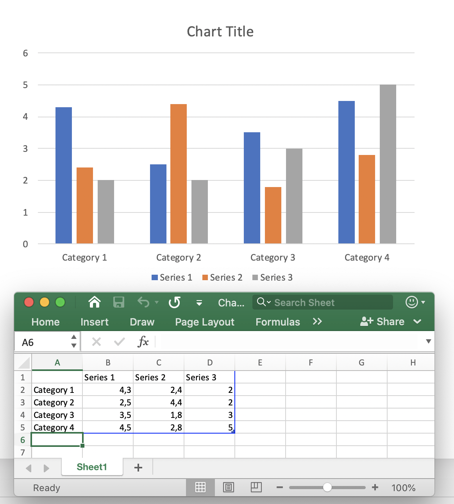

## **Přehled**

Grafy v PowerPointu obvykle ukládají svá zdrojová data do vloženého pracovního listu. V Aspose.Slides pro PHP přes Java můžete tento list získat prostřednictvím sešitu s daty grafu, zapisovat vstupní hodnoty, přiřazovat buňkám vzorce, vypočítávat podporované vzorce a používat vypočítané buňky jako data grafu.

Tento článek vysvětluje kompletní workflow pro vzorce: vytvořit graf, naplnit jeho pracovní list, přiřadit vzorce ve stylu A1 nebo R1C1, přepočítat je, přečíst vypočítané hodnoty, propojit tyto buňky s řadou grafu a uložit prezentaci. Také popisuje podporovanou syntaxi vzorců, vestavěný podmnožinu funkcí, uložené hodnoty, nepodporované vzorce a chyby specifické pro tabulkové procesory.

## **Pracovní listy grafů a vzorce**

Pracovní list grafu obsahuje kategorie, názvy řad a hodnoty používané v grafu. V PowerPointu můžete list prozkoumat otevřením editoru dat grafu:



V Aspose.Slides je list vystaven prostřednictvím třídy [ChartDataWorkbook](https://reference.aspose.com/slides/cs/php-java/aspose.slides/chartdataworkbook/). Použijte [ChartDataCell::setFormula](https://reference.aspose.com/slides/cs/php-java/aspose.slides/chartdatacell/#setFormula) pro vzorce ve stylu A1 a [ChartDataCell::setR1C1Formula](https://reference.aspose.com/slides/cs/php-java/aspose.slides/chartdatacell/#setR1C1Formula) pro vzorce ve stylu R1C1. Po změně vstupních buněk nebo vzorců zavolejte [ChartDataWorkbook::calculateFormulas](https://reference.aspose.com/slides/cs/php-java/aspose.slides/chartdataworkbook/#calculateFormulas) pro přepočet podporovaných vzorců a aktualizaci odpovídajících hodnot buněk.

Vypočítaná buňka stále zpřístupňuje svůj výsledek prostřednictvím [ChartDataCell::getValue](https://reference.aspose.com/slides/cs/php-java/aspose.slides/chartdatacell/#getValue). To je důležité, když potřebujete v kódu zkontrolovat výsledek vzorce nebo použít buňku jako datový bod grafu.

## **Vytvoření grafu a výpočet vzorců v pracovním listu**

Následující příklad ukazuje kompletní workflow. Vytvoří sloupcový seskupený graf, vymaže ukázková data, zapíše čtvrtletní příjmy a výdaje, vypočítá zisk pomocí vzorců, přečte výsledky, použije vypočítané buňky jako hodnoty grafu a uloží prezentaci.

```php
$presentation = new Presentation();
try {
    $slide = $presentation->getSlides()->get_Item(0);
    $chart = $slide->getShapes()->addChart(ChartType::ClusteredColumn, 50, 50, 600, 350);
    $workbook = $chart->getChartData()->getChartDataWorkbook();
    $worksheetIndex = 0;

    $chart->getChartData()->getSeries()->clear();
    $chart->getChartData()->getCategories()->clear();
    $workbook->clear($worksheetIndex);

    $category1 = $workbook->getCell($worksheetIndex, "A2", "Q1");
    $category2 = $workbook->getCell($worksheetIndex, "A3", "Q2");
    $category3 = $workbook->getCell($worksheetIndex, "A4", "Q3");

    $workbook->getCell($worksheetIndex, "B1", "Revenue");
    $workbook->getCell($worksheetIndex, "C1", "Expenses");
    $workbook->getCell($worksheetIndex, "D1", "Profit");

    $workbook->getCell($worksheetIndex, "B2")->setValue(120.0);
    $workbook->getCell($worksheetIndex, "C2")->setValue(80.0);
    $workbook->getCell($worksheetIndex, "B3")->setValue(150.0);
    $workbook->getCell($worksheetIndex, "C3")->setValue(95.0);
    $workbook->getCell($worksheetIndex, "B4")->setValue(135.0);
    $workbook->getCell($worksheetIndex, "C4")->setValue(110.0);

    $profit1 = $workbook->getCell($worksheetIndex, "D2");
    $profit2 = $workbook->getCell($worksheetIndex, "D3");
    $profit3 = $workbook->getCell($worksheetIndex, "D4");

    $profit1->setFormula("B2-C2");
    $profit2->setFormula("B3-C3");
    $profit3->setFormula("B4-C4");

    $workbook->calculateFormulas();

    $q1Profit = java_values($profit1->getValue()); // 40
    $q2Profit = java_values($profit2->getValue()); // 55
    $q3Profit = java_values($profit3->getValue()); // 25

    echo "Q1 profit: " . $q1Profit . PHP_EOL;
    echo "Q2 profit: " . $q2Profit . PHP_EOL;
    echo "Q3 profit: " . $q3Profit . PHP_EOL;

    $chart->getChartData()->getCategories()->add($category1);
    $chart->getChartData()->getCategories()->add($category2);
    $chart->getChartData()->getCategories()->add($category3);

    $profitSeries = $chart->getChartData()->getSeries()->add($workbook->getCell($worksheetIndex, "D1"), $chart->getType());
    $profitSeries->getDataPoints()->addDataPointForBarSeries($profit1);
    $profitSeries->getDataPoints()->addDataPointForBarSeries($profit2);
    $profitSeries->getDataPoints()->addDataPointForBarSeries($profit3);
    $profitSeries->getLabels()->getDefaultDataLabelFormat()->setShowValue(true);

    $presentation->save("chart-formulas.pptx", SaveFormat::Pptx);
} finally {
    $presentation->dispose();
}
```

Datové body grafu odkazují na `D2:D4`, takže graf používá vypočítané hodnoty zisku. V tomto workflow neexistuje samostatné volání pro obnovu grafu: nejprve přepočítejte sešit a poté použijte nebo uložte data grafu, která ukazují na vypočítané buňky.

## **Použití vzorců ve stylu A1**

A1 notace identifikuje sloupce písmeny a řádky čísly. Přidělujte výrazy ve stylu A1 přes [ChartDataCell::setFormula](https://reference.aspose.com/slides/cs/php-java/aspose.slides/chartdatacell/#setFormula).

```php
$presentation = new Presentation();
try {
    $slide = $presentation->getSlides()->get_Item(0);
    $chart = $slide->getShapes()->addChart(ChartType::ClusteredColumn, 50, 50, 500, 300);
    $workbook = $chart->getChartData()->getChartDataWorkbook();

    $workbook->getCell(0, "C3")->setValue(10);
    $workbook->getCell(0, "F2")->setValue(2);
    $workbook->getCell(0, "G2")->setValue(3);
    $workbook->getCell(0, "H2")->setValue(4);

    $cell = $workbook->getCell(0, "A2");
    $cell->setFormula("C3+SUM(F2:H2)");

    $workbook->calculateFormulas();

    $value = java_values($cell->getValue()); // 19
} finally {
    $presentation->dispose();
}
```

Běžné formy odkazů A1 jsou:

| Odkaz | Relativní | Absolutní | Smíšený |
|---|---|---|---|
| Buňka | `A2` | `$A$2` | `A$2`, `$A2` |
| Řádek | `2:2` | `$2:$2` | — |
| Sloupec | `A:A` | `$A:$A` | — |
| Rozsah | `A2:C4` | `$A$2:$C$4` | `A$2:$C4`, `$A2:C$4` |

Relativní odkazy se mohou změnit, když je vzorec přesunut nebo zkopírován tabulkovým procesorem. Absolutní odkazy udržují oba souřadnice pevně, zatímco smíšené odkazy fixují jen řádek nebo sloupec.

## **Použití vzorců ve stylu R1C1**

R1C1 notace identifikuje jak řádky, tak sloupce numericky. Relativní odkazy používají offsety v hranatých závorkách. Přidělujte tuto syntaxi přes [ChartDataCell::setR1C1Formula](https://reference.aspose.com/slides/cs/php-java/aspose.slides/chartdatacell/#setR1C1Formula).

```php
$presentation = new Presentation();
try {
    $slide = $presentation->getSlides()->get_Item(0);
    $chart = $slide->getShapes()->addChart(ChartType::ClusteredColumn, 50, 50, 500, 300);
    $workbook = $chart->getChartData()->getChartDataWorkbook();

    $workbook->getCell(0, "B2")->setValue(12);
    $workbook->getCell(0, "C2")->setValue(5);

    $cell = $workbook->getCell(0, "D2");
    $cell->setR1C1Formula("RC[-2]-RC[-1]");

    $workbook->calculateFormulas();

    $value = java_values($cell->getValue()); // 7
} finally {
    $presentation->dispose();
}
```

Běžné formy odkazů R1C1 jsou:

| Odkaz | Relativní | Absolutní | Smíšený |
|---|---|---|---|
| Buňka | `R[2]C[3]` | `R2C3` | `R2C[3]`, `R[2]C3` |
| Řádek | `R[2]` | `R2` | — |
| Sloupec | `C[3]` | `C3` | — |
| Rozsah | `R[2]C[3]:R[5]C[7]` | `R2C3:R5C7` | `R2C3:R[5]C[7]`, `R[2]C3:R5C[7]` |

Například v buňce `D2` znamená `RC[-2]` buňku ve stejném řádku dvěma sloupci vlevo (`B2`).

## **Konstanty a operátory ve vzorcích**

Vestavěný vyhodnocovač vzorců podporuje logické hodnoty, číselné literály, řetězce, chybové hodnoty tabulky, aritmetické operátory a porovnávací operátory.

### **Konstanty a literály**

| Typ | Příklady | Poznámky |
|---|---|---|
| Logická | `TRUE`, `FALSE` | Lze použít přímo v logických výrazech, např. `A2=TRUE`. |
| Číselná | `1`, `0.5`, `.3`, `1E-2` | Jsou podporovány běžná i vědecká zápisy. |
| Řetězec | `"abc"`, `"2/3/2020 12:00"` | Textové literály jsou ve vzorci uzavřeny do dvojitých uvozovek. |
| Výsledek chyby | `#DIV/0!`, `#N/A`, `#REF!` | Platný vzorec může vyhodnotit chybovou hodnotu tabulky místo normálního výsledku. |

Tento příklad používá několik typů konstant:

```php
$presentation = new Presentation();
try {
    $slide = $presentation->getSlides()->get_Item(0);
    $chart = $slide->getShapes()->addChart(ChartType::ClusteredColumn, 50, 50, 500, 300);
    $workbook = $chart->getChartData()->getChartDataWorkbook();

    $workbook->getCell(0, "A2")->setValue(false);
    $workbook->getCell(0, "B2")->setFormula("A2=TRUE");
    $workbook->getCell(0, "C2")->setFormula("1+0.5");
    $workbook->getCell(0, "D2")->setFormula(".3*1E-2");
    $workbook->getCell(0, "E2")->setFormula("\"abc\"");
    $workbook->getCell(0, "F2")->setFormula("2/0");

    $workbook->calculateFormulas();

    $logicalValue = java_values($workbook->getCell(0, "B2")->getValue()); // nepravda
    $numericValue = java_values($workbook->getCell(0, "C2")->getValue()); // 1.5
    $scientificValue = java_values($workbook->getCell(0, "D2")->getValue()); // 0.003
    $stringValue = java_values($workbook->getCell(0, "E2")->getValue()); // abc
    $errorValue = java_values($workbook->getCell(0, "F2")->getValue()); // #DIV/0!
} finally {
    $presentation->dispose();
}
```

### **Aritmetické operátory**

| Operátor | Význam | Příklad |
|---|---|---|
| `+` | Sčítání nebo unární plus | `2+3` |
| `-` | Odčítání nebo negace | `2-3`, `-3` |
| `*` | Násobení | `2*3` |
| `/` | Dělení | `2/3` |
| `%` | Procento | `30%` |
| `^` | Mocnina | `2^3` |

Používejte závorky, aby byl pořadí vyhodnocení explicitní, např. `(A2+B2)*C2`.

### **Porovnávací operátory**

Porovnávací výrazy vrací logické hodnoty.

| Operátor | Význam | Příklad |
|---|---|---|
| `=` | Rovná se | `A2=3` |
| `<>` | Nerovná se | `A2<>3` |
| `>` | Větší než | `A2>3` |
| `>=` | Větší nebo rovno | `A2>=3` |
| `<` | Menší než | `A2<3` |
| `<=` | Menší nebo rovno | `A2<=3` |

## **Podporované předdefinované funkce**

Aspose.Slides zahrnuje vestavěný vyhodnocovač vzorců pro pracovní listy grafů, ale není kompletním výpočetním jádrem Excelu. Dokumentovaná množina funkcí je omezena na níže uvedené. Nepředpokládejte, že libovolná Excel funkce může být přepočítána pomocí [ChartDataWorkbook::calculateFormulas](https://reference.aspose.com/slides/cs/php-java/aspose.slides/chartdataworkbook/#calculateFormulas).

| Funkce | Účel nebo podpora | Příklad |
|---|---|---|
| `ABS` | Absolutní hodnota | `ABS(A2)` |
| `AVERAGE` | Aritmetický průměr | `AVERAGE(B2:B5)` |
| `CEILING` | Zaokrouhlení čísla nahoru na násobek | `CEILING(A2,5)` |
| `CHOOSE` | Výběr hodnoty podle indexu | `CHOOSE(A2,"Low","High")` |
| `CONCAT` | Spojení textových hodnot | `CONCAT(A2,B2)` |
| `CONCATENATE` | Spojení textových hodnot | `CONCATENATE(A2," ",B2)` |
| `DATE` | Vytvoření datumové hodnoty pomocí systému 1900 | `DATE(2026,8,19)` |
| `DAYS` | Vrací počet dní mezi daty | `DAYS(B2,A2)` |
| `FIND` | Najde jeden text uvnitř druhého | `FIND("-",A2)` |
| `FINDB` | Vyhledávání na úrovni bajtů | `FINDB("a",A2)` |
| `IF` | Podmíněný výsledek | `IF(A2>0,A2,0)` |
| `INDEX` | Referenční forma | `INDEX(A2:C4,2,3)` |
| `LOOKUP` | Vektorová forma | `LOOKUP(A2,B2:B5,C2:C5)` |
| `MATCH` | Vektorová forma | `MATCH(A2,B2:B5,0)` |
| `MAX` | Maximální hodnota | `MAX(B2:B5)` |
| `SUM` | Součet hodnot | `SUM(B2:B5)` |
| `VLOOKUP` | Vertikální vyhledávání | `VLOOKUP(A2,B2:D10,3,FALSE)` |

Omezení uvedená v tabulce jsou podstatná: `INDEX` je dokumentován ve referenční formě, zatímco `LOOKUP` a `MATCH` jsou dokumentovány ve svých vektorových formách. `DATE` používá systém 1900. Funkce a vlastnosti, které zde nejsou uvedeny, by měly být považovány za nepodporované vestavěným vyhodnocovačem Aspose.Slides, pokud nejsou dokumentovány zvlášť.

## **Přepočet a uložené hodnoty**

Soubory tabulek běžně ukládají jak vzorec, tak jeho naposledy vypočítanou hodnotu. Aspose.Slides proto může při načtení prezentace přečíst uloženou hodnotu z [ChartDataCell::getValue](https://reference.aspose.com/slides/cs/php-java/aspose.slides/chartdatacell/#getValue), pokud se data grafu nezměnila.

Po změně vstupních buněk nebo vzorců nespoléhejte na starý uložený výsledek. Před čtením vypočítaných hodnot nebo uložením dat grafu, která na nich závisí, zavolejte [ChartDataWorkbook::calculateFormulas](https://reference.aspose.com/slides/cs/php-java/aspose.slides/chartdataworkbook/#calculateFormulas).

U vzorců mimo podporovanou podmnožinu může Aspose.Slides nedokázat vzorec analyzovat nebo zjistit jeho závislosti. Pokud byl sešit změněn, předchozí uložená hodnota již není spolehlivá. V takové situaci může čtení buňky s nepodporovanými daty vyvolat [CellUnsupportedDataException](https://reference.aspose.com/slides/cs/php-java/aspose.slides/cellunsupporteddataexception/).

Pokud váš graf závisí na Excel funkcích, které Aspose.Slides nevyhodnocuje, vypočítejte tyto vzorce pomocí tabulkového enginu, který je podporuje, a zapište vzniklé hodnoty zpět do sešitu grafu. Nepřepisujte nepodporované vzorce odhadovanými hodnotami.

## **Zpracování chyb ve vzorcích**

Existují dva různé typy problémů, které je třeba rozlišovat.

Vzorec může být platný, ale vrátit chybový výsledek tabulky, jako je `#DIV/0!`, `#N/A`, `#NAME?`, `#NULL!`, `#NUM!`, `#REF!` nebo `#VALUE!`. V tomto případě je chybový token výsledkem buňky a může být získán přes [ChartDataCell::getValue](https://reference.aspose.com/slides/cs/php-java/aspose.slides/chartdatacell/#getValue).

Vzorec může také selhat při parsování, referencování, závislostech nebo na úrovni podporovaných dat. Aspose.Slides poskytuje pro tyto případy tabulkově specifické výjimky: [CellInvalidFormulaException](https://reference.aspose.com/slides/cs/php-java/aspose.slides/cellinvalidformulaexception/), [CellInvalidReferenceException](https://reference.aspose.com/slides/cs/php-java/aspose.slides/cellinvalidreferenceexception/), [CellCircularReferenceException](https://reference.aspose.com/slides/cs/php-java/aspose.slides/cellcircularreferenceexception/) a [CellUnsupportedDataException](https://reference.aspose.com/slides/cs/php-java/aspose.slides/cellunsupporteddataexception/).

V PHP přes Java jsou Java výjimky exponovány jako `JavaException`. Když vzorce pocházejí ze šablon nebo uživatelského vstupu, zachyťte je kolem přepočtu a přístupu k hodnotám. Java výjimka uvedená ve stack trace identifikuje konkrétní selhání tabulky:

```php
$presentation = new Presentation();
try {
    $slide = $presentation->getSlides()->get_Item(0);
    $chart = $slide->getShapes()->addChart(ChartType::ClusteredColumn, 50, 50, 500, 300);
    $workbook = $chart->getChartData()->getChartDataWorkbook();
    $cell = $workbook->getCell(0, "A2");
    $cell->setFormula("SUM(B2:B5)");

    try {
        $workbook->calculateFormulas();
        echo java_values($cell->getValue()) . PHP_EOL;
    } catch (JavaException $ex) {
        $ex->printStackTrace();
    }
} finally {
    $presentation->dispose();
}
```

## **Praktická omezení**

Podpora vzorců v pracovních listech grafů je určena pro definovanou podmnožinu výpočtů tabulek, nikoli pro úplnou kompatibilitu s Excelem. Mějte na paměti tato omezení při návrhu workflow pro reportování:

- Používejte pouze dokumentované konstanty, operátory, odkazy a funkce, pokud potřebujete, aby Aspose.Slides přepočítával vzorce.
- Přepočítejte po změně buněk, na nichž výsledky vzorců závisí.
- Považujte uložené hodnoty z načtených prezentací za snímky, nikoli za náhradu přepočtu po úpravách.
- Otestujte vzorce z existujících šablon před spoleháním na jejich vypočítané hodnoty, zejména pokud používají funkce mimo dokumentovaný seznam.
- Pro vzorce, které vyžadují kompletní výpočetní engine tabulek, je vypočítejte externě a poté aktualizujte pracovní list grafu vzniklými hodnotami.

## **Často kladené otázky**

**Jaký je rozdíl mezi [ChartDataCell::setFormula](https://reference.aspose.com/slides/cs/php-java/aspose.slides/chartdatacell/#setFormula) a [ChartDataCell::setR1C1Formula](https://reference.aspose.com/slides/cs/php-java/aspose.slides/chartdatacell/#setR1C1Formula)?**

[ChartDataCell::setFormula](https://reference.aspose.com/slides/cs/php-java/aspose.slides/chartdatacell/#setFormula) ukládá výraz ve stylu A1, například `B2-C2`. [ChartDataCell::setR1C1Formula](https://reference.aspose.com/slides/cs/php-java/aspose.slides/chartdatacell/#setR1C1Formula) ukládá výraz ve stylu R1C1, například `RC[-2]-RC[-1]`. Použijte notaci, která nejlépe odpovídá tomu, jak vytváříte nebo kopírujete vzorce.

**Musím po přepočtu číst buňku samotnou nebo jen její hodnotu?**

[ChartDataWorkbook::getCell](https://reference.aspose.com/slides/cs/php-java/aspose.slides/chartdataworkbook/#getCell) vrací [ChartDataCell](https://reference.aspose.com/slides/cs/php-java/aspose.slides/chartdatacell/). Pro získání vypočítaného výsledku zavolejte metodou [ChartDataCell::getValue](https://reference.aspose.com/slides/cs/php-java/aspose.slides/chartdatacell/#getValue) po přepočtu.

**Kdy mám zavolat [ChartDataWorkbook::calculateFormulas](https://reference.aspose.com/slides/cs/php-java/aspose.slides/chartdataworkbook/#calculateFormulas)?**

Zavolejte [ChartDataWorkbook::calculateFormulas](https://reference.aspose.com/slides/cs/php-java/aspose.slides/chartdataworkbook/#calculateFormulas) po změně vstupních hodnot nebo vzorců a před tím, než budete záviset na vypočítaných výsledcích. Tím se aktualizují hodnoty vzorců, které vestavěný vyhodnocovač podporuje.

**Podporuje Aspose.Slides každou Excel funkci?**

Ne. Vestavěný vyhodnocovač podporuje pouze dokumentovanou podmnožinu funkcí. Funkce mimo tuto podmnožinu by neměly být považovány za správně přepočítatelné. Pokud je vyžadována úplná kompatibilita s Excel vzorci, proveďte výpočet pomocí vhodného tabulkového enginu a zapište finální hodnoty do pracovního listu grafu.

**Co se stane, když načtená prezentace obsahuje nepodporovaný vzorec?**

Pokud data grafu nebyla změněna, sešit může stále obsahovat dříve vypočítanou uloženou hodnotu. Po úpravě souvisejících dat však tato uložená hodnota může být neplatná. Přístup k buňce, jejíž vzorec nelze zpracovat, může vyvolat [CellUnsupportedDataException](https://reference.aspose.com/slides/cs/php-java/aspose.slides/cellunsupporteddataexception/).

**Jsou hodnoty chyb ve vzorci stejné jako PHP výjimky?**

Ne. Výsledek jako `#DIV/0!` je hodnota tabulky vytvořená platným výpočtem. Selhání zpracování tabulky, jako jsou [CellInvalidFormulaException](https://reference.aspose.com/slides/cs/php-java/aspose.slides/cellinvalidformulaexception/) nebo [CellCircularReferenceException](https://reference.aspose.com/slides/cs/php-java/aspose.slides/cellcircularreferenceexception/), jsou Java výjimky, které jsou v PHP prezentovány pomocí `JavaException`.

**Aktualizuje se graf automaticky, když se změní buňka s vzorcem?**

Řada grafu může odkazovat na buňky sešitu. Nejprve přepočítejte sešit, poté uložte nebo vykreslete prezentaci. Pokud datové body grafu odkazují na vypočítané buňky, graf použije tyto aktualizované hodnoty; pro tento workflow není vyžadována žádná samostatná metoda pro obnovu grafu.

**Mohou grafy používat externí Excel sešit?**

Ano, data grafu lze nakonfigurovat tak, aby používala externí sešit prostřednictvím API pro data grafu. Nicméně workflow výpočtu vzorců popsané v tomto článku se týká pracovního listu grafu a podmnožiny vzorců vyhodnocovaných Aspose.Slides. Nepředpokládejte, že [ChartDataWorkbook::calculateFormulas](https://reference.aspose.com/slides/cs/php-java/aspose.slides/chartdataworkbook/#calculateFormulas) poskytuje úplný přepočet libovolných vzorců v externím souboru XLSX.

**Mohu používat vzorce, které odkazují na jiný pracovní list nebo sešit?**

Odkazy ve stylu Excel mohou existovat v pracovních listech grafů, ale vyhodnocování vzorců je omezeno podporovaným parserem a množinou funkcí. Pokud je nezbytný odkaz na jiný list nebo externí sešit, ověřte přesně tento vzorec s vaší cílovou verzí Aspose.Slides. Pro workflow, které vyžadují širokou kompatibilitu odkazů Excelu, vypočítejte sešit externě a zapište vyřešené hodnoty zpět do dat grafu.

**Měly by řetězce vzorců začínat znakem `=`?**

Příklady v API Aspose.Slides přiřazují výrazy jako `B2-C2` nebo `SUM(B2:B5)` bez úvodního `=`. Použití této podoby zachovává generované vzorce v souladu s dokumentovanými příklady API.