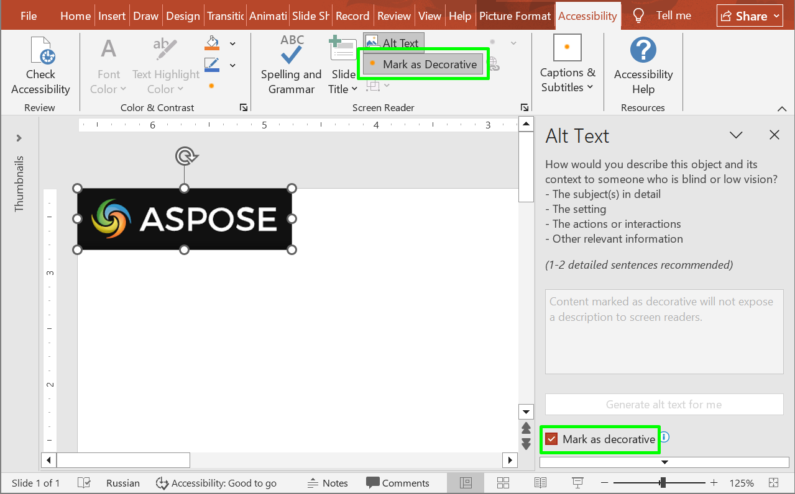

## **Přehled**

Zajištění přístupnosti prezentací zaručuje, že lidé používající asistenční technologie—například čtečky obrazovky, braillovy řádky nebo čistě klávesovou navigaci—mohou pochopit a procházet vaše snímky stejně efektivně jako publikum se zrakem a používající myš. Dobré postupy se zaměřují na jasné pořadí čtení, smysluplný alternativní text k informačním vizuálům, dostatečný kontrast barev, čitelnou typografii, výstižný text odkazů a vyhýbání se vyjadřování významu pouze barvou nebo polohou. Když je přístupnost plánována od samého začátku, výsledkem je přehlednější struktura, konzistentnější vizuály a obsah, který osloví každého diváka bez nutnosti obcházek.

## **Označit jako dekorativní**

Označení jako dekorativní slouží k označení čistě ornamentálních vizuálů, aby je čtečky obrazovky přeskočily, čímž se snižuje šum a zachovává se pozornost na smysluplném obsahu. Používejte jej u pozadí, ozdob a mezer—nikdy u grafů, ikon nebo obrázků, které předávají informace. Aspose.Slides tuto vlajku zpřístupňuje pro detekci a validaci, což umožňuje automatizované kontroly přístupnosti a úklid.



Následující ukázka kódu ukazuje, jak zjistit, zda je tvar označen jako dekorativní.

```php
$presentation = new Presentation("sample.pptx");
try {
    $shape = $presentation->getSlides()->get_Item(0)->getShapes()->get_Item(0);
    echo "Is shape decorative: " . ($shape->isDecorative() ? "true" : "false") . "\n";
} finally {
    $presentation->dispose();
}
```