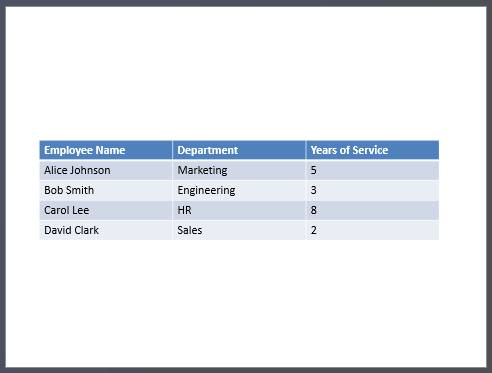

## **Úvod**

Prezentace PowerPoint jsou výkonný způsob, jak zobrazit a sdělit informace. Často se používají ve spojení s sešity Excel, kde Excel slouží jako vynikající zdroj strukturovaných dat a PowerPoint exceluje v jejich vizualizaci pro publikum.

Existuje mnoho praktických scénářů, kde je kombinace Excelu a PowerPointu nezbytná: hromadná korespondence, naplňování datových tabulek, generování jedné snímky na jeden záznam (dávková generace snímků), tvorba výukových materiálů a konsolidace více Excelových reportů do jedné prezentace, jen některé z nich.

Dosud implementace takových funkcí pomocí API Aspose.Slides vyžadovala spoléhat se na řešení třetích stran, jako je Aspose.Cells. Přestože jsou tyto nástroje robustní, mohou být pro uživatele, kteří potřebují jen základní funkci integrace dat, příliš složité a nákladné.

## **Jak to funguje**

Aby bylo práce s daty Excel snazší a efektivnější, Aspose.Slides zavedl nové třídy pro čtení dat ze sešitů Excel a importování obsahu do prezentace. Tato funkce otevírá výkonné nové možnosti pro uživatele API, kteří chtějí využívat Excel jako zdroj dat ve svých pracovních postupech s prezentacemi.

Nová funkčnost je navržena pro obecný přístup k datům a není integrována do Presentation Document Object Model (DOM). To znamená, že *neumožňuje upravovat ani ukládat soubory Excel* — jejím jediným účelem je otevřít sešity a procházet jejich obsah za účelem získání dat buněk.

V jádru této funkce je nová třída [ExcelDataWorkbook](https://reference.aspose.com/slides/cs/python-java/aspose.slides/exceldataworkbook/). Tato třída vám umožňuje načíst sešit Excel z lokálního souboru nebo proudu. Po načtení poskytuje několik přetížení metody [ExcelDataWorkbook.getCell](https://reference.aspose.com/slides/cs/python-java/aspose.slides/exceldataworkbook/#getCell), kterou můžete použít k získání konkrétních buněk podle jejich polohy (např. indexů řádku a sloupce nebo pojmenovaných oblastí).

Každé volání [ExcelDataWorkbook.getCell](https://reference.aspose.com/slides/cs/python-java/aspose.slides/exceldataworkbook/#getCell) vrací objekt [ExcelDataCell](https://reference.aspose.com/slides/cs/python-java/aspose.slides/exceldatacell/). Tento objekt představuje jedinou buňku v sešitu Excel a poskytuje vám přístup k její hodnotě jednoduchým a intuitivním způsobem.

#### **Import grafu z Excelu**

Dalším krokem k rozšíření funkčnosti je třída [ExcelWorkbookImporter](https://reference.aspose.com/slides/cs/python-java/aspose.slides/excelworkbookimporter/). Tato pomocná třída poskytuje funkci importování obsahu ze sešitu Excel do prezentace. Obsahuje několik přetížení metody [ExcelWorkbookImporter.addChartFromWorkbook](https://reference.aspose.com/slides/cs/python-java/aspose.slides/excelworkbookimporter/#addChartFromWorkbook), která vám pomáhá získat vybraný graf ze zadaného sešitu Excel a přidat jej na konec dané kolekce tvarů na zadaných souřadnicích.

#### **Import tabulky z Excelu**

Třída [ExcelWorkbookImporter](https://reference.aspose.com/slides/cs/python-java/aspose.slides/excelworkbookimporter/) také obsahuje několik přetížení metody [ExcelWorkbookImporter.addTableFromWorkbook](https://reference.aspose.com/slides/cs/python-java/aspose.slides/excelworkbookimporter/#addTableFromWorkbook). Tyto metody vám umožňují importovat určený rozsah buněk ze zadaného listu a přidat jej jako tabulku na konec dané kolekce tvarů na zadaných souřadnicích.

Stručně řečeno, jedná se o lehké a přehledné API pro čtení dat z Excelu — přesně to, co mnoho vývojářů potřebuje, aniž by museli zatěžovat plnohodnotnou knihovnou pro zpracování tabulek.

## **Pojďme kódovat**

### **Příklad scénáře hromadné korespondence**

V následujícím příkladu implementujeme jednoduchý scénář hromadné korespondence vytvořením více prezentací na základě dat uložených v sešitu Excel.

Pro zahájení potřebujeme dvě věci:

1. Sešit Excel obsahující data


2. Šablona prezentace PowerPoint


```python
import jpype
import asposeslides

if not jpype.isJVMStarted():
    jpype.startJVM()

from asposeslides.api import ExcelDataWorkbook, Presentation, SaveFormat

# Načtěte sešit Excel s údaji o zaměstnancích.
workbook = ExcelDataWorkbook("TemplateData.xlsx")
worksheet_index = 0

# Načtěte šablonu prezentace.
template_presentation = Presentation("PresentationTemplate.pptx")

try:
    # Procházejte řádky Excelu (s výjimkou záhlaví na řádku 0).
    for row_index in range(1, 5):

        # Vytvořte prezentaci pro každý záznam zaměstnance.
        employee_presentation = Presentation()

        try:
            # Odeberte výchozí prázdný snímek.
            employee_presentation.getSlides().removeAt(0)

            # Zduplikujte šablonový snímek v prezentaci.
            slide = employee_presentation.getSlides().addClone(template_presentation.getSlides().get_Item(0))

            # Získejte odstavce z cílového tvaru (předpokládá se, že se používá index tvaru 1).
            paragraphs = slide.getShapes().get_Item(1).getTextFrame().getParagraphs()

            # Nahraďte zástupné symboly daty z Excelu.
            employee_name = str(workbook.getCell(worksheet_index, row_index, 0).getValue())
            name_portion = paragraphs.get_Item(0).getPortions().get_Item(0)
            name_portion.setText(str(name_portion.getText()).replace("{{EmployeeName}}", employee_name))

            department = str(workbook.getCell(worksheet_index, row_index, 1).getValue())
            department_portion = paragraphs.get_Item(1).getPortions().get_Item(0)
            department_portion.setText(str(department_portion.getText()).replace("{{Department}}", department))

            years_of_service = str(workbook.getCell(worksheet_index, row_index, 2).getValue())
            years_portion = paragraphs.get_Item(2).getPortions().get_Item(0)
            years_portion.setText(str(years_portion.getText()).replace("{{YearsOfService}}", years_of_service))

            # Uložte personalizovanou prezentaci do samostatného souboru.
            employee_presentation.save(f"{employee_name} Report.pptx", SaveFormat.Pptx)
        finally:
            employee_presentation.dispose()
finally:
    template_presentation.dispose()
```


### **Příklad tabulky Excel**

Ve druhém příkladu jednoduše zkopírujeme data z tabulky Excel a zobrazíme je na snímku PowerPoint v vizuálně přitažlivějším formátu.

V tomto příkladu znovu použijeme stejný sešit Excel z prvního příkladu, který obsahuje jednoduchou tabulku zaměstnanců.

```python
import jpype
import asposeslides

if not jpype.isJVMStarted():
    jpype.startJVM()

from asposeslides.api import ExcelDataWorkbook, Presentation, SaveFormat

# Načtěte sešit Excel obsahující údaje o zaměstnancích.
workbook = ExcelDataWorkbook("TemplateData.xlsx")
worksheet_index = 0

# Vytvořte prezentaci PowerPoint.
presentation = Presentation()

try:
    # Přidejte tvar tabulky na první snímek.
    column_widths = jpype.JArray(jpype.JDouble)([200, 200, 200])
    row_heights = jpype.JArray(jpype.JDouble)([30, 30, 30, 30, 30])
    table = presentation.getSlides().get_Item(0).getShapes().addTable(50, 200, column_widths, row_heights)

    # Vyplňte tabulku PowerPoint daty ze sešitu Excel.
    for row_index in range(5):
        for column_index in range(3):
            cell_value = str(workbook.getCell(worksheet_index, row_index, column_index).getValue())
            table.getColumns().get_Item(column_index).get_Item(row_index).getTextFrame().setText(cell_value)

    # Uložte výslednou prezentaci do souboru.
    presentation.save("Table.pptx", SaveFormat.Pptx)
finally:
    presentation.dispose()
```



### **Příklad importu grafu z Excelu**

V tomto příkladu importujeme graf z prvního listu sešitu Excel použitého v předchozím příkladu. Graf bude v výsledné prezentaci odkazovat na externí sešit.

Nejprve přidáme koláčový graf do sešitu Excel založený na tabulce zaměstnanců.


```python
import jpype
import asposeslides

if not jpype.isJVMStarted():
    jpype.startJVM()

from asposeslides.api import ExcelWorkbookImporter, Presentation, SaveFormat

# Vytvořte prezentaci PowerPoint.
presentation = Presentation()
try:
    # Získejte kolekci tvarů z prvního snímku.
    shapes = presentation.getSlides().get_Item(0).getShapes()

    # Importujte graf s názvem "Chart 1" z prvního listu sešitu a přidejte jej do kolekce tvarů.
    ExcelWorkbookImporter.addChartFromWorkbook(shapes, 10, 10, "TemplateData.xlsx", "Sheet1", "Chart 1", False)

    # Uložte výslednou prezentaci do souboru.
    presentation.save("Chart.pptx", SaveFormat.Pptx)
finally:
    presentation.dispose()
```


### **Příklad importu všech grafů z Excelu**

Představte si, že máte sešit Excel plný grafů a potřebujete je všechny importovat do prezentace. Každý graf by měl být umístěn na nový snímek.

Následující kód prochází všechny listy ve zdrojovém souboru Excel, extrahuje grafy z každého listu a přidá každý graf na samostatný snímek pomocí prázdného rozvržení snímku. V výsledné prezentaci bude vložena pouze data grafu, nikoli celý sešit.

```python
import jpype
import asposeslides

if not jpype.isJVMStarted():
    jpype.startJVM()

from asposeslides.api import ExcelDataWorkbook, ExcelWorkbookImporter, Presentation, SaveFormat, SlideLayoutType

    # Načtěte sešit Excel obsahující údaje o zaměstnancích.
    workbook = ExcelDataWorkbook("ExcelWithCharts.xlsx")

    # Vytvořte prezentaci PowerPoint.
    presentation = Presentation()
    try:
        # Získejte prázdné rozložení snímku.
        blank_layout = presentation.getLayoutSlides().getByType(SlideLayoutType.Blank)

        # Odeberte výchozí snímek, aby výsledek obsahoval jeden snímek na graf.
        presentation.getSlides().removeAt(0)

        # Získejte názvy všech listů obsažených v sešitu Excel.
        worksheet_names = workbook.getWorksheetNames()

        for name in worksheet_names:
            # Získejte mapu, která mapuje indexy grafů na názvy grafů pro list.
            worksheet_charts = workbook.getChartsFromWorksheet(name)

            for chart in worksheet_charts:
                # Přidejte snímek pomocí prázdného rozložení.
                slide = presentation.getSlides().addEmptySlide(blank_layout)

                # Importujte zadaný graf ze sešitu Excel do kolekce tvarů snímku.
                ExcelWorkbookImporter.addChartFromWorkbook(slide.getShapes(), 10, 10, workbook, name, chart.getKey(), False)

        # Uložte výslednou prezentaci do souboru.
        presentation.save("Charts.pptx", SaveFormat.Pptx)
    finally:
        presentation.dispose()
```

### **Příklad importu tabulky z Excelu**

V tomto příkladu importujeme naformátovanou tabulku z listu Excel přímo do prezentace PowerPoint.

Zdrojový list Excel obsahuje naformátovanou tabulku se zaměstnaneckými údaji:


```python
import jpype
import asposeslides

if not jpype.isJVMStarted():
    jpype.startJVM()

from asposeslides.api import ExcelWorkbookImporter, Presentation, SaveFormat

# Vytvořte prezentaci PowerPoint.
presentation = Presentation()
try:
    # Získejte první snímek a jeho kolekci tvarů.
    slide = presentation.getSlides().get_Item(0)
    shapes = slide.getShapes()

    # Importujte tabulku z prvního listu sešitu a přidejte ji do kolekce tvarů.
    ExcelWorkbookImporter.addTableFromWorkbook(shapes, 10, 10, "TemplateData.xlsx", "Sheet1", "A1:C5")

    # Uložte výslednou prezentaci do souboru.
    presentation.save("FormattedTable.pptx", SaveFormat.Pptx)
finally:
    presentation.dispose()
```


## **Shrnutí**

Tento mechanismus, dostupný přímo v Aspose.Slides, kombinuje práci s daty Excel a prezentacemi na jednom místě. Umožňuje vám vytvářet snímky s vizuálními grafy a daty prezentovanými jako tabulky Excel — bez jakýchkoli dalších knihoven nebo složitých integrací.