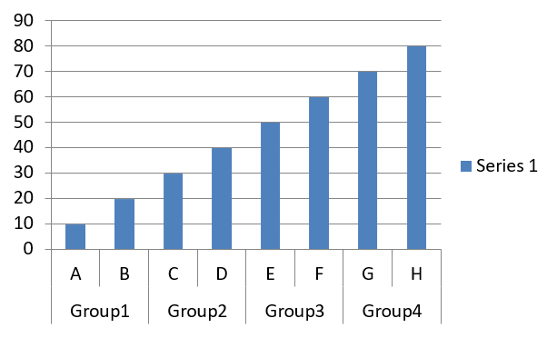

## **Přehled**

Tento článek vysvětluje, jak vytvářet a přizpůsobovat grafy pomocí Aspose.Slides for Python via .NET. Naučíte se, jak přidat graf na snímek, naplnit ho daty a formátovat jej tak, aby odpovídal vašim požadavkům na design. Příklady kódu zahrnují vytváření prezentací a grafů, konfiguraci sérií, os a legend a integraci generování grafů do vašich aplikací.

## **Vytvoření grafu**

Grafy pomáhají lidem rychle vizualizovat data a získat postřehy, které nemusí být okamžitě patrné z tabulky nebo kalkulace.

**Proč vytvářet grafy?**

Používáním grafů můžete:

* agregovat, zhušťovat nebo sumarizovat velké objemy dat na jediném snímku v prezentaci;
* odhalovat vzory a trendy v datech;
* odhadovat směr a momentum dat v čase nebo vzhledem k určité jednotce měření;
* odhalovat odlehlé hodnoty, odchylky, chyby a nesmyslná data;
* komunikovat nebo prezentovat složitá data.

V PowerPointu můžete vytvářet grafy přes funkci *Insert*, která poskytuje šablony pro navrhování mnoha typů grafů. Pomocí Aspose.Slides můžete vytvářet jak běžné grafy (založené na populárních typech), tak vlastní grafy.

{}

Use the [ChartType](https://reference.aspose.com/slides/cs/python-net/aspose.slides.charts/charttype/) enumeration under the [Aspose.Slides.Charts](https://reference.aspose.com/slides/cs/python-net/aspose.slides.charts/) namespace. The values in this enumeration correspond to different chart types.

{}

### **Vytvoření seskupených sloupcových grafů**

Tato sekce popisuje, jak vytvořit seskupené sloupcové grafy pomocí Aspose.Slides for Python via .NET. Naučíte se inicializovat prezentaci, přidat graf a přizpůsobit jeho prvky, jako jsou nadpis, data, série, kategorie a stylování. Postupujte podle níže uvedených kroků, abyste viděli, jak se generuje standardní seskupený sloupcový graf:

1. Vytvořte instanci třídy [Presentation](https://reference.aspose.com/slides/cs/python-net/aspose.slides/presentation/).
1. Získejte odkaz na snímek pomocí jeho indexu.
1. Přidejte graf s nějakými daty a uveďte typ `ChartType.CLUSTERED_COLUMN`.
1. Přidejte nadpis do grafu.
1. Přistupte k pracovním listům dat grafu.
1. Vymažte všechny výchozí série a kategorie.
1. Přidejte nové série a kategorie.
1. Přidejte nová data do grafu pro série.
1. Použijte barvu výplně na série grafu.
1. Přidejte popisky k sériím grafu.
1. Uložte upravenou prezentaci jako soubor PPTX.

Tento Python kód ukazuje, jak vytvořit seskupený sloupcový graf:

```py
import aspose.slides.charts as charts
import aspose.slides as slides
import aspose.pydrawing as draw

# Vytvořte instanci třídy Presentation, která představuje soubor PPTX.
with slides.Presentation() as presentation:

    # Přístup k prvnímu snímku.
    slide = presentation.slides[0]

    # Přidejte seskupený sloupcový graf s výchozími daty.
    chart = slide.shapes.add_chart(charts.ChartType.CLUSTERED_COLUMN, 20, 20, 500, 300)

    # Nastavte název grafu.
    chart.chart_title.add_text_frame_for_overriding("Sample Title")
    chart.chart_title.text_frame_for_overriding.text_frame_format.center_text = slides.NullableBool.TRUE
    chart.chart_title.height = 20
    chart.has_title = True

    # Nastavte index listu dat grafu.
    worksheet_index = 0

    # Získejte sešit dat grafu.
    workbook = chart.chart_data.chart_data_workbook

    # Odstraňte výchozí vytvořené série a kategorie.
    chart.chart_data.series.clear()
    chart.chart_data.categories.clear()

    # Přidejte nové série.
    chart.chart_data.series.add(workbook.get_cell(worksheet_index, 0, 1, "Series 1"), chart.type)
    chart.chart_data.series.add(workbook.get_cell(worksheet_index, 0, 2, "Series 2"), chart.type)

    # Přidejte nové kategorie.
    chart.chart_data.categories.add(workbook.get_cell(worksheet_index, 1, 0, "Category 1"))
    chart.chart_data.categories.add(workbook.get_cell(worksheet_index, 2, 0, "Category 2"))
    chart.chart_data.categories.add(workbook.get_cell(worksheet_index, 3, 0, "Category 3"))

    # Získejte první sérii grafu.
    series = chart.chart_data.series[0]

    # Naplňte data série.
    series.data_points.add_data_point_for_bar_series(workbook.get_cell(worksheet_index, 1, 1, 20))
    series.data_points.add_data_point_for_bar_series(workbook.get_cell(worksheet_index, 2, 1, 50))
    series.data_points.add_data_point_for_bar_series(workbook.get_cell(worksheet_index, 3, 1, 30))

    # Nastavte barvu výplně pro sérii.
    series.format.fill.fill_type = slides.FillType.SOLID
    series.format.fill.solid_fill_color.color = draw.Color.red

    # Získejte druhou sérii grafu.
    series = chart.chart_data.series[1]

    # Naplňte data série.
    series.data_points.add_data_point_for_bar_series(workbook.get_cell(worksheet_index, 1, 2, 30))
    series.data_points.add_data_point_for_bar_series(workbook.get_cell(worksheet_index, 2, 2, 10))
    series.data_points.add_data_point_for_bar_series(workbook.get_cell(worksheet_index, 3, 2, 60))

    # Nastavte barvu výplně pro sérii.
    series.format.fill.fill_type = slides.FillType.SOLID
    series.format.fill.solid_fill_color.color = draw.Color.green

    # Nastavte první popisek tak, aby zobrazoval název kategorie.
    label = series.data_points[0].label
    label.data_label_format.show_category_name = True

    label = series.data_points[1].label
    label.data_label_format.show_series_name = True

    # Nastavte sérii tak, aby třetí popisek zobrazoval hodnotu.
    label = series.data_points[2].label
    label.data_label_format.show_value = True
    label.data_label_format.show_series_name = True
    label.data_label_format.separator = "/"
                
    # Uložte prezentaci na disk jako soubor PPTX.
    presentation.save("ClusteredColumnChart.pptx", slides.export.SaveFormat.PPTX)
```

Výsledek:


### **Vytvoření rozptylových grafů**

Rozptylové grafy (také známé jako scatter plot nebo x‑y grafy) se často používají k ověření vzorů nebo demonstraci korelací mezi dvěma proměnnými.

Použijte rozptylový graf, když:

* Máte spárovaná číselná data.
* Máte dvě proměnné, které dobře spolu souvisí.
* Chcete zjistit, zda jsou tyto dvě proměnné vzájemně provázány.
* Máte nezávislou proměnnou s více hodnotami pro závislou proměnnou.

Tento Python kód ukazuje, jak vytvořit rozptylový graf s různými značkami pro každou sérii:

```py
import aspose.slides.charts as charts
import aspose.slides as slides
import aspose.pydrawing as draw

# Vytvořte instanci třídy Presentation.
with slides.Presentation() as presentation:

    # Přístup k prvnímu snímku.
    slide = presentation.slides[0]

    # Vytvořte výchozí rozptylový graf.
    chart = slide.shapes.add_chart(charts.ChartType.SCATTER_WITH_SMOOTH_LINES, 20, 20, 500, 300)

    # Nastavte index listu dat grafu.
    worksheet_index = 0

    # Získejte sešit dat grafu.
    workbook = chart.chart_data.chart_data_workbook

    # Odstraňte výchozí sérii.
    chart.chart_data.series.clear()

    # Přidejte nové série.
    chart.chart_data.series.add(workbook.get_cell(worksheet_index, 1, 1, "Series 1"), chart.type)
    chart.chart_data.series.add(workbook.get_cell(worksheet_index, 1, 3, "Series 2"), chart.type)

    # Získejte první sérii grafu.
    series = chart.chart_data.series[0]

    # Přidejte nový bod (1:3) do série.
    series.data_points.add_data_point_for_scatter_series(workbook.get_cell(worksheet_index, 2, 1, 1), workbook.get_cell(worksheet_index, 2, 2, 3))

    # Přidejte nový bod (2:10).
    series.data_points.add_data_point_for_scatter_series(workbook.get_cell(worksheet_index, 3, 1, 2), workbook.get_cell(worksheet_index, 3, 2, 10))

    # Změňte typ série.
    series.type = charts.ChartType.SCATTER_WITH_STRAIGHT_LINES_AND_MARKERS

    # Změňte značku série grafu.
    series.marker.size = 10
    series.marker.symbol = charts.MarkerStyleType.STAR

    # Získejte druhou sérii grafu.
    series = chart.chart_data.series[1]

    # Přidejte nový bod (5:2) do série grafu.
    series.data_points.add_data_point_for_scatter_series(workbook.get_cell(worksheet_index, 2, 3, 5), workbook.get_cell(worksheet_index, 2, 4, 2))

    # Přidejte nový bod (3:1).
    series.data_points.add_data_point_for_scatter_series(workbook.get_cell(worksheet_index, 3, 3, 3), workbook.get_cell(worksheet_index, 3, 4, 1))

    # Přidejte nový bod (2:2).
    series.data_points.add_data_point_for_scatter_series(workbook.get_cell(worksheet_index, 4, 3, 2), workbook.get_cell(worksheet_index, 4, 4, 2))

    # Přidejte nový bod (5:1).
    series.data_points.add_data_point_for_scatter_series(workbook.get_cell(worksheet_index, 5, 3, 5), workbook.get_cell(worksheet_index, 5, 4, 1))

    # Změňte značku série grafu.
    series.marker.size = 10
    series.marker.symbol = charts.MarkerStyleType.CIRCLE

    presentation.save("ScatterChart.pptx", slides.export.SaveFormat.PPTX)
```

Výsledek:


### **Vytvoření koláčových grafů**

Koláčové grafy jsou nejvhodnější pro zobrazení poměru část–celku v datech, zejména když data obsahují kategoriální štítky s číselnými hodnotami. Pokud však vaše data obsahují mnoho částí nebo štítků, můžete zvážit místo toho sloupcový graf.

1. Vytvořte instanci třídy [Presentation](https://reference.aspose.com/slides/cs/python-net/aspose.slides/presentation/).
1. Získejte odkaz na snímek pomocí jeho indexu.
1. Přidejte graf s výchozími daty a uveďte typ `ChartType.PIE`.
1. Přistupte k sešitu dat grafu ([ChartDataWorkbook](https://reference.aspose.com/slides/cs/python-net/aspose.slides.charts/chartdataworkbook/)).
1. Vymažte výchozí série a kategorie.
1. Přidejte nové série a kategorie.
1. Přidejte nová data do grafu pro série.
1. Přidejte nové body do grafu a použijte vlastní barvy na výseče koláčového grafu.
1. Nastavte popisky pro série.
1. Aktivujte vodící čáry pro popisky sérií.
1. Nastavte úhlovou rotaci koláčového grafu.
1. Uložte upravenou prezentaci jako soubor PPTX.

Tento Python kód ukazuje, jak vytvořit koláčový graf:

```py
import aspose.slides.charts as charts
import aspose.slides as slides
import aspose.pydrawing as draw

# Vytvořte instanci třídy Presentation, která představuje soubor PPTX.
with slides.Presentation() as presentation:

    # Přístup k prvnímu snímku.
    slide = presentation.slides[0]

    # Přidejte graf s výchozími daty.
    chart = slide.shapes.add_chart(charts.ChartType.PIE, 20, 20, 500, 300)

    # Nastavte název grafu.
    chart.chart_title.add_text_frame_for_overriding("Sample Title")
    chart.chart_title.text_frame_for_overriding.text_frame_format.center_text = slides.NullableBool.TRUE
    chart.chart_title.height = 20
    chart.has_title = True

    # Nastavte index listu dat grafu.
    worksheet_index = 0

    # Získejte sešit dat grafu.
    workbook = chart.chart_data.chart_data_workbook

    # Odstraňte výchozí vytvořené série a kategorie.
    chart.chart_data.series.clear()
    chart.chart_data.categories.clear()

    # Přidejte nové kategorie.
    chart.chart_data.categories.add(workbook.get_cell(0, 1, 0, "First Qtr"))
    chart.chart_data.categories.add(workbook.get_cell(0, 2, 0, "2nd Qtr"))
    chart.chart_data.categories.add(workbook.get_cell(0, 3, 0, "3rd Qtr"))

    # Přidejte nové série.
    series = chart.chart_data.series.add(workbook.get_cell(0, 0, 1, "Series 1"), chart.type)

    # Naplněte data série.
    series.data_points.add_data_point_for_pie_series(workbook.get_cell(worksheet_index, 1, 1, 20))
    series.data_points.add_data_point_for_pie_series(workbook.get_cell(worksheet_index, 2, 1, 50))
    series.data_points.add_data_point_for_pie_series(workbook.get_cell(worksheet_index, 3, 1, 30))

    # Nastavte barvu výseče.
    chart.chart_data.series_groups[0].is_color_varied = True

    point = series.data_points[0]
    point.format.fill.fill_type = slides.FillType.SOLID
    point.format.fill.solid_fill_color.color = draw.Color.cyan

    # Nastavte okraj výseče.
    point.format.line.fill_format.fill_type = slides.FillType.SOLID
    point.format.line.fill_format.solid_fill_color.color = draw.Color.gray
    point.format.line.width = 3.0
    point.format.line.style = slides.LineStyle.THIN_THICK
    point.format.line.dash_style = slides.LineDashStyle.DASH_DOT

    point1 = series.data_points[1]
    point1.format.fill.fill_type = slides.FillType.SOLID
    point1.format.fill.solid_fill_color.color = draw.Color.brown

    # Nastavte okraj výseče.
    point1.format.line.fill_format.fill_type = slides.FillType.SOLID
    point1.format.line.fill_format.solid_fill_color.color = draw.Color.blue
    point1.format.line.width = 3.0
    point1.format.line.style = slides.LineStyle.SINGLE
    point1.format.line.dash_style = slides.LineDashStyle.LARGE_DASH_DOT

    point2 = series.data_points[2]
    point2.format.fill.fill_type = slides.FillType.SOLID
    point2.format.fill.solid_fill_color.color = draw.Color.coral

    # Nastavte okraj výseče.
    point2.format.line.fill_format.fill_type = slides.FillType.SOLID
    point2.format.line.fill_format.solid_fill_color.color = draw.Color.red
    point2.format.line.width = 2.0
    point2.format.line.style = slides.LineStyle.THIN_THIN
    point2.format.line.dash_style = slides.LineDashStyle.LARGE_DASH_DOT_DOT

    # Vytvořte vlastní popisky pro každou kategorii v nové sérii.
    label1 = series.data_points[0].label

    label1.data_label_format.show_value = True

    label2 = series.data_points[1].label
    label2.data_label_format.show_value = True
    label2.data_label_format.show_legend_key = True
    label2.data_label_format.show_percentage = True

    label3 = series.data_points[2].label
    label3.data_label_format.show_series_name = True
    label3.data_label_format.show_percentage = True

    # Nastavte sérii tak, aby zobrazovala vodící čáry v grafu.
    series.labels.default_data_label_format.show_leader_lines = True

    # Nastavte úhlovou rotaci výsečí koláčového grafu.
    chart.chart_data.series_groups[0].first_slice_angle = 180

    # Uložte prezentaci na disk jako soubor PPTX.
    presentation.save("PieChart.pptx", slides.export.SaveFormat.PPTX)
```

Výsledek:


### **Vytvoření spojnicových grafů**

Spojnicové grafy (také známé jako line graphs) jsou nejvhodnější v situacích, kdy chcete demonstrovat změny hodnot v čase. Pomocí spojnicového grafu můžete najednou porovnat velké množství dat, sledovat změny a trendy v čase, zvýraznit anomálie v datových sériích a další.

1. Vytvořte instanci třídy [Presentation](https://reference.aspose.com/slides/cs/python-net/aspose.slides/presentation/).
1. Získejte odkaz na snímek pomocí jeho indexu.
1. Přidejte graf s výchozími daty a uveďte typ `ChartType.LINE`.
1. Uložte upravenou prezentaci jako soubor PPTX.

Tento Python kód ukazuje, jak vytvořit spojnicový graf:

```python
import aspose.slides as slides

with slides.Presentation() as presentation:
    line_chart = presentation.slides[0].shapes.add_chart(slides.charts.ChartType.LINE, 20, 20, 500, 300)
    
    presentation.save("LineChart.pptx", slides.export.SaveFormat.PPTX)
```

Ve výchozím nastavení jsou body spojnicového grafu spojeny přímými spojnicemi. Pokud chcete, aby byly body spojeny čárkami, můžete specifikovat požadovaný typ čáry následovně:

```python
import aspose.slides as slides

with slides.Presentation() as presentation:
    line_chart = presentation.slides[0].shapes.add_chart(slides.charts.ChartType.LINE, 10, 50, 600, 350)

    for series in line_chart.chart_data.series:
        series.format.line.dash_style = slides.LineDashStyle.DASH

    presentation.save("LineChart.pptx", slides.export.SaveFormat.PPTX)
```

Výsledek:


### **Vytvoření stromových mapových grafů**

Stromové mapové grafy jsou nejvhodnější pro prodejní data, když chcete zobrazit relativní velikost kategorií a rychle upozornit na položky, které jsou významnými přispěvateli v rámci každé kategorie.

1. Vytvořte instanci třídy [Presentation](https://reference.aspose.com/slides/cs/python-net/aspose.slides/presentation/).
1. Získejte odkaz na snímek pomocí jeho indexu.
1. Přidejte graf s výchozími daty a uveďte typ `ChartType.TREEMAP`.
1. Přistupte k sešitu dat grafu ([ChartDataWorkbook](https://reference.aspose.com/slides/cs/python-net/aspose.slides.charts/chartdataworkbook/)).
1. Vymažte výchozí série a kategorie.
1. Přidejte nové série a kategorie.
1. Přidejte nová data do grafu pro série.
1. Uložte upravenou prezentaci jako soubor PPTX.

Tento Python kód ukazuje, jak vytvořit stromový mapový graf:

```py
import aspose.slides.charts as charts
import aspose.slides as slides
import aspose.pydrawing as draw

with slides.Presentation() as presentation:
    chart = presentation.slides[0].shapes.add_chart(charts.ChartType.TREEMAP, 20, 20, 500, 300)
    chart.chart_data.categories.clear()
    chart.chart_data.series.clear()

    workbook = chart.chart_data.chart_data_workbook
    workbook.clear(0)

    # Větev 1
    leaf = chart.chart_data.categories.add(workbook.get_cell(0, "C1", "Leaf1"))
    leaf.grouping_levels.set_grouping_item(1, "Stem1")
    leaf.grouping_levels.set_grouping_item(2, "Branch1")

    chart.chart_data.categories.add(workbook.get_cell(0, "C2", "Leaf2"))

    leaf = chart.chart_data.categories.add(workbook.get_cell(0, "C3", "Leaf3"))
    leaf.grouping_levels.set_grouping_item(1, "Stem2")

    chart.chart_data.categories.add(workbook.get_cell(0, "C4", "Leaf4"))

    # Větev 2
    leaf = chart.chart_data.categories.add(workbook.get_cell(0, "C5", "Leaf5"))
    leaf.grouping_levels.set_grouping_item(1, "Stem3")
    leaf.grouping_levels.set_grouping_item(2, "Branch2")

    chart.chart_data.categories.add(workbook.get_cell(0, "C6", "Leaf6"))

    leaf = chart.chart_data.categories.add(workbook.get_cell(0, "C7", "Leaf7"))
    leaf.grouping_levels.set_grouping_item(1, "Stem4")

    chart.chart_data.categories.add(workbook.get_cell(0, "C8", "Leaf8"))

    series = chart.chart_data.series.add(charts.ChartType.TREEMAP)
    series.labels.default_data_label_format.show_category_name = True
    series.data_points.add_data_point_for_treemap_series(workbook.get_cell(0, "D1", 4))
    series.data_points.add_data_point_for_treemap_series(workbook.get_cell(0, "D2", 5))
    series.data_points.add_data_point_for_treemap_series(workbook.get_cell(0, "D3", 3))
    series.data_points.add_data_point_for_treemap_series(workbook.get_cell(0, "D4", 6))
    series.data_points.add_data_point_for_treemap_series(workbook.get_cell(0, "D5", 9))
    series.data_points.add_data_point_for_treemap_series(workbook.get_cell(0, "D6", 9))
    series.data_points.add_data_point_for_treemap_series(workbook.get_cell(0, "D7", 4))
    series.data_points.add_data_point_for_treemap_series(workbook.get_cell(0, "D8", 3))

    series.parent_label_layout = charts.ParentLabelLayoutType.OVERLAPPING

    presentation.save("TreeMap.pptx", slides.export.SaveFormat.PPTX)
```

Výsledek:


### **Vytvoření burzovních grafů**

Burzovní grafy slouží k zobrazování finančních dat, jako jsou otevírací, nejvyšší, nejnižší a zavírací ceny, a pomáhají analyzovat tržní trendy a volatilitu. Poskytují klíčové informace o výkonu akcií, což investorům a analytikům usnadňuje činit informovaná rozhodnutí.

1. Vytvořte instanci třídy [Presentation](https://reference.aspose.com/slides/cs/python-net/aspose.slides/presentation/).
1. Získejte odkaz na snímek pomocí jeho indexu.
1. Přidejte graf s výchozími daty a uveďte typ `ChartType.OPEN_HIGH_LOW_CLOSE`.
1. Přistupte k sešitu dat grafu ([ChartDataWorkbook](https://reference.aspose.com/slides/cs/python-net/aspose.slides.charts/chartdataworkbook/)).
1. Vymažte výchozí série a kategorie.
1. Přidejte nové série a kategorie.
1. Přidejte nová data do grafu pro série.
1. Specifikujte formát čar high‑low.
1. Uložte upravenou prezentaci jako soubor PPTX.

Tento Python kód ukazuje, jak vytvořit burzovní graf:

```py
import aspose.slides.charts as charts
import aspose.slides as slides
import aspose.pydrawing as draw

with slides.Presentation() as presentation:
    chart = presentation.slides[0].shapes.add_chart(charts.ChartType.OPEN_HIGH_LOW_CLOSE, 20, 20, 500, 300, False)

    chart.chart_data.series.clear()
    chart.chart_data.categories.clear()

    workbook = chart.chart_data.chart_data_workbook

    chart.chart_data.categories.add(workbook.get_cell(0, 1, 0, "A"))
    chart.chart_data.categories.add(workbook.get_cell(0, 2, 0, "B"))
    chart.chart_data.categories.add(workbook.get_cell(0, 3, 0, "C"))

    chart.chart_data.series.add(workbook.get_cell(0, 0, 1, "Open"), chart.type)
    chart.chart_data.series.add(workbook.get_cell(0, 0, 2, "High"), chart.type)
    chart.chart_data.series.add(workbook.get_cell(0, 0, 3, "Low"), chart.type)
    chart.chart_data.series.add(workbook.get_cell(0, 0, 4, "Close"), chart.type)

    series = chart.chart_data.series[0]

    series.data_points.add_data_point_for_stock_series(workbook.get_cell(0, 1, 1, 72))
    series.data_points.add_data_point_for_stock_series(workbook.get_cell(0, 2, 1, 25))
    series.data_points.add_data_point_for_stock_series(workbook.get_cell(0, 3, 1, 38))

    series = chart.chart_data.series[1]
    series.data_points.add_data_point_for_stock_series(workbook.get_cell(0, 1, 2, 172))
    series.data_points.add_data_point_for_stock_series(workbook.get_cell(0, 2, 2, 57))
    series.data_points.add_data_point_for_stock_series(workbook.get_cell(0, 3, 2, 57))

    series = chart.chart_data.series[2]
    series.data_points.add_data_point_for_stock_series(workbook.get_cell(0, 1, 3, 12))
    series.data_points.add_data_point_for_stock_series(workbook.get_cell(0, 2, 3, 12))
    series.data_points.add_data_point_for_stock_series(workbook.get_cell(0, 3, 3, 13))

    series = chart.chart_data.series[3]
    series.data_points.add_data_point_for_stock_series(workbook.get_cell(0, 1, 4, 25))
    series.data_points.add_data_point_for_stock_series(workbook.get_cell(0, 2, 4, 38))
    series.data_points.add_data_point_for_stock_series(workbook.get_cell(0, 3, 4, 50))

    chart.chart_data.series_groups[0].up_down_bars.has_up_down_bars = True
    chart.chart_data.series_groups[0].hi_low_lines_format.line.fill_format.fill_type = slides.FillType.SOLID

    for ser in chart.chart_data.series:
        ser.format.line.fill_format.fill_type = slides.FillType.NO_FILL

    presentation.save("StockChart.pptx", slides.export.SaveFormat.PPTX)
```

Výsledek:


### **Vytvoření krabicových a fousových grafů**

Krabicové a fousové grafy slouží k zobrazení rozdělení dat shrnutím klíčových statistických měr, jako je medián, kvartily a potenciální odlehlé hodnoty. Jsou zvláště užitečné při průzkumné analýze dat a statistických studiích, kde rychle pomáhají pochopit variabilitu dat a identifikovat případné anomálie.

1. Vytvořte instanci třídy [Presentation](https://reference.aspose.com/slides/cs/python-net/aspose.slides/presentation/).
1. Získejte odkaz na snímek pomocí jeho indexu.
1. Přidejte graf s výchozími daty a uveďte typ `ChartType.BOX_AND_WHISKER`.
1. Přistupte k sešitu dat grafu ([ChartDataWorkbook](https://reference.aspose.com/slides/cs/python-net/aspose.slides.charts/chartdataworkbook/)).
1. Vymažte výchozí série a kategorie.
1. Přidejte nové série a kategorie.
1. Přidejte nová data do grafu pro série.
1. Uložte upravenou prezentaci jako soubor PPTX.

Tento Python kód ukazuje, jak vytvořit krabicový a fousový graf:

```py
import aspose.slides.charts as charts
import aspose.slides as slides
import aspose.pydrawing as draw

with slides.Presentation() as presentation:
    chart = presentation.slides[0].shapes.add_chart(charts.ChartType.BOX_AND_WHISKER, 20, 20, 500, 300)
    chart.chart_data.categories.clear()
    chart.chart_data.series.clear()

    workbook = chart.chart_data.chart_data_workbook
    workbook.clear(0)

    chart.chart_data.categories.add(workbook.get_cell(0, "A1", "Category 1"))
    chart.chart_data.categories.add(workbook.get_cell(0, "A2", "Category 1"))
    chart.chart_data.categories.add(workbook.get_cell(0, "A3", "Category 1"))
    chart.chart_data.categories.add(workbook.get_cell(0, "A4", "Category 1"))
    chart.chart_data.categories.add(workbook.get_cell(0, "A5", "Category 1"))
    chart.chart_data.categories.add(workbook.get_cell(0, "A6", "Category 1"))

    series = chart.chart_data.series.add(charts.ChartType.BOX_AND_WHISKER)

    series.quartile_method = charts.QuartileMethodType.EXCLUSIVE
    series.show_mean_line = True
    series.show_mean_markers = True
    series.show_inner_points = True
    series.show_outlier_points = True

    series.data_points.add_data_point_for_box_and_whisker_series(workbook.get_cell(0, "B1", 15))
    series.data_points.add_data_point_for_box_and_whisker_series(workbook.get_cell(0, "B2", 41))
    series.data_points.add_data_point_for_box_and_whisker_series(workbook.get_cell(0, "B3", 16))
    series.data_points.add_data_point_for_box_and_whisker_series(workbook.get_cell(0, "B4", 10))
    series.data_points.add_data_point_for_box_and_whisker_series(workbook.get_cell(0, "B5", 23))
    series.data_points.add_data_point_for_box_and_whisker_series(workbook.get_cell(0, "B6", 16))

    presentation.save("BoxAndWhiskerChart.pptx", slides.export.SaveFormat.PPTX)
```

### **Vytvoření trychtýřových grafů**

Trychtýřové grafy slouží k vizualizaci procesů zahrnujících postupné fáze, kde objem dat klesá při přechodu z jednoho kroku na další. Jsou zvláště užitečné při analýze konverzních poměrů, identifikaci úzkých míst a sledování efektivity prodejních nebo marketingových procesů.

1. Vytvořte instanci třídy [Presentation](https://reference.aspose.com/slides/cs/python-net/aspose.slides/presentation/).
1. Získejte odkaz na snímek pomocí jeho indexu.
1. Přidejte graf s výchozími daty a uveďte typ `ChartType.FUNNEL`.
1. Uložte upravenou prezentaci jako soubor PPTX.

Tento Python kód ukazuje, jak vytvořit trychtýřový graf:

```py
import aspose.slides.charts as charts
import aspose.slides as slides
import aspose.pydrawing as draw

with slides.Presentation() as presentation:
    chart = presentation.slides[0].shapes.add_chart(charts.ChartType.FUNNEL, 50, 50, 500, 400)
    chart.chart_data.categories.clear()
    chart.chart_data.series.clear()

    workbook = chart.chart_data.chart_data_workbook
    workbook.clear(0)

    chart.chart_data.categories.add(workbook.get_cell(0, "A1", "Category 1"))
    chart.chart_data.categories.add(workbook.get_cell(0, "A2", "Category 2"))
    chart.chart_data.categories.add(workbook.get_cell(0, "A3", "Category 3"))
    chart.chart_data.categories.add(workbook.get_cell(0, "A4", "Category 4"))
    chart.chart_data.categories.add(workbook.get_cell(0, "A5", "Category 5"))
    chart.chart_data.categories.add(workbook.get_cell(0, "A6", "Category 6"))

    series = chart.chart_data.series.add(charts.ChartType.FUNNEL)

    series.data_points.add_data_point_for_funnel_series(workbook.get_cell(0, "B1", 50))
    series.data_points.add_data_point_for_funnel_series(workbook.get_cell(0, "B2", 100))
    series.data_points.add_data_point_for_funnel_series(workbook.get_cell(0, "B3", 200))
    series.data_points.add_data_point_for_funnel_series(workbook.get_cell(0, "B4", 300))
    series.data_points.add_data_point_for_funnel_series(workbook.get_cell(0, "B5", 400))
    series.data_points.add_data_point_for_funnel_series(workbook.get_cell(0, "B6", 500))

    presentation.save("FunnelChart.pptx", slides.export.SaveFormat.PPTX)
```

Výsledek:


### **Vytvoření slunečních grafů**

Sluneční grafy slouží k vizualizaci hierarchických dat, kde jsou úrovně zobrazeny jako soustředné kruhové prstence. Pomáhají ilustrovat vztahy část–celku a jsou ideální pro reprezentaci vnořených kategorií a podkategorií přehledně a kompaktně.

1. Vytvořte instanci třídy [Presentation](https://reference.aspose.com/slides/cs/python-net/aspose.slides/presentation/).
1. Získejte odkaz na snímek pomocí jeho indexu.
1. Přidejte graf s výchozími daty a uveďte typ `ChartType.SUNBURST`.
1. Uložte upravenou prezentaci jako soubor PPTX.

Tento Python kód ukazuje, jak vytvořit sluneční graf:

```py
import aspose.slides.charts as charts
import aspose.slides as slides
import aspose.pydrawing as draw

with slides.Presentation() as presentation:
    chart = presentation.slides[0].shapes.add_chart(charts.ChartType.SUNBURST, 20, 20, 500, 300)
    chart.chart_data.categories.clear()
    chart.chart_data.series.clear()

    workbook = chart.chart_data.chart_data_workbook
    workbook.clear(0)

    # Větev 1
    leaf = chart.chart_data.categories.add(workbook.get_cell(0, "C1", "Leaf1"))
    leaf.grouping_levels.set_grouping_item(1, "Stem1")
    leaf.grouping_levels.set_grouping_item(2, "Branch1")

    chart.chart_data.categories.add(workbook.get_cell(0, "C2", "Leaf2"))

    leaf = chart.chart_data.categories.add(workbook.get_cell(0, "C3", "Leaf3"))
    leaf.grouping_levels.set_grouping_item(1, "Stem2")

    chart.chart_data.categories.add(workbook.get_cell(0, "C4", "Leaf4"))

    # Větev 2
    leaf = chart.chart_data.categories.add(workbook.get_cell(0, "C5", "Leaf5"))
    leaf.grouping_levels.set_grouping_item(1, "Stem3")
    leaf.grouping_levels.set_grouping_item(2, "Branch2")

    chart.chart_data.categories.add(workbook.get_cell(0, "C6", "Leaf6"))

    leaf = chart.chart_data.categories.add(workbook.get_cell(0, "C7", "Leaf7"))
    leaf.grouping_levels.set_grouping_item(1, "Stem4")

    chart.chart_data.categories.add(workbook.get_cell(0, "C8", "Leaf8"))

    series = chart.chart_data.series.add(charts.ChartType.SUNBURST)
    series.labels.default_data_label_format.show_category_name = True
    series.data_points.add_data_point_for_sunburst_series(workbook.get_cell(0, "D1", 4))
    series.data_points.add_data_point_for_sunburst_series(workbook.get_cell(0, "D2", 5))
    series.data_points.add_data_point_for_sunburst_series(workbook.get_cell(0, "D3", 3))
    series.data_points.add_data_point_for_sunburst_series(workbook.get_cell(0, "D4", 6))
    series.data_points.add_data_point_for_sunburst_series(workbook.get_cell(0, "D5", 9))
    series.data_points.add_data_point_for_sunburst_series(workbook.get_cell(0, "D6", 9))
    series.data_points.add_data_point_for_sunburst_series(workbook.get_cell(0, "D7", 4))
    series.data_points.add_data_point_for_sunburst_series(workbook.get_cell(0, "D8", 3))

    presentation.save("SunburstChart.pptx", slides.export.SaveFormat.PPTX)
```

Výsledek:


### **Vytvoření histogramových grafů**

Histogramové grafy slouží k zobrazení rozdělení číselných dat seskupením hodnot do intervalů nebo “košů”. Pomáhají identifikovat vzory v datech, jako jsou četnosti, zkreslení a rozptyl, a také odhalovat odlehlé hodnoty v datové sadě.

1. Vytvořte instanci třídy [Presentation](https://reference.aspose.com/slides/cs/python-net/aspose.slides/presentation/).
1. Získejte odkaz na snímek pomocí jeho indexu.
1. Přidejte graf s nějakými daty a uveďte typ `ChartType.HISTOGRAM`.
1. Přistupte k sešitu dat grafu ([ChartDataWorkbook](https://reference.aspose.com/slides/cs/python-net/aspose.slides.charts/chartdataworkbook/)).
1. Vymažte výchozí série a kategorie.
1. Přidejte novou sérii a naplňte ji datovými body. Histogram nemá kategorie; koše jsou vypočítány z hodnot.
1. Uložte upravenou prezentaci jako soubor PPTX.

Tento Python kód ukazuje, jak vytvořit histogramový graf:

```py
import aspose.slides.charts as charts
import aspose.slides as slides
import aspose.pydrawing as draw

with slides.Presentation() as presentation:
    chart = presentation.slides[0].shapes.add_chart(charts.ChartType.HISTOGRAM, 20, 20, 500, 300)
    chart.chart_data.categories.clear()
    chart.chart_data.series.clear()

    workbook = chart.chart_data.chart_data_workbook
    workbook.clear(0)

    series = chart.chart_data.series.add(charts.ChartType.HISTOGRAM)
    series.data_points.add_data_point_for_histogram_series(workbook.get_cell(0, "A1", 15))
    series.data_points.add_data_point_for_histogram_series(workbook.get_cell(0, "A2", -41))
    series.data_points.add_data_point_for_histogram_series(workbook.get_cell(0, "A3", 16))
    series.data_points.add_data_point_for_histogram_series(workbook.get_cell(0, "A4", 10))
    series.data_points.add_data_point_for_histogram_series(workbook.get_cell(0, "A5", -23))
    series.data_points.add_data_point_for_histogram_series(workbook.get_cell(0, "A6", 16))

    chart.axes.horizontal_axis.aggregation_type = charts.AxisAggregationType.AUTOMATIC

    presentation.save("HistogramChart.pptx", slides.export.SaveFormat.PPTX)
```

Výsledek:


### **Vytvoření radiových grafů**

Radiové grafy slouží k zobrazení multivariačních dat ve dvourozměrném formátu, což usnadňuje porovnání několika proměnných současně. Jsou zvláště užitečné pro identifikaci vzorů, silných a slabých stránek napříč více výkonnostními metrikami nebo atributy.

1. Vytvořte instanci třídy [Presentation](https://reference.aspose.com/slides/cs/python-net/aspose.slides/presentation/).
1. Získejte odkaz na snímek pomocí jeho indexu.
1. Přidejte graf s nějakými daty a uveďte typ `ChartType.RADAR`.
1. Uložte upravenou prezentaci jako soubor PPTX.

Tento Python kód ukazuje, jak vytvořit radiový graf:

```python
import aspose.slides as slides

with slides.Presentation() as presentation:
    presentation.slides[0].shapes.add_chart(slides.charts.ChartType.RADAR, 20, 20, 500, 300)
    presentation.save("RadarChart.pptx", slides.export.SaveFormat.PPTX)
```

Výsledek:


### **Vytvoření vícekategoriálních grafů**

Vícekategoriální grafy slouží k zobrazení dat, která zahrnují více než jednu kategorizaci, což umožňuje porovnat hodnoty napříč několika dimenzemi současně. Jsou užitečné při analýze trendů a vztahů v komplexních, vrstvených datových sadách.

1. Vytvořte instanci třídy [Presentation](https://reference.aspose.com/slides/cs/python-net/aspose.slides/presentation/).
1. Získejte odkaz na snímek pomocí jeho indexu.
1. Přidejte graf s výchozími daty a uveďte typ `ChartType.CLUSTERED_COLUMN`.
1. Přistupte k sešitu dat grafu ([ChartDataWorkbook](https://reference.aspose.com/slides/cs/python-net/aspose.slides.charts/chartdataworkbook/)).
1. Vymažte výchozí série a kategorie.
1. Přidejte nové série a kategorie.
1. Přidejte nová data do grafu pro série.
1. Uložte upravenou prezentaci jako soubor PPTX.

Tento Python kód ukazuje, jak vytvořit vícekategoriální graf:

```py
import aspose.slides.charts as charts
import aspose.slides as slides
import aspose.pydrawing as draw

with slides.Presentation() as presentation:
    slide = presentation.slides[0]

    chart = presentation.slides[0].shapes.add_chart(charts.ChartType.CLUSTERED_COLUMN, 20, 20, 500, 300)
    chart.chart_data.series.clear()
    chart.chart_data.categories.clear()

    workbook = chart.chart_data.chart_data_workbook
    workbook.clear(0)

    worksheet_index = 0

    category = chart.chart_data.categories.add(workbook.get_cell(0, "c2", "A"))
    category.grouping_levels.set_grouping_item(1, "Group1")
    category = chart.chart_data.categories.add(workbook.get_cell(0, "c3", "B"))

    category = chart.chart_data.categories.add(workbook.get_cell(0, "c4", "C"))
    category.grouping_levels.set_grouping_item(1, "Group2")
    category = chart.chart_data.categories.add(workbook.get_cell(0, "c5", "D"))

    category = chart.chart_data.categories.add(workbook.get_cell(0, "c6", "E"))
    category.grouping_levels.set_grouping_item(1, "Group3")
    category = chart.chart_data.categories.add(workbook.get_cell(0, "c7", "F"))

    category = chart.chart_data.categories.add(workbook.get_cell(0, "c8", "G"))
    category.grouping_levels.set_grouping_item(1, "Group4")
    category = chart.chart_data.categories.add(workbook.get_cell(0, "c9", "H"))

    # Přidejte sérii.
    series = chart.chart_data.series.add(workbook.get_cell(0, "D1", "Series 1"), charts.ChartType.CLUSTERED_COLUMN)

    series.data_points.add_data_point_for_bar_series(workbook.get_cell(worksheet_index, "D2", 10))
    series.data_points.add_data_point_for_bar_series(workbook.get_cell(worksheet_index, "D3", 20))
    series.data_points.add_data_point_for_bar_series(workbook.get_cell(worksheet_index, "D4", 30))
    series.data_points.add_data_point_for_bar_series(workbook.get_cell(worksheet_index, "D5", 40))
    series.data_points.add_data_point_for_bar_series(workbook.get_cell(worksheet_index, "D6", 50))
    series.data_points.add_data_point_for_bar_series(workbook.get_cell(worksheet_index, "D7", 60))
    series.data_points.add_data_point_for_bar_series(workbook.get_cell(worksheet_index, "D8", 70))
    series.data_points.add_data_point_for_bar_series(workbook.get_cell(worksheet_index, "D9", 80))

    # Uložte prezentaci s grafem.
    presentation.save("MultiCategoryChart.pptx", slides.export.SaveFormat.PPTX)
```

Výsledek:



### **Vytvoření mapových grafů**

Mapové grafy slouží k vizualizaci geografických dat přiřazením informací k konkrétním místům, jako jsou země, státy nebo města. Pomáhají analyzovat regionální trendy, demografická data a prostorová rozložení přehledným a vizuálně atraktivním způsobem.

Tento Python kód ukazuje, jak vytvořit mapový graf:

```python
import aspose.slides as slides

with slides.Presentation() as presentation:
    chart = presentation.slides[0].shapes.add_chart(slides.charts.ChartType.MAP, 20, 20, 500, 300)
    presentation.save("mapChart.pptx", slides.export.SaveFormat.PPTX)
```

Výsledek:


### **Vytvoření kombinovaných grafů**

Kombinovaný graf (nebo combo graf) spojuje dva nebo více typů grafů v jednom diagramu. Tento graf vám umožní zvýraznit, porovnat nebo prozkoumat rozdíly mezi dvěma nebo více datovými sadami a pomoci tak identifikovat vztahy mezi nimi.


Následující Python kód ukazuje, jak vytvořit výše uvedený kombinovaný graf v PowerPoint prezentaci:

```python
import aspose.slides.charts as charts
import aspose.pydrawing as draw
import aspose.slides as slides

def create_combo_chart():
    with slides.Presentation() as presentation:
        chart = create_chart_with_first_series(presentation.slides[0])

        add_second_series_to_chart(chart)
        add_third_series_to_chart(chart)

        set_primary_axes_format(chart)
        set_secondary_axes_format(chart)

        presentation.save("combo-chart.pptx", slides.export.SaveFormat.PPTX)


def create_chart_with_first_series(slide):
    chart = slide.shapes.add_chart(charts.ChartType.CLUSTERED_COLUMN, 50, 50, 600, 400)

    # Nastavte název grafu.
    chart.has_title = True
    chart.chart_title.add_text_frame_for_overriding("Chart Title")
    chart.chart_title.overlay = False
    title_paragraph = chart.chart_title.text_frame_for_overriding.paragraphs[0]
    title_format = title_paragraph.paragraph_format.default_portion_format

    title_format.font_bold = slides.NullableBool.FALSE
    title_format.font_height = 18

    # Nastavte legendu grafu.
    chart.legend.position = charts.LegendPositionType.BOTTOM
    chart.legend.text_format.portion_format.font_height = 12

    # Odstraňte výchozí generované série a kategorie.
    chart.chart_data.series.clear()
    chart.chart_data.categories.clear()

    worksheet_index = 0
    workbook = chart.chart_data.chart_data_workbook

    # Přidejte nové kategorie.
    chart.chart_data.categories.add(workbook.get_cell(worksheet_index, 1, 0, "Category 1"))
    chart.chart_data.categories.add(workbook.get_cell(worksheet_index, 2, 0, "Category 2"))
    chart.chart_data.categories.add(workbook.get_cell(worksheet_index, 3, 0, "Category 3"))
    chart.chart_data.categories.add(workbook.get_cell(worksheet_index, 4, 0, "Category 4"))

    # Přidejte první sérii.
    series_name_cell = workbook.get_cell(worksheet_index, 0, 1, "Series 1")
    series = chart.chart_data.series.add(series_name_cell, chart.type)

    series.parent_series_group.overlap = -25
    series.parent_series_group.gap_width = 220

    series.data_points.add_data_point_for_bar_series(workbook.get_cell(worksheet_index, 1, 1, 4.3))
    series.data_points.add_data_point_for_bar_series(workbook.get_cell(worksheet_index, 2, 1, 2.5))
    series.data_points.add_data_point_for_bar_series(workbook.get_cell(worksheet_index, 3, 1, 3.5))
    series.data_points.add_data_point_for_bar_series(workbook.get_cell(worksheet_index, 4, 1, 4.5))

    return chart


def add_second_series_to_chart(chart):
    workbook = chart.chart_data.chart_data_workbook
    worksheet_index = 0

    series_name_cell = workbook.get_cell(worksheet_index, 0, 2, "Series 2")
    series = chart.chart_data.series.add(series_name_cell, charts.ChartType.CLUSTERED_COLUMN)

    series.parent_series_group.overlap = -25
    series.parent_series_group.gap_width = 220

    series.data_points.add_data_point_for_bar_series(workbook.get_cell(worksheet_index, 1, 2, 2.4))
    series.data_points.add_data_point_for_bar_series(workbook.get_cell(worksheet_index, 2, 2, 4.4))
    series.data_points.add_data_point_for_bar_series(workbook.get_cell(worksheet_index, 3, 2, 1.8))
    series.data_points.add_data_point_for_bar_series(workbook.get_cell(worksheet_index, 4, 2, 2.8))


def add_third_series_to_chart(chart):
    workbook = chart.chart_data.chart_data_workbook
    worksheet_index = 0

    series_name_cell = workbook.get_cell(worksheet_index, 0, 3, "Series 3")
    series = chart.chart_data.series.add(series_name_cell, charts.ChartType.LINE)

    series.data_points.add_data_point_for_line_series(workbook.get_cell(worksheet_index, 1, 3, 2.0))
    series.data_points.add_data_point_for_line_series(workbook.get_cell(worksheet_index, 2, 3, 2.0))
    series.data_points.add_data_point_for_line_series(workbook.get_cell(worksheet_index, 3, 3, 3.0))
    series.data_points.add_data_point_for_line_series(workbook.get_cell(worksheet_index, 4, 3, 5.0))

    series.plot_on_second_axis = True


def set_primary_axes_format(chart):
    # Nastavte vodorovnou osu.
    horizontal_axis = chart.axes.horizontal_axis
    horizontal_axis.text_format.portion_format.font_height = 12.0
    horizontal_axis.format.line.fill_format.fill_type = slides.FillType.NO_FILL

    set_axis_title(horizontal_axis, "X Axis")

    # Nastavte svislou osu.
    vertical_axis = chart.axes.vertical_axis
    vertical_axis.text_format.portion_format.font_height = 12.0
    vertical_axis.format.line.fill_format.fill_type = slides.FillType.NO_FILL

    set_axis_title(vertical_axis, "Y Axis 1")

    # Nastavte barvu hlavních mřížkových čar svislé osy.
    major_grid_lines_format = vertical_axis.major_grid_lines_format.line.fill_format
    major_grid_lines_format.fill_type = slides.FillType.SOLID
    major_grid_lines_format.solid_fill_color.color = draw.Color.from_argb(217, 217, 217)


def set_secondary_axes_format(chart):
    # Nastavte sekundární vodorovnou osu.
    secondary_horizontal_axis = chart.axes.secondary_horizontal_axis
    secondary_horizontal_axis.position = charts.AxisPositionType.BOTTOM
    secondary_horizontal_axis.cross_type = charts.CrossesType.MAXIMUM
    secondary_horizontal_axis.is_visible = False
    secondary_horizontal_axis.major_grid_lines_format.line.fill_format.fill_type = slides.FillType.NO_FILL
    secondary_horizontal_axis.minor_grid_lines_format.line.fill_format.fill_type = slides.FillType.NO_FILL

    # Nastavte sekundární svislou osu.
    secondary_vertical_axis = chart.axes.secondary_vertical_axis
    secondary_vertical_axis.position = charts.AxisPositionType.RIGHT
    secondary_vertical_axis.text_format.portion_format.font_height = 12.0
    secondary_vertical_axis.format.line.fill_format.fill_type = slides.FillType.NO_FILL
    secondary_vertical_axis.major_grid_lines_format.line.fill_format.fill_type = slides.FillType.NO_FILL
    secondary_vertical_axis.minor_grid_lines_format.line.fill_format.fill_type = slides.FillType.NO_FILL

    set_axis_title(secondary_vertical_axis, "Y Axis 2")


def set_axis_title(axis, axis_title):
    axis.has_title = True
    axis.title.overlay = False
    title_portion_format = axis.title.add_text_frame_for_overriding(axis_title).paragraphs[0].paragraph_format.default_portion_format
    title_portion_format.font_bold = slides.NullableBool.FALSE
    title_portion_format.font_height = 12.0
```

## **Aktualizace grafů**

Aspose.Slides for Python via .NET vám umožňuje aktualizovat data grafu, formátování a stylování, aby byly vaše PowerPoint prezentace aktuální.

1. Vytvořte instanci třídy [Presentation](https://reference.aspose.com/slides/cs/python-net/aspose.slides/presentation/) pro otevření prezentace obsahující graf.
1. Získejte odkaz na snímek pomocí jeho indexu.
1. Procházejte všechny tvary a nalezněte graf.
1. Přistupte k pracovním listům dat grafu.
1. Modifikujte sérii dat grafu změnou hodnot série.
1. Přidejte novou sérii a naplňte ji daty.
1. Uložte upravenou prezentaci jako soubor PPTX.

Tento Python kód ukazuje, jak aktualizovat graf:

```py
import aspose.slides.charts as charts
import aspose.slides as slides
import aspose.pydrawing as draw

chart_name = "My chart"

# Vytvořte instanci třídy Presentation, která představuje soubor PPTX.
with slides.Presentation("ExistingChart.pptx") as presentation:

    # Přístup k prvnímu snímku.
    slide = presentation.slides[0]

    for shape in slide.shapes:
        if isinstance(shape, charts.Chart) and shape.name == chart_name:
            chart = shape

            # Nastavte index listu dat grafu.
            worksheet_index = 0

            # Získejte sešit dat grafu.
            workbook = chart.chart_data.chart_data_workbook

            # Změňte názvy kategorií grafu.
            workbook.get_cell(worksheet_index, 1, 0, "Modified Category 1")
            workbook.get_cell(worksheet_index, 2, 0, "Modified Category 2")

            # Získejte první sérii grafu.
            series = chart.chart_data.series[0]

            # Aktualizujte data série.
            workbook.get_cell(worksheet_index, 0, 1, "New_Series1")  # Úprava názvu série.
            series.data_points[0].value.data = 90
            series.data_points[1].value.data = 123
            series.data_points[2].value.data = 44

            # Získejte druhou sérii grafu.
            series = chart.chart_data.series[1]

            # Aktualizujte data série.
            workbook.get_cell(worksheet_index, 0, 2, "New_Series2")  # Úprava názvu série.
            series.data_points[0].value.data = 23
            series.data_points[1].value.data = 67
            series.data_points[2].value.data = 99

            # Přidejte novou sérii.
            series = chart.chart_data.series.add(workbook.get_cell(worksheet_index, 0, 3, "Series 3"), chart.type)

            # Naplněte data série.
            series.data_points.add_data_point_for_bar_series(workbook.get_cell(worksheet_index, 1, 3, 20))
            series.data_points.add_data_point_for_bar_series(workbook.get_cell(worksheet_index, 2, 3, 50))
            series.data_points.add_data_point_for_bar_series(workbook.get_cell(worksheet_index, 3, 3, 30))

            chart.type = charts.ChartType.CLUSTERED_CYLINDER

            # Uložte prezentaci s grafem.
            presentation.save("ModifiedChart.pptx", slides.export.SaveFormat.PPTX)
```

## **Nastavení datového rozsahu pro graf**

Aspose.Slides for Python via .NET vám umožňuje použít konkrétní rozsah pracovního listu jako zdroj dat pro graf. To řídí, které buňky poskytují série a kategorie grafu, a umožňuje aktualizovat graf tak, aby odrážel změny v listu.

1. Vytvořte instanci třídy [Presentation](https://reference.aspose.com/slides/cs/python-net/aspose.slides/presentation/) pro otevření prezentace obsahující graf.
1. Získejte odkaz na snímek pomocí jeho indexu.
1. Procházejte všechny tvary a nalezněte graf.
1. Přistupte k datům grafu a nastavte rozsah.
1. Uložte upravenou prezentaci jako soubor PPTX.

Tento Python kód ukazuje, jak nastavit datový rozsah pro graf:

```py
import aspose.slides.charts as charts
import aspose.slides as slides
import aspose.pydrawing as draw

chart_name = "My chart"

# Vytvořte instanci třídy Presentation, která představuje soubor PPTX.
with slides.Presentation("ExistingChart.pptx") as presentation:

    # Přístup k prvnímu snímku.
    slide = presentation.slides[0]

    for shape in slide.shapes:
        if isinstance(shape, charts.Chart) and shape.name == chart_name:
            chart = shape
            chart.chart_data.set_range("Sheet1!A1:B4")

    presentation.save("DataRange.pptx", slides.export.SaveFormat.PPTX)
```

## **Použití výchozích značek v grafech**

Když používáte výchozí značky v grafech, každá série grafu automaticky získá jiný symbol značky.

Tento Python kód ukazuje, jak automaticky nastavit značku série grafu:

```py
import aspose.slides.charts as charts
import aspose.slides as slides
import aspose.pydrawing as draw

with slides.Presentation() as presentation:
    slide = presentation.slides[0]
    chart = slide.shapes.add_chart(charts.ChartType.LINE_WITH_MARKERS, 10, 10, 400, 400)

    chart.chart_data.series.clear()
    chart.chart_data.categories.clear()

    workbook = chart.chart_data.chart_data_workbook

    series = chart.chart_data.series.add(workbook.get_cell(0, 0, 1, "Series 1"), chart.type)

    chart.chart_data.categories.add(workbook.get_cell(0, 1, 0, "C1"))
    series.data_points.add_data_point_for_line_series(workbook.get_cell(0, 1, 1, 24))

    chart.chart_data.categories.add(workbook.get_cell(0, 2, 0, "C2"))
    series.data_points.add_data_point_for_line_series(workbook.get_cell(0, 2, 1, 23))

    chart.chart_data.categories.add(workbook.get_cell(0, 3, 0, "C3"))
    series.data_points.add_data_point_for_line_series(workbook.get_cell(0, 3, 1, -10))

    chart.chart_data.categories.add(workbook.get_cell(0, 4, 0, "C4"))
    series.data_points.add_data_point_for_line_series(workbook.get_cell(0, 4, 1, None))

    series2 = chart.chart_data.series.add(workbook.get_cell(0, 0, 2, "Series 2"), chart.type)

    # Naplňte data série.
    series2.data_points.add_data_point_for_line_series(workbook.get_cell(0, 1, 2, 30))
    series2.data_points.add_data_point_for_line_series(workbook.get_cell(0, 2, 2, 10))
    series2.data_points.add_data_point_for_line_series(workbook.get_cell(0, 3, 2, 60))
    series2.data_points.add_data_point_for_line_series(workbook.get_cell(0, 4, 2, 40))

    chart.has_legend = True
    chart.legend.overlay = False

    presentation.save("DefaultMarkersInChart.pptx", slides.export.SaveFormat.PPTX)
```

## **FAQ**

**Jaké typy grafů jsou podporovány v Aspose.Slides for Python via .NET?**

Aspose.Slides for Python via .NET podporuje širokou škálu typů grafů, včetně sloupcových, spojnicových, koláčových, plošných, rozptylových, histogramových, radiových a mnoha dalších. Tato flexibilita vám umožní vybrat nejvhodnější typ grafu pro vaše potřeby vizualizace dat.

**Jak přidám nový graf na snímek?**

Pro přidání grafu nejprve vytvoříte instanci třídy [Presentation](https://reference.aspose.com/slides/cs/python-net/aspose.slides/presentation/), získáte požadovaný snímek pomocí jeho indexu a poté zavoláte metodu pro přidání grafu, kde specifikujete typ grafu a počáteční data. Tento proces vloží graf přímo do vaší prezentace.

**Jak mohu aktualizovat data zobrazená v grafu?**

Data grafu můžete aktualizovat tak, že přistoupíte k jeho sešitu dat ([ChartDataWorkbook](https://reference.aspose.com/slides/cs/python-net/aspose.slides.charts/chartdataworkbook/)), vymažete výchozí série a kategorie a poté přidáte vlastní data. Tímto způsobem můžete programově obnovit graf, aby odrážel nejnovější data.

**Je možné přizpůsobit vzhled grafu?**

Ano, Aspose.Slides for Python via .NET poskytuje rozsáhlé možnosti přizpůsobení. Můžete měnit barvy, písma, popisky, legendy a další formátovací prvky, aby vzhled grafu odpovídal vašim konkrétním designovým požadavkům.