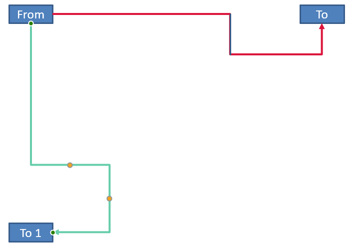

## **Úvod**

Konektor PowerPointu je specializovaná čára, která spojuje dva tvary a zůstává připojena, když jsou tvary posouvány nebo přemístěny na snímku. Konektory se připojují k **bodům připojení** (zelené body) na tvarech. Body připojení se zobrazí, když k nim přistoupí ukazatel. **Úchyty úpravy** (žluté body), dostupné u některých konektorů, vám umožňují upravit polohu a tvar konektoru.

## **Typy konektorů**

V PowerPointu můžete použít tři typy konektorů: přímý, loketní (úhlový) a zakřivený.

Aspose.Slides podporuje následující typy konektorů:

| Typ konektoru                  | Obrázek                                                     | Počet bodů úpravy |
| ------------------------------ | ----------------------------------------------------------- | ----------------- |
| `ShapeType.LINE`                |             | 0                 |
| `ShapeType.STRAIGHT_CONNECTOR1` |       | 0                 |
| `ShapeType.BENT_CONNECTOR2`     |         | 0                 |
| `ShapeType.BENT_CONNECTOR3`     |          | 1                 |
| `ShapeType.BENT_CONNECTOR4`     |          | 2                 |
| `ShapeType.BENT_CONNECTOR5`     |          | 3                 |
| `ShapeType.CURVED_CONNECTOR2`   |      | 0                 |
| `ShapeType.CURVED_CONNECTOR3`   |      | 1                 |
| `ShapeType.CURVED_CONNECTOR4`   |      | 2                 |
| `ShapeType.CURVED_CONNECTOR5`   |      | 3                 |

## **Propojení tvarů pomocí konektorů**

Tato část ukazuje, jak v Aspose.Slides propojit tvary pomocí konektorů. Přidáte konektor na snímek, připojíte jeho začátek a konec k cílovým tvarům. Použití míst připojení zajišťuje, že konektor zůstane „přilepen“ k tvarům i při jejich přesunu nebo změně velikosti.

1. Vytvořte instanci třídy [Presentation](https://reference.aspose.com/slides/cs/python-net/aspose.slides/presentation/).
1. Získejte odkaz na snímek podle jeho indexu.
1. Přidejte dva objekty [AutoShape](https://reference.aspose.com/slides/cs/python-net/aspose.slides/autoshape/) na snímek pomocí metody `add_auto_shape`, kterou poskytuje objekt [ShapeCollection](https://reference.aspose.com/slides/cs/python-net/aspose.slides/shapecollection/).
1. Přidejte konektor pomocí metody `add_connector`, kterou poskytuje objekt [ShapeCollection](https://reference.aspose.com/slides/cs/python-net/aspose.slides/shapecollection/), a určete typ konektoru.
1. Propojte tvary pomocí konektoru.
1. Zavolejte metodu `reroute` pro použití nejkratší cesty spojení.
1. Uložte prezentaci.

Následující Python kód ukazuje, jak přidat ohýbaný konektor mezi dva tvary (elipsu a obdélník):

```python
import aspose.slides as slides

# Vytvořte instanci třídy Presentation pro vytvoření souboru PPTX.
with slides.Presentation() as presentation:

    # Získejte kolekci tvarů pro první snímek.
    shapes = presentation.slides[0].shapes

    # Přidejte AutoShape elipsy.
    ellipse = shapes.add_auto_shape(slides.ShapeType.ELLIPSE, 50, 50, 100, 100)

    # Přidejte AutoShape obdélníku.
    rectangle = shapes.add_auto_shape(slides.ShapeType.RECTANGLE, 150, 200, 100, 100)

    # Přidejte konektor na snímek.
    connector = shapes.add_connector(slides.ShapeType.BENT_CONNECTOR2, 0, 0, 10, 10)

    # Propojte tvary pomocí konektoru.
    connector.start_shape_connected_to = ellipse
    connector.end_shape_connected_to = rectangle

    # Zavolejte reroute pro nastavení nejkratší cesty.
    connector.reroute()

    # Uložte prezentaci.
    presentation.save("connected_shapes.pptx", slides.export.SaveFormat.PPTX)
```

{}
`connector.reroute` metoda přesměruje konektor a vynutí, aby zvolil nejkratší možnou cestu mezi tvary. K tomu může metoda změnit hodnoty `start_shape_connection_site_index` a `end_shape_connection_site_index`.
{}

## **Určení bodů připojení**

Tato část vysvětluje, jak připojit konektor k určitému bodu připojení na tvaru v Aspose.Slides. Cílením na konkrétní místa připojení můžete řídit trasování a rozvržení konektoru a vytvářet tak čisté, předvídatelné diagramy ve vašich prezentacích.

1. Vytvořte instanci třídy [Presentation](https://reference.aspose.com/slides/cs/python-net/aspose.slides/presentation/).
1. Získejte odkaz na snímek podle jeho indexu.
1. Přidejte dva objekty [AutoShape](https://reference.aspose.com/slides/cs/python-net/aspose.slides/autoshape/) na snímek pomocí metody `add_auto_shape`, kterou poskytuje objekt [ShapeCollection](https://reference.aspose.com/slides/cs/python-net/aspose.slides/shapecollection/).
1. Přidejte konektor pomocí metody `add_connector` na objektu [ShapeCollection](https://reference.aspose.com/slides/cs/python-net/aspose.slides/shapecollection/) a určete typ konektoru.
1. Propojte tvary pomocí konektoru.
1. Nastavte požadované body připojení na tvarech.
1. Uložte prezentaci.

Následující Python kód ukazuje, jak specifikovat požadovaný bod připojení:

```python
import aspose.slides as slides

# Vytvořte instanci třídy Presentation pro vytvoření souboru PPTX.
with slides.Presentation() as presentation:

    # Získejte kolekci tvarů pro první snímek.
    shapes = presentation.slides[0].shapes

    # Přidejte AutoShape elipsy.
    ellipse = shapes.add_auto_shape(slides.ShapeType.ELLIPSE, 50, 50, 100, 100)

    # Přidejte AutoShape obdélníku.
    rectangle = shapes.add_auto_shape(slides.ShapeType.RECTANGLE, 150, 200, 100, 100)

    # Přidejte konektor do kolekce tvarů na snímku.
    connector = shapes.add_connector(slides.ShapeType.BENT_CONNECTOR3, 0, 0, 10, 10)

    # Propojte tvary pomocí konektoru.
    connector.start_shape_connected_to = ellipse
    connector.end_shape_connected_to = rectangle

    # Nastavte preferovaný index místa připojení na elipse.
    site_index = 6

    # Zkontrolujte, že preferovaný index je v rámci dostupného počtu míst.
    if  ellipse.connection_site_count > site_index:
        # Přiřaďte preferované místo připojení na AutoShape elipsy.
        connector.start_shape_connection_site_index = site_index

    # Uložte prezentaci.
    presentation.save("connection_points.pptx", slides.export.SaveFormat.PPTX)
```

## **Úprava bodů konektoru**

Můžete upravovat konektory pomocí jejich bodů úpravy. Pouze konektory, které poskytují body úpravy, lze tímto způsobem upravovat. Podrobnosti o tom, které konektory podporují úpravy, najdete v tabulce pod [Connector Types](/slides/cs/python-net/connector/#connector-types).

### **Jednoduchý případ**

Zvažte případ, kdy konektor mezi dvěma tvary (A a B) protíná třetí tvar (C):


Příklad kódu:

```python
import aspose.slides as slides
import aspose.pydrawing as draw

with slides.Presentation() as presentation:
    slide = presentation.slides[0]

    shape = slide.shapes.add_auto_shape(slides.ShapeType.RECTANGLE, 300, 150, 150, 75)
    shape_from = slide.shapes.add_auto_shape(slides.ShapeType.RECTANGLE, 500, 400, 100, 50)
    shape_to = slide.shapes.add_auto_shape(slides.ShapeType.RECTANGLE, 100, 100, 70, 30)
    
    connector = slide.shapes.add_connector(slides.ShapeType.BENT_CONNECTOR5, 20, 20, 400, 300)
    
    connector.line_format.end_arrowhead_style = slides.LineArrowheadStyle.TRIANGLE
    connector.line_format.fill_format.fill_type = slides.FillType.SOLID
    connector.line_format.fill_format.solid_fill_color.color = draw.Color.black
    
    connector.start_shape_connected_to = shape_from
    connector.end_shape_connected_to = shape_to
    connector.start_shape_connection_site_index = 2
```

Aby se vyhnul třetímu tvaru, upravte konektor posunutím jeho svislého segmentu doleva:


```python
    adjustment2 = connector.adjustments[1]
    adjustment2.raw_value += 10000
```

### **Komplexní případy**

Pro pokročilejší úpravy zvažte následující:

- Bod úpravy konektoru je řízen vzorcem, který určuje jeho polohu. Změna tohoto bodu může změnit celkový tvar konektoru.
- Body úpravy konektoru jsou uloženy v přísně uspořádaném poli, očíslovaném od začátku konektoru po jeho konec.
- Hodnoty bodů úpravy představují procenta šířky/výšky tvaru konektoru.
  - Tvar je omezen počátečním a koncovým bodem konektoru a škálován pomocí 1000.
  - První, druhý a třetí bod úpravy představují: procento šířky, procento výšky a opět procento šířky.
- Při výpočtu souřadnic bodů úpravy zohledněte rotaci a odraz konektoru. **Poznámka:** U všech konektorů uvedených v [Connector Types](/slides/cs/python-net/connector/#connector-types) je úhel rotace 0.

#### **Případ 1**

Zvažte případ, kdy jsou dva objekty textového rámce propojeny konektorem:


Příklad kódu:

```python
import aspose.slides as slides
import aspose.pydrawing as draw

# Vytvořte instanci třídy Presentation pro vytvoření souboru PPTX.
with slides.Presentation() as presentation:

    # Získejte první snímek.
    slide = presentation.slides[0]

    # Získejte první snímek.
    shape_from = slide.shapes.add_auto_shape(slides.ShapeType.RECTANGLE, 100, 100, 60, 25)
    shape_from.text_frame.text = "From"
    shape_to = slide.shapes.add_auto_shape(slides.ShapeType.RECTANGLE, 500, 100, 60, 25)
    shape_to.text_frame.text = "To"

    # Přidejte konektor.
    connector = slide.shapes.add_connector(slides.ShapeType.BENT_CONNECTOR4, 20, 20, 400, 300)
    # Nastavte směr konektoru.
    connector.line_format.end_arrowhead_style = slides.LineArrowheadStyle.TRIANGLE
    # Nastavte barvu konektoru.
    connector.line_format.fill_format.fill_type = slides.FillType.SOLID
    connector.line_format.fill_format.solid_fill_color.color = draw.Color.crimson
    # Nastavte tloušťku čáry konektoru.
    connector.line_format.width = 3

    # Propojte tvary pomocí konektoru.
    connector.start_shape_connected_to = shape_from
    connector.start_shape_connection_site_index = 3
    connector.end_shape_connected_to = shape_to
    connector.end_shape_connection_site_index = 2

    # Získejte body úpravy konektoru.
    adjustment_0 = connector.adjustments[0]
    adjustment_1 = connector.adjustments[1]
```

**Úprava**

Změňte hodnoty bodů úpravy konektoru zvýšením procenta šířky o 20 % a procenta výšky o 200 %:

```python
    # Změňte hodnoty bodů úpravy.
    adjustment_0.raw_value += 20000
    adjustment_1.raw_value += 200000
```

Výsledek:


Pro definování modelu, který umožňuje určit souřadnice a tvar segmentů konektoru, vytvořte tvar, který odpovídá svislé komponentě konektoru na `connector.adjustments[0]`:

```python
    # Nakreslete svislou komponentu konektoru.
    x = connector.x + connector.width * adjustment_0.raw_value / 100000
    y = connector.y
    height = connector.height * adjustment_1.raw_value / 100000

    slide.shapes.add_auto_shape(slides.ShapeType.RECTANGLE, x, y, 0, height)
```

Výsledek:


#### **Případ 2**

V **Případě 1** jsme demonstrovali jednoduchou úpravu konektoru pomocí základních principů. V typických scénářích musíte zohlednit rotaci konektoru a jeho nastavení zobrazení (řízené pomocí `connector.rotation`, `connector.frame.flip_h` a `connector.frame.flip_v`). Zde je postup.

Nejprve přidejte nový objekt textového rámce (**To 1**) na snímek (pro připojení) a vytvořte nový zelený konektor, který ho propojí s existujícími objekty.

```python
    # Vytvořte nový cílový objekt.
    shape_to_1 = sld.shapes.add_auto_shape(slides.ShapeType.RECTANGLE, 100, 400, 60, 25)
    shape_to_1.text_frame.text = "To 1"

    # Vytvořte nový konektor.
    connector = sld.shapes.add_connector(slides.ShapeType.BENT_CONNECTOR4, 20, 20, 400, 300)
    connector.line_format.end_arrowhead_style = slides.LineArrowheadStyle.TRIANGLE
    connector.line_format.fill_format.fill_type = slides.FillType.SOLID
    connector.line_format.fill_format.solid_fill_color.color = draw.Color.medium_aquamarine
    connector.line_format.width = 3

    # Propojte objekty pomocí nově vytvořeného konektoru.
    connector.start_shape_connected_to = shapeFrom
    connector.start_shape_connection_site_index = 2
    connector.end_shape_connected_to = shape_to_1
    connector.end_shape_connection_site_index = 3

    # Získejte body úpravy konektoru.
    adjustment_0 = connector.adjustments[0]
    adjustment_1 = connector.adjustments[1]
    
    # Změňte hodnoty bodů úpravy.
    adjustment_0.raw_value += 20000
    adjustment_1.raw_value += 200000
```

Výsledek:



Druhé, vytvořte tvar, který odpovídá **horizontálnímu** segmentu konektoru procházejícímu novým bodem úpravy konektoru `connector.adjustments[0]`. Použijte hodnoty z `connector.rotation`, `connector.frame.flip_h` a `connector.frame.flip_v` a aplikujte standardní převodovou rovnici souřadnic pro rotaci kolem daného bodu `x0`:

X = (x — x0) * cos(alpha) — (y — y0) * sin(alpha) + x0;
Y = (x — x0) * sin(alpha) + (y — y0) * cos(alpha) + y0;

V našem případě je úhel rotace objektu 90 stupňů a konektor je zobrazen vertikálně, takže odpovídající kód je:

```python
    # Uložte souřadnice konektoru.
    x = connector.x
    y = connector.y
    
    # Opravte souřadnice konektoru, pokud je převrácen.
    if connector.frame.flip_h == 1:
        x += connector.width
    if connector.frame.flip_v == 1:
        y += connector.height

    # Použijte hodnotu bodu úpravy jako souřadnici.
    x += connector.width * adjValue_0.raw_value / 100000
    
    # Převěďte souřadnice, protože sin(90°) = 1 a cos(90°) = 0.
    xx = connector.frame.center_x - y + connector.frame.center_y
    yy = x - connector.frame.center_x + connector.frame.center_y

    # Určete šířku vodorovného segmentu pomocí hodnoty druhého bodu úpravy.
    width = connector.height * adjValue_1.raw_value / 100000
    shape = sld.shapes.add_auto_shape(slides.ShapeType.RECTANGLE, xx, yy, width, 0)
    shape.line_format.fill_format.fill_type = slides.FillType.SOLID
    shape.line_format.fill_format.solid_fill_color.color = draw.Color.red
```

Výsledek:


Ukázali jsme výpočty zahrnující jednoduché úpravy i složitější body úpravy (ty, které zohledňují rotaci). S touto znalostí můžete vytvořit vlastní model – nebo napsat kód – pro získání objektu `GraphicsPath` nebo dokonce nastavit hodnoty bodů úpravy konektoru na základě konkrétních souřadnic snímku.

## **Zjištění úhlů čar konektoru**

Použijte níže uvedený příklad k určení úhlu čar konektoru na snímku pomocí Aspose.Slides. Naučíte se číst koncové body konektoru a vypočítat jeho orientaci, abyste mohli přesně zarovnat šipky, popisky a další tvary.

1. Vytvořte instanci třídy [Presentation](https://reference.aspose.com/slides/cs/python-net/aspose.slides/presentation/).
1. Získejte odkaz na snímek podle indexu.
1. Získejte přístup k tvaru čáry konektoru.
1. Použijte šířku a výšku čáry a šířku a výšku rámce tvaru k výpočtu úhlu.

Následující Python kód ukazuje, jak vypočítat úhel pro tvar čáry konektoru:

```python
import aspose.slides as slides
import math

def get_direction(w, h, flip_h, flip_v):
    end_line_x = w * (-1 if flip_h else 1)
    end_line_y = h * (-1 if flip_v else 1)
    end_y_axis_x = 0
    end_y_axis_y = h
    angle = math.atan2(end_y_axis_y, end_y_axis_x) - math.atan2(end_line_y, end_line_x)
    if (angle < 0):
         angle += 2 * math.pi
    return angle * 180.0 / math.pi

with slides.Presentation("connector_line_angle.pptx") as presentation:
    slide = presentation.slides[0]
    for shape_index in range(len(slide.shapes)):
        direction = 0.0
        shape = slide.shapes[shape_index]
        if type(shape) is slides.AutoShape and shape.shape_type == slides.ShapeType.LINE:
            direction = get_direction(shape.width, shape.height, shape.frame.flip_h, shape.frame.flip_v)
        elif type(shape) is slides.Connector:
            direction = get_direction(shape.width, shape.height, shape.frame.flip_h, shape.frame.flip_v)
        print(direction)
```

## **Často kladené otázky**

**Jak zjistím, zda lze konektor „přilepit“ k danému tvaru?**

Zkontrolujte, zda tvar poskytuje [místa připojení](https://reference.aspose.com/slides/cs/python-net/aspose.slides/shape/connection_site_count/). Pokud žádná nejsou nebo je jejich počet nula, přilepení není k dispozici; v takovém případě použijte volné koncové body a umístěte je ručně. Je rozumné před připojením zkontrolovat počet míst.

**Co se stane s konektorem, pokud smažu jeden z propojených tvarů?**

Jeho konce se odpojí; konektor zůstane na snímku jako obyčejná čára s volným začátkem/konec. Můžete jej buď smazat, nebo přiřadit spojení znovu a v případě potřeby [přesměrovat](https://reference.aspose.com/slides/cs/python-net/aspose.slides/connector/reroute/).

**Zůstávají vazby konektoru zachovány při kopírování snímku do jiné prezentace?**

Obecně ano, pokud jsou zkopírovány i cílové tvary. Pokud je snímek vložen do jiného souboru bez připojených tvarů, konce se stanou volnými a budete je muset znovu připojit.