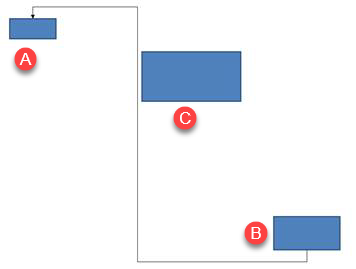

## **Přehled**

Konektor je čára, která může zůstat připojena ke dvěma tvary, i když se kterýkoli z tvarů pohybuje. Jeho konce se přichycují k místům připojení, která jsou v PowerPointu zobrazena zelenými tečkami. Některé ohnuté a zakřivené konektory také nabízejí body úprav, zobrazené oranžovými tečkami, které řídí polohu jednotlivých segmentů konektoru.

Aspose.Slides představuje konektory prostřednictvím rozhraní [IConnector](https://reference.aspose.com/slides/cs/python-net/aspose.slides/iconnector/). Můžete je vytvářet, přichycovat jejich konce k tvarům, vybírat místa připojení, přepočítávat je a upravovat geometrii konektorů, které mají body úprav.

## **Typy konektorů**

Výčtový typ [ShapeType](https://reference.aspose.com/slides/cs/python-net/aspose.slides/shapetype/) obsahuje předvolby pro rovné, ohnuté a zakřivené konektory. Následující tabulka uvádí dostupné geometrie konektorů a počet bodů úprav definovaných každou předvolbou.

| Konektor | Obrázek | Počet bodů úprav |
|---|---|---|
| `ShapeType.LINE` |  | 0 |
| `ShapeType.STRAIGHT_CONNECTOR1` |  | 0 |
| `ShapeType.BENT_CONNECTOR2` |  | 0 |
| `ShapeType.BENT_CONNECTOR3` |  | 1 |
| `ShapeType.BENT_CONNECTOR4` |  | 2 |
| `ShapeType.BENT_CONNECTOR5` |  | 3 |
| `ShapeType.CURVED_CONNECTOR2` |  | 0 |
| `ShapeType.CURVED_CONNECTOR3` |  | 1 |
| `ShapeType.CURVED_CONNECTOR4` |  | 2 |
| `ShapeType.CURVED_CONNECTOR5` |  | 3 |

Počet a význam bodů úprav jsou součástí vybrané předvolby konektoru. Nepředpokládejte, že dva různé typy konektorů mají stejnou strukturu kolekce.

## **Propojení dvou tvarů**

Použijte [IShapeCollection.add_connector](https://reference.aspose.com/slides/cs/python-net/aspose.slides/ishapecollection/add_connector/) k přidání konektoru a přiřaďte jeho vlastnosti [start_shape_connected_to](https://reference.aspose.com/slides/cs/python-net/aspose.slides/iconnector/start_shape_connected_to/) a [end_shape_connected_to](https://reference.aspose.com/slides/cs/python-net/aspose.slides/iconnector/end_shape_connected_to/). Jakmile jsou oba konce přichyceny, metoda [IConnector.reroute](https://reference.aspose.com/slides/cs/python-net/aspose.slides/iconnector/reroute/) zvolí nejkratší cestu mezi tvary.

Následující příklad spojuje elipsu a obdélník pomocí ohnutého konektoru:

```python
import aspose.slides as slides

with slides.Presentation() as presentation:
    slide = presentation.slides[0]

    ellipse = slide.shapes.add_auto_shape(slides.ShapeType.ELLIPSE, 40, 80, 120, 80)
    rectangle = slide.shapes.add_auto_shape(slides.ShapeType.RECTANGLE, 320, 240, 140, 80)
    connector = slide.shapes.add_connector(slides.ShapeType.BENT_CONNECTOR2, 0, 0, 10, 10)

    connector.start_shape_connected_to = ellipse
    connector.end_shape_connected_to = rectangle
    connector.reroute()

    presentation.save("connected-shapes.pptx", slides.export.SaveFormat.PPTX)
```

{}

Volání `reroute` může změnit hodnoty [start_shape_connection_site_index](https://reference.aspose.com/slides/cs/python-net/aspose.slides/iconnector/start_shape_connection_site_index/) a [end_shape_connection_site_index](https://reference.aspose.com/slides/cs/python-net/aspose.slides/iconnector/end_shape_connection_site_index/). Po přepočítání přiřaďte konkrétní místa připojení, pokud mají zůstat pevně daná.

{}

## **Výběr místa připojení**

Každý propojitelný tvar udává počet svých míst připojení pomocí vlastnosti [connection_site_count](https://reference.aspose.com/slides/cs/python-net/aspose.slides/igeometryshape/connection_site_count/). Před přiřazením konci konektoru ověřte preferovaný nulový index místa; počet míst se liší podle geometrie tvaru.

Tento příklad připojuje konektor k určitému místu na elipse, pokud takové místo existuje:

```python
import aspose.slides as slides

with slides.Presentation() as presentation:
    slide = presentation.slides[0]

    ellipse = slide.shapes.add_auto_shape(slides.ShapeType.ELLIPSE, 40, 80, 120, 80)
    rectangle = slide.shapes.add_auto_shape(slides.ShapeType.RECTANGLE, 320, 240, 140, 80)
    connector = slide.shapes.add_connector(slides.ShapeType.BENT_CONNECTOR3, 0, 0, 10, 10)

    connector.start_shape_connected_to = ellipse
    connector.end_shape_connected_to = rectangle

    preferred_site_index = 2
    if preferred_site_index < ellipse.connection_site_count:
        connector.start_shape_connection_site_index = preferred_site_index
    else:
        print(f"The ellipse has only {ellipse.connection_site_count} connection sites.")

    presentation.save("specific-connection-site.pptx", slides.export.SaveFormat.PPTX)
```

## **Úprava bodu konektoru**

Konektory s body úprav je vystavují pomocí [IGeometryShape.adjustments](https://reference.aspose.com/slides/cs/python-net/aspose.slides/igeometryshape/adjustments/). Prozkoumejte každý [IAdjustValue](https://reference.aspose.com/slides/cs/python-net/aspose.slides/iadjustvalue/) a před změnou jeho [type](https://reference.aspose.com/slides/cs/python-net/aspose.slides/iadjustvalue/type/) zkontrolujte jeho [raw_value](https://reference.aspose.com/slides/cs/python-net/aspose.slides/iadjustvalue/raw_value/). Pro obecnou manipulaci s tvary viz [Shape Manipulation](/slides/cs/python-net/shape-manipulations/).

Počet, pořadí, význam a platný rozsah hodnot úprav konektoru závisí na předvolbě konektoru. Vlastnost `type` je jen ke čtení, zatímco hodnota úpravy je zapisovatelná. Vlastnost jen ke čtení [name](https://reference.aspose.com/slides/cs/python-net/aspose.slides/iadjustvalue/name/) poskytuje další identifikaci, pokud konektor obsahuje více úprav se stejným sémantickým typem.

### **Obejití překážky**

V následujícím rozvržení prochází konektor `ShapeType.BENT_CONNECTOR5` mezi dvěma tvary třetím tvarem:


Tento kód vytvoří blokovaný konektor:

```python
import aspose.slides as slides
import aspose.pydrawing as draw

with slides.Presentation() as presentation:
    slide = presentation.slides[0]

    slide.shapes.add_auto_shape(slides.ShapeType.RECTANGLE, 300, 150, 150, 75)
    source_shape = slide.shapes.add_auto_shape(slides.ShapeType.RECTANGLE, 500, 400, 100, 50)
    target_shape = slide.shapes.add_auto_shape(slides.ShapeType.RECTANGLE, 100, 100, 70, 30)
    connector = slide.shapes.add_connector(slides.ShapeType.BENT_CONNECTOR5, 20, 20, 400, 300)

    connector.line_format.end_arrowhead_style = slides.LineArrowheadStyle.TRIANGLE
    connector.line_format.fill_format.fill_type = slides.FillType.SOLID
    connector.line_format.fill_format.solid_fill_color.color = draw.Color.black
    connector.start_shape_connected_to = source_shape
    connector.end_shape_connected_to = target_shape
    connector.start_shape_connection_site_index = 2

    presentation.save("connector-obstruction.pptx", slides.export.SaveFormat.PPTX)
```

Posunutí vertikálního ohybu změní trasu tak, aby konektor obešel překážku:



Místo předpokladu, že index kolekce `1` vždy představuje vertikální ohyb, tento příklad hledá `ShapeAdjustmentType.CONNECTOR_BEND_POSITION_Y` a mění jej jen tehdy, když je přítomen očekávaný sémantický typ:

```python
import aspose.slides as slides
import aspose.pydrawing as draw

with slides.Presentation() as presentation:
    slide = presentation.slides[0]

    slide.shapes.add_auto_shape(slides.ShapeType.RECTANGLE, 300, 150, 150, 75)
    source_shape = slide.shapes.add_auto_shape(slides.ShapeType.RECTANGLE, 500, 400, 100, 50)
    target_shape = slide.shapes.add_auto_shape(slides.ShapeType.RECTANGLE, 100, 100, 70, 30)
    connector = slide.shapes.add_connector(slides.ShapeType.BENT_CONNECTOR5, 20, 20, 400, 300)

    connector.line_format.end_arrowhead_style = slides.LineArrowheadStyle.TRIANGLE
    connector.line_format.fill_format.fill_type = slides.FillType.SOLID
    connector.line_format.fill_format.solid_fill_color.color = draw.Color.black
    connector.start_shape_connected_to = source_shape
    connector.end_shape_connected_to = target_shape
    connector.start_shape_connection_site_index = 2

    vertical_bend = None
    for adjustment_index in range(len(connector.adjustments)):
        adjustment = connector.adjustments[adjustment_index]
        print(f"{adjustment.name}: {adjustment.type}, raw value = {adjustment.raw_value}")
        if adjustment.type == slides.ShapeAdjustmentType.CONNECTOR_BEND_POSITION_Y:
            vertical_bend = adjustment
            break

    if vertical_bend is None:
        print("The connector does not expose a vertical bend adjustment.")
    else:
        vertical_bend.raw_value = 60000
        presentation.save("connector-obstruction-fixed.pptx", slides.export.SaveFormat.PPTX)
```

`ShapeType.BENT_CONNECTOR5` má dva úpravy typu `ShapeAdjustmentType.CONNECTOR_BEND_POSITION_X` a jednu úpravu typu `ShapeAdjustmentType.CONNECTOR_BEND_POSITION_Y`. Pokud se požadovaný typ vyskytuje vícekrát, před výběrem si prohlédněte `name` a známou geometriku předvolby. Pokud úprava vrací [ShapeAdjustmentType.CUSTOM](https://reference.aspose.com/slides/cs/python-net/aspose.slides/shapeadjustmenttype/), považujte její význam a rozsah za specifické pro předvolbu a neměňte ji, dokud neznáte smlouvu.

## **Vztah hodnot úprav k geometrii konektoru**

U ohnutých konektorů lze hodnoty úprav použít k odhadu poloh jednotlivých segmentů. Výpočty jsou specifické pro předvolbu konektoru:

- `ShapeType.BENT_CONNECTOR4` typicky vystavuje jednu úpravu `ShapeAdjustmentType.CONNECTOR_BEND_POSITION_X` a jednu úpravu `ShapeAdjustmentType.CONNECTOR_BEND_POSITION_Y`.
- Pro tyto pozice ohybu se `raw_value / 100000` používá k získání zlomku šířky nebo výšky rámce konektoru, jak je použito v níže uvedených příkladech.
- Rámec konektoru může být otočen nebo převrácen, takže souřadnice rámce je třeba převést před porovnáním se souřadnicemi snímku.

Následující příklady nejprve identifikují úpravy pomocí `type`. Nepředpokládají, že indexy kolekce jsou přenositelné identifikátory.

### **Neotočený konektor**

Úvodní rozvržení obsahuje dva textové tvary propojené `ShapeType.BENT_CONNECTOR4`:


Tento příklad prozkoumá konektor a získá jeho horizontální a vertikální úpravy ohybu:

```python
import aspose.slides as slides
import aspose.pydrawing as draw

with slides.Presentation() as presentation:
    slide = presentation.slides[0]

    source_shape = slide.shapes.add_auto_shape(slides.ShapeType.RECTANGLE, 100, 100, 60, 25)
    source_shape.text_frame.text = "From"
    target_shape = slide.shapes.add_auto_shape(slides.ShapeType.RECTANGLE, 500, 100, 60, 25)
    target_shape.text_frame.text = "To"
    connector = slide.shapes.add_connector(slides.ShapeType.BENT_CONNECTOR4, 20, 20, 400, 300)

    connector.line_format.end_arrowhead_style = slides.LineArrowheadStyle.TRIANGLE
    connector.line_format.fill_format.fill_type = slides.FillType.SOLID
    connector.line_format.fill_format.solid_fill_color.color = draw.Color.crimson
    connector.line_format.width = 3
    connector.start_shape_connected_to = source_shape
    connector.start_shape_connection_site_index = 3
    connector.end_shape_connected_to = target_shape
    connector.end_shape_connection_site_index = 2

    for adjustment_index in range(len(connector.adjustments)):
        adjustment = connector.adjustments[adjustment_index]
        print(f"{adjustment.name}: {adjustment.type}, raw value = {adjustment.raw_value}")
```

Pro změnu obou ohybů najděte každý očekávaný typ a upravte hodnoty až po nalezení obou:

```python
import aspose.slides as slides

with slides.Presentation() as presentation:
    slide = presentation.slides[0]

    source_shape = slide.shapes.add_auto_shape(slides.ShapeType.RECTANGLE, 100, 100, 60, 25)
    target_shape = slide.shapes.add_auto_shape(slides.ShapeType.RECTANGLE, 500, 100, 60, 25)
    connector = slide.shapes.add_connector(slides.ShapeType.BENT_CONNECTOR4, 20, 20, 400, 300)
    connector.start_shape_connected_to = source_shape
    connector.start_shape_connection_site_index = 3
    connector.end_shape_connected_to = target_shape
    connector.end_shape_connection_site_index = 2

    horizontal_bend = None
    vertical_bend = None
    for adjustment_index in range(len(connector.adjustments)):
        adjustment = connector.adjustments[adjustment_index]
        if adjustment.type == slides.ShapeAdjustmentType.CONNECTOR_BEND_POSITION_X:
            horizontal_bend = adjustment
        elif adjustment.type == slides.ShapeAdjustmentType.CONNECTOR_BEND_POSITION_Y:
            vertical_bend = adjustment

    if horizontal_bend is None or vertical_bend is None:
        print("The connector does not expose the expected bend adjustments.")
    else:
        horizontal_bend.raw_value += 20000
        vertical_bend.raw_value += 200000
        presentation.save("connector-adjusted.pptx", slides.export.SaveFormat.PPTX)
```

Výsledkem je konektor, jehož horizontální a vertikální segmenty se posunuly:


Jakmile jsou sémantické typy známy, lze jejich hodnoty převést na souřadnice rámce konektoru. Tento příklad nakreslí tenký obdélník přes vertikální segment řízený dvěma ohyby:

```python
import aspose.slides as slides

with slides.Presentation() as presentation:
    slide = presentation.slides[0]

    source_shape = slide.shapes.add_auto_shape(slides.ShapeType.RECTANGLE, 100, 100, 60, 25)
    target_shape = slide.shapes.add_auto_shape(slides.ShapeType.RECTANGLE, 500, 100, 60, 25)
    connector = slide.shapes.add_connector(slides.ShapeType.BENT_CONNECTOR4, 20, 20, 400, 300)
    connector.start_shape_connected_to = source_shape
    connector.start_shape_connection_site_index = 3
    connector.end_shape_connected_to = target_shape
    connector.end_shape_connection_site_index = 2

    horizontal_bend = None
    vertical_bend = None
    for adjustment_index in range(len(connector.adjustments)):
        adjustment = connector.adjustments[adjustment_index]
        if adjustment.type == slides.ShapeAdjustmentType.CONNECTOR_BEND_POSITION_X:
            horizontal_bend = adjustment
        elif adjustment.type == slides.ShapeAdjustmentType.CONNECTOR_BEND_POSITION_Y:
            vertical_bend = adjustment

    if horizontal_bend is None or vertical_bend is None:
        print("The connector does not expose the expected bend adjustments.")
    else:
        x = connector.x + connector.width * horizontal_bend.raw_value / 100000
        y = connector.y
        height = connector.height * vertical_bend.raw_value / 100000
        slide.shapes.add_auto_shape(slides.ShapeType.RECTANGLE, x, y, 1, height)
        presentation.save("connector-segment-guide.pptx", slides.export.SaveFormat.PPTX)
```

Vodicí tvar označuje vypočtený segment:


### **Otočený nebo převrácený konektor**

Když je stejná geometrie konektoru orientována svisle, její hodnoty [frame](https://reference.aspose.com/slides/cs/python-net/aspose.slides/iconnector/frame/), [flip_h](https://reference.aspose.com/slides/cs/python-net/aspose.slides/ishapeframe/flip_h/) a [flip_v](https://reference.aspose.com/slides/cs/python-net/aspose.slides/ishapeframe/flip_v/) ovlivňují převod souřadnic z rámce konektoru na souřadnice snímku.

Tento příklad vytvoří a upraví svisle orientovaný konektor:

```python
import aspose.slides as slides
import aspose.pydrawing as draw

with slides.Presentation() as presentation:
    slide = presentation.slides[0]

    source_shape = slide.shapes.add_auto_shape(slides.ShapeType.RECTANGLE, 100, 100, 60, 25)
    source_shape.text_frame.text = "From"
    target_shape = slide.shapes.add_auto_shape(slides.ShapeType.RECTANGLE, 100, 400, 60, 25)
    target_shape.text_frame.text = "To 1"
    connector = slide.shapes.add_connector(slides.ShapeType.BENT_CONNECTOR4, 20, 20, 400, 300)

    connector.line_format.end_arrowhead_style = slides.LineArrowheadStyle.TRIANGLE
    connector.line_format.fill_format.fill_type = slides.FillType.SOLID
    connector.line_format.fill_format.solid_fill_color.color = draw.Color.medium_aquamarine
    connector.line_format.width = 3
    connector.start_shape_connected_to = source_shape
    connector.start_shape_connection_site_index = 2
    connector.end_shape_connected_to = target_shape
    connector.end_shape_connection_site_index = 3

    for adjustment_index in range(len(connector.adjustments)):
        adjustment = connector.adjustments[adjustment_index]
        if adjustment.type == slides.ShapeAdjustmentType.CONNECTOR_BEND_POSITION_X:
            adjustment.raw_value += 20000
        elif adjustment.type == slides.ShapeAdjustmentType.CONNECTOR_BEND_POSITION_Y:
            adjustment.raw_value += 200000

    presentation.save("vertical-connector-adjusted.pptx", slides.export.SaveFormat.PPTX)
```

Upravený konektor se zobrazí svisle mezi tvary:


Pro libovolný úhel otáčení `alpha` otočte bod rámce konektoru `(x, y)` kolem středu rámce `(x0, y0)`:

`X = (x - x0) * cos(alpha) - (y - y0) * sin(alpha) + x0`

`Y = (x - x0) * sin(alpha) + (y - y0) * cos(alpha) + y0`

Následující kód řeší 90‑stupňovou orientaci použitou v tomto příkladu a vykreslí červenou vodítko přes odpovídající segment konektoru:

```python
import aspose.slides as slides
import aspose.pydrawing as draw

with slides.Presentation() as presentation:
    slide = presentation.slides[0]

    source_shape = slide.shapes.add_auto_shape(slides.ShapeType.RECTANGLE, 100, 100, 60, 25)
    target_shape = slide.shapes.add_auto_shape(slides.ShapeType.RECTANGLE, 100, 400, 60, 25)
    connector = slide.shapes.add_connector(slides.ShapeType.BENT_CONNECTOR4, 20, 20, 400, 300)
    connector.start_shape_connected_to = source_shape
    connector.start_shape_connection_site_index = 2
    connector.end_shape_connected_to = target_shape
    connector.end_shape_connection_site_index = 3

    horizontal_bend = None
    vertical_bend = None
    for adjustment_index in range(len(connector.adjustments)):
        adjustment = connector.adjustments[adjustment_index]
        if adjustment.type == slides.ShapeAdjustmentType.CONNECTOR_BEND_POSITION_X:
            horizontal_bend = adjustment
        elif adjustment.type == slides.ShapeAdjustmentType.CONNECTOR_BEND_POSITION_Y:
            vertical_bend = adjustment

    if horizontal_bend is None or vertical_bend is None:
        print("The connector does not expose the expected bend adjustments.")
    else:
        horizontal_bend.raw_value += 20000
        vertical_bend.raw_value += 200000

        x = connector.x
        y = connector.y
        if connector.frame.flip_h == slides.NullableBool.TRUE:
            x += connector.width
        if connector.frame.flip_v == slides.NullableBool.TRUE:
            y += connector.height

        x += connector.width * horizontal_bend.raw_value / 100000
        rotated_x = connector.frame.center_x - y + connector.frame.center_y
        rotated_y = x - connector.frame.center_x + connector.frame.center_y
        segment_width = connector.height * vertical_bend.raw_value / 100000
        guide = slide.shapes.add_auto_shape(slides.ShapeType.RECTANGLE, rotated_x, rotated_y, segment_width, 1)
        guide.line_format.fill_format.fill_type = slides.FillType.SOLID
        guide.line_format.fill_format.solid_fill_color.color = draw.Color.red

        presentation.save("rotated-connector-segment-guide.pptx", slides.export.SaveFormat.PPTX)
```

Červené vodítko označuje vypočtený segment po transformaci souřadnic:


Tyto vzorce popisují předvolby použité v příkladech, nikoli univerzální model konektoru. Před použitím stejných výpočtů na jinou předvolbu ověřte typy úprav, orientaci rámce a rozsahy hodnot.

## **Zjištění úhlu směru konektoru**

Směr rovného konektoru lze vypočítat z jeho šířky a výšky s ohledem na horizontální a vertikální převrácení. Následující příklad vrací úhel ve směru hodinových ručiček od kladné horizontální osy v souřadnicích snímku:

```python
import math
import aspose.slides as slides

with slides.Presentation() as presentation:
    slide = presentation.slides[0]
    connector = slide.shapes.add_connector(slides.ShapeType.STRAIGHT_CONNECTOR1, 100, 100, 200, 100)

    flip_h = connector.frame.flip_h == slides.NullableBool.TRUE
    flip_v = connector.frame.flip_v == slides.NullableBool.TRUE
    delta_x = connector.width * (-1 if flip_h else 1)
    delta_y = connector.height * (-1 if flip_v else 1)
    angle = math.atan2(delta_y, delta_x) * 180.0 / math.pi

    if angle < 0:
        angle += 360

    print(f"Connector direction: {angle:.2f} degrees")
```

## **Často kladené otázky**

**Jak zjistím, zda se konektor může připojit k tvaru?**

Zkontrolujte [connection_site_count](https://reference.aspose.com/slides/cs/python-net/aspose.slides/igeometryshape/connection_site_count/) tvaru. Kladný počet značí, že tvar poskytuje místa připojení. Před přiřazením ověřte vybraný index místa.

**Mohu identifikovat úpravu konektoru podle indexu kolekce?**

Index má smysl jen pro známou předvolbu konektoru a uspořádání kolekce. Před úpravou hodnoty zkontrolujte [IAdjustValue.type](https://reference.aspose.com/slides/cs/python-net/aspose.slides/iadjustvalue/type/) a použijte [IAdjustValue.name](https://reference.aspose.com/slides/cs/python-net/aspose.slides/iadjustvalue/name/) jako doplňující informaci, pokud se stejný sémantický typ vyskytuje vícekrát.

**Co se stane, když je připojený tvar smazán?**

Příslušný konec konektoru se odpojí. Konektor zůstane na snímku a lze jej smazat, umístit jako volnou čáru nebo připojit k jinému tvaru.

**Zůstávají vazby konektoru zachovány při kopírování snímku?**

Vazby jsou obecně zachovány, pokud jsou kopírovány i připojené tvary se snímkem. Pokud je konektor zkopírován bez některého ze svých cílových tvarů, je třeba postižený konec znovu připojit.