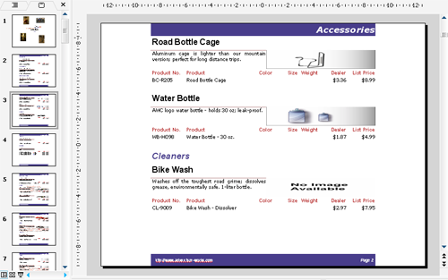

{} 

Aspose.Slides for Reporting Services plně podporuje všechny specifikace RDL. To znamená dvě skvělé věci: 

- Není nutné přetvářet existující zprávy. Můžete exportovat libovolnou existující RDL zprávu jako prezentaci Microsoft PowerPoint a bude přesně odpovídat návrhu RDL.
- Není nutné používat konkrétní návrhář zpráv. Můžete použít libovolný návrhář RDL zpráv a zpráva bude exportována přesně tak, jak jste ji navrhli.

{} 

Aspose.Slides for Reporting Services podporuje následující prvky RDL: 

- Stránka, záhlaví, zápatí
- Textová pole
- Obrázky
- Podřízené zprávy
- Grafy
- Seznamy
- Tabulky
- Matice
- Styly
- Obdélníky

**Příklad zprávy se záhlavím, zápatím, obrázky, podřízenými zprávami, tabulkami, textovými poli a obdélníky exportované jako prezentace Microsoft PowerPoint (PPT).** 

Pro více ukázek zpráv viz sekci [Galerie ukázek zpráv](/slides/cs/reportingservices/sample-reports-gallery/).