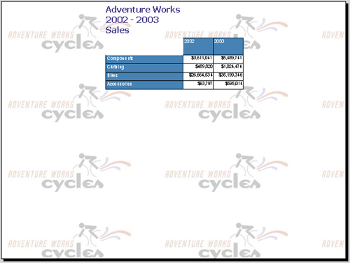

{} 

Postupujte podle těchto kroků pouze v případě, že chcete nainstalovat Aspose.Slides for Reporting Services ručně. V takovém případě jste stáhli ZIP balíček obsahující soubory sestavení. 

{} 

{} 

**Aspose.Slides for Reporting Services** vyžaduje instalaci **.NET Framework 3.5** na hostitelském počítači. 

{}

### **Manuální instalace**
Tyto instrukce ukazují, jak zkopírovat a upravit soubory v adresáři, kde je nainstalováno Microsoft SQL Server Reporting Services:

1. Najděte instalační adresář Report Serveru.  
   Kořenový adresář pro Microsoft SQL Server je obvykle zde: ***C:\Program Files\Microsoft SQL Server***
   
   {} 
   
   **Microsoft SQL Server 2005 a 2008**: Na počítači může být nakonfigurováno několik instancí Microsoft SQL Serveru a mohou být umístěny v různých podadresářích MSSQL.x, například MSSQL.1, MSSQL.2 atd. Před pokračováním musíte najít správný adresář ***C:\Program Files\Microsoft SQL Server\MSSQL.x\Reporting Services\ReportServer***. 
   
   {} Všechny cesty uvedené níže budou odkazovat na tento adresář jako <Instance>. 

2. Zkopírujte soubor Aspose.Slides.ReportingServices.dll do složky **C:\Program Files\Microsoft SQL Server\xxx\Reporting Services\ReportServer\bin**.  
   Stažení **Aspose.Slides.ReportingServices.zip** obsahuje **Aspose.Slides.ReportingServices.dll**. {} 

   V některých případech, když zkopírujete DLL do adresáře **ReportServer\bin**, může se spolu s ní zkopírovat i explicitně přiřazené oprávnění NTFS. Tato oprávnění mohou způsobit, že Microsoft SQL Server Reporting Services bude mít při načítání **Aspose.Slides.ReportingServices.dll** odmítnutý přístup. Pokud k tomu dojde, nové exportní formáty nebudou k dispozici. Zkontrolujte a potvrďte, že jsou nastavená správná oprávnění NTFS:

   1. Klikněte pravým tlačítkem na **Aspose.Slides.ReportingServices.dll**.  
   2. Vyberte **Properties** a přejděte na kartu **Security**.  
   3. Odstraňte všechna explicitně přiřazená oprávnění NTFS a ponechte pouze zděděná oprávnění.

{}

3. Zaregistrujte Aspose.Slides for Reporting Services jako rozšíření vykreslování:  
   1. Otevřete *C:\Program Files\Microsoft SQL Server\<Instance>\Reporting Services\ReportServer\rsreportserver.config*.  
   2. Přidejte tyto řádky do elementu <Render>:

**<Render>**

``` xml

   ...

  <!--Začněte zde.-->

  <Extension Name="ASPPT" Type="Aspose.Slides.ReportingServices.PptRenderer,Aspose.Slides.ReportingServices"/>

  <Extension Name="ASPPS" Type="Aspose.Slides.ReportingServices.PpsRenderer,Aspose.Slides.ReportingServices"/>

  <Extension Name="ASPPTX" Type="Aspose.Slides.ReportingServices.PptxRenderer,Aspose.Slides.ReportingServices"/>

  <Extension Name="ASPPSX" Type="Aspose.Slides.ReportingServices.PpsxRenderer,Aspose.Slides.ReportingServices"/>

  <!--Ukončete zde.-->

</Render>


```

4. Udělte Aspose.Slides for Reporting Services oprávnění k provedení:  
   1. Otevřete **C:\Program Files\Microsoft SQL Server\<Instance>\Reporting Services\ReportServer\rssrvpolicy.config**.  
   2. Přidejte následující jako poslední položku ve druhém vnějším elementu <CodeGroup> (který by měl být `<CodeGroup class="FirstMatchCodeGroup" version="1" PermissionSetName="Execution" Description="This code group grants MyComputer code Execution permission. ">`).

**<CodeGroup>**

``` xml


...

  <CodeGroup>

    ...

    <!--Začněte zde.-->

    <CodeGroup

        class="UnionCodeGroup"

        version="1"

        PermissionSetName="FullTrust"

        Name="Aspose.Slides_for_Reporting_Services"

        Description="This code group grants full trust to the AS4SSRS assembly.">

        <IMembershipCondition

            class="StrongNameMembershipCondition"

            version="1"

            PublicKeyBlob="00240000048000009400000006020000002400005253413100040000010001005542e

            99cecd28842dad186257b2c7b6ae9b5947e51e0b17b4ac6d8cecd3e01c4d20658c5e4ea1b9a6c8f854b2

            d796c4fde740dac65e834167758cff283eed1be5c9a812022b015a902e0b97d4e95569eb8c0971834744

            e633d9cb4c4a6d8eda03c12f486e13a1a0cb1aa101ad94943236384cbbf5c679944b994de9546e493bf" />

    </CodeGroup>

    <!--Ukončete zde.-->

  </CodeGroup>

</CodeGroup>


```

5. Ověřte, že Aspose.Slides for Reporting Services byl úspěšně nainstalován:  
   1. Otevřete Report Manager a zkontrolujte seznam dostupných typů exportu pro report.  
   
      {} Report Manager můžete spustit otevřením prohlížeče (Microsoft Internet Explorer 6.0 nebo novější) a zadáním URL Report Manageru do adresního řádku (ve výchozím nastavení je http://< ComputerName >/Reports).  
   
      {}

   1. Vyberte report na serveru.  
   1. Otevřete seznam **Select Format**.  
      Měli byste vidět seznam exportních formátů poskytovaných Aspose.Slides for Reporting Services.  
   1. Vyberte **PPT – PowerPoint Presentation via Aspose.Slides**.  

   **Aspose.Slides for Reporting Services byl úspěšně nainstalován a nové exportní formáty jsou k dispozici.**  


6. Klikněte na odkaz **Export**.  
   Report je vygenerován ve zvoleném formátu, odeslán klientovi a následně otevřen v příslušné aplikaci. V našem případě byl report otevřen v Microsoft PowerPoint.  

   **PPT report vygenerovaný pomocí Aspose.Slides for Reporting Services.**  



Úspěšně jste nainstalovali Aspose.Slides for Reporting Services a vygenerovali report jako prezentaci Microsoft PowerPoint!