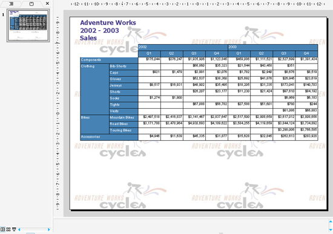

## **Vítejte v Aspose.Slides for Reporting Services!**

Aspose.Slides for Reporting Services je jediným řešením na trhu, které umožňuje generovat pravé PPT a PPS reporty v Microsoft SQL Server 2005, 2008, 2012, 2016 a 2017 Reporting Services (32-bit a 64-bit). Všechny funkce RDL reportu, včetně tabulek, matic, grafů a obrázků, jsou převedeny s nejvyšší přesností do prezentací Microsoft PowerPoint.

## **Přehled produktu**

Microsoft SQL Server Reporting Services nemá vestavěné možnosti exportovat reporty jako prezentace Microsoft PowerPoint, ale po instalaci Aspose.Slides for Reporting Services na váš server získáte přístup k dalším exportním formátům:

- PPT - Prezentace PowerPoint pomocí Aspose.Slides
- PPS - Prezentace PowerPoint SlideShow pomocí Aspose.Slides
- PPTX - Prezentace PowerPoint 2007 pomocí Aspose.Slides
- PPSX - Prezentace PowerPoint 2007 SlideShow pomocí Aspose.Slides

Aspose.Slides for Reporting Services vytváří prezentace na serveru bez použití Microsoft PowerPoint. Interně Aspose.Slides for Reporting Services používá Aspose.Slides for .NET – špičkovou komponentu pro zpracování prezentací na straně serveru.

**Aspose.Slides for Reporting Services umožňuje exportovat jakýkoli report ve formátu PPT, PPS, PPTX nebo PPSX.** 

**Aspose.Slides for Reporting Services exportoval report jako soubor PPT.** 

