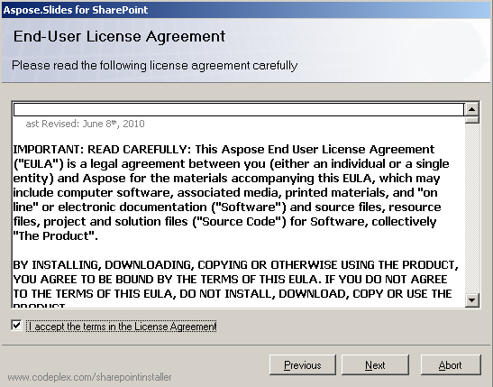

## **Obsah balíčku**

Aspose.Slides for SharePoint se stahuje ze [stránky ke stažení](https://releases.aspose.com/slides/cs/sharepoint/) jako archiv ZIP. Archiv obsahuje jeden balíček řešení SharePoint (WSP) a jeden instalační program pro každou podporovanou verzi SharePoint:

| Verze SharePoint | Instalační program | Balíček řešení |
| :- | :- | :- |
| SharePoint 2007 | Setup2007.exe | Aspose.Slides.SharePoint2007.wsp |
| SharePoint 2010 | Setup2010.exe | Aspose.Slides.SharePoint2010.wsp |
| SharePoint Server 2013 | Setup2013.exe | Aspose.Slides.SharePoint2013.wsp |
| SharePoint Server 2016 | Setup2016.exe | Aspose.Slides.SharePoint2016.wsp |
| SharePoint Server 2019 | Setup2019.exe | Aspose.Slides.SharePoint2019.wsp |

Každý instalační program má vedle sebe konfigurační soubor (například *Setup2019.exe.config*), který uvádí název balíčku řešení, který se má nainstalovat. Složka *License* obsahuje odkaz na smlouvu o koncovém uživatelském licencování a oznámení o licencích třetích stran.

Aspose.Slides for SharePoint je zabalen jako řešení SharePoint, které SharePoint nasazuje napříč farmou serverů. Jeho funkce je následně aktivována nebo deaktivována pro konkrétní kolekci webů.

## **Proces instalace**

Před instalací spustí instalační program kontrolu systému. Ověřuje, že:

- SharePoint je nainstalován na serveru.
- Aktuální uživatel má oprávnění instalovat a nasazovat řešení SharePoint.
- Služba SharePoint Administration je spuštěna.
- Služba SharePoint Timer je spuštěna.
- Balíček řešení uvedený v konfiguračním souboru je přítomen.

Služby Administration a Timer jsou potřeba, protože některé akce instalace běží jako časové úlohy, které šíří řešení do všech serverů ve farmě.

### **Spuštění instalace**

Pro instalaci Aspose.Slides for SharePoint:

1. Rozbalte archiv ZIP na lokální jednotku na serveru ve farmě SharePoint.
2. Spusťte instalační program odpovídající vaší verzi SharePoint (viz tabulka výše) a řiďte se pokyny na obrazovce. Instalační program:
   1. Provede kontrolu systému. Instalace neproběhne, pokud některá kontrola selže.

      **Spuštění kontroly systému**

      

   2. Zobrazí smlouvu o koncovém uživatelském licencování. Musíte ji přijmout, abyste mohli pokračovat.

      **Smlouva o licencích**

      

   3. Zobrazí cíle nasazení. Vyberte webové aplikace a kolekce webů, pro které chcete funkci aktivovat.

      **Výběr cílů nasazení**

      

   4. Nasadí řešení do farmy.

      **Průběh instalace**

      

   5. Aktivuje Aspose.Slides for SharePoint ve vybraných kolekcích webů.
   6. Vyjmenuje webové aplikace a kolekce webů, kde bylo řešení nasazeno a aktivováno.

      **Úspěšná instalace**

      

{}
Snímky obrazovky byly pořízeny na SharePoint 2007. Instalátory pro novější verze procházejí stejnými obrazovkami.
{}

Pokud je již ve farmě nainstalována stejná verze Aspose.Slides for SharePoint, instalační program nabídne opravu nebo odebrání. Pokud je nainstalována jiná verze, nabídne upgrade nebo odebrání.

Po instalaci se v nabídce souborů v knihovnách dokumentů vybraných kolekcí webů objeví položka **Convert via Aspose.Slides** (na SharePoint 2007 **Convert with Aspose.Slides**). Pro konverzi první prezentace viz [Převod dokumentů Microsoft PowerPoint do jiných formátů](/slides/cs/sharepoint/converting-microsoft-powerpoint-documents-into-other-formats/). Co řešení do farmy přidává, je popsáno v [Nasazení a aktivace](/slides/cs/sharepoint/deployment-and-activation/).

## **Často kladené otázky**

**Který instalační program mám spustit?**

Ten, jehož název odpovídá vaší verzi SharePoint. Například spusťte *Setup2016.exe* na farmě SharePoint Server 2016. Každý instalační program instaluje pouze svůj vlastní balíček řešení.

**Potřebuji samostatné stažení pro licencovanou verzi?**

Ne. Ten samý balíček funguje v režimu zkušební verze, dokud neinstalujete licenční řešení; viz [Instalace licencí Aspose.Slides for SharePoint](/slides/cs/sharepoint/installing-aspose-slides-for-sharepoint-license/).

**Jak produkt odebrat?**

Spusťte znovu stejný instalační program a vyberte **Remove**; viz [Odinstalace Aspose.Slides for SharePoint](/slides/cs/sharepoint/uninstalling-aspose-slides-for-sharepoint/).