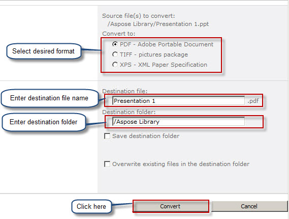

{} 

Když je Aspose.Slides for SharePoint nainstalováno na serveru SharePoint, přidá se možnost **Convert via Aspose.Slides.SharePoint** do nabídky prezentace, jak je uvedeno níže: 

**Instalace Aspose.Slides for SharePoint přidá možnost Convert via Aspose.Slides do menu dokumentů** 

{} 
## **Převod prezentace**
Chcete-li převést dokument Microsoft PowerPoint z knihovny dokumentů SharePoint: 

1. Vyberte dokument Microsoft PowerPoint v knihovně dokumentů.
2. Klikněte na šipku dolů pro zobrazení nabídky a klikněte na **Convert via Aspose.Slides.SharePoint**. 

   **Nabídka souboru Presentation 2 zobrazuje možnost Convert via Aspose.Slides** 

3. Vyberte požadovaný výstupní formát ve formuláři. Pokud chcete, změňte název výstupního souboru a cílovou složku.
4. Klikněte na **Convert** pro převod souboru. 

   **Formulář pro konverzi vám umožňuje vybrat formát výstupního souboru, název a cíl** 

5. Po dokončení konverze se zobrazí zpráva o úspěchu. 

   **Konverze byla úspěšná** 

6. Klikněte na **Source Library** (pro přechod do zdrojového adresáře) nebo **Destination Library** (pro přechod do adresáře, kam byl soubor uložen). 

   Převedený dokument se objeví v knihovně dokumentů. 

   **Převedený dokument zobrazený v knihovně, kam byl uložen** 

