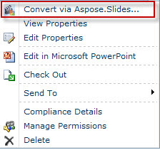

{}

Když je Aspose.Slides pro SharePoint nainstalován na serveru SharePoint a aktivován pro kolekci webů, přidá položku **Convert via Aspose.Slides** do nabídky dokumentů v jeho knihovnách dokumentů, jak je uvedeno níže. Ve verzi SharePoint 2007 se položka nazývá **Convert with Aspose.Slides**.

**Instalace Aspose.Slides pro SharePoint přidá položku Convert via Aspose.Slides do nabídek dokumentů**

{}

## **Převod prezentace**

1. Vyberte prezentaci Microsoft PowerPoint v knihovně dokumentů.
2. Otevřete její nabídku a klikněte na **Convert via Aspose.Slides**.

   **Nabídka souboru Presentation 2, zobrazující položku Convert via Aspose.Slides**

   

3. Vyberte výstupní formát pod **Convert to**. Pokud chcete, změňte název výstupního souboru a cílovou složku.
4. Klikněte na **Convert** pro převod souboru.

   **Stránka převodu vám umožní vybrat výstupní formát, název souboru a cíl**

   

5. Po dokončení převodu se zobrazí zpráva o úspěchu.

   **Převod byl úspěšný**

   

6. Klikněte na **Source Library** (pro přechod do zdrojové složky) nebo **Destination Library** (pro přechod do složky, kam byl soubor uložen).

   Převedený dokument se objeví v knihovně dokumentů.

   **Převedený dokument zobrazený v knihovně, do které byl uložen**

   

{}

Snímky obrazovky byly pořízeny v dřívější verzi, která nabízela pouze formáty PDF, TIFF a XPS. Aktuální stránka převodu nabízí více výstupních formátů; viz [Podpora více formátů](/slides/cs/sharepoint/multiple-format-support/).

{}

Na SharePoint 2010 a novějším můžete také vybrat jednu nebo více prezentací v knihovně a kliknout na **Convert Slides** na kartu pásu **Aspose Tools**. Otevře se stejná stránka převodu.