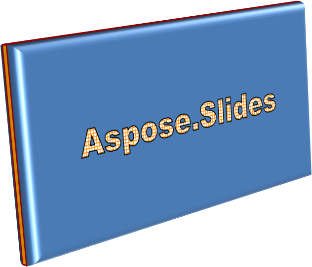

## **Übersicht**

WordArt‑Effekte ermöglichen das Gestalten von Text mit Füllungen, Konturen, Schatten, Spiegelungen, Leuchteffekten, Transformationen und 3D‑Formatierung. Dieser Artikel erklärt, wie Sie diese Effekte in PowerPoint‑Präsentationen mithilfe von Aspose.Slides für Java erstellen und anpassen, ohne dass Microsoft Office installiert ist.

## **Erstellen einer einfachen WordArt‑Vorlage und Anwenden auf Text**

Die folgenden Beispiele erstellen einen einfachen WordArt‑Stil, indem sie Text, Schriftart, Musterfüllung und Kontur festlegen.

Jedes Beispiel erstellt eine neue Präsentation und fügt ihrer ersten Folie ein Rechteck hinzu; eine Eingabedatei ist nicht erforderlich. Das erste Beispiel setzt den Text auf "Aspose.Slides". Die Position und Abmessungen der Form werden in Punkten gemessen:

```java
import com.aspose.slides.*;

Presentation presentation = new Presentation();
try {
    ISlide slide = presentation.getSlides().get_Item(0);

    IAutoShape autoShape = slide.getShapes().addAutoShape(ShapeType.Rectangle, 20, 20, 400, 200);
    ITextFrame textFrame = autoShape.getTextFrame();

    IPortion portion = textFrame.getParagraphs().get_Item(0).getPortions().get_Item(0);
    portion.setText("Aspose.Slides");
} finally {
    presentation.dispose();
}
```

Stellen Sie die Schriftart auf Arial Black mit 36 Punkten ein, um die Formatierung deutlicher zu machen:

```java
import com.aspose.slides.*;

Presentation presentation = new Presentation();
try {
    ISlide slide = presentation.getSlides().get_Item(0);

    IAutoShape autoShape = slide.getShapes().addAutoShape(ShapeType.Rectangle, 20, 20, 400, 200);

    IPortion portion = autoShape.getTextFrame().getParagraphs().get_Item(0).getPortions().get_Item(0);
    portion.setText("Aspose.Slides");
    FontData font = new FontData("Arial Black");
    portion.getPortionFormat().setLatinFont(font);
    portion.getPortionFormat().setFontHeight(36);
} finally {
    presentation.dispose();
}
```

Wenden Sie ein [SmallGrid](https://reference.aspose.com/slides/de/java/com.aspose.slides/patternstyle/#SmallGrid)-Muster mit einem dunkelorangefarbenen Vordergrund und einem weißen Hintergrund an und fügen Sie anschließend eine schwarze Textkontur mit einer Breite von 1 Punkt hinzu:

```java
import com.aspose.slides.*;
import java.awt.Color;

Presentation presentation = new Presentation();
try {
    ISlide slide = presentation.getSlides().get_Item(0);

    IAutoShape autoShape = slide.getShapes().addAutoShape(ShapeType.Rectangle, 20, 20, 400, 200);

    IPortion portion = autoShape.getTextFrame().getParagraphs().get_Item(0).getPortions().get_Item(0);
    portion.setText("Aspose.Slides");
    FontData font = new FontData("Arial Black");
    portion.getPortionFormat().setLatinFont(font);
    portion.getPortionFormat().setFontHeight(36);

    portion.getPortionFormat().getFillFormat().setFillType(FillType.Pattern);
    Color darkOrange = new Color(255, 140, 0);
    portion.getPortionFormat().getFillFormat().getPatternFormat().getForeColor().setColor(darkOrange);
    portion.getPortionFormat().getFillFormat().getPatternFormat().getBackColor().setColor(Color.WHITE);
    portion.getPortionFormat().getFillFormat().getPatternFormat().setPatternStyle(PatternStyle.SmallGrid);

    portion.getPortionFormat().getLineFormat().setWidth(1);
    portion.getPortionFormat().getLineFormat().getFillFormat().setFillType(FillType.Solid);
    portion.getPortionFormat().getLineFormat().getFillFormat().getSolidFillColor().setColor(Color.BLACK);
} finally {
    presentation.dispose();
}
```

Der resultierende Text:


## **Weitere WordArt‑Effekte anwenden**

Die folgenden Beispiele zeigen, wie Schatten, Spiegelungen, Leuchteffekte, Transformationen und 3D‑Effekte auf Text angewendet werden.

### **Außen‑Schatten‑Effekte anwenden**

Ein Außen‑Schatten fügt Tiefe hinzu, indem er einen Schatten hinter den Text legt. Sie können Farbe, Richtung, Abstand, Unschärferadius, Skalierung und Schrägstellung anpassen.

Dieses Beispiel ruft [enableOuterShadowEffect](https://reference.aspose.com/slides/de/java/com.aspose.slides/effectformat/#enableOuterShadowEffect--) auf und setzt einen schwarzen Schatten mit einem Unschärferadius von 4 Punkten, einer Richtung von 230 Grad und einem Abstand von 30 Punkten. Skalierungswerte von 100 erhalten die Schattengröße, während die horizontale Schrägstellung ihn um 20 Grad neigt. Die Alpha‑Transformation legt die Deckkraft auf 32 % fest:

```java
import com.aspose.slides.*;
import java.awt.Color;

Presentation presentation = new Presentation();
try {
    ISlide slide = presentation.getSlides().get_Item(0);

    IAutoShape autoShape = slide.getShapes().addAutoShape(ShapeType.Rectangle, 20, 20, 400, 200);

    IPortion portion = autoShape.getTextFrame().getParagraphs().get_Item(0).getPortions().get_Item(0);
    portion.setText("Aspose.Slides");
    FontData font = new FontData("Arial Black");
    portion.getPortionFormat().setLatinFont(font);
    portion.getPortionFormat().setFontHeight(36);

    portion.getPortionFormat().getEffectFormat().enableOuterShadowEffect();
    portion.getPortionFormat().getEffectFormat().getOuterShadowEffect().getShadowColor().setColor(Color.BLACK);
    portion.getPortionFormat().getEffectFormat().getOuterShadowEffect().setScaleHorizontal(100);
    portion.getPortionFormat().getEffectFormat().getOuterShadowEffect().setScaleVertical(100);
    portion.getPortionFormat().getEffectFormat().getOuterShadowEffect().setBlurRadius(4);
    portion.getPortionFormat().getEffectFormat().getOuterShadowEffect().setDirection(230);
    portion.getPortionFormat().getEffectFormat().getOuterShadowEffect().setDistance(30);
    portion.getPortionFormat().getEffectFormat().getOuterShadowEffect().setSkewHorizontal(20);
    portion.getPortionFormat().getEffectFormat().getOuterShadowEffect().setSkewVertical(0);
    portion.getPortionFormat().getEffectFormat().getOuterShadowEffect().getShadowColor().getColorTransform().add(ColorTransformOperation.SetAlpha, 0.32f);
} finally {
    presentation.dispose();
}
```

Der resultierende Text:


{}
- Wenn Außen‑ und Vorgabe‑Schatten zusammen verwendet werden, wird nur der Außen‑Schatten angewendet.
- Wenn Außen‑ und Innen‑Schatten gleichzeitig verwendet werden, hängt der resultierende Effekt von der PowerPoint‑Version ab. Beispielsweise wird der Effekt in PowerPoint 2013 verdoppelt, während in PowerPoint 2007 nur der Außen‑Schatten angewendet wird.
{}

### **Spiegelungs‑Effekte anwenden**

Eine Spiegelung erzeugt eine gespiegelte Kopie des Textes. Passen Sie Position, Skalierung, Unschärfe und Deckkraft an, um das Aussehen zu steuern.

Dieses Beispiel ruft [enableReflectionEffect](https://reference.aspose.com/slides/de/java/com.aspose.slides/effectformat/#enableReflectionEffect--) auf und spiegelt die Reflexion vertikal mit einer Skalierung von -100 % um. Es verwendet einen Unschärferadius von 0,5 Punkten und einen Abstand von 4,72 Punkten. Die Deckkraft sinkt von 60 % auf 0,9 % zwischen den Positionen 0 % und 60 % entlang der Spiegelung:

```java
import com.aspose.slides.*;

Presentation presentation = new Presentation();
try {
    ISlide slide = presentation.getSlides().get_Item(0);

    IAutoShape autoShape = slide.getShapes().addAutoShape(ShapeType.Rectangle, 20, 20, 400, 200);

    IPortion portion = autoShape.getTextFrame().getParagraphs().get_Item(0).getPortions().get_Item(0);
    portion.setText("Aspose.Slides");
    FontData font = new FontData("Arial Black");
    portion.getPortionFormat().setLatinFont(font);
    portion.getPortionFormat().setFontHeight(36);

    portion.getPortionFormat().getEffectFormat().enableReflectionEffect();
    portion.getPortionFormat().getEffectFormat().getReflectionEffect().setBlurRadius(0.5);
    portion.getPortionFormat().getEffectFormat().getReflectionEffect().setDistance(4.72);
    portion.getPortionFormat().getEffectFormat().getReflectionEffect().setStartPosAlpha(0f);
    portion.getPortionFormat().getEffectFormat().getReflectionEffect().setEndPosAlpha(60f);
    portion.getPortionFormat().getEffectFormat().getReflectionEffect().setDirection(90);
    portion.getPortionFormat().getEffectFormat().getReflectionEffect().setScaleHorizontal(100);
    portion.getPortionFormat().getEffectFormat().getReflectionEffect().setScaleVertical(-100);
    portion.getPortionFormat().getEffectFormat().getReflectionEffect().setStartReflectionOpacity(60f);
    portion.getPortionFormat().getEffectFormat().getReflectionEffect().setEndReflectionOpacity(0.9f);
    portion.getPortionFormat().getEffectFormat().getReflectionEffect().setRectangleAlign(RectangleAlignment.BottomLeft);
} finally {
    presentation.dispose();
}
```

Der resultierende Text:


### **Leuchteffekte anwenden**

Ein Leuchteffekt fügt um den Text eine weiche farbige Kontur hinzu. Passen Sie Farbe, Deckkraft und Radius an, um den Effekt zu steuern.

Dieses Beispiel ruft [enableGlowEffect](https://reference.aspose.com/slides/de/java/com.aspose.slides/effectformat/#enableGlowEffect--) auf und wendet ein rotes Leuchten mit 54 % Deckkraft und einem Radius von 7 Punkten an:

```java
import com.aspose.slides.*;
import java.awt.Color;

Presentation presentation = new Presentation();
try {
    ISlide slide = presentation.getSlides().get_Item(0);

    IAutoShape autoShape = slide.getShapes().addAutoShape(ShapeType.Rectangle, 20, 20, 400, 200);

    IPortion portion = autoShape.getTextFrame().getParagraphs().get_Item(0).getPortions().get_Item(0);
    portion.setText("Aspose.Slides");
    FontData font = new FontData("Arial Black");
    portion.getPortionFormat().setLatinFont(font);
    portion.getPortionFormat().setFontHeight(36);

    portion.getPortionFormat().getEffectFormat().enableGlowEffect();
    portion.getPortionFormat().getEffectFormat().getGlowEffect().getColor().setColor(Color.RED);
    portion.getPortionFormat().getEffectFormat().getGlowEffect().getColor().getColorTransform().add(ColorTransformOperation.SetAlpha, 0.54f);
    portion.getPortionFormat().getEffectFormat().getGlowEffect().setRadius(7);
} finally {
    presentation.dispose();
}
```

Der resultierende Text:


### **WordArt‑Transformationen anwenden**

WordArt‑Transformationen biegen, strecken oder verzerren einen Textblock.

Setzen Sie [setTransform](https://reference.aspose.com/slides/de/java/com.aspose.slides/textframeformat/#setTransform-int-) auf [ArchUpPour](https://reference.aspose.com/slides/de/java/com.aspose.slides/textshapetype/#ArchUpPour), um den gesamten Textrahmen nach oben zu bogen:

```java
import com.aspose.slides.*;

Presentation presentation = new Presentation();
try {
    ISlide slide = presentation.getSlides().get_Item(0);

    IAutoShape autoShape = slide.getShapes().addAutoShape(ShapeType.Rectangle, 20, 20, 400, 200);

    ITextFrame textFrame = autoShape.getTextFrame();
    textFrame.setText("Aspose.Slides");
    textFrame.getTextFrameFormat().setTransform(TextShapeType.ArchUpPour);
} finally {
    presentation.dispose();
}
```

Der resultierende Text:


{}
Aspose.Slides für Java bietet eine Reihe vordefinierter [Transformationstypen](https://reference.aspose.com/slides/de/java/com.aspose.slides/textshapetype/).
{}

### **3D‑Effekte auf Formen und Text anwenden**

Sie können 3D‑Effekte auf eine Form oder deren Text anwenden. Abschrägungen, Extrusion, Beleuchtung und Kameraeinstellungen steuern das resultierende Aussehen.

Das folgende Beispiel verwendet [ThreeDFormat](https://reference.aspose.com/slides/de/java/com.aspose.slides/threedformat/), um dem Rechteck kreisförmige Abschrägungen, orangefarbene Extrusion und eine dunkelrote Kontur hinzuzufügen. Abschrägungsabmessungen, Extrusionshöhe, Konturbreite und Tiefe werden in Punkten gemessen. Ein Kunststoffmaterial, ausgewogene Beleuchtung, um 40 Grad um die Z‑Achse gedreht, und eine Perspektivkamera bestimmen das Aussehen:

```java
import com.aspose.slides.*;
import java.awt.Color;

Presentation presentation = new Presentation();
try {
    ISlide slide = presentation.getSlides().get_Item(0);

    IAutoShape autoShape = slide.getShapes().addAutoShape(ShapeType.Rectangle, 20, 20, 400, 200);
    autoShape.getTextFrame().setText("Aspose.Slides");

    autoShape.getThreeDFormat().getBevelBottom().setBevelType(BevelPresetType.Circle);
    autoShape.getThreeDFormat().getBevelBottom().setHeight(10.5);
    autoShape.getThreeDFormat().getBevelBottom().setWidth(10.5);

    autoShape.getThreeDFormat().getBevelTop().setBevelType(BevelPresetType.Circle);
    autoShape.getThreeDFormat().getBevelTop().setHeight(12.5);
    autoShape.getThreeDFormat().getBevelTop().setWidth(11);

    Color orange = new Color(255, 165, 0);
    autoShape.getThreeDFormat().getExtrusionColor().setColor(orange);
    autoShape.getThreeDFormat().setExtrusionHeight(6);

    Color darkRed = new Color(139, 0, 0);
    autoShape.getThreeDFormat().getContourColor().setColor(darkRed);
    autoShape.getThreeDFormat().setContourWidth(1.5);

    autoShape.getThreeDFormat().setDepth(3);

    autoShape.getThreeDFormat().setMaterial(MaterialPresetType.Plastic);

    autoShape.getThreeDFormat().getLightRig().setDirection(LightingDirection.Top);
    autoShape.getThreeDFormat().getLightRig().setLightType(LightRigPresetType.Balanced);
    autoShape.getThreeDFormat().getLightRig().setRotation(0, 0, 40);

    autoShape.getThreeDFormat().getCamera().setCameraType(CameraPresetType.PerspectiveContrastingRightFacing);
} finally {
    presentation.dispose();
}
```

Der 3D‑Effekt der Form:



Dieses Beispiel wendet über [TextFrameFormat.getThreeDFormat](https://reference.aspose.com/slides/de/java/com.aspose.slides/textframeformat/#getThreeDFormat--) eine ähnliche 3D‑Formatierung auf den Text an. Kleinere Abschrägungen formen die Buchstabenränder, während Extrusion und Beleuchtung dem Text Tiefe verleihen:

```java
import com.aspose.slides.*;
import java.awt.Color;

Presentation presentation = new Presentation();
try {
    ISlide slide = presentation.getSlides().get_Item(0);

    IAutoShape autoShape = slide.getShapes().addAutoShape(ShapeType.Rectangle, 20, 20, 400, 200);
    ITextFrame textFrame = autoShape.getTextFrame();
    textFrame.setText("Aspose.Slides");

    textFrame.getTextFrameFormat().getThreeDFormat().getBevelBottom().setBevelType(BevelPresetType.Circle);
    textFrame.getTextFrameFormat().getThreeDFormat().getBevelBottom().setHeight(3.5);
    textFrame.getTextFrameFormat().getThreeDFormat().getBevelBottom().setWidth(3.5);

    textFrame.getTextFrameFormat().getThreeDFormat().getBevelTop().setBevelType(BevelPresetType.Circle);
    textFrame.getTextFrameFormat().getThreeDFormat().getBevelTop().setHeight(4);
    textFrame.getTextFrameFormat().getThreeDFormat().getBevelTop().setWidth(4);

    Color orange = new Color(255, 165, 0);
    textFrame.getTextFrameFormat().getThreeDFormat().getExtrusionColor().setColor(orange);
    textFrame.getTextFrameFormat().getThreeDFormat().setExtrusionHeight(6);

    Color darkRed = new Color(139, 0, 0);
    textFrame.getTextFrameFormat().getThreeDFormat().getContourColor().setColor(darkRed);
    textFrame.getTextFrameFormat().getThreeDFormat().setContourWidth(1.5);

    textFrame.getTextFrameFormat().getThreeDFormat().setDepth(3);

    textFrame.getTextFrameFormat().getThreeDFormat().setMaterial(MaterialPresetType.Plastic);

    textFrame.getTextFrameFormat().getThreeDFormat().getLightRig().setDirection(LightingDirection.Top);
    textFrame.getTextFrameFormat().getThreeDFormat().getLightRig().setLightType(LightRigPresetType.Balanced);
    textFrame.getTextFrameFormat().getThreeDFormat().getLightRig().setRotation(0, 0, 40);

    textFrame.getTextFrameFormat().getThreeDFormat().getCamera().setCameraType(CameraPresetType.PerspectiveContrastingRightFacing);
} finally {
    presentation.dispose();
}
```

Der 3D‑Effekt des Textes:


{}
Die Anwendung von 3D‑Effekten auf Text oder deren Formen – und die Wechselwirkung zwischen diesen Effekten – wird durch spezifische Regeln bestimmt. Betrachten Sie eine Szene, die sowohl Text als auch die ihn enthaltende Form umfasst. Ein 3D‑Effekt umfasst die 3D‑Darstellung des Objekts und die Szene, in der es platziert ist.

- Wenn für sowohl die Form als auch den Text eine Szene festgelegt ist, hat die Szene der Form Vorrang und die Szene des Textes wird ignoriert.
- Wenn die Form keine eigene Szene hat, aber eine 3D‑Darstellung besitzt, wird die Szene des Textes verwendet.
- Wenn die Form überhaupt keinen 3D‑Effekt hat, wird sie als flach behandelt und der 3D‑Effekt wird nur auf den Text angewendet.

Diese Verhaltensweisen beziehen sich auf die Methoden [ThreeDFormat.getLightRig](https://reference.aspose.com/slides/de/java/com.aspose.slides/threedformat/#getLightRig--) und [ThreeDFormat.getCamera](https://reference.aspose.com/slides/de/java/com.aspose.slides/threedformat/#getCamera--).
{}

Um Text flach und lesbar zu halten und gleichzeitig die 3D‑Formatierung der Form beizubehalten, siehe [Text flach auf einer 3D‑Form halten](/slides/de/java/3d-presentation/) für einen Vergleich beider Einstellungen und ein vollständiges Java‑Beispiel.

## **FAQ**

**Kann ich WordArt‑Effekte mit verschiedenen Schriften oder Skripten (z. B. Arabisch, Chinesisch) verwenden?**

Ja, Aspose.Slides für Java unterstützt Unicode und funktioniert mit allen gängigen Schriften und Skripten. WordArt‑Effekte wie Schatten, Füllung und Kontur können unabhängig von der Sprache angewendet werden, wobei die Verfügbarkeit von Schriften und deren Darstellung von den Systemschriftarten abhängen kann.

**Kann ich WordArt‑Effekte auf Elemente des Folienmasters anwenden?**

Ja, Sie können WordArt‑Effekte auf Formen in Masterfolien anwenden, einschließlich Titelplatzhaltern, Fußzeilen oder Hintergrundtext. Änderungen am Master‑Layout werden in allen zugehörigen Folien übernommen.

**Beeinflussen WordArt‑Effekte die Dateigröße einer Präsentation?**

Leicht. WordArt‑Effekte wie Schatten, Leuchten und Farbverlauffüllungen können die Dateigröße durch zusätzliche Formatierungs‑Metadaten geringfügig erhöhen, jedoch ist der Unterschied meist vernachlässigbar.

**Kann ich das Ergebnis von WordArt‑Effekten anzeigen, ohne die Präsentation zu speichern?**

Ja, Sie können Folien mit WordArt in Bilder (z. B. PNG, JPEG) rendern, indem Sie [ISlide.getImage](https://reference.aspose.com/slides/de/java/com.aspose.slides/islide/#getImage--) verwenden, oder einzelne Formen mit [IShape.getImage](https://reference.aspose.com/slides/de/java/com.aspose.slides/ishape/#getImage--) rendern. Dadurch können Sie das Ergebnis im Speicher oder auf dem Bildschirm anzeigen, bevor Sie die gesamte Präsentation speichern oder exportieren.