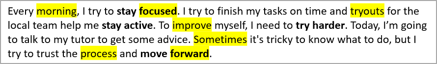

## **Übersicht**

Aspose.Slides für .NET kann Text in einem einzelnen Textfeld oder in einer gesamten Präsentation suchen, hervorheben und ersetzen. Jeder Vorgang kann zudem über einen Ergebnis‑Callback die Anwendung über jede Übereinstimmung informieren. Dadurch ist es möglich, eine Präsentation zu aktualisieren und gleichzeitig ein Prüfprotokoll zu erstellen, das den gefundenen Text, dessen Kontext, Position, Textfeld und Foliennummer enthält.

Diese Fähigkeiten sind nützlich für Überprüfungen, Redaktionen, Terminologie‑Checks, Vorlagen‑Bereinigungen und automatisierte Reporting‑Workflows.

In den ersten Beispielen unten verwenden wir die Datei **"sample.pptx"**, die auf der ersten Folie ein einzelnes Textfeld mit folgendem Text enthält:


## **Wählen Sie den Suchbereich**

Verwenden Sie Methoden von [ITextFrame](https://reference.aspose.com/slides/de/net/aspose.slides/itextframe/), um einen Vorgang auf ein Textfeld zu beschränken. Verwenden Sie Methoden von [Presentation](https://reference.aspose.com/slides/de/net/aspose.slides/presentation/), um sämtlichen anwendbaren Text in der Präsentation zu verarbeiten.

| Vorgang | Ein Textfeld | Gesamte Präsentation |
|---|---|---|
| Literalen Text hervorheben | [ITextFrame.HighlightText](https://reference.aspose.com/slides/de/net/aspose.slides/itextframe/highlighttext/) | [Presentation.HighlightText](https://reference.aspose.com/slides/de/net/aspose.slides/presentation/highlighttext/) |
| Übereinstimmungen mit regulären Ausdrücken hervorheben | [ITextFrame.HighlightRegex](https://reference.aspose.com/slides/de/net/aspose.slides/itextframe/highlightregex/) | [Presentation.HighlightRegex](https://reference.aspose.com/slides/de/net/aspose.slides/presentation/highlightregex/) |
| Literalen Text ersetzen | [ITextFrame.ReplaceText](https://reference.aspose.com/slides/de/net/aspose.slides/itextframe/replacetext/) | [Presentation.ReplaceText](https://reference.aspose.com/slides/de/net/aspose.slides/presentation/replacetext/) |
| Übereinstimmungen mit regulären Ausdrücken ersetzen | [ITextFrame.ReplaceRegex](https://reference.aspose.com/slides/de/net/aspose.slides/itextframe/replaceregex/) | [Presentation.ReplaceRegex](https://reference.aspose.com/slides/de/net/aspose.slides/presentation/replaceregex/) |

## **Textabgleich konfigurieren**

Für Vorgänge mit literalem Text verwenden Sie [TextSearchOptions](https://reference.aspose.com/slides/de/net/aspose.slides/textsearchoptions/), um das Matching zu steuern:

- [TextSearchOptions.WholeWordsOnly](https://reference.aspose.com/slides/de/net/aspose.slides/textsearchoptions/wholewordsonly/) beschränkt Übereinstimmungen auf ganze Wörter.
- [TextSearchOptions.CaseSensitive](https://reference.aspose.com/slides/de/net/aspose.slides/textsearchoptions/casesensitive/) legt fest, ob die Groß‑/Kleinschreibung übereinstimmen muss.
- [TextSearchOptions.IncludeNotes](https://reference.aspose.com/slides/de/net/aspose.slides/textsearchoptions/includenotes/) schließt Folien‑Notizen in Präsentations‑Suche, -Ersetzung und -Hervorhebung ein.

Vorgänge mit regulären Ausdrücken verwenden ein .NET‑`Regex`, sodass Matching‑Regeln wie Groß‑/Kleinschreibung und Wortgrenzen vom Ausdruck und dessen Optionen definiert werden.

## **Den Eigentümer eines Textfelds ermitteln**

Generische Text‑Verarbeitungs‑Workflows erhalten häufig ein [ITextFrame](https://reference.aspose.com/slides/de/net/aspose.slides/itextframe/), während sie Text suchen, ersetzen, validieren oder exportieren. Verwenden Sie [ITextFrame.ParentShape](https://reference.aspose.com/slides/de/net/aspose.slides/itextframe/parentshape/) und [ITextFrame.ParentCell](https://reference.aspose.com/slides/de/net/aspose.slides/itextframe/parentcell/), um festzustellen, welches Präsentations‑Objekt das Textfeld besitzt.

Die erwarteten Werte hängen vom Eigentümer ab:

| Besitzer des Textfelds | `ParentShape` | `ParentCell` |
|---|---|---|
| Ein AutoShape oder ein anderes Text‑enthaltendes Shape | Das zugehörige [IShape](https://reference.aspose.com/slides/de/net/aspose.slides/ishape/) | `null` |
| Eine Tabellenzelle | `null` | Das zugehörige [ICell](https://reference.aspose.com/slides/de/net/aspose.slides/icell/) |

Beide Eigenschaften sind schreibgeschützte Navigations‑Properties. Das Auslesen bewegt das Textfeld nicht und ändert dessen Eigentümer nicht. Generischer Code sollte beide Werte auf `null` prüfen und den Fall behandeln, dass keiner der Eigentümer verfügbar ist.

Das folgende Beispiel verwendet [SlideUtil.GetAllTextFrames](https://reference.aspose.com/slides/de/net/aspose.slides.util/slideutil/getalltextframes/), um alle Textfelder einer Präsentation zu durchlaufen. Für Shapes gibt es den Shape‑Namen, den Shape‑Typ und die zugehörige Folie aus. Für Tabellenzellen werden die null‑basierten Spalten‑ und Zeilenkoordinaten sowie die zugehörige Folie ausgegeben.

```cs
using System;
using Aspose.Slides;
using Aspose.Slides.Util;

using var presentation = new Presentation("presentation.pptx");

var textFrames = SlideUtil.GetAllTextFrames(presentation, false);

foreach (var textFrame in textFrames)
{
    var ownerShape = textFrame.ParentShape;
    if (ownerShape != null)
    {
        var shapeName = string.IsNullOrEmpty(ownerShape.Name) ? "(unnamed)" : ownerShape.Name;
        var shapeType = GetShapeType(ownerShape);
        var slideLabel = GetSlideLabel(ownerShape.Slide);
        Console.WriteLine($"Shape: {shapeName}; type: {shapeType}; {slideLabel}");

        continue;
    }

    var ownerCell = textFrame.ParentCell;
    if (ownerCell != null)
    {
        var slideLabel = GetSlideLabel(ownerCell.Slide);
        Console.WriteLine($"Table cell: column {ownerCell.FirstColumnIndex}, row {ownerCell.FirstRowIndex}; {slideLabel}");
        continue;
    }

    Console.WriteLine("The text frame owner is not available as a shape or table cell.");
}

static string GetShapeType(IShape shape)
{
    if (shape is IGeometryShape geometryShape)
    {
        return geometryShape.ShapeType.ToString();
    }

    return shape.GetType().Name;
}

static string GetSlideLabel(IBaseSlide baseSlide)
{
    if (baseSlide is ISlide slide)
    {
        return $"slide {slide.SlideNumber}";
    }

    if (baseSlide is INotesSlide notesSlide)
    {
        return $"notes for slide {notesSlide.ParentSlide.SlideNumber}";
    }

    return baseSlide.GetType().Name;
}
```

Für SmartArt‑Inhalte iterieren Sie durch die Shapes in [ISmartArtNode.Shapes](https://reference.aspose.com/slides/de/net/aspose.slides.smartart/ismartartnode/shapes/) und greifen auf jedes [ISmartArtShape.TextFrame](https://reference.aspose.com/slides/de/net/aspose.slides.smartart/ismartartshape/textframe/) zu. Das Textfeld lässt sich über [ITextFrame.ParentShape](https://reference.aspose.com/slides/de/net/aspose.slides/itextframe/parentshape/) zu seinem zugehörigen Shape zurückverfolgen, während [ITextFrame.ParentCell](https://reference.aspose.com/slides/de/net/aspose.slides/itextframe/parentcell/) `null` ist. Daher behandelt der Shape‑Zweig im Beispiel auch Text aus SmartArt‑Knoten.

## **Übereinstimmungsinformationen mit einem Callback sammeln**

Implementieren Sie [IFindResultCallback](https://reference.aspose.com/slides/de/net/aspose.slides/ifindresultcallback/), um für jede Übereinstimmung eine Benachrichtigung zu erhalten. Seine Methode [IFindResultCallback.FoundResult](https://reference.aspose.com/slides/de/net/aspose.slides/ifindresultcallback/foundresult/) liefert das zugehörige Textfeld, den Quelltext, den gefundenen Text und die Position der Übereinstimmung.

Der Callback erhält keine Folien‑Nummer direkt. Die nachstehende Implementierung leitet sie aus der übergeordneten Folie ab und behandelt zudem Text, der in Folien‑Notizen gefunden wurde. Eine nullable Folien‑Nummer ermöglicht es, dasselbe Ergebnis‑Modell für Text zu verwenden, der zu anderen Folientypen gehört.

```cs
using System.Collections.Generic;
using Aspose.Slides;

public sealed class TextMatch
{
    public TextMatch(ITextFrame textFrame, string sourceText, string foundText, int textPosition, int? slideNumber)
    {
        TextFrame = textFrame;
        SourceText = sourceText;
        FoundText = foundText;
        TextPosition = textPosition;
        SlideNumber = slideNumber;
    }

    public ITextFrame TextFrame { get; }
    public string SourceText { get; }
    public string FoundText { get; }
    public int TextPosition { get; }
    public int? SlideNumber { get; }
}

public sealed class TextSearchCallback : IFindResultCallback
{
    public List<TextMatch> Results { get; } = new();

    public void FoundResult(ITextFrame textFrame, string sourceText, string foundText, int textPosition)
    {
        var slideNumber = GetSlideNumber(textFrame);
        var result = new TextMatch(textFrame, sourceText, foundText, textPosition, slideNumber);

        Results.Add(result);
    }

    private static int? GetSlideNumber(ITextFrame textFrame)
    {
        var parentSlide = textFrame.ParentShape?.Slide ?? textFrame.ParentCell?.Slide ?? textFrame.Slide;

        if (parentSlide is ISlide slide)
        {
            return slide.SlideNumber;
        }

        if (parentSlide is INotesSlide notesSlide)
        {
            return notesSlide.ParentSlide.SlideNumber;
        }

        return null;
    }
}
```

Bei Ersetz‑Vorgängen enthält `FoundText` den ursprünglich gefundenen Text, sodass der Callback exakt aufzeichnen kann, welche Begriffe ersetzt wurden.

## **Text hervorheben**

Verwenden Sie die Methode [ITextFrame.HighlightText](https://reference.aspose.com/slides/de/net/aspose.slides/itextframe/highlighttext/), um literal‑Text‑Übereinstimmungen in einem Textfeld hervorzuheben. Übergeben Sie [TextSearchOptions](https://reference.aspose.com/slides/de/net/aspose.slides/textsearchoptions/), um die Suche zu steuern, und einen Callback, um Detailinformationen zu sammeln.

Das nachfolgende Code‑Beispiel hebt alle Vorkommen der Zeichenfolge **"try"** hervor und anschließend nur das komplette Wort **"to"**. Beide Suchen melden ihre Ergebnisse an denselben Callback.

```cs
using System;
using System.Drawing;
using Aspose.Slides;
using Aspose.Slides.Export;

using var presentation = new Presentation("sample.pptx");

// Hole das erste Shape von der ersten Folie.
var shape = (IAutoShape)presentation.Slides[0].Shapes[0];
var callback = new TextSearchCallback();

var substringSearchOptions = new TextSearchOptions
{
    CaseSensitive = false
};

// Hebe jedes Vorkommen von "try" im Textfeld hervor.
shape.TextFrame.HighlightText("try", Color.LightBlue, substringSearchOptions, callback);

var wholeWordSearchOptions = new TextSearchOptions
{
    WholeWordsOnly = true,
    CaseSensitive = false
};

// Hebe nur das komplette Wort "to" hervor.
shape.TextFrame.HighlightText("to", Color.Violet, wholeWordSearchOptions, callback);

foreach (var result in callback.Results)
{
    Console.WriteLine($"Found '{result.FoundText}' at position {result.TextPosition} on slide {result.SlideNumber}.");
}

presentation.Save("highlighted_text.pptx", SaveFormat.Pptx);
```

Das Ergebnis:


## **Text mit regulären Ausdrücken hervorheben**

Die Methode [ITextFrame.HighlightRegex](https://reference.aspose.com/slides/de/net/aspose.slides/itextframe/highlightregex/) hebt Text hervor, der durch einen regulären Ausdruck in einem Textfeld gefunden wurde.

Der folgende Code hebt alle Wörter mit sieben oder mehr Zeichen hervor und sammelt jede Übereinstimmung:

```cs
using System.Drawing;
using System.Text.RegularExpressions;
using Aspose.Slides;
using Aspose.Slides.Export;

using var presentation = new Presentation("sample.pptx");

var shape = (IAutoShape)presentation.Slides[0].Shapes[0];
var callback = new TextSearchCallback();
var regex = new Regex(@"\b[^\s]{7,}\b");

shape.TextFrame.HighlightRegex(regex, Color.Yellow, callback);

presentation.Save("highlighted_text_using_regex.pptx", SaveFormat.Pptx);
```

Das Ergebnis:



## **Text in einer Präsentation hervorheben**

Verwenden Sie [Presentation.HighlightText](https://reference.aspose.com/slides/de/net/aspose.slides/presentation/highlighttext/) und [Presentation.HighlightRegex](https://reference.aspose.com/slides/de/net/aspose.slides/presentation/highlightregex/), um alle anwendbaren Textfelder einer Präsentation zu durchsuchen. Das folgende Beispiel hebt einen literal‑Begriff und alle E‑Mail‑Adressen hervor, wobei für die beiden Suchen getrennte Ergebnis‑Sammlungen verwendet werden.

```cs
using System.Drawing;
using System.Text.RegularExpressions;
using Aspose.Slides;
using Aspose.Slides.Export;

using var presentation = new Presentation("presentation.pptx");

var termCallback = new TextSearchCallback();
var searchOptions = new TextSearchOptions
{
    WholeWordsOnly = true,
    CaseSensitive = false
};

presentation.HighlightText("confidential", Color.Orange, searchOptions, termCallback);

var emailCallback = new TextSearchCallback();
var emailRegex = new Regex(@"\b[A-Z0-9._%+-]+@[A-Z0-9.-]+\.[A-Z]{2,}\b", RegexOptions.IgnoreCase);

presentation.HighlightRegex(emailRegex, Color.Yellow, emailCallback);

presentation.Save("highlighted_presentation.pptx", SaveFormat.Pptx);
```

## **Text in einem Textfeld ersetzen**

Verwenden Sie [ITextFrame.ReplaceText](https://reference.aspose.com/slides/de/net/aspose.slides/itextframe/replacetext/) für literal‑Text und [ITextFrame.ReplaceRegex](https://reference.aspose.com/slides/de/net/aspose.slides/itextframe/replaceregex/) für pattern‑basiertes Ersetzen. Diese Methoden aktualisieren den gefundenen Text im bestehenden Textfeld, wobei die Formatierung der umgebenden Abschnitte erhalten bleibt, anstatt das Textfeld aus einem reinen String neu aufzubauen.

Das nachfolgende Beispiel vereinheitlicht eine Rechtschreibvariante und ersetzt anschließend Versionsbezeichnungen. Der gleiche Callback protokolliert die ursprünglichen Begriffe, die von beiden Vorgängen gefunden wurden.

```cs
using System.Text.RegularExpressions;
using Aspose.Slides;
using Aspose.Slides.Export;

using var presentation = new Presentation("presentation.pptx");

var shape = (IAutoShape)presentation.Slides[0].Shapes[0];
var callback = new TextSearchCallback();
var searchOptions = new TextSearchOptions
{
    WholeWordsOnly = true,
    CaseSensitive = false
};

shape.TextFrame.ReplaceText("colour", "color", searchOptions, callback);

var versionRegex = new Regex(@"\bv\d+(?:\.\d+)*\b", RegexOptions.IgnoreCase);
shape.TextFrame.ReplaceRegex(versionRegex, "current version", callback);

presentation.Save("updated_text_frame.pptx", SaveFormat.Pptx);
```

Wenn eine Übereinstimmung Bereiche mit unterschiedlicher Formatierung umfasst, prüfen Sie die Ausgabe, um zu bestätigen, welche Formatierung für den Ersetzungstext gelten soll.

## **Text in einer Präsentation ersetzen**

Verwenden Sie [Presentation.ReplaceText](https://reference.aspose.com/slides/de/net/aspose.slides/presentation/replacetext/) und [Presentation.ReplaceRegex](https://reference.aspose.com/slides/de/net/aspose.slides/presentation/replaceregex/), um dieselben Vorgänge presentationsweit anzuwenden. Dies ist nützlich für Vorlagen‑Bereinigungen, Terminologie‑Updates und Redaktionen.

```cs
using System.Text.RegularExpressions;
using Aspose.Slides;
using Aspose.Slides.Export;

using var presentation = new Presentation("presentation.pptx");

var callback = new TextSearchCallback();
var searchOptions = new TextSearchOptions
{
    WholeWordsOnly = true,
    CaseSensitive = true
};

presentation.ReplaceText("Contoso", "Example Corp", searchOptions, callback);

var accountNumberRegex = new Regex(@"\bACCT-\d{6}\b");
presentation.ReplaceRegex(accountNumberRegex, "ACCT-REDACTED", callback);

presentation.Save("updated_presentation.pptx", SaveFormat.Pptx);
```

## **Übereinstimmungen für Berichte gruppieren**

Da jedes Ergebnis seine Folien‑Nummer und das Textfeld speichert, können Anwendungen Übereinstimmungen für Prüf‑, Reporting‑ oder Review‑Workflows gruppieren. Das folgende Beispiel gruppiert die gesammelten Ergebnisse zuerst nach Folie und dann nach Textfeld:

```cs
using System;
using System.Linq;

var matchesBySlide = callback.Results.GroupBy(result => result.SlideNumber);

foreach (var slideGroup in matchesBySlide)
{
    var slideLabel = slideGroup.Key.HasValue ? slideGroup.Key.Value.ToString() : "Other";
    Console.WriteLine($"Slide: {slideLabel}");

    var matchesByTextFrame = slideGroup.GroupBy(result => result.TextFrame);
    foreach (var textFrameGroup in matchesByTextFrame)
    {
        Console.WriteLine($"  Text frame: {textFrameGroup.Key.Text}");

        foreach (var result in textFrameGroup)
        {
            Console.WriteLine($"    '{result.FoundText}' at position {result.TextPosition}; context: '{result.SourceText}'");
        }
    }
}
```

## **FAQ**

**Wie kann ich nur ein Textfeld statt der gesamten Präsentation durchsuchen?**

Holen Sie sich das Textfeld des Shapes und rufen Sie [ITextFrame.HighlightText](https://reference.aspose.com/slides/de/net/aspose.slides/itextframe/highlighttext/), [ITextFrame.HighlightRegex](https://reference.aspose.com/slides/de/net/aspose.slides/itextframe/highlightregex/), [ITextFrame.ReplaceText](https://reference.aspose.com/slides/de/net/aspose.slides/itextframe/replacetext/) oder [ITextFrame.ReplaceRegex](https://reference.aspose.com/slides/de/net/aspose.slides/itextframe/replaceregex/) für dieses Textfeld auf. Methoden auf Präsentationsebene verarbeiten stattdessen alle anwendbaren Textfelder.

**Wie kann ich komplette Wörter mit korrekter Groß‑/Kleinschreibung abgleichen?**

Setzen Sie [TextSearchOptions.WholeWordsOnly](https://reference.aspose.com/slides/de/net/aspose.slides/textsearchoptions/wholewordsonly/) und [TextSearchOptions.CaseSensitive](https://reference.aspose.com/slides/de/net/aspose.slides/textsearchoptions/casesensitive/) auf `true` und übergeben Sie die Optionen an eine literal‑Text‑Hervorhebungs‑ oder -Ersetzungs‑Methode. Für reguläre Ausdrücke definieren Sie Wortgrenzen und Groß‑/Kleinschreibung direkt im .NET‑`Regex`.

**Können Suche und Ersetzung Text in Folien‑Notizen einbeziehen?**

Ja. Setzen Sie [TextSearchOptions.IncludeNotes](https://reference.aspose.com/slides/de/net/aspose.slides/textsearchoptions/includenotes/) auf `true`, wenn Sie einen literal‑Text‑Vorgang auf Präsentationsebene verwenden. Die oben gezeigte Callback‑Implementierung ordnet eine Übereinstimmung in einer Notiz‑Folien zurück zur übergeordneten Folien‑Nummer.

**Wie kann ich einen Bericht erstellen, ohne die Präsentation ein zweites Mal zu durchsuchen?**

Übergeben Sie eine [IFindResultCallback](https://reference.aspose.com/slides/de/net/aspose.slides/ifindresultcallback/)-Implementierung an den Hervorhebungs‑ oder Ersetzungs‑Vorgang. Der Callback erhält jede Übereinstimmung während der Ausführung, sodass die Anwendung Quelltext, gefundenen Text, Position, Textfeld und abgeleitete Folien‑Nummer für spätere Gruppierung oder den Export speichern kann.

**Behält das Ersetzen von Text dessen Formatierung bei?**

[ITextFrame.ReplaceText](https://reference.aspose.com/slides/de/net/aspose.slides/itextframe/replacetext/) und [ITextFrame.ReplaceRegex](https://reference.aspose.com/slides/de/net/aspose.slides/itextframe/replaceregex/) ändern den gefundenen Text innerhalb des bestehenden Textfeldes und behalten die Formatierung der umgebenden Abschnitte bei. Wenn eine Übereinstimmung Bereiche mit unterschiedlicher Formatierung umfasst, prüfen Sie das Ergebnis, um sicherzustellen, dass die Ersetzung die gewünschte Formatierung verwendet.