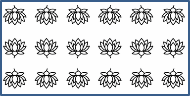

## **Einleitung**

In PowerPoint können Sie Formen zu Folien hinzufügen. Da Formen aus Linien bestehen, können Sie sie formatieren, indem Sie deren Konturen ändern oder Effekte darauf anwenden. Zusätzlich können Sie Formen formatieren, indem Sie Einstellungen festlegen, die steuern, wie deren Innenflächen gefüllt werden.


Aspose.Slides für Python via Java stellt Klassen und Methoden bereit, mit denen Sie Formen mit denselben Optionen formatieren können, die in PowerPoint verfügbar sind.

## **Linien formatieren**

Mit Aspose.Slides können Sie für eine Form einen benutzerdefinierten Linienstil festlegen. Die folgenden Schritte beschreiben das Vorgehen:

1. Erstellen Sie eine Instanz der Klasse [Presentation](https://reference.aspose.com/slides/de/python-java/aspose.slides/presentation/).
2. Holen Sie eine Referenz auf eine Folie über deren Index.
3. Fügen Sie ein [AutoShape](https://reference.aspose.com/slides/de/python-java/aspose.slides/autoshape/) zur Folie hinzu.
4. Legen Sie den [line style](https://reference.aspose.com/slides/de/python-java/aspose.slides/linestyle/) der Form fest.
5. Setzen Sie die Linienbreite.
6. Legen Sie den [dash style](https://reference.aspose.com/slides/de/python-java/aspose.slides/linedashstyle/) der Linie fest.
7. Setzen Sie die Linienfarbe für die Form.
8. Speichern Sie die geänderte Präsentation als PPTX-Datei.

Der folgende Code zeigt, wie ein Rechteck-[AutoShape](https://reference.aspose.com/slides/de/python-java/aspose.slides/autoshape/) formatiert wird:

```python
import jpype
import asposeslides

if not jpype.isJVMStarted():
    jpype.startJVM()

from asposeslides.api import FillType, LineDashStyle, LineStyle, Presentation, SaveFormat, ShapeType
from java.awt import Color

# Instanziieren Sie die Presentation‑Klasse, die eine Präsentationsdatei darstellt.
presentation = Presentation()
try:
    # Holen Sie die erste Folie.
    slide = presentation.getSlides().get_Item(0)

    # Fügen Sie eine AutoShape vom Typ Rectangle hinzu.
    shape = slide.getShapes().addAutoShape(ShapeType.Rectangle, 50, 150, 150, 75)

    # Legen Sie die Füllfarbe für die Rechteckform fest.
    shape.getFillFormat().setFillType(FillType.NoFill)

    # Formatieren Sie die Linien des Rechtecks.
    shape.getLineFormat().setStyle(LineStyle.ThickThin)
    shape.getLineFormat().setWidth(7)
    shape.getLineFormat().setDashStyle(LineDashStyle.Dash)

    # Legen Sie die Farbe für die Linie des Rechtecks fest.
    shape.getLineFormat().getFillFormat().setFillType(FillType.Solid)
    shape.getLineFormat().getFillFormat().getSolidFillColor().setColor(Color.BLUE)

    # Speichern Sie die PPTX‑Datei auf dem Datenträger.
    presentation.save("formatted_lines.pptx", SaveFormat.Pptx)
finally:
    presentation.dispose()
```


## **Skizzen‑Effekte auf Formlinien anwenden**

Ein Skizzen‑Effekt lässt eine Formlinie handgezeichnet wirken. Verwenden Sie [Shape.getLineFormat](https://reference.aspose.com/slides/de/python-java/aspose.slides/shape/#getLineFormat), um auf die Linieneinstellungen zuzugreifen, [LineFormat.getSketchFormat](https://reference.aspose.com/slides/de/python-java/aspose.slides/lineformat/#getSketchFormat), um auf die Skizzeneinstellungen zuzugreifen, und [SketchFormat.setSketchType](https://reference.aspose.com/slides/de/python-java/aspose.slides/sketchformat/#setSketchType), um einen Wert aus der Aufzählung [LineSketchType](https://reference.aspose.com/slides/de/python-java/aspose.slides/linesketchtype/) auszuwählen.

Der folgende Python‑Code zeigt, wie ein [LineSketchType.Curved](https://reference.aspose.com/slides/de/python-java/aspose.slides/linesketchtype/#Curved)‑Effekt angewendet, der explizit zugewiesene Wert ausgelesen und der Effekt mit [LineSketchType.None_](https://reference.aspose.com/slides/de/python-java/aspose.slides/linesketchtype/#None) entfernt wird:

```python
import jpype
import asposeslides

if not jpype.isJVMStarted():
    jpype.startJVM()

from asposeslides.api import LineSketchType, Presentation, ShapeType

presentation = Presentation()
try:
    slide = presentation.getSlides().get_Item(0)
    shape = slide.getShapes().addAutoShape(ShapeType.Rectangle, 50, 50, 200, 100)

    # Zugriff auf das Linienformat der Form und ihr Skizzenformat.
    sketch_format = shape.getLineFormat().getSketchFormat()

    # Skizzen‑Effekt anwenden.
    sketch_format.setSketchType(LineSketchType.Curved)

    # Lesen Sie den direkt der Form zugewiesenen Skizzen‑Effekt.
    explicit_sketch_type = sketch_format.getSketchType()
    print(f"Explicit sketch type: {explicit_sketch_type}")

    # Entfernen Sie den Skizzen‑Effekt.
    sketch_format.setSketchType(LineSketchType.None_)
finally:
    presentation.dispose()
```

Der von [SketchFormat.getSketchType](https://reference.aspose.com/slides/de/python-java/aspose.slides/sketchformat/#getSketchType) zurückgegebene Wert stellt die direkt der Form zugewiesene Einstellung dar. Wenn die Linienformatierung von einem Design, einer Master‑Folien oder einer Layout‑Folie geerbt werden kann, verwenden Sie [LineFormat.getEffective](https://reference.aspose.com/slides/de/python-java/aspose.slides/lineformat/#getEffective), greifen Sie auf `LineFormatEffectiveData.getSketchFormat` zu und lesen Sie `SketchFormatEffectiveData.getSketchType`. Der effektive Wert spiegelt die Formatierung wider, die nach Auflösung der Vererbung tatsächlich angewendet wird:

```python
import jpype
import asposeslides

if not jpype.isJVMStarted():
    jpype.startJVM()

from asposeslides.api import Presentation

presentation = Presentation("presentation.pptx")
try:
    shape = presentation.getSlides().get_Item(0).getShapes().get_Item(0)
    line_format = shape.getLineFormat()

    explicit_sketch_type = line_format.getSketchFormat().getSketchType()
    effective_line_format = line_format.getEffective()
    effective_sketch_type = effective_line_format.getSketchFormat().getSketchType()

    print(f"Explicit sketch type: {explicit_sketch_type}")
    print(f"Effective sketch type: {effective_sketch_type}")
finally:
    presentation.dispose()
```

## **Verbindungs‑Stile formatieren**

Hier sind die drei Optionen für den Verbindungsstil:

* Rund
* Gehrung
* Fase

Standardmäßig verwendet PowerPoint beim Zusammenführen zweier Linien in einem Winkel (z. B. an einer Formkante) die Einstellung **Rund**. Wenn Sie jedoch eine Form mit scharfen Winkeln zeichnen, bevorzugen Sie möglicherweise die Option **Gehrung**.


Der folgende Python‑Code zeigt, wie drei Rechtecke (wie im Bild oben) mit den Verbindungsstil‑Einstellungen Miter, Bevel und Round erstellt wurden:

```python
import jpype
import asposeslides

if not jpype.isJVMStarted():
    jpype.startJVM()

from asposeslides.api import FillType, LineJoinStyle, Presentation, SaveFormat, ShapeType
from java.awt import Color

    # Instanziieren Sie die Presentation‑Klasse, die eine Präsentationsdatei darstellt.
    presentation = Presentation()
    try:
        # Holen Sie die erste Folie.
        slide = presentation.getSlides().get_Item(0)

        # Fügen Sie drei AutoShapes vom Typ Rectangle hinzu.
        miter_shape = slide.getShapes().addAutoShape(ShapeType.Rectangle, 20, 20, 150, 75)
        bevel_shape = slide.getShapes().addAutoShape(ShapeType.Rectangle, 210, 20, 150, 75)
        round_shape = slide.getShapes().addAutoShape(ShapeType.Rectangle, 20, 135, 150, 75)

        # Legen Sie die Füllfarbe für jede Rechtecksform fest.
        miter_shape.getFillFormat().setFillType(FillType.Solid)
        miter_shape.getFillFormat().getSolidFillColor().setColor(Color.BLACK)
        bevel_shape.getFillFormat().setFillType(FillType.Solid)
        bevel_shape.getFillFormat().getSolidFillColor().setColor(Color.BLACK)
        round_shape.getFillFormat().setFillType(FillType.Solid)
        round_shape.getFillFormat().getSolidFillColor().setColor(Color.BLACK)

        # Setzen Sie die Linienbreite.
        miter_shape.getLineFormat().setWidth(15)
        bevel_shape.getLineFormat().setWidth(15)
        round_shape.getLineFormat().setWidth(15)

        # Legen Sie die Farbe für die Linie jedes Rechtecks fest.
        miter_shape.getLineFormat().getFillFormat().setFillType(FillType.Solid)
        miter_shape.getLineFormat().getFillFormat().getSolidFillColor().setColor(Color.BLUE)
        bevel_shape.getLineFormat().getFillFormat().setFillType(FillType.Solid)
        bevel_shape.getLineFormat().getFillFormat().getSolidFillColor().setColor(Color.BLUE)
        round_shape.getLineFormat().getFillFormat().setFillType(FillType.Solid)
        round_shape.getLineFormat().getFillFormat().getSolidFillColor().setColor(Color.BLUE)

        # Setzen Sie den Verbindungsstil.
        miter_shape.getLineFormat().setJoinStyle(LineJoinStyle.Miter)
        bevel_shape.getLineFormat().setJoinStyle(LineJoinStyle.Bevel)
        round_shape.getLineFormat().setJoinStyle(LineJoinStyle.Round)

        # Fügen Sie jedem Rechteck Text hinzu.
        miter_shape.getTextFrame().setText("Miter Join Style")
        bevel_shape.getTextFrame().setText("Bevel Join Style")
        round_shape.getTextFrame().setText("Round Join Style")

        # Speichern Sie die PPTX‑Datei auf dem Datenträger.
        presentation.save("join_styles.pptx", SaveFormat.Pptx)
    finally:
        presentation.dispose()
```

## **Verlauffüllung**

In PowerPoint ist „Gradient Fill“ (Verlaufsfüllung) eine Formatierungsoption, mit der Sie einer Form einen kontinuierlichen Farbübergang zuweisen können. Beispielsweise können Sie zwei oder mehr Farben anwenden, sodass eine allmählich in die andere übergeht.

So wenden Sie eine Verlaufsfüllung auf eine Form mit Aspose.Slides an:

1. Erstellen Sie eine Instanz der Klasse [Presentation](https://reference.aspose.com/slides/de/python-java/aspose.slides/presentation/).
2. Holen Sie eine Referenz auf eine Folie über deren Index.
3. Fügen Sie ein [AutoShape](https://reference.aspose.com/slides/de/python-java/aspose.slides/autoshape/) zur Folie hinzu.
4. Setzen Sie den [FillType](https://reference.aspose.com/slides/de/python-java/aspose.slides/filltype/) der Form auf `Gradient`.
5. Fügen Sie Ihre beiden bevorzugten Farben mit definierten Positionen mithilfe der Methode [addPresetColor](https://reference.aspose.com/slides/de/python-java/aspose.slides/gradientstopcollection/#addPresetColor) der Gradienten‑Stop‑Sammlung hinzu, die von der Klasse [GradientFormat](https://reference.aspose.com/slides/de/python-java/aspose.slides/gradientformat/) bereitgestellt wird.
6. Speichern Sie die geänderte Präsentation als PPTX-Datei.

```python
import jpype
import asposeslides

if not jpile.isJVMStarted():
    jpile.startJVM()

from asposeslides.api import FillType, GradientDirection, GradientShape, Presentation, PresetColor, SaveFormat, ShapeType
from java.awt import Color

# Instanziieren Sie die Presentation‑Klasse, die eine Präsentationsdatei darstellt.
presentation = Presentation()
try:
    # Holen Sie die erste Folie.
    slide = presentation.getSlides().get_Item(0)

    # Fügen Sie eine AutoShape vom Typ Ellipse hinzu.
    shape = slide.getShapes().addAutoShape(ShapeType.Ellipse, 50, 50, 150, 75)

    # Wenden Sie eine Verlaufsformatierung auf die Ellipse an.
    shape.getFillFormat().setFillType(FillType.Gradient)
    shape.getFillFormat().getGradientFormat().setGradientShape(GradientShape.Linear)

    # Legen Sie die Richtung des Verlaufs fest.
    shape.getFillFormat().getGradientFormat().setGradientDirection(GradientDirection.FromCorner2)

    # Fügen Sie zwei Verlaufsstopps hinzu.
    shape.getFillFormat().getGradientFormat().getGradientStops().addPresetColor(1.0, PresetColor.Purple)
    shape.getFillFormat().getGradientFormat().getGradientStops().addPresetColor(0.0, PresetColor.Red)

    # Speichern Sie die PPTX‑Datei auf dem Datenträger.
    presentation.save("gradient_fill.pptx", SaveFormat.Pptx)
finally:
    presentation.dispose()
```


## **Musterfüllung**

In PowerPoint ist „Pattern Fill“ (Musterfüllung) eine Formatierungsoption, die es Ihnen ermöglicht, einer Form ein zweifarbiges Design – wie Punkte, Streifen, Kreuzschraffuren oder Rauten – zuzuweisen. Sie können benutzerdefinierte Farben für den Vorder‑ und Hintergrund des Musters auswählen.

Aspose.Slides stellt über 45 vordefinierte Musterstile bereit, die Sie auf Formen anwenden können, um die optische Attraktivität Ihrer Präsentationen zu erhöhen. Auch nach der Auswahl eines vordefinierten Musters können Sie die genauen Farben festlegen, die verwendet werden sollen.

So wenden Sie eine Musterfüllung auf eine Form mit Aspose.Slides an:

1. Erstellen Sie eine Instanz der Klasse [Presentation](https://reference.aspose.com/slides/de/python-java/aspose.slides/presentation/).
2. Holen Sie eine Referenz auf eine Folie über deren Index.
3. Fügen Sie ein [AutoShape](https://reference.aspose.com/slides/de/python-java/aspose.slides/autoshape/) zur Folie hinzu.
4. Setzen Sie den [FillType](https://reference.aspose.com/slides/de/python-java/aspose.slides/filltype/) der Form auf `Pattern`.
5. Wählen Sie einen Musterstil aus den vordefinierten Optionen.
6. Setzen Sie die [Background Color](https://reference.aspose.com/slides/de/python-java/aspose.slides/patternformat/#getBackColor) des Musters.
7. Setzen Sie die [Foreground Color](https://reference.aspose.com/slides/de/python-java/aspose.slides/patternformat/#getForeColor) des Musters.
8. Speichern Sie die geänderte Präsentation als PPTX-Datei.

```python
import jpype
import asposeslides

if not jpype.isJVMStarted():
    jpype.startJVM()

from asposeslides.api import FillType, PatternStyle, Presentation, SaveFormat, ShapeType
from java.awt import Color

# Instanziieren Sie die Presentation‑Klasse, die eine Präsentationsdatei darstellt.
presentation = Presentation()
try:
    # Holen Sie die erste Folie.
    slide = presentation.getSlides().get_Item(0)

    # Fügen Sie eine AutoShape vom Typ Rectangle hinzu.
    shape = slide.getShapes().addAutoShape(ShapeType.Rectangle, 50, 50, 150, 75)

    # Setzen Sie den Fülltyp auf Pattern.
    shape.getFillFormat().setFillType(FillType.Pattern)

    # Setzen Sie den Musterstil.
    shape.getFillFormat().getPatternFormat().setPatternStyle(PatternStyle.Trellis)

    # Setzen Sie die Hintergrund‑ und Vordergrundfarben des Musters.
    shape.getFillFormat().getPatternFormat().getBackColor().setColor(Color.LIGHT_GRAY)
    shape.getFillFormat().getPatternFormat().getForeColor().setColor(Color.YELLOW)

    # Speichern Sie die PPTX‑Datei auf dem Datenträger.
    presentation.save("pattern_fill.pptx", SaveFormat.Pptx)
finally:
    presentation.dispose()
```


## **Bildfüllung**

In PowerPoint ist „Picture Fill“ (Bildfüllung) eine Formatierungsoption, die es Ihnen ermöglicht, ein Bild in eine Form einzufügen – das Bild dient effektiv als Hintergrund der Form.

So verwenden Sie Aspose.Slides, um einer Form eine Bildfüllung zuzuweisen:

1. Erstellen Sie eine Instanz der Klasse [Presentation](https://reference.aspose.com/slides/de/python-java/aspose.slides/presentation/).
2. Holen Sie eine Referenz auf eine Folie über deren Index.
3. Fügen Sie ein [AutoShape](https://reference.aspose.com/slides/de/python-java/aspose.slides/autoshape/) zur Folie hinzu.
4. Setzen Sie den [FillType](https://reference.aspose.com/slides/de/python-java/aspose.slides/filltype/) der Form auf `Picture`.
5. Setzen Sie den Bildfüllungsmodus auf `Tile` (oder einen anderen gewünschten Modus).
6. Erstellen Sie ein [PPImage](https://reference.aspose.com/slides/de/python-java/aspose.slides/ppimage/)‑Objekt aus dem Bild, das Sie verwenden möchten.
7. Übergeben Sie das Bild an die Methode `SlidesPicture.setImage`.
8. Speichern Sie die geänderte Präsentation als PPTX-Datei.

Angenommen, wir haben eine Datei "lotus.png" mit folgendem Bild:


```python
import jpype
import asposeslides

if not jpype.isJVMStarted():
    jpype.startJVM()

from asposeslides.api import FillType, Images, PictureFillMode, Presentation, SaveFormat, ShapeType

# Instanziieren Sie die Presentation‑Klasse, die eine Präsentationsdatei darstellt.
presentation = Presentation()
try:
    # Holen Sie die erste Folie.
    slide = presentation.getSlides().get_Item(0)

    # Fügen Sie eine AutoShape vom Typ Rectangle hinzu.
    shape = slide.getShapes().addAutoShape(ShapeType.Rectangle, 50, 50, 255, 130)
    
    # Setzen Sie den Fülltyp auf Picture.
    shape.getFillFormat().setFillType(FillType.Picture)

    # Setzen Sie den Bildfüllungsmodus.
    shape.getFillFormat().getPictureFillFormat().setPictureFillMode(PictureFillMode.Tile)

    # Laden Sie ein Bild und fügen Sie es zu den Präsentationsressourcen hinzu.
    image = Images.fromFile("lotus.png")
    picture = presentation.getImages().addImage(image)
    image.dispose()

    # Setzen Sie das Bild.
    shape.getFillFormat().getPictureFillFormat().getPicture().setImage(picture)

    # Speichern Sie die PPTX‑Datei auf dem Datenträger.
    presentation.save("picture_fill.pptx", SaveFormat.Pptx)
finally:
    presentation.dispose()
```


### **Bild kacheln als Textur**

Wenn Sie ein gekacheltes Bild als Textur festlegen und das Kachelverhalten anpassen möchten, können Sie die folgenden Methoden der Klasse [PictureFillFormat](https://reference.aspose.com/slides/de/python-java/aspose.slides/picturefillformat/) verwenden:

- [setPictureFillMode](https://reference.aspose.com/slides/de/python-java/aspose.slides/picturefillformat/#setPictureFillMode): Legt den Bildfüllungsmodus fest – entweder `Tile` oder `Stretch`.
- [setTileAlignment](https://reference.aspose.com/slides/de/python-java/aspose.slides/picturefillformat/#setTileAlignment): Gibt die Ausrichtung der Kacheln innerhalb der Form an.
- [setTileFlip](https://reference.aspose.com/slides/de/python-java/aspose.slides/picturefillformat/#setTileFlip): Steuert, ob die Kachel horizontal, vertikal oder beides gespiegelt wird.
- [setTileOffsetX](https://reference.aspose.com/slides/de/python-java/aspose.slides/picturefillformat/#setTileOffsetX): Legt den horizontalen Versatz der Kachel (in Punkten) vom Ursprung der Form fest.
- [setTileOffsetY](https://reference.aspose.com/slides/de/python-java/aspose.slides/picturefillformat/#setTileOffsetY): Legt den vertikalen Versatz der Kachel (in Punkten) vom Ursprung der Form fest.
- [setTileScaleX](https://reference.aspose.com/slides/de/python-java/aspose.slides/picturefillformat/#setTileScaleX): Definiert die horizontale Skalierung der Kachel als Prozentsatz.
- [setTileScaleY](https://reference.aspose.com/slides/de/python-java/aspose.slides/picturefillformat/#setTileScaleY): Definiert die vertikale Skalierung der Kachel als Prozentsatz.

Das folgende Codebeispiel zeigt, wie ein Rechteck mit gekachelter Bildfüllung hinzugefügt und Kacheloptionen konfiguriert werden:

```python
import jpype
import asposeslides

if not jpype.isJVMStarted():
    jpype.startJVM()

from asposeslides.api import FillType, Images, PictureFillMode, Presentation, RectangleAlignment, SaveFormat, ShapeType, TileFlip

# Instanziieren Sie die Presentation‑Klasse, die eine Präsentationsdatei darstellt.
presentation = Presentation()
try:
    # Holen Sie die erste Folie.
    first_slide = presentation.getSlides().get_Item(0)

    # Fügen Sie eine Rechteck‑AutoShape hinzu.
    shape = first_slide.getShapes().addAutoShape(ShapeType.Rectangle, 50, 50, 190, 95)

    # Setzen Sie den Fülltyp der Form auf Picture.
    shape.getFillFormat().setFillType(FillType.Picture)

    # Laden Sie das Bild und fügen Sie es zu den Präsentationsressourcen hinzu.
    source_image = Images.fromFile("lotus.png")
    presentation_image = presentation.getImages().addImage(source_image)
    source_image.dispose()

    # Weisen Sie das Bild der Form zu.
    picture_fill_format = shape.getFillFormat().getPictureFillFormat()
    picture_fill_format.getPicture().setImage(presentation_image)

    # Konfigurieren Sie den Bildfüllungsmodus und die Kacheleigenschaften.
    picture_fill_format.setPictureFillMode(PictureFillMode.Tile)
    picture_fill_format.setTileOffsetX(-32)
    picture_fill_format.setTileOffsetY(-32)
    picture_fill_format.setTileScaleX(50)
    picture_fill_format.setTileScaleY(50)
    picture_fill_format.setTileAlignment(RectangleAlignment.BottomRight)
    picture_fill_format.setTileFlip(TileFlip.FlipBoth)

    # Speichern Sie die PPTX‑Datei auf dem Datenträger.
    presentation.save("tile.pptx", SaveFormat.Pptx)
finally:
    presentation.dispose()
```



## **Einfarbige Füllung**

In PowerPoint ist „Solid Color Fill“ (einfarbige Füllung) eine Formatierungsoption, die eine Form mit einer einzigen, gleichmäßigen Farbe füllt. Dieser einfarbige Hintergrund wird ohne Verläufe, Texturen oder Muster angewendet.

So wenden Sie eine einfarbige Füllung auf eine Form mit Aspose.Slides an:

1. Erstellen Sie eine Instanz der Klasse [Presentation](https://reference.aspose.com/slides/de/python-java/aspose.slides/presentation/).
2. Holen Sie eine Referenz auf eine Folie über deren Index.
3. Fügen Sie ein [AutoShape](https://reference.aspose.com/slides/de/python-java/aspose.slides/autoshape/) zur Folie hinzu.
4. Setzen Sie den [FillType](https://reference.aspose.com/slides/de/python-java/aspose.slides/filltype/) der Form auf `Solid`.
5. Weisen Sie der Form Ihre bevorzugte Füllfarbe zu.
6. Speichern Sie die geänderte Präsentation als PPTX-Datei.

```python
import jpype
import asposeslides

if not jpype.isJVMStarted():
    jpype.startJVM()

from asposeslides.api import FillType, Presentation, SaveFormat, ShapeType
from java.awt import Color

# Instanziieren Sie die Presentation‑Klasse, die eine Präsentationsdatei darstellt.
presentation = Presentation()
try:
    # Holen Sie die erste Folie.
    slide = presentation.getSlides().get_Item(0)

    # Fügen Sie eine AutoShape vom Typ Rectangle hinzu.
    shape = slide.getShapes().addAutoShape(ShapeType.Rectangle, 50, 50, 150, 75)

    # Setzen Sie den Fülltyp auf Solid.
    shape.getFillFormat().setFillType(FillType.Solid)

    # Setzen Sie die Füllfarbe.
    shape.getFillFormat().getSolidFillColor().setColor(Color.YELLOW)

    # Speichern Sie die PPTX‑Datei auf dem Datenträger.
    presentation.save("solid_color_fill.pptx", SaveFormat.Pptx)
finally:
    presentation.dispose()
```


## **Transparenz festlegen**

In PowerPoint können Sie, wenn Sie einer Form eine einfarbige, verlaufende, Bild‑ oder Texturfüllung zuweisen, zusätzlich einen Transparenzwert festlegen, um die Deckkraft der Füllung zu steuern. Ein höherer Transparenzwert macht die Form durchsichtiger, sodass Hintergrund oder darunterliegende Objekte teilweise sichtbar werden.

Aspose.Slides ermöglicht es, den Transparenzwert durch Anpassen des Alphawerts der für die Füllung verwendeten Farbe zu setzen. So geht's:

1. Erstellen Sie eine Instanz der Klasse [Presentation](https://reference.aspose.com/slides/de/python-java/aspose.slides/presentation/).
2. Holen Sie eine Referenz auf eine Folie über deren Index.
3. Fügen Sie ein [AutoShape](https://reference.aspose.com/slides/de/python-java/aspose.slides/autoshape/) zur Folie hinzu.
4. Setzen Sie den [FillType](https://reference.aspose.com/slides/de/python-java/aspose.slides/filltype/) der Form auf `Solid`.
5. Verwenden Sie [Color](https://docs.oracle.com/en/java/javase/17/docs/api/java.desktop/java/awt/Color.html), um eine Farbe mit Transparenz zu definieren (die `alpha`‑Komponente steuert die Transparenz).
6. Speichern Sie die Präsentation.

```python
import jpype
import asposeslides

if not jpype.isJVMStarted():
    jpype.startJVM()

from asposeslides.api import FillType, Presentation, SaveFormat, ShapeType
from java.awt import Color

# Instanziieren Sie die Presentation‑Klasse, die eine Präsentationsdatei darstellt.
presentation = Presentation()
try:
    # Holen Sie die erste Folie.
    slide = presentation.getSlides().get_Item(0)

    # Fügen Sie eine feste Rechteck‑AutoShape hinzu.
    solid_shape = slide.getShapes().addAutoShape(ShapeType.Rectangle, 50, 50, 150, 75)

    # Fügen Sie eine transparente Rechteck‑AutoShape über der festen Form hinzu.
    transparent_shape = slide.getShapes().addAutoShape(ShapeType.Rectangle, 80, 80, 150, 75)
    transparent_shape.getFillFormat().setFillType(FillType.Solid)
    transparent_color = Color(255, 255, 0, 204)
    transparent_shape.getFillFormat().getSolidFillColor().setColor(transparent_color)

    # Speichern Sie die PPTX‑Datei auf dem Datenträger.
    presentation.save("shape_transparency.pptx", SaveFormat.Pptx)
finally:
    presentation.dispose()
```


## **Formen drehen**

Aspose.Slides ermöglicht es Ihnen, Formen in PowerPoint‑Präsentationen zu drehen. Das kann nützlich sein, um visuelle Elemente mit bestimmter Ausrichtung oder Designanforderungen zu positionieren.

So drehen Sie eine Form auf einer Folie:

1. Erstellen Sie eine Instanz der Klasse [Presentation](https://reference.aspose.com/slides/de/python-java/aspose.slides/presentation/).
2. Holen Sie eine Referenz auf eine Folie über deren Index.
3. Fügen Sie ein [AutoShape](https://reference.aspose.com/slides/de/python-java/aspose.slides/autoshape/) zur Folie hinzu.
4. Setzen Sie die Rotations‑Eigenschaft der Form auf den gewünschten Winkel.
5. Speichern Sie die Präsentation.

```python
import jpype
import asposeslides

if not jpype.isJVMStarted():
    jpype.startJVM()

from asposeslides.api import Presentation, SaveFormat, ShapeType

# Instanziieren Sie die Presentation‑Klasse, die eine Präsentationsdatei darstellt.
presentation = Presentation()
try:
    # Holen Sie die erste Folie.
    slide = presentation.getSlides().get_Item(0)

    # Fügen Sie eine AutoShape vom Typ Rectangle hinzu.
    shape = slide.getShapes().addAutoShape(ShapeType.Rectangle, 50, 50, 150, 75)

    # Drehen Sie die Form um 5 Grad.
    shape.setRotation(5)

    # Speichern Sie die PPTX‑Datei auf dem Datenträger.
    presentation.save("shape_rotation.pptx", SaveFormat.Pptx)
finally:
    presentation.dispose()
```


## **3D‑Kanteneffekte hinzufügen**

Aspose.Slides ermöglicht es, Formen 3D‑Kanten‑Effekte zuzuweisen, indem deren [ThreeDFormat](https://reference.aspose.com/slides/de/python-java/aspose.slides/threedformat/)‑Eigenschaften konfiguriert werden.

So fügen Sie einer Form 3D‑Kanten‑Effekte hinzu:

1. Instanziieren Sie die Klasse [Presentation](https://reference.aspose.com/slides/de/python-java/aspose.slides/presentation/).
2. Holen Sie eine Referenz auf eine Folie über deren Index.
3. Fügen Sie ein [AutoShape](https://reference.aspose.com/slides/de/python-java/aspose.slides/autoshape/) zur Folie hinzu.
4. Konfigurieren Sie das [ThreeDFormat](https://reference.aspose.com/slides/de/python-java/aspose.slides/threedformat/) der Form, um Kanten‑Einstellungen zu definieren.
5. Speichern Sie die Präsentation.

```python
import jpype
import asposeslides

if not jpype.isJVMStarted():
    jpype.startJVM()

from asposeslides.api import BevelPresetType, CameraPresetType, FillType, LightRigPresetType, LightingDirection, Presentation, SaveFormat, ShapeType
from java.awt import Color

# Erstellen Sie eine Instanz der Presentation‑Klasse.
presentation = Presentation()
try:
    slide = presentation.getSlides().get_Item(0)

    # Fügen Sie der Folie eine Form hinzu.
    shape = slide.getShapes().addAutoShape(ShapeType.Ellipse, 50, 50, 100, 100)
    shape.getFillFormat().setFillType(FillType.Solid)
    shape.getFillFormat().getSolidFillColor().setColor(Color.GREEN)
    shape.getLineFormat().getFillFormat().setFillType(FillType.Solid)
    shape.getLineFormat().getFillFormat().getSolidFillColor().setColor(Color.ORANGE)
    shape.getLineFormat().setWidth(2.0)

    # Setzen Sie die ThreeDFormat‑Eigenschaften der Form.
    shape.getThreeDFormat().setDepth(4)
    shape.getThreeDFormat().getBevelTop().setBevelType(BevelPresetType.Circle)
    shape.getThreeDFormat().getBevelTop().setHeight(6)
    shape.getThreeDFormat().getBevelTop().setWidth(6)
    shape.getThreeDFormat().getCamera().setCameraType(CameraPresetType.OrthographicFront)
    shape.getThreeDFormat().getLightRig().setLightType(LightRigPresetType.ThreePt)
    shape.getThreeDFormat().getLightRig().setDirection(LightingDirection.Top)

    # Speichern Sie die Präsentation als PPTX‑Datei.
    presentation.save("3D_bevel_effect.pptx", SaveFormat.Pptx)
finally:
    presentation.dispose()
```


## **3D‑Drehungseffekte hinzufügen**

Aspose.Slides ermöglicht es, Formen 3D‑Drehungseffekte zuzuweisen, indem deren [ThreeDFormat](https://reference.aspose.com/slides/de/python-java/aspose.slides/threedformat/)‑Eigenschaften konfiguriert werden.

So wenden Sie 3D‑Drehungseffekte auf eine Form an:

1. Erstellen Sie eine Instanz der Klasse [Presentation](https://reference.aspose.com/slides/de/python-java/aspose.slides/presentation/).
2. Holen Sie eine Referenz auf eine Folie über deren Index.
3. Fügen Sie ein [AutoShape](https://reference.aspose.com/slides/de/python-java/aspose.slides/autoshape/) zur Folie hinzu.
4. Verwenden Sie die Methoden [setCameraType](https://reference.aspose.com/slides/de/python-java/aspose.slides/camera/#setCameraType) und [setLightType](https://reference.aspose.com/slides/de/python-java/aspose.slides/lightrig/#setLightType), um die 3D‑Drehung zu definieren.
5. Speichern Sie die Präsentation.

```python
import jpype
import asposeslides

if not jpype.isJVMStarted():
    jpype.startJVM()

from asposeslides.api import CameraPresetType, LightRigPresetType, Presentation, SaveFormat, ShapeType

# Erstellen Sie eine Instanz der Presentation‑Klasse.
presentation = Presentation()
try:
    slide = presentation.getSlides().get_Item(0)

    auto_shape = slide.getShapes().addAutoShape(ShapeType.Rectangle, 50, 50, 150, 75)
    auto_shape.getTextFrame().setText("Hello, Aspose!")

    auto_shape.getThreeDFormat().setDepth(6)
    auto_shape.getThreeDFormat().getCamera().setRotation(40, 35, 20)
    auto_shape.getThreeDFormat().getCamera().setCameraType(CameraPresetType.IsometricLeftUp)
    auto_shape.getThreeDFormat().getLightRig().setLightType(LightRigPresetType.Balanced)

    # Speichern Sie die Präsentation als PPTX‑Datei.
    presentation.save("3D_rotation_effect.pptx", SaveFormat.Pptx)
finally:
    presentation.dispose()
```


## **Schwarz‑Weiß‑Darstellung von Formen steuern**

Die Methode [Shape.setBlackWhiteMode](https://reference.aspose.com/slides/de/python-java/aspose.slides/shape/#setBlackWhiteMode) gibt an, wie eine einzelne Form gerendert wird, wenn eine Präsentation im Schwarz‑Weiß‑Modus angezeigt oder verarbeitet wird. Sie aktiviert nicht eigenständig die Schwarz‑Weiß‑Anzeige und ändert die Füll‑, Linien‑ oder sonstige Formatierung der Form im normalen Farbmodus nicht.

Verwenden Sie einen Wert aus der Klasse [BlackWhiteMode](https://reference.aspose.com/slides/de/python-java/aspose.slides/blackwhitemode/), um das gewünschte Verhalten auszuwählen. Zum Beispiel lässt `Automatic` die Rendering‑Anwendung die Konvertierung wählen, `Gray` und `LightGray` verwenden Graufärbung, `BlackWhite` verwendet ausschließlich Schwarz und Weiß, `Black` und `White` erzwingen eine einfarbige Darstellung, `Color` erhält die normale Farbgebung bei, und `Hidden` blendet die Form im Schwarz‑Weiß‑Modus aus. `NotDefined` bedeutet, dass kein Modus auf Formebene zugewiesen ist.

Der folgende Python‑Code erstellt eine farbige Form und lässt sie im Schwarz‑Weiß‑Anzeigemodus grau erscheinen:

```python
import jpype
import asposeslides

if not jpype.isJVMStarted():
    jpype.startJVM()

from asposeslides.api import BlackWhiteMode, FillType, Presentation, SaveFormat, ShapeType
from java.awt import Color

presentation = Presentation()
try:
    slide = presentation.getSlides().get_Item(0)

    shape = slide.getShapes().addAutoShape(ShapeType.Rectangle, 50, 50, 200, 100)
    shape.getFillFormat().setFillType(FillType.Solid)
    shape.getFillFormat().getSolidFillColor().setColor(Color.ORANGE)

    # Behalten Sie die orange Füllung im Farbmodus bei, aber rendern Sie die Form mit grauer Färbung im Schwarz-Weiß-Modus.
    shape.setBlackWhiteMode(BlackWhiteMode.Gray)

    presentation.save("shape_black_white_mode.pptx", SaveFormat.Pptx)
finally:
    presentation.dispose()
```

Im normalen Farbmodus behält das Rechteck seine orangefarbene Füllung. In einem Schwarz‑Weiß‑Anzeige‑Workflow verwendet es eine graue Färbung, weil sein Modus auf `Gray` gesetzt ist. So können Sie eine Folie in voller Farbe beibehalten und gleichzeitig ein separates Erscheinungsbild für den Druck, die Vorschau oder andere Workflows definieren, die die Schwarz‑Weiß‑Anzeigeeinstellungen der Präsentation berücksichtigen.

## **Formatierung zurücksetzen**

Der folgende Python‑Code zeigt, wie die Formatierung einer Folie zurückgesetzt und die Position, Größe und Formatierung aller Formen mit Platzhaltern auf der [LayoutSlide](https://reference.aspose.com/slides/de/python-java/aspose.slides/layoutslide/) auf ihre Standardwerte zurückgesetzt werden:

```python
import jpype
import asposeslides

if not jpype.isJVMStarted():
    jpype.startJVM()

from asposeslides.api import Presentation, SaveFormat

presentation = Presentation("sample.pptx")
try:
    for slide in presentation.getSlides():
        # Setze jede Form auf der Folie zurück, die einen Platzhalter im Layout hat.
        slide.reset()

    presentation.save("reset_formatting.pptx", SaveFormat.Pptx)
finally:
    presentation.dispose()
```

## **FAQ**

**Beeinflusst die Formatierung von Formen die endgültige Dateigröße der Präsentation?**

Nur minimal. Eingebettete Bilder und Medien belegen den größten Teil des Speicherplatzes, während Formparameter wie Farben, Effekte und Verläufe als Metadaten gespeichert werden und praktisch keinen zusätzlichen Platz benötigen.

**Wie kann ich Formen auf einer Folie erkennen, die identische Formatierungen teilen, um sie zu gruppieren?**

Vergleichen Sie die wichtigsten Formatierungseigenschaften jeder Form – Füll‑, Linien‑ und Effekt‑Einstellungen. Stimmen alle entsprechenden Werte überein, gelten die Stile als identisch und die Formen können logisch gruppiert werden, was die spätere Stilverwaltung vereinfacht.

**Kann ich ein Set benutzerdefinierter Formstile in einer separaten Datei speichern, um sie in anderen Präsentationen wiederzuverwenden?**

Ja. Speichern Sie Beispiel­formen mit den gewünschten Stilen in einer Vorlagen‑Präsentation oder einer .POTX‑Vorlagendatei. Beim Erstellen einer neuen Präsentation öffnen Sie die Vorlage, klonen die benötigten gestylten Formen und wenden deren Formatierung dort an, wo sie benötigt wird.