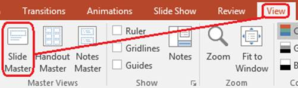

## **Übersicht**

Ein **slide master** definiert gemeinsame Design‑Einstellungen für eine Gruppe von Folien. Er kann gemeinsame Formen, Logos, Hintergründe, Textstile, Designthemen und Fußzeileneinstellungen enthalten. In PowerPoint ist das Bearbeiten eines Folienmasters der übliche Weg, um eine Präsentation konsistent zu halten, ohne dieselbe Formatierung auf jeder Folie zu wiederholen.

Aspose.Slides for Python via Java unterstützt dasselbe Modell. Eine Präsentation kann einen oder mehrere Master‑Folien enthalten, und jede Master‑Folie kann mehrere Layout‑Folien enthalten. Normale Folien verweisen in der Regel nicht direkt auf eine Master‑Folie. Stattdessen verwendet eine normale Folie eine Layout‑Folie, und diese Layout‑Folie gehört zu einer Master‑Folie.

Die Hierarchie lautet:

1. **Slide master** – definiert das gemeinsame Design und Thema.  
1. **Layout slide** – definiert eine spezifische Anordnung von Platzhaltern und Layout‑Formatierungen.  
1. **Normal slide** – enthält den eigentlichen Präsentationsinhalt und verwendet eine Layout‑Folie.


In Aspose.Slides wird ein Folienmaster durch die [MasterSlide](https://reference.aspose.com/slides/de/python-java/aspose.slides/masterslide/)‑Klasse repräsentiert. Alle Master‑Folien einer Präsentation sind über die [Presentation.getMasters](https://reference.aspose.com/slides/de/python-java/aspose.slides/presentation/#getMasters)‑Auflistung verfügbar, die durch [MasterSlideCollection](https://reference.aspose.com/slides/de/python-java/aspose.slides/masterslidecollection/) dargestellt wird.

{}
Wenn dieselbe Eigenschaft auf mehreren Ebenen definiert ist, gewinnt die spezifischere Ebene. Beispiel: Definieren sowohl eine Master‑Folie als auch eine Layout‑Folie einen Hintergrund, verwenden Folien, die auf diesem Layout basieren, den Layout‑Hintergrund. Weitere Informationen zu Layout‑Folien finden Sie unter [Apply or Change Slide Layouts](/slides/de/python-java/slide-layout/).
{}

## **Zugriff auf Folienmaster**

In PowerPoint können Sie die Folienmaster‑Ansicht über **Ansicht** > **Folienmaster** öffnen.



In Aspose.Slides nutzen Sie die [Presentation.getMasters](https://reference.aspose.com/slides/de/python-java/aspose.slides/presentation/#getMasters)‑Auflistung, um Master‑Folien zuzugreifen:

```python
import jpype
import asposeslides

if not jpype.isJVMStarted():
    jpype.startJVM()

from asposeslides.api import Presentation

presentation = Presentation("presentation.pptx")
try:
    first_master_slide = presentation.getMasters().get_Item(0)
    master_slide_count = presentation.getMasters().size()
    first_master_layout_slide_count = first_master_slide.getLayoutSlides().size()

    print(f"Master slides: {master_slide_count}")
    print(f"Layouts in the first master: {first_master_layout_slide_count}")
finally:
    presentation.dispose()
```

Sie können auch die Master‑Folie erhalten, die von einer normalen Folie über ihr Layout verwendet wird:

```python
import jpype
import asposeslides

if not jpype.isJVMStarted():
    jpype.startJVM()

from asposeslides.api import Presentation

presentation = Presentation("presentation.pptx")
try:
    slide = presentation.getSlides().get_Item(0)
    layout_slide = slide.getLayoutSlide()
    master_slide = layout_slide.getMasterSlide()
    master_slide_name = master_slide.getName()

    print(master_slide_name)
finally:
    presentation.dispose()
```

## **Was ein Folienmaster enthält**

Eine Master‑Folie ist ein folienähnliches Objekt. Sie erbt von [BaseSlide](https://reference.aspose.com/slides/de/python-java/aspose.slides/baseslide/), sodass sie viele derselben Folieneigenschaften bereitstellt, die von normalen und Layout‑Folien verwendet werden. Master‑spezifische Mitglieder sind auf der API‑Seite von [MasterSlide](https://reference.aspose.com/slides/de/python-java/aspose.slides/masterslide/) aufgeführt.

Häufig genutzte Master‑Folie‑Mitglieder umfassen:

| Mitglied | Zweck |
| --- | --- |
| [getBackground](https://reference.aspose.com/slides/de/python-java/aspose.slides/baseslide/#getBackground) | Legt den master‑bezogenen Folienhintergrund fest. |
| [getShapes](https://reference.aspose.com/slides/de/python-java/aspose.slides/baseslide/#getShapes) | Speichert Formen, die auf dem Master platziert sind, z. B. Logos, Bildrahmen und gemeinsamen Text. |
| [getLayoutSlides](https://reference.aspose.com/slides/de/python-java/aspose.slides/masterslide/#getLayoutSlides) | Enthält die Layout‑Folien, die zum Master gehören. |
| [getThemeManager](https://reference.aspose.com/slides/de/python-java/aspose.slides/masterslide/#getThemeManager) | Bietet Zugriff auf die Master‑Theme‑APIs. |
| [getHeaderFooterManager](https://reference.aspose.com/slides/de/python-java/aspose.slides/masterslide/#getHeaderFooterManager) | Steuert Kopf‑ und Fußzeilen, Datum und Foliennummern für den Master und seine untergeordneten Layouts. |
| [getDependingSlides](https://reference.aspose.com/slides/de/python-java/aspose.slides/masterslide/#getDependingSlides) | Gibt normale Folien zurück, die über ihre Layouts vom Master abhängen. |

## **Ein Bild zu einem Folienmaster hinzufügen**

Wenn Sie ein Bild zu einer Master‑Folie hinzufügen, erscheint es auf Folien, die Layouts dieses Masters verwenden. Das ist nützlich für Logos, Wasserzeichen, dekorative Bänder und andere wiederkehrende Bildelemente.

Das folgende Beispiel fügt das Logo zur ersten Master‑Folie hinzu:

```python
import jpype
import asposeslides

if not jpype.isJVMStarted():
    jpype.startJVM()

from asposeslides.api import Images, Presentation, SaveFormat, ShapeType

presentation = Presentation("presentation.pptx")
try:
    master_slide = presentation.getMasters().get_Item(0)
    logo = Images.fromFile("logo.png")
    try:
        logo_image = presentation.getImages().addImage(logo)
        master_slide.getShapes().addPictureFrame(ShapeType.Rectangle, 20, 20, 80, 80, logo_image)
    finally:
        logo.dispose()

    presentation.save("presentation-with-logo.pptx", SaveFormat.Pptx)
finally:
    presentation.dispose()
```

Weitere Informationen zu Bildrahmen finden Sie unter [Picture Frame](/slides/de/python-java/picture-frame/).

## **Mit Platzhaltern arbeiten**

Platzhalter werden normalerweise auf Layout‑Folien definiert. Der Master‑Folie liefert den gemeinsamen Stil und das Theme, das diese Layouts erben, während jedes Layout entscheidet, welche Platzhalter verfügbar sind und wo sie platziert werden.

In PowerPoint sind Platzhalter‑Befehle in der Folienmaster‑Ansicht verfügbar.


Um neue Platzhalter mit Aspose.Slides hinzuzufügen, arbeiten Sie mit der Layout‑Folie, die zum Master gehört:

```python
import jpype
import asposeslides

if not jpype.isJVMStarted():
    jpype.startJVM()

from asposeslides.api import Presentation, SaveFormat, SlideLayoutType

presentation = Presentation("presentation.pptx")
try:
    master_slide = presentation.getMasters().get_Item(0)
    blank_layout_slide = master_slide.getLayoutSlides().getByType(SlideLayoutType.Blank)

    if blank_layout_slide is None:
        blank_layout_slide = master_slide.getLayoutSlides().add(SlideLayoutType.Blank, "Blank")

    blank_layout_slide.getPlaceholderManager().addTextPlaceholder(60, 120, 600, 80)

    presentation.getSlides().addEmptySlide(blank_layout_slide)
    presentation.save("presentation-with-placeholder.pptx", SaveFormat.Pptx)
finally:
    presentation.dispose()
```

Sie können auch Platzhalterformen formatieren, die bereits auf einer Master‑Folie existieren. Das folgende Beispiel findet den Titel‑Platzhalter und wendet eine lineare Farbverlauf‑Füllung an:

```python
import jpype
import asposeslides

if not jpype.isJVMStarted():
    jpype.startJVM()

from asposeslides.api import AutoShape, FillType, GradientShape, PlaceholderType, Presentation, SaveFormat

Color = jpype.JClass("java.awt.Color")

presentation = Presentation("presentation.pptx")
try:
    master_slide = presentation.getMasters().get_Item(0)
    title_placeholder = None

    for shape in master_slide.getShapes():
        if isinstance(shape, AutoShape):
            if shape.getPlaceholder() is not None and shape.getPlaceholder().getType() == PlaceholderType.Title:
                title_placeholder = shape
                break

    if title_placeholder is not None:
        red_gradient_color = Color(255, 0, 0)
        purple_gradient_color = Color(128, 0, 128)

        title_placeholder.getFillFormat().setFillType(FillType.Gradient)
        title_placeholder.getFillFormat().getGradientFormat().setGradientShape(GradientShape.Linear)
        title_placeholder.getFillFormat().getGradientFormat().getGradientStops().add(jpype.JFloat(0.0), red_gradient_color)
        title_placeholder.getFillFormat().getGradientFormat().getGradientStops().add(jpype.JFloat(1.0), purple_gradient_color)

    presentation.save("presentation-title-style.pptx", SaveFormat.Pptx)
finally:
    presentation.dispose()
```


Weitere Optionen für Platzhalter‑ und Textformatierung finden Sie unter [Set Prompt Text in Placeholder](/slides/de/python-java/manage-placeholder/) und [Text Formatting](/slides/de/python-java/text-formatting/).

## **Hintergrund eines Folienmasters ändern**

Ein Master‑Hintergrund wird von Layouts und Folien geerbt, die ihn nicht überschreiben. Das folgende Beispiel setzt eine einfarbige Hintergrundfarbe für die erste Master‑Folie:

```python
import jpype
import asposeslides

if not jpype.isJVMStarted():
    jpype.startJVM()

from asposeslides.api import BackgroundType, FillType, Presentation, SaveFormat

Color = jpype.JClass("java.awt.Color")

presentation = Presentation("presentation.pptx")
try:
    master_slide = presentation.getMasters().get_Item(0)
    master_background_color = Color.GREEN

    master_slide.getBackground().setType(BackgroundType.OwnBackground)
    master_slide.getBackground().getFillFormat().setFillType(FillType.Solid)
    master_slide.getBackground().getFillFormat().getSolidFillColor().setColor(master_background_color)

    presentation.save("presentation-master-background.pptx", SaveFormat.Pptx)
finally:
    presentation.dispose()
```

Verwandte Themen finden Sie unter [Presentation Background](/slides/de/python-java/presentation-background/) und [Presentation Theme](/slides/de/python-java/presentation-theme/).

## **Einen Folienmaster in eine andere Präsentation klonen**

Verwenden Sie [MasterSlideCollection.addClone](https://reference.aspose.com/slides/de/python-java/aspose.slides/masterslidecollection/#addClone), um eine Master‑Folie in eine andere Präsentation zu kopieren. Der kopierte Master kann dann von Layouts und Folien in der Zielpräsentation verwendet werden.

```python
import jpype
import asposeslides

if not jpype.isJVMStarted():
    jpype.startJVM()

from asposeslides.api import Presentation, SaveFormat

source_presentation = Presentation("source.pptx")
destination_presentation = Presentation("destination.pptx")
try:
    source_master_slide = source_presentation.getMasters().get_Item(0)
    cloned_master_slide = destination_presentation.getMasters().addClone(source_master_slide)

    destination_presentation.save("destination-with-master.pptx", SaveFormat.Pptx)
finally:
    source_presentation.dispose()
    destination_presentation.dispose()
```

Falls Sie normale Folien zusammen mit ihrem Master klonen müssen, siehe [Clone Slides](/slides/de/python-java/clone-slides/).

## **Mehrere Folienmaster hinzufügen**

Eine Präsentation kann mehrere Master‑Folien enthalten. Das ist nützlich, wenn unterschiedliche Abschnitte verschiedene Markenauftritte, Seitenstrukturen oder Theme‑Einstellungen benötigen.


Das folgende Beispiel klont den Standard‑Master, gibt dem Klon einen anderen Hintergrund, erstellt ein Layout unter diesem geklonten Master und fügt eine neue Folie basierend auf diesem Layout hinzu:

```python
import jpype
import asposeslides

if not jpype.isJVMStarted():
    jpype.startJVM()

from asposeslides.api import BackgroundType, FillType, Presentation, SaveFormat, SlideLayoutType

Color = jpype.JClass("java.awt.Color")

presentation = Presentation("presentation.pptx")
try:
    default_master_slide = presentation.getMasters().get_Item(0)
    section_master_slide = presentation.getMasters().addClone(default_master_slide)
    section_master_background_color = Color.LIGHT_GRAY

    section_master_slide.getBackground().setType(BackgroundType.OwnBackground)
    section_master_slide.getBackground().getFillFormat().setFillType(FillType.Solid)
    section_master_slide.getBackground().getFillFormat().getSolidFillColor().setColor(section_master_background_color)

    source_blank_layout = default_master_slide.getLayoutSlides().getByType(SlideLayoutType.Blank)
    if source_blank_layout is None:
        source_blank_layout = default_master_slide.getLayoutSlides().get_Item(0)

    section_blank_layout = section_master_slide.getLayoutSlides().addClone(source_blank_layout)

    presentation.getSlides().addEmptySlide(section_blank_layout)
    presentation.save("presentation-with-multiple-masters.pptx", SaveFormat.Pptx)
finally:
    presentation.dispose()
```

## **Folienmaster vergleichen**

Master‑Folien können mit der von [BaseSlide](https://reference.aspose.com/slides/de/python-java/aspose.slides/baseslide/) geerbten [equals](https://reference.aspose.com/slides/de/python-java/aspose.slides/baseslide/#equals)‑Methode verglichen werden. Der Vergleich prüft Struktur und statischen Inhalt, wie Formen, Text, Formatierung, Animationen und andere Folieneinstellungen. Er vergleicht nicht eindeutige Kennungen wie Folien‑IDs oder dynamische Platzhalter‑Werte wie das aktuelle Datum.

```python
import jpype
import asposeslides

if not jpype.isJVMStarted():
    jpype.startJVM()

from asposeslides.api import Presentation

first_presentation = Presentation("first.pptx")
second_presentation = Presentation("second.pptx")
try:
    first_presentation_master_count = first_presentation.getMasters().size()
    second_presentation_master_count = second_presentation.getMasters().size()

    for first_master_index in range(first_presentation_master_count):
        for second_master_index in range(second_presentation_master_count):
            first_master_slide = first_presentation.getMasters().get_Item(first_master_index)
            second_master_slide = second_presentation.getMasters().get_Item(second_master_index)
            are_master_slides_equal = first_master_slide.equals(second_master_slide)

            if are_master_slides_equal:
                print(f"first.pptx master #{first_master_index} equals second.pptx master #{second_master_index}")
finally:
    first_presentation.dispose()
    second_presentation.dispose()
```

Weitere Informationen finden Sie unter [Compare Presentation Slides](/slides/de/python-java/compare-slides/).

## **Folienmaster‑Ansicht als Standardansicht festlegen**

Verwenden Sie die Methode [setLastView](https://reference.aspose.com/slides/de/python-java/aspose.slides/viewproperties/#setLastView) auf [ViewProperties](https://reference.aspose.com/slides/de/python-java/aspose.slides/viewproperties/), um die Ansicht zu steuern, die PowerPoint zuerst öffnet. Das folgende Beispiel öffnet die Präsentation in der Folienmaster‑Ansicht:

```python
import jpype
import asposeslides

if not jpype.isJVMStarted():
    jpype.startJVM()

from asposeslides.api import Presentation, SaveFormat, ViewType

presentation = Presentation("presentation.pptx")
try:
    presentation.getViewProperties().setLastView(ViewType.SlideMasterView)
    presentation.save("presentation-master-view.pptx", SaveFormat.Pptx)
finally:
    presentation.dispose()
```

Weitere Ansichtseinstellungen finden Sie unter [Save Presentation](/slides/de/python-java/save-presentation/).

## **Unbenutzte Master‑Folien entfernen**

Manchmal enthalten Präsentationen Master‑Folien, die von keiner normalen Folie mehr verwendet werden. Das Entfernen unbenutzter Master‑Folien kann die Dateigröße verringern und die Vorlagenwartung vereinfachen.

Verwenden Sie [removeUnused](https://reference.aspose.com/slides/de/python-java/aspose.slides/masterslidecollection/#removeUnused), um unbenutzte Master‑Folien aus der [Presentation.getMasters](https://reference.aspose.com/slides/de/python-java/aspose.slides/presentation/#getMasters)‑Auflistung zu entfernen:

```python
import jpype
import asposeslides

if not jpype.isJVMStarted():
    jpype.startJVM()

from asposeslides.api import Presentation, SaveFormat

presentation = Presentation("presentation.pptx")
try:
    presentation.getMasters().removeUnused(True)
    presentation.save("presentation-clean.pptx", SaveFormat.Pptx)
finally:
    presentation.dispose()
```

Sie können auch die Low‑Code‑Methode [Compress.removeUnusedMasterSlides](https://reference.aspose.com/slides/de/python-java/aspose.slides/compress/#removeUnusedMasterSlides) verwenden:

```python
import jpype
import asposeslides

if not jpype.isJVMStarted():
    jpype.startJVM()

from asposeslides.api import Compress, Presentation, SaveFormat

presentation = Presentation("presentation.pptx")
try:
    Compress.removeUnusedMasterSlides(presentation)
    presentation.save("presentation-clean.pptx", SaveFormat.Pptx)
finally:
    presentation.dispose()
```

## **FAQ**

**Was ist der Unterschied zwischen einem Folienmaster und einer Layout‑Folie?**

Ein Folienmaster definiert gemeinsame Design‑Einstellungen wie Theme, Hintergrund, gemeinsame Formen und Textstile. Eine Layout‑Folie gehört zu einem Folienmaster und definiert eine spezifische Anordnung von Platzhaltern. Eine normale Folie verwendet eine Layout‑Folie und erbt somit sowohl vom Layout als auch vom Master.

**Kann eine Präsentation mehrere Folienmaster enthalten?**

Ja. Eine Präsentation kann mehrere Folienmaster enthalten. Verwenden Sie mehrere Master, wenn verschiedene Abschnitte unterschiedliche visuelle Systeme oder Markenauftritte benötigen.

**Sollte ich Platzhalter zu einem Folienmaster oder zu einer Layout‑Folie hinzufügen?**

In den meisten Fällen fügen Sie Platzhalter zu Layout‑Folien hinzu. Platzieren Sie gemeinsam genutzte visuelle Elemente und Formatierungen auf dem Folienmaster und setzen Sie Inhalts‑Platzhalter auf den Layout‑Folien, die von normalen Folien verwendet werden.

**Kann ich eine Folienmaster‑Folie löschen, die noch verwendet wird?**

Nein. Eine Folienmaster‑Folie, die abhängige Folien hat, kann nicht sicher direkt entfernt werden. Verschieben Sie zuerst diese Folien zu Layouts unter einem anderen Master oder verwenden Sie eine Bereinigungs‑Methode, die nur unbenutzte Master entfernt.