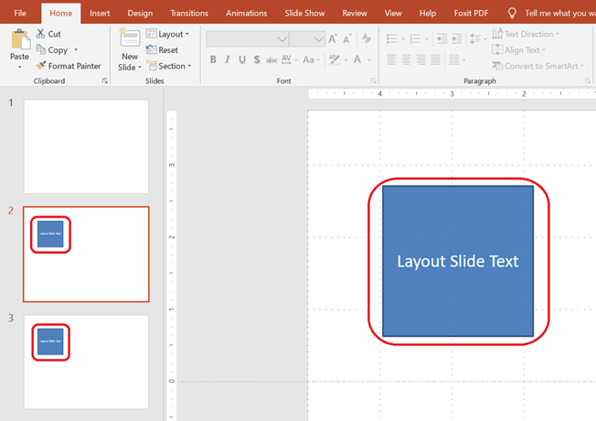

Dieser Artikel zeigt, wie man mit **Layoutfolien** mithilfe von Aspose.Slides für Python über Java arbeitet. Eine Layoutfolie definiert das Design und die Formatierung, die von normalen Folien geerbt werden. Sie können Layoutfolien hinzufügen, darauf zugreifen, duplizieren und entfernen sowie ungenutzte Folien bereinigen, um die Präsentationsgröße zu reduzieren.

Installieren Sie das Paket wie in [Installation](/slides/de/python-java/installation/) beschrieben. Jeder Beispielcode importiert `asposeslides`, bevor die JVM gestartet wird, und importiert anschließend die API, nachdem die JVM läuft.

## **Layoutfolie hinzufügen**

Erstellen Sie eine benutzerdefinierte Layoutfolie, um wiederverwendbare Formatierung zu definieren. Das folgende Beispiel fügt einer neuen Layoutfolie ein Textfeld hinzu und erstellt anschließend zwei Folien, die diese verwenden.

```python
import jpype
import asposeslides

if not jpype.isJVMStarted():
    jpype.startJVM()

from asposeslides.api import Presentation, ShapeType, SlideLayoutType

presentation = Presentation()
try:
    master_slide = presentation.getMasters().get_Item(0)

    # Eine Layoutfolie mit einem leeren Layouttyp und einem benutzerdefinierten Namen erstellen.
    layout_slide = presentation.getLayoutSlides().add(master_slide, SlideLayoutType.Blank, "Main layout")

    # Ein Textfeld zur Layoutfolie hinzufügen.
    layout_text_box = layout_slide.getShapes().addAutoShape(ShapeType.Rectangle, 75, 75, 150, 150)
    layout_text_box.getTextFrame().setText("Layout Slide Text")

    # Zwei Folien hinzufügen, die den Text vom Layout erben.
    presentation.getSlides().addEmptySlide(layout_slide)
    presentation.getSlides().addEmptySlide(layout_slide)
finally:
    presentation.dispose()
```

> 💡 **Hinweis 1:** Layoutfolien dienen als Vorlagen für einzelne Folien. Sie können gemeinsame Elemente einmal definieren und sie über viele Folien hinweg wiederverwenden.

> 💡 **Hinweis 2:** Wenn Sie Formen oder Text zu einer Layoutfolie hinzufügen, zeigen alle Folien, die auf dieser Layoutfolie basieren, den gemeinsamen Inhalt automatisch an.
> Das untenstehende Screenshot zeigt zwei Folien, die ein Textfeld von derselben Layoutfolie erben.



## **Zugriff auf eine Layoutfolie**

Greifen Sie auf Layoutfolien per Index oder nach Layouttyp zu, z. B. leer, Titel oder Abschnittsüberschrift.

```python
import jpype
import asposeslides

if not jpype.isJVMStarted():
    jpype.startJVM()

from asposeslides.api import Presentation, SlideLayoutType

presentation = Presentation()
try:
    # Eine Layoutfolie nach Index zugreifen.
    first_layout_slide = presentation.getLayoutSlides().get_Item(0)

    # Eine Layoutfolie nach Typ zugreifen.
    blank_layout_slide = presentation.getLayoutSlides().getByType(SlideLayoutType.Blank)
finally:
    presentation.dispose()
```

## **Layoutfolie entfernen**

Entfernen Sie eine bestimmte Layoutfolie, wenn sie nicht mehr benötigt wird.

```python
import jpype
import asposeslides

if not jpype.isJVMStarted():
    jpype.startJVM()

from asposeslides.api import Presentation, SlideLayoutType

presentation = Presentation()
try:
    master_slide = presentation.getMasters().get_Item(0)
    layout_slide = presentation.getLayoutSlides().add(master_slide, SlideLayoutType.Blank, "Temporary layout")

    presentation.getLayoutSlides().remove(layout_slide)
finally:
    presentation.dispose()
```

## **Unbenutzte Layoutfolien entfernen**

Entfernen Sie Layoutfolien, die von keiner normalen Folie verwendet werden, um die Präsentationsgröße zu reduzieren.

```python
import jpype
import asposeslides

if not jpype.isJVMStarted():
    jpype.startJVM()

from asposeslides.api import Presentation

presentation = Presentation()
try:
    presentation.getLayoutSlides().removeUnused()
finally:
    presentation.dispose()
```

## **Layoutfolie duplizieren**

Duplizieren Sie eine Layoutfolie und fügen die Kopie am Ende der Layoutfoliensammlung hinzu.

```python
import jpype
import asposeslides

if not jpype.isJVMStarted():
    jpype.startJVM()

from asposeslides.api import Presentation, SlideLayoutType

presentation = Presentation()
try:
    master_slide = presentation.getMasters().get_Item(0)
    source_layout_slide = presentation.getLayoutSlides().add(master_slide, SlideLayoutType.Blank, "Source layout")

    cloned_layout_slide = presentation.getLayoutSlides().addClone(source_layout_slide)
finally:
    presentation.dispose()
```

> ✅ **Zusammenfassung:** Layoutfolien helfen, einheitliche Formatierung in einer gesamten Präsentation beizubehalten. Aspose.Slides ermöglicht es Ihnen, Layouts nach Bedarf zu erstellen, zu verwalten, wiederzuverwenden und aufzuräumen.