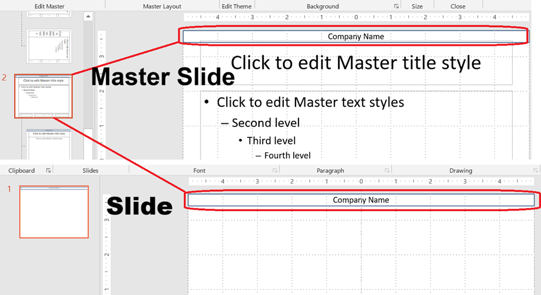

Masterfolien bilden die oberste Ebene der Folienvererbungshierarchie in PowerPoint. Eine **Masterfolie** definiert gemeinsame Designelemente wie Hintergründe, Logos und Textformatierung. **Layoutfolien** erben von Masterfolien, und **Normale Folien** erben von Layoutfolien.

Dieser Artikel demonstriert, wie man Masterfolien mit **Aspose.Slides for Python via Java** erstellt, ändert und verwaltet.

Installieren Sie das Paket wie in [Installation](/slides/de/python-java/installation/) beschrieben. Jedes Beispiel importiert `asposeslides`, bevor die JVM gestartet wird, und importiert anschließend die API, nachdem die JVM läuft.

## **Masterfolie hinzufügen**

Dieses Beispiel zeigt, wie man eine neue Masterfolie erstellt, indem man die Standardsfolie klont. Anschließend fügt es ein Firmenname‑Banner zu allen Folien über die Layout‑Vererbung hinzu.

```python
import jpype
import asposeslides

if not jpype.isJVMStarted():
    jpype.startJVM()

from asposeslides.api import FillType, Presentation, ShapeType
from java.awt import Color

presentation = Presentation()
try:
    # Kopiere die Standards-Masterfolie.
    default_master_slide = presentation.getMasters().get_Item(0)
    new_master_slide = presentation.getMasters().addClone(default_master_slide)

    # Füge ein Banner mit dem Firmennamen oben auf der Masterfolie hinzu.
    text_box = new_master_slide.getShapes().addAutoShape(ShapeType.Rectangle, 0, 0, 720, 25)
    text_box.getTextFrame().setText("Company Name")
    paragraph = text_box.getTextFrame().getParagraphs().get_Item(0)
    paragraph.getParagraphFormat().getDefaultPortionFormat().getFillFormat().setFillType(FillType.Solid)
    paragraph.getParagraphFormat().getDefaultPortionFormat().getFillFormat().getSolidFillColor().setColor(Color.BLACK)
    text_box.getFillFormat().setFillType(FillType.NoFill)

    # Weiste die neue Masterfolie einer Layoutfolie zu.
    layout_slide = presentation.getLayoutSlides().get_Item(0)
    layout_slide.setMasterSlide(new_master_slide)

    # Weiste die Layoutfolie der ersten Folie in der Präsentation zu.
    presentation.getSlides().get_Item(0).setLayoutSlide(layout_slide)
finally:
    presentation.dispose()
```

{}
Masterfolien ermöglichen es, einheitliches Branding oder gemeinsam genutzte Designelemente auf alle Folien anzuwenden. Änderungen an einer Masterfolie werden automatisch auf abhängige Layout‑ und Normale Folien übertragen.
{}

{}
Formen und Formatierungen, die zu einer Masterfolie hinzugefügt werden, werden von Layoutfolien und wiederum von allen Normalfolien, die diese Layouts verwenden, geerbt. Das Bild unten veranschaulicht, wie ein Textfeld, das zu einer Masterfolie hinzugefügt wurde, automatisch auf der endgültigen Folie gerendert wird.
{}



## **Zugriff auf eine Masterfolie**

Sie können über die Master‑Sammlung der Präsentation auf Masterfolien zugreifen. Dieses Beispiel ruft die erste Masterfolie ab und ändert deren Hintergrundtyp.

```python
import jpype
import asposeslides

if not jpype.isJVMStarted():
    jpype.startJVM()

from asposeslides.api import BackgroundType, Presentation

presentation = Presentation()
try:
    first_master_slide = presentation.getMasters().get_Item(0)
    first_master_slide.getBackground().setType(BackgroundType.OwnBackground)
finally:
    presentation.dispose()
```

## **Masterfolie entfernen**

Eine Masterfolie kann nach Nichtverwendung per Index oder per Referenz entfernt werden. Dieses Beispiel weist der Präsentation eine geklonte Masterfolie zu und entfernt anschließend die ursprüngliche Masterfolie per Index.

```python
import jpype
import asposeslides

if not jpype.isJVMStarted():
    jpype.startJVM()

from asposeslides.api import Presentation

presentation = Presentation()
try:
    default_master_slide = presentation.getMasters().get_Item(0)
    new_master_slide = presentation.getMasters().addClone(default_master_slide)

    layout_slide = presentation.getLayoutSlides().get_Item(0)
    layout_slide.setMasterSlide(new_master_slide)
    presentation.getSlides().get_Item(0).setLayoutSlide(layout_slide)

    # Entferne die nicht genutzte ursprüngliche Masterfolie per Index.
    # Alternativ kann eine nicht genutzte Masterfolie per Referenz entfernt werden:
    # presentation.getMasters().remove(unused_master_slide)
finally:
    presentation.dispose()
```

## **Unbenutzte Masterfolien entfernen**

Einige Präsentationen enthalten Masterfolien, die nicht verwendet werden. Das Entfernen dieser Folien kann helfen, die Dateigröße zu reduzieren.

```python
import jpype
import asposeslides

if not jpype.isJVMStarted():
    jpype.startJVM()

from asposeslides.api import Presentation

presentation = Presentation()
try:
    default_master_slide = presentation.getMasters().get_Item(0)
    presentation.getMasters().addClone(default_master_slide)

    # Entferne alle nicht verwendeten Masterfolien, einschließlich solcher, die als Preserve markiert sind.
    presentation.getMasters().removeUnused(True)
finally:
    presentation.dispose()
```