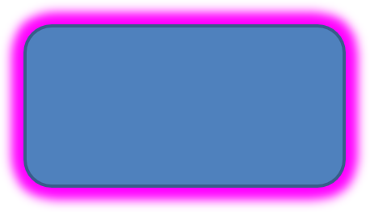

## **Εισαγωγή**

Ενώ τα εφέ στο PowerPoint μπορούν να χρησιμοποιηθούν για να κάνουν ένα σχήμα να ξεχωρίζει, διαφέρουν από τις [συμπληρώσεις](/slides/el/nodejs-java/shape-formatting/#gradient-fill) ή τα περιγράμματα. Χρησιμοποιώντας εφέ PowerPoint, μπορείτε να δημιουργήσετε πειστικές αντανακλάσεις σε ένα σχήμα, να διαχυθεί η λάμψη ενός σχήματος κ.λπ.


Το PowerPoint παρέχει έξι εφέ που μπορούν να εφαρμοστούν σε σχήματα. Μπορείτε να εφαρμόσετε ένα ή περισσότερα εφέ σε ένα σχήμα.

Κάποιοι συνδυασμοί εφέ φαίνονται καλύτερα από άλλους. Για το λόγο αυτό, το PowerPoint παρέχει επιλογές υπό **Preset**. Οι επιλογές Preset είναι συνδυασμοί δύο ή περισσότερων εφέ που είναι γνωστό ότι φαίνονται καλά. Με αυτόν τον τρόπο, επιλέγοντας ένα preset, δεν θα χρειαστεί να χάνετε χρόνο δοκιμάζοντας ή συνδυάζοντας διαφορετικά εφέ για να βρείτε έναν καλό συνδυασμό.

Το Aspose.Slides παρέχει ιδιότητες και μεθόδους υπό την κλάση [EffectFormat](https://reference.aspose.com/slides/nodejs-java/aspose.slides/effectformat/) που σας επιτρέπουν να εφαρμόζετε τα ίδια εφέ σε σχήματα σε παρουσιάσεις PowerPoint.

## **Εφαρμογή εφέ σκιάς**

Το Aspose.Slides for Node.js via Java υποστηρίζει εξωτερικές και εσωτερικές σκιές για σχήματα. Μπορείτε να προσαρμόσετε το χρώμα, την κατεύθυνση, την απόσταση και την ακτίνα θολώματος ώστε να ταιριάζει με το σχέδιο της παρουσίασής σας.

### **Εφαρμογή εξωτερικής σκιάς**

Χρησιμοποιήστε μια εξωτερική σκιά για να κάνετε μια κάρτα ή πίνακα να ξεχωρίζει από το φόντο της διαφάνειας. Η σκιά εκτείνεται πέρα από τις άκρες του σχήματος, δημιουργώντας την εντύπωση ότι το σχήμα είναι ανυψωμένο πάνω από τη διαφάνεια. Ρυθμίστε το χρώμα, την κατεύθυνση, την απόσταση και την ακτίνα θολώματος ώστε να ταιριάζει με τον φωτισμό και το στιλ του προτύπου σας.

Αυτός ο κώδικας JavaScript δείχνει πώς να εφαρμόσετε το [εφέ εξωτερικής σκιάς](https://reference.aspose.com/slides/nodejs-java/aspose.slides/effectformat/#getOuterShadowEffect) σε ένα ορθογώνιο:

```javascript
const aspose = { slides: require("aspose.slides.via.java") };
const java = require("java");

const presentation = new aspose.slides.Presentation();
try {
    const slide = presentation.getSlides().get_Item(0);

    const shape = slide.getShapes().addAutoShape(aspose.slides.ShapeType.RoundCornerRectangle, 20, 20, 200, 100);
    shape.getEffectFormat().enableOuterShadowEffect();
    const color = java.newInstanceSync("java.awt.Color", 169, 169, 169);
    shape.getEffectFormat().getOuterShadowEffect().getShadowColor().setColor(color);
    shape.getEffectFormat().getOuterShadowEffect().setDistance(10);
    shape.getEffectFormat().getOuterShadowEffect().setDirection(45);

    presentation.save("shadow_effect.pptx", aspose.slides.SaveFormat.Pptx);
} finally {
    presentation.dispose();
}
```


### **Εφαρμογή εσωτερικής σκιάς**

Κατά την αναπαραγωγή του οπτικού στιλ ενός προτύπου, χρησιμοποιήστε μια εσωτερική σκιά για να δώσετε σε μια κάρτα ή πίνακα μια εσοχή. Μια εξωτερική σκιά εκτείνεται έξω από το σχήμα και το κάνει να φαίνεται ανυψωμένο, ενώ μια εσωτερική σκιά σκιάζει το εσωτερικό των άκρων του.

Καλέστε την [enableInnerShadowEffect](https://reference.aspose.com/slides/nodejs-java/aspose.slides/effectformat/#enableInnerShadowEffect), στη συνέχεια ρυθμίστε τη σκιά που επιστρέφεται από την [getInnerShadowEffect](https://reference.aspose.com/slides/nodejs-java/aspose.slides/effectformat/#getInnerShadowEffect). Μεγαλύτερες τιμές ακτίνας θολώματος παράγουν πιο απαλές άκρες.

Αυτό το παράδειγμα JavaScript δημιουργεί μια ανοιχτό μπλε κάρτα με σκούρα γκρι εσωτερική σκιά και την αποθηκεύει ως αρχείο PPTX. Η κατεύθυνση της σκιάς είναι 225 μοίρες, η απόσταση 7 σημεία και η ακτίνα θολώματος 6 σημεία:

```javascript
const aspose = { slides: require("aspose.slides.via.java") };
const java = require("java");

const presentation = new aspose.slides.Presentation();
try {
    const slide = presentation.getSlides().get_Item(0);

    const shape = slide.getShapes().addAutoShape(aspose.slides.ShapeType.Rectangle, 20, 20, 200, 100);
    shape.getFillFormat().setFillType(java.newByte(aspose.slides.FillType.Solid));
    const fillColor = java.newInstanceSync("java.awt.Color", 173, 216, 230);
    shape.getFillFormat().getSolidFillColor().setColor(fillColor);
    shape.getLineFormat().getFillFormat().setFillType(java.newByte(aspose.slides.FillType.NoFill));

    shape.getEffectFormat().enableInnerShadowEffect();
    const shadow = shape.getEffectFormat().getInnerShadowEffect();
    const color = java.newInstanceSync("java.awt.Color", 105, 105, 105);
    shadow.getShadowColor().setColor(color);
    shadow.setDirection(225);
    shadow.setDistance(7);
    shadow.setBlurRadius(6);

    presentation.save("inner_shadow_effect.pptx", aspose.slides.SaveFormat.Pptx);
} finally {
    presentation.dispose();
}
```


Για να αφαιρέσετε την εσωτερική σκιά, καλέστε την [disableInnerShadowEffect](https://reference.aspose.com/slides/nodejs-java/aspose.slides/effectformat/#disableInnerShadowEffect) στη μορφή εφέ του σχήματος.

## **Εφαρμογή εφέ ανάκλασης**

Για να εφαρμόσετε ένα εφέ ανάκλασης στο Aspose.Slides for Node.js via Java, μπορείτε να προσθέσετε μια καθρέφτη-ομοιάζουσα ανάκλαση σε σχήματα, ρυθμίζοντας παραμέτρους όπως απόσταση, διαφάνεια και μέγεθος. Αυτό το εφέ ενισχύει την αισθητική των παρουσιάσεών σας δίνοντας στα σχήματα μια πιο γυαλιστερή και πολυτελή εμφάνιση. Είναι εύκολο στην υλοποίηση με απλό κώδικα, επιτρέποντας γρήγορη εφαρμογή σε πολλαπλά στοιχεία για συνεπές σχέδιο.

Αυτός ο κώδικας JavaScript δείχνει πώς να εφαρμόσετε το [εφέ ανάκλασης](https://reference.aspose.com/slides/nodejs-java/aspose.slides/effectformat/#getReflectionEffect) σε ένα σχήμα:

```javascript
const aspose = { slides: require("aspose.slides.via.java") };
const java = require("java");

const presentation = new aspose.slides.Presentation();
try {
    const slide = presentation.getSlides().get_Item(0);

    const shape = slide.getShapes().addAutoShape(aspose.slides.ShapeType.RoundCornerRectangle, 20, 20, 200, 100);
    shape.getEffectFormat().enableReflectionEffect();
    shape.getEffectFormat().getReflectionEffect().setRectangleAlign(java.newByte(aspose.slides.RectangleAlignment.Bottom));
    shape.getEffectFormat().getReflectionEffect().setDirection(90);
    shape.getEffectFormat().getReflectionEffect().setDistance(40);
    shape.getEffectFormat().getReflectionEffect().setBlurRadius(2);

    presentation.save("reflection_effect.pptx", aspose.slides.SaveFormat.Pptx);
} finally {
    presentation.dispose();
}
```


## **Εφαρμογή εφέ λάμψης**

Για να εφαρμόσετε ένα εφέ λάμψης σε σχήμα στο Aspose.Slides for Node.js via Java, μπορείτε να προσθέσετε μια ήπια, φωτεινή αύρα γύρω από τα σχήματα, ρυθμίζοντας ιδιότητες όπως χρώμα και μέγεθος. Αυτό το εφέ βοηθάει τα σχήματα να ξεχωρίζουν και προσθέτει ένα ελκυστικό, εντυπωσιακό οπτικό στοιχείο στην παρουσίασή σας. Είναι εύκολο στην υλοποίηση με ελάχιστο κώδικα, βελτιώνοντας τη συνολική εμφάνιση των διαφανειών σας.

Αυτός ο κώδικας JavaScript δείχνει πώς να εφαρμόσετε το [εφέ λάμψης](https://reference.aspose.com/slides/nodejs-java/aspose.slides/effectformat/#getGlowEffect) σε ένα σχήμα:

```javascript
const aspose = { slides: require("aspose.slides.via.java") };
const java = require("java");

const presentation = new aspose.slides.Presentation();
try {
    const slide = presentation.getSlides().get_Item(0);

    const shape = slide.getShapes().addAutoShape(aspose.slides.ShapeType.RoundCornerRectangle, 20, 20, 200, 100);
    shape.getEffectFormat().enableGlowEffect();
    const color = java.getStaticFieldValue("java.awt.Color", "MAGENTA");
    shape.getEffectFormat().getGlowEffect().getColor().setColor(color);
    shape.getEffectFormat().getGlowEffect().setRadius(15);

    presentation.save("glow_effect.pptx", aspose.slides.SaveFormat.Pptx);
} finally {
    presentation.dispose();
}
```



## **Εφαρμογή εφέ μαλακών άκρων**

Για να εφαρμόσετε ένα εφέ μαλακών άκρων στο Aspose.Slides for Node.js via Java, μπορείτε να δημιουργήσετε μια ομαλή, θολή μετάβαση γύρω από τις άκρες ενός σχήματος. Αυτό το εφέ προσθέτει μια πιο διακριτική και εκλεπτυσμένη εμφάνιση, ιδανική για σχέδια που χρειάζονται ήπια, πιο απαλό φινίρισμα. Μπορείτε εύκολα να ρυθμίσετε παραμέτρους όπως η ακτίνα για να πετύχετε το επιθυμητό αποτέλεσμα σε διάφορα σχήματα στην παρουσίασή σας.

Αυτός ο κώδικας JavaScript δείχνει πώς να εφαρμόσετε το [εφέ μαλακών άκρων](https://reference.aspose.com/slides/nodejs-java/aspose.slides/effectformat/#getSoftEdgeEffect) σε ένα σχήμα:

```javascript
const aspose = { slides: require("aspose.slides.via.java") };

const presentation = new aspose.slides.Presentation();
try {
    const slide = presentation.getSlides().get_Item(0);

    const shape = slide.getShapes().addAutoShape(aspose.slides.ShapeType.RoundCornerRectangle, 20, 20, 200, 150);
    shape.getEffectFormat().enableSoftEdgeEffect();
    shape.getEffectFormat().getSoftEdgeEffect().setRadius(8);

    presentation.save("soft_edges_effect.pptx", aspose.slides.SaveFormat.Pptx);
} finally {
    presentation.dispose();
}
```


## **Συχνές ερωτήσεις**

**Μπορώ να εφαρμόσω πολλαπλά εφέ στο ίδιο σχήμα;**

Ναι, μπορείτε να συνδυάσετε διαφορετικά εφέ, όπως σκιά, ανάκλαση και λάμψη, σε ένα μόνο σχήμα για να δημιουργήσετε μια πιο δυναμική εμφάνιση.

**Σε ποια σχήματα μπορώ να εφαρμόσω εφέ;**

Μπορείτε να εφαρμόσετε εφέ σε διάφορα σχήματα, συμπεριλαμβανομένων των αυτόσχημων, διαγραμμάτων, πινάκων, εικόνων, αντικειμένων SmartArt, αντικειμένων OLE και άλλων.

**Μπορώ να εφαρμόσω εφέ σε ομαδοποιημένα σχήματα;**

Ναι, μπορείτε να εφαρμόσετε εφέ σε ομαδοποιημένα σχήματα. Το εφέ θα εφαρμοστεί σε ολόκληρη την ομάδα.