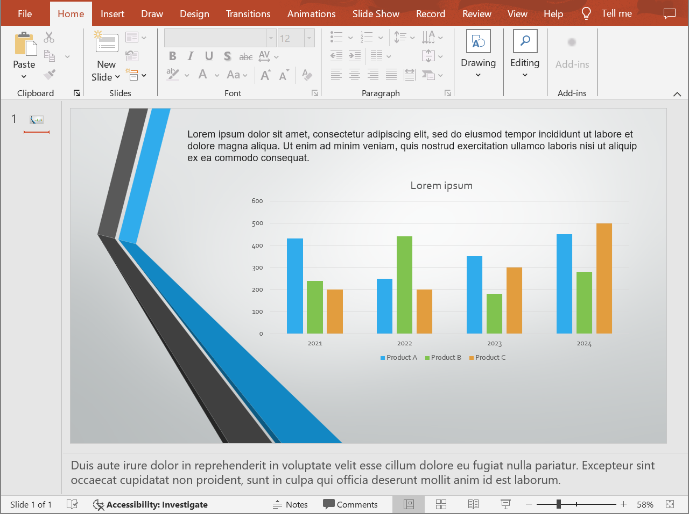

## **Επισκόπηση**

Το Aspose.Slides για Python μέσω Java μπορεί να αποθηκεύσει παρουσιάσεις PowerPoint ως HTML χωρίς το Microsoft PowerPoint. Η βασική μετατροπή αποτελείται από ένα μόνο φόρτωμα [Presentation](https://reference.aspose.com/slides/el/python-java/aspose.slides/presentation/) και μια κλήση [save](https://reference.aspose.com/slides/el/python-java/aspose.slides/presentation/#save) με το [SaveFormat](https://reference.aspose.com/slides/el/python-java/aspose.slides/saveformat/). Χρησιμοποιήστε το [HtmlOptions](https://reference.aspose.com/slides/el/python-java/aspose.slides/htmloptions/) όταν χρειάζεται να ελέγξετε τη διάταξη εξαγόμενων δεδομένων, τις γραμματοσειρές, τις εικόνες, τις σημειώσεις, τα σχόλια, την έξοδο SVG ή τους συνδεδεμένους πόρους.

Αυτός ο οδηγός επικεντρώνεται σε πρακτικά σενάρια εξαγωγής HTML:

- Εξαγωγή ολόκληρης παρουσίασης ή επιλεγμένων διαφανειών.
- Δημιουργία σταθερής διάταξης, ανταποκρινόμενου ή βασισμένου σε SVG HTML.
- Συμπερίληψη σημειώσεων ομιλητή και σχολίων.
- Έλεγχος ποιότητας εικόνας και δεδομένων περικομμένων εικόνων.
- Ενσωμάτωση γραμματοσειρών ή αποθήκευση αρχείων γραμματοσειρών ξεχωριστά.
- Επιλογή τρόπου δημιουργίας και παραπομπής εξωτερικών πόρων και αρχείων πολυμέσων.

Από προεπιλογή, η εξαγωγή HTML δημιουργεί ένα αυτόνομο έγγραφο HTML όπου οι περισσότεροι πόροι είναι ενσωματωμένοι. Αυτό είναι βολικό για κοινή χρήση ενός μόνο αρχείου, αλλά μπορεί να αυξήσει το μέγεθος εξόδου. Για δημοσίευση στο web, σκεφτείτε εξωτερικούς πόρους, χαμηλότερο DPI εικόνας και ενσωμάτωση μόνο γραμματοσειρών που δεν είναι αξιόπιστα διαθέσιμες στο περιβάλλον προορισμού.

## **Μετατροπή Παρουσίασης σε HTML**

Για να εξαγάγετε μια παρουσίαση σε HTML, φορτώστε την με [Presentation](https://reference.aspose.com/slides/el/python-java/aspose.slides/presentation/) και αποθηκεύστε την με [SaveFormat.Html](https://reference.aspose.com/slides/el/python-java/aspose.slides/saveformat/#Html).

```python
import jpype
import asposeslides

if not jpype.isJVMStarted():
    jpype.startJVM()

from asposeslides.api import Presentation, SaveFormat

presentation = Presentation("presentation.pptx")
try:
    presentation.save("presentation.html", SaveFormat.Html)
finally:
    presentation.dispose()
```

Κάθε παράδειγμα φορτώνει το `presentation.pptx` από τον τρέχοντα φάκελο εργασίας. Εγκαταστήστε το Aspose.Slides για Python μέσω Java και ένα συμβατό περιβάλλον χρόνου εκτέλεσης Java πριν το τρέξετε. Η JVM εκκινείται μία φορά ανά διεργασία Python.

Αυτό το παράδειγμα γράφει ένα αρχείο HTML. Το αντικείμενο παρουσίασης διαγράφεται στο μπλοκ `finally`, το οποίο απελευθερώνει τους χειριστές αρχείων και τους πόρους απόδοσης μετά την εξαγωγή.

## **Διαμόρφωση Εξαγωγής HTML**

[HtmlOptions](https://reference.aspose.com/slides/el/python-java/aspose.slides/htmloptions/) είναι η κύρια κλάση ρύθμισης για την εξαγωγή HTML. Συνηθισμένες ρυθμίσεις περιλαμβάνουν:

- [setSlidesLayoutOptions](https://reference.aspose.com/slides/el/python-java/aspose.slides/htmloptions/#setSlidesLayoutOptions): προσθέτει σημειώσεις, σχόλια, φυλλάδια ή άλλες πληροφορίες διάταξης.
- [setHtmlFormatter](https://reference.aspose.com/slides/el/python-java/aspose.slides/htmloptions/#setHtmlFormatter): αλλάζει τη δομή του εγγράφου HTML ή παραχωρεί τη μορφοποίηση σε ελεγκτή.
- [setSlideImageFormat](https://reference.aspose.com/slides/el/python-java/aspose.slides/htmloptions/#setSlideImageFormat): αλλάζει τον τρόπο αναπαράστασης των διαφανειών, π.χ. ως SVG.
- [setPicturesCompression](https://reference.aspose.com/slides/el/python-java/aspose.slides/htmloptions/#setPicturesCompression): ελέγχει το DPI της εικόνας και το μέγεθος εξόδου.
- [setDeletePicturesCroppedAreas](https://reference.aspose.com/slides/el/python-java/aspose.slides/htmloptions/#setDeletePicturesCroppedAreas): διατηρεί ή αφαιρεί τα δεδομένα περικομμένων εικόνων.
- [setSvgResponsiveLayout](https://reference.aspose.com/slides/el/python-java/aspose.slides/htmloptions/#setSvgResponsiveLayout): κάνει το εξαγόμενο περιεχόμενο SVG να προσαρμόζεται στο περιβάλλον του.
- [setShowHiddenSlides](https://reference.aspose.com/slides/el/python-java/aspose.slides/htmloptions/#setShowHiddenSlides): περιλαμβάνει κρυφές διαφάνειες όταν απαιτείται.

Οι παρακάτω ενότητες δείχνουν τις πιο συνηθισμένες επιλογές ξεχωριστά, ώστε να μπορείτε να συνδυάσετε μόνο αυτές που χρειάζεται η ροή εργασίας σας.

## **Μετατροπή Επιλεγμένων Διαφανειών σε HTML**

Η υπερφόρτωση [Presentation.save](https://reference.aspose.com/slides/el/python-java/aspose.slides/presentation/#save) που δέχεται αριθμούς διαφανειών χρησιμοποιεί θέσεις διαφανειών με βάση το 1. Ο βρόχος παρακάτω αποθηκεύει κάθε διαφάνεια σε ξεχωριστό αρχείο HTML.

```python
import jpype
import asposeslides

if not jpype.isJVMStarted():
    jpype.startJVM()

from asposeslides.api import Presentation, SaveFormat

presentation = Presentation("presentation.pptx")
try:
    slide_count = presentation.getSlides().size()
    for slide_index in range(slide_count):
        slide_number = slide_index + 1
        slide_numbers = jpype.JArray(jpype.JInt)([slide_number])
        html_file_name = f"slide-{slide_number}.html"
        presentation.save(html_file_name, slide_numbers, SaveFormat.Html)
finally:
    presentation.dispose()
```

Χρησιμοποιήστε αυτό το μοτίβο όταν μια ιστοσελίδα ή εφαρμογή χρειάζεται μία σελίδα HTML ανά διαφάνεια. Εάν κάθε διαφάνεια πρέπει να έχει την ίδια διάταξη, δημιουργήστε ένα αντικείμενο [HtmlOptions](https://reference.aspose.com/slides/el/python-java/aspose.slides/htmloptions/) και περάστε το σε κάθε κλήση [Presentation.save](https://reference.aspose.com/slides/el/python-java/aspose.slides/presentation/#save).

## **Δημιουργία Ανταποκρινόμενου HTML**

[ResponsiveHtmlController](https://reference.aspose.com/slides/el/python-java/aspose.slides/responsivehtmlcontroller/) παρέχει ανταποκρινόμενη έξοδο HTML μέσω του [HtmlFormatter](https://reference.aspose.com/slides/el/python-java/aspose.slides/htmlformatter/). Χρησιμοποιήστε το όταν η εξαγόμενη σελίδα πρέπει να προσαρμόζεται καλύτερα στο πλάτος του προγράμματος περιήγησης.

```python
import jpype
import asposeslides

if not jpype.isJVMStarted():
    jpype.startJVM()

from asposeslides.api import HtmlFormatter, HtmlOptions, Presentation, ResponsiveHtmlController, SaveFormat

presentation = Presentation("presentation.pptx")
try:
    controller = ResponsiveHtmlController()
    formatter = HtmlFormatter.createCustomFormatter(controller)

    html_options = HtmlOptions()
    html_options.setHtmlFormatter(formatter)

    presentation.save("presentation-responsive.html", SaveFormat.Html, html_options)
finally:
    presentation.dispose()
```

Για ανταποκρινόμενη διάταξη βασισμένη σε SVG, καλέστε το [HtmlOptions.setSvgResponsiveLayout](https://reference.aspose.com/slides/el/python-java/aspose.slides/htmloptions/#setSvgResponsiveLayout) με `True`. Αυτό είναι χρήσιμο όταν το περιεχόμενο της διαφάνειας εξάγεται ως κλιμακώσιμο markup SVG.

```python
import jpype
import asposeslides

if not jpype.isJVMStarted():
    jpype.startJVM()

from asposeslides.api import HtmlOptions, Presentation, SaveFormat

presentation = Presentation("presentation.pptx")
try:
    html_options = HtmlOptions()
    html_options.setSvgResponsiveLayout(True)

    presentation.save("presentation-svg-responsive.html", SaveFormat.Html, html_options)
finally:
    presentation.dispose()
```

## **Συμπερίληψη Σημειώσεων Ομιλητή και Σχολίων**

Χρησιμοποιήστε το [NotesCommentsLayoutingOptions](https://reference.aspose.com/slides/el/python-java/aspose.slides/notescommentslayoutingoptions/) μέσω του [HtmlOptions.setSlidesLayoutOptions](https://reference.aspose.com/slides/el/python-java/aspose.slides/htmloptions/#setSlidesLayoutOptions) για να συμπεριλάβετε σημειώσεις ομιλητή ή σχόλια. Οι σημειώσεις και τα σχόλια είναι κρυφά από προεπιλογή, εκτός εάν επιλέξετε τις θέσεις τους.

Ας υποθέσουμε ότι η πηγαία παρουσίαση περιέχει σημειώσεις ομιλητή:



Ο παρακάτω κώδικας εξάγει το περιεχόμενο της διαφάνειας με τις σημειώσεις ομιλητή κάτω από τη διαφάνεια.

```python
import jpype
import asposeslides

if not jpype.isJVMStarted():
    jpype.startJVM()

from asposeslides.api import HtmlOptions, NotesCommentsLayoutingOptions, NotesPositions, Presentation, SaveFormat

presentation = Presentation("presentation.pptx")
try:
    layout_options = NotesCommentsLayoutingOptions()
    layout_options.setNotesPosition(NotesPositions.BottomFull)

    html_options = HtmlOptions()
    html_options.setSlidesLayoutOptions(layout_options)

    presentation.save("presentation-with-notes.html", SaveFormat.Html, html_options)
finally:
    presentation.dispose()
```

Η εξαγόμενη HTML περιλαμβάνει την περιοχή σημειώσεων:


Για εξαγωγή σχολίων, καλέστε το [NotesCommentsLayoutingOptions.setCommentsPosition](https://reference.aspose.com/slides/el/python-java/aspose.slides/notescommentslayoutingoptions/#setCommentsPosition), π.χ. με [CommentsPositions.Right](https://reference.aspose.com/slides/el/python-java/aspose.slides/commentspositions/#Right) ή [CommentsPositions.Bottom](https://reference.aspose.com/slides/el/python-java/aspose.slides/commentspositions/#Bottom). Εάν χρειάζεστε μόνο σχόλια, παραλείψτε το [NotesCommentsLayoutingOptions.setNotesPosition](https://reference.aspose.com/slides/el/python-java/aspose.slides/notescommentslayoutingoptions/#setNotesPosition). Εάν χρειάζεστε και τις δύο, καλέστε και τις δύο μεθόδους.

## **Έλεγχος Ποιότητας Εικόνας και Περικομμένων Περιοχών**

Η εξαγωγή HTML μπορεί να συμπιέσει τις εικόνες διαφανειών για μείωση του μεγέθους εξόδου. Περνάτε τιμή στο [HtmlOptions.setPicturesCompression](https://reference.aspose.com/slides/el/python-java/aspose.slides/htmloptions/#setPicturesCompression) από το [PicturesCompression](https://reference.aspose.com/slides/el/python-java/aspose.slides/picturescompression/) όταν χρειάζεστε υψηλότερη ποιότητα εικόνας.

```python
import jpype
import asposeslides

if not jpype.isJVMStarted():
    jpype.startJVM()

from asposeslides.api import HtmlOptions, PicturesCompression, Presentation, SaveFormat

presentation = Presentation("presentation.pptx")
try:
    html_options = HtmlOptions()
    html_options.setPicturesCompression(PicturesCompression.Dpi150)

    presentation.save("presentation-dpi-150.html", SaveFormat.Html, html_options)
finally:
    presentation.dispose()
```

Από προεπιλογή, οι περικομμένες περιοχές εικόνων μπορεί να αφαιρεθούν από την εξαγόμενη έξοδο. Διατηρήστε τα περικομμένα δεδομένα μόνο όταν οι χρήστες πρέπει να μπορούν να επαναφέρουν ή να εξετάσουν τα κρυμμένα τμήματα εικόνας. Η διατήρησή τους μπορεί να αυξήσει το μέγεθος του HTML.

```python
import jpype
import asposeslides

if not jpype.isJVMStarted():
    jpype.startJVM()

from asposeslides.api import HtmlOptions, Presentation, SaveFormat

presentation = Presentation("presentation.pptx")
try:
    html_options = HtmlOptions()
    html_options.setDeletePicturesCroppedAreas(False)

    presentation.save("presentation-with-cropped-areas.html", SaveFormat.Html, html_options)
finally:
    presentation.dispose()
```

## **Προσθήκη CSS**

Για απλή μορφοποίηση, περάστε μια συμβολοσειρά CSS στο [HtmlFormatter.createDocumentFormatter](https://reference.aspose.com/slides/el/python-java/aspose.slides/htmlformatter/#createDocumentFormatter). Αυτό αλλάζει το περιβάλλον του HTML εγγράφου ενώ το Aspose.Slides συνεχίζει να αποδίδει το περιεχόμενο της διαφάνειας.

```python
import jpype
import asposeslides

if not jpype.isJVMStarted():
    jpype.startJVM()

from asposeslides.api import HtmlFormatter, HtmlOptions, Presentation, SaveFormat

presentation = Presentation("presentation.pptx")
try:
    css_rules = "body { margin: 0; background: #f7f7f7; } .slide { margin: 24px auto; }"
    formatter = HtmlFormatter.createDocumentFormatter(css_rules, True)

    html_options = HtmlOptions()
    html_options.setHtmlFormatter(formatter)

    presentation.save("presentation-styled.html", SaveFormat.Html, html_options)
finally:
    presentation.dispose()
```

Για προσαρμοσμένη κεφαλίδα εγγράφου, συνδεδεμένο αρχείο CSS ή προσαρμοσμένο markup γύρω από διαφάνειες και σχήματα, χρησιμοποιήστε έναν προσαρμοσμένο ελεγκτή μορφοποίησης μέσω ενός διαμεσολαβητή JPype και περάστε τον στο [HtmlFormatter](https://reference.aspose.com/slides/el/python-java/aspose.slides/htmlformatter/) με το [HtmlFormatter.createCustomFormatter](https://reference.aspose.com/slides/el/python-java/aspose.slides/htmlformatter/#createCustomFormatter).

## **Ενσωμάτωση Γραμματοσειρών**

Εάν το περιβάλλον προορισμού ενδέχεται να μην έχει εγκατεστημένες τις γραμματοσειρές της παρουσίασης, ενσωματώστε τις γραμματοσειρές στο HTML με το [EmbedAllFontsHtmlController](https://reference.aspose.com/slides/el/python-java/aspose.slides/embedallfontshtmlcontroller/). Η ενσωμάτωση βελτιώνει την οπτική πιστότητα αλλά αυξάνει το μέγεθος εξόδου.

```python
import jpype
import asposeslides

if not jpype.isJVMStarted():
    jpype.startJVM()

from asposeslides.api import EmbedAllFontsHtmlController, HtmlFormatter, HtmlOptions, Presentation, SaveFormat

presentation = Presentation("presentation.pptx")
try:
    font_names_to_exclude = jpype.JArray(jpype.JString)(["Arial"])
    font_controller = EmbedAllFontsHtmlController(font_names_to_exclude)
    formatter = HtmlFormatter.createCustomFormatter(font_controller)

    html_options = HtmlOptions()
    html_options.setHtmlFormatter(formatter)

    presentation.save("presentation-embedded-fonts.html", SaveFormat.Html, html_options)
finally:
    presentation.dispose()
```

Αποκλείστε τις γραμματοσειρές μόνο όταν είστε βέβαιοι ότι οι στοχευόμενοι browsers ή συστήματα τις παρέχουν ήδη. Για εταιρικές ή λιγότερο κοινές γραμματοσειρές, η ενσωμάτωση συνήθως είναι πιο ασφαλής.

## **Αποθήκευση Πόρων Εξωτερικά**

Το αυτόνομο HTML είναι εύκολο στη μεταφορά, αλλά οι ενσωματωμένοι πόροι Base64 μπορούν να κάνουν το αρχείο μεγάλο. Εάν η εφαρμογή σας χρειάζεται εξωτερικά αρχεία εικόνας, υλοποιήστε έναν ελεγκτή σύνδεσης πόρων μέσω διαμεσολαβητή JPype και περάστε τον στον κατασκευαστή [HtmlOptions](https://reference.aspose.com/slides/el/python-java/aspose.slides/htmloptions/).

Όταν εξωτερικοποιείτε τους πόρους, επιλέξτε δύο διαδρομές σκόπιμα:

- Τη διαδρομή εξόδου του συστήματος αρχείων, όπου η εφαρμογή σας γράφει τις παραγόμενες εικόνες, γραμματοσειρές, ήχους ή βίντεο.
- Τη διαδρομή URL, η οποία χρησιμοποιείται από το πρόγραμμα περιήγησης για τη φόρτωση αυτών των αρχείων από το έγγραφο HTML.

## **Εξαγωγή Αρχείων Πολυμέσων**

[VideoPlayerHtmlController](https://reference.aspose.com/slides/el/python-java/aspose.slides/videoplayerhtmlcontroller/) εξάγει βίντεο και ήχους και γράφει HTML που μπορεί να τα αναπαράγει σε έναν browser. Ο κατασκευαστής του δέχεται:

- `path`: τον φάκελο όπου θα γραφτούν τα παραγόμενα αρχεία πολυμέσων.
- `fileName`: το όνομα του αρχείου HTML που δημιουργείται.
- `baseUri`: το απόλυτο πρόθεμα URI που χρησιμοποιείται στους συνδέσμους HTML προς τα αρχεία πολυμέσων.

Το παρακάτω παράδειγμα εξάγει πολυμέσα που είναι ήδη ενσωματωμένα στο `presentation.pptx`. Το παραγόμενο HTML παραπέμπει στα αρχεία πολυμέσων μόνο με όνομα αρχείου, σχετικό με το έγγραφο HTML, οπότε το `path` πρέπει να είναι ο φάκελος που λαμβάνει επίσης και το αρχείο HTML. Το `baseUri` πρέπει να είναι απόλυτο URI: για τοπική προεπισκόπηση, δημιουργήστε ένα URI `file:///` από τον φάκελο εξόδου· για εφαρμογή που έχει αναπτυχθεί, χρησιμοποιήστε το απόλυτο URL του δημοσιευμένου φακέλου.

```python
import jpype
import asposeslides

if not jpype.isJVMStarted():
    jpype.startJVM()

from asposeslides.api import HtmlFormatter, HtmlOptions, Presentation, SVGOptions, SaveFormat, SlideImageFormat, VideoPlayerHtmlController

from pathlib import Path

output_directory = Path("html-output").resolve()
output_directory.mkdir(parents=True, exist_ok=True)
html_file_name = "presentation.html"
media_base_uri = output_directory.as_uri() + "/"

presentation = Presentation("presentation.pptx")
try:
    controller = VideoPlayerHtmlController(str(output_directory), html_file_name, media_base_uri)
    formatter = HtmlFormatter.createCustomFormatter(controller)
    svg_options = SVGOptions(controller)
    slide_image_format = SlideImageFormat.svg(svg_options)

    html_options = HtmlOptions(controller)
    html_options.setHtmlFormatter(formatter)
    html_options.setSlideImageFormat(slide_image_format)

    html_file_path = output_directory / html_file_name
    presentation.save(str(html_file_path), SaveFormat.Html, html_options)
finally:
    presentation.dispose()
```

Χρησιμοποιήστε φακέλους εξόδου που είναι μοναδικοί για κάθε εργασία εξαγωγής, ιδιαίτερα σε περιβάλλοντα εξυπηρετητών. Κοινόχρηστες διαδρομές εξόδου μπορούν να οδηγήσουν σε αντικατάσταση αρχείων από διαφορετικές μετατροπές.

## **Απόδοση και Διαχείριση Πόρων**

Η μετατροπή σε HTML είναι μια λειτουργία απόδοσης, επομένως ο χρόνος επεξεργασίας και η χρήση μνήμης εξαρτώνται από τον αριθμό διαφανειών, την ανάλυση εικόνας, τις γραμματοσειρές, τα εφέ, τα διαγράμματα και τα ενσωματωμένα πολυμέσα. Υψηλότερες τιμές DPI εικόνας που περνιούνται στο [HtmlOptions.setPicturesCompression](https://reference.aspose.com/slides/el/python-java/aspose.slides/htmloptions/#setPicturesCompression), ενσωματωμένες γραμματοσειρές, έξοδο SVG και διατηρημένες περικομμένες περιοχές εικόνας μπορούν να βελτιώσουν την πιστότητα αλλά συνήθως αυξάνουν το μέγεθος εξόδου.

Για μαζική μετατροπή:

- Διαγράψτε άμεσα κάθε αντικείμενο [Presentation](https://reference.aspose.com/slides/el/python-java/aspose.slides/presentation/).
- Χρησιμοποιήστε ξεχωριστούς φακέλους εξόδου για κάθε εργασία.
- Αποφύγετε την ενσωμάτωση κοινών γραμματοσειρών εκτός εάν η πιστότητα το απαιτεί.
- Μειώστε το DPI της εικόνας όταν το HTML προορίζεται για προεπισκόπηση ή μικρογραφίες.
- Διατηρήστε την πηγαία παρουσίαση, το παραγόμενο HTML και τους εξωτερικούς πόρους μαζί μέχρι να οριστικοποιηθούν οι διαδρομές ανάπτυξης.

## **Συχνές Ερωτήσεις**

**Διατηρούνται οι υπερσυνδέσεις στην έξοδο HTML;**

Ναι. Οι υπερσυνδέσεις της παρουσίασης εξάγονται σε HTML και παραμένουν κλικάξιμες όταν το URL προορισμού είναι έγκυρο.

**Μπορώ να μετατρέψω παρουσιάσεις σε HTML παράλληλα;**

Ναι, αλλά μην μοιράζεστε ένα αντικείμενο [Presentation](https://reference.aspose.com/slides/el/python-java/aspose.slides/presentation/) μεταξύ νημάτων. Επεξεργαστείτε διαφορετικά αρχεία με ξεχωριστές παρουσίες, ξεχωριστά ροές και ξεχωριστούς φακέλους εξόδου. Δείτε την οδηγία [multithreading guidance](/slides/el/python-java/multithreading/) για λεπτομέρειες.

**Είναι το αντικείμενο Presentation thread‑safe;**

Όχι. Ένα μόνο αντικείμενο [Presentation](https://reference.aspose.com/slides/el/python-java/aspose.slides/presentation/) πρέπει να φορτωθεί, τροποποιηθεί, αποθηκευτεί και διαγραφεί σε ένα νήμα. Για παράλληλη εργασία, δημιουργήστε ανεξάρτητη παρουσίαση ανά νήμα ή διεργασία.

**Γιατί το παραγόμενο αρχείο HTML είναι μεγάλο;**

Η προεπιλεγμένη εξαγωγή μπορεί να ενσωματώνει πόρους απευθείας στο HTML. Ενσωματωμένες γραμματοσειρές, εικόνες υψηλού DPI, πολυμέσα, περιεχόμενο SVG και διατηρημένες περικομμένες περιοχές εικόνας αυξάνουν επίσης το μέγεθος. Χρησιμοποιήστε εξωτερικούς πόρους, εξαιρέστε κοινές γραμματοσειρές από την ενσωμάτωση και περάστε μικρότερη τιμή DPI στο [HtmlOptions.setPicturesCompression](https://reference.aspose.com/slides/el/python-java/aspose.slides/htmloptions/#setPicturesCompression) όταν το μικρό μέγεθος είναι πιο σημαντικό από τη μέγιστη πιστότητα.

**Γιατί οι τιμές font‑size στο HTML διαφέρουν από τις τιμές στο PowerPoint;**

Η εξαγόμενη σελίδα μπορεί να χρησιμοποιεί συστήματα συντεταγμένων SVG και μετασχηματισμούς κλίμακας. Μια ακατέργαστη τιμή CSS ή SVG για το font‑size δεν περιγράφει το τελικό εμφανιζόμενο μέγεθος. Συγκρίνετε τη διαφάνεια που αποδίδεται στο επιθυμητό επίπεδο ζουμ και ελέγξτε τη διαθεσιμότητα της γραμματοσειράς εάν το κείμενο φαίνεται διαφορετικό.

**Πώς πρέπει να επιλέξω το baseUri για εξαγωγή πολυμέσων;**

Επιλέξτε το `baseUri` από την άποψη του προγράμματος περιήγησης και περάστε το ως απόλυτο URI. Για τοπική προεπισκόπηση, μπορείτε να το προκύψετε από τον φάκελο εξόδου με `output_directory.as_uri() + "/"`. Για ανάπτυξη, χρησιμοποιήστε το απόλυτο URL του δημοσιευμένου φακέλου. Το σύστημα αρχείων `path` και το `baseUri` του browser δεν χρειάζεται να είναι η ίδια συμβολοσειρά, αλλά πρέπει να περιγράφουν την ίδια θέση, και αυτή η θέση πρέπει να είναι ο φάκελος που περιέχει το παραγόμενο αρχείο HTML, επειδή οι σύνδεσμοι πολυμέσων γράφονται σχετικά με αυτόν.

**Μπορώ να συμπεριλάβω κρυφές διαφάνειες;**

Ναι. Καλέστε το [HtmlOptions.setShowHiddenSlides](https://reference.aspose.com/slides/el/python-java/aspose.slides/htmloptions/#setShowHiddenSlides) με `True` όταν πρέπει να εξαχθούν κρυφές διαφάνειες.