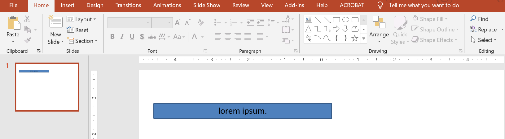
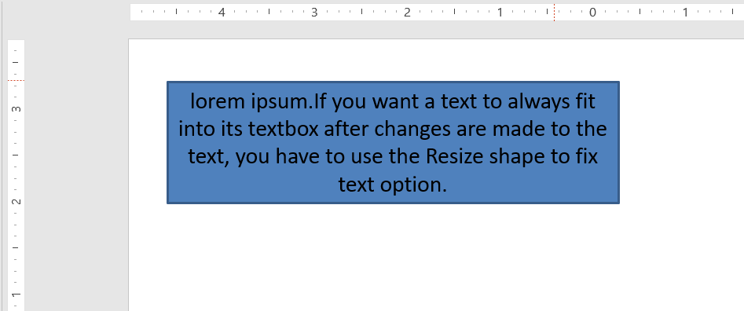

## **Εισαγωγή**

Από προεπιλογή, όταν προσθέτετε ένα πλαίσιο κειμένου, το Microsoft PowerPoint χρησιμοποιεί τη ρύθμιση **Resize shape to fit text** για το πλαίσιο κειμένου—αλλάζει αυτόματα το μέγεθός του ώστε το κείμενό του να ταιριάζει πάντα.



* Όταν το κείμενο στο πλαίσιο κειμένου μεγαλώνει ή γίνεται μεγαλύτερο, το PowerPoint αυτόματα αυξάνει το μέγεθος του πλαισίου—αυξάνει το ύψος του—ώστε να μπορεί να χωρέσει περισσότερο κείμενο.
* Όταν το κείμενο στο πλαίσιο κειμένου μικραίνει ή γίνεται μικρότερο, το PowerPoint αυτόματα μειώνει το πλαίσιο—μειώνει το ύψος του—για να αφαιρέσει το περιττό κενό.

Στο PowerPoint, αυτά είναι τα 4 σημαντικά παραμέτρους ή επιλογές που ελέγχουν τη συμπεριφορά **autofit** για ένα πλαίσιο κειμένου:

* **Do not Autofit**
* **Shrink text on overflow**
* **Resize shape to fit text**
* **Wrap text in shape.**


Το Aspose.Slides for Python via Java παρέχει παρόμοιες επιλογές—μερικές ιδιότητες κάτω από την κλάση [TextFrameFormat](https://reference.aspose.com/slides/el/python-java/aspose.slides/textframeformat/)—που σάς επιτρέπει να ελέγξετε τη συμπεριφορά autofit για πλαίσια κειμένου σε παρουσιάσεις.

## **Αλλαγή μεγέθους σχήματος ώστε το κείμενο να ταιριάζει**

Αν θέλετε το κείμενο σε ένα πλαίσιο να ταιριάζει πάντα σε αυτό μετά από αλλαγές, πρέπει να χρησιμοποιήσετε την επιλογή **Resize shape to fit text**. Για να ορίσετε αυτή τη ρύθμιση, χρησιμοποιήστε τη μέθοδο [setAutofitType](https://reference.aspose.com/slides/el/python-java/aspose.slides/textframeformat/#setAutofitType) (από την κλάση [TextFrameFormat](https://reference.aspose.com/slides/el/python-java/aspose.slides/textframeformat/)) με το [Shape](https://reference.aspose.com/slides/el/python-java/aspose.slides/textautofittype/#Shape).



Αυτός ο κώδικας Python δείχνει πώς να ορίσετε ότι το κείμενο πρέπει πάντα να ταιριάζει στο πλαίσιο του σε μια παρουσίαση PowerPoint:

```python
import jpype
import asposeslides

if not jpype.isJVMStarted():
    jpype.startJVM()

from asposeslides.api import Presentation, ShapeType, Portion, FillType, TextAutofitType, SaveFormat
from java.awt import Color

presentation = Presentation()
try:
    slide = presentation.getSlides().get_Item(0)
    auto_shape = slide.getShapes().addAutoShape(ShapeType.Rectangle, 30, 30, 350, 100)

    portion = Portion("lorem ipsum...")
    portion.getPortionFormat().getFillFormat().getSolidFillColor().setColor(Color.BLACK)
    portion.getPortionFormat().getFillFormat().setFillType(FillType.Solid)
    auto_shape.getTextFrame().getParagraphs().get_Item(0).getPortions().add(portion)

    text_frame_format = auto_shape.getTextFrame().getTextFrameFormat()
    text_frame_format.setAutofitType(TextAutofitType.Shape)

    presentation.save("Output-presentation.pptx", SaveFormat.Pptx)
finally:
    presentation.dispose()
```

Αν το κείμενο γίνει μεγαλύτερο ή πιο εκτενές, το πλαίσιο κειμένου θα αλλάξει αυτόματα το μέγεθός του (αύξηση του ύψους) ώστε όλο το κείμενο να ταιριάζει. Αν το κείμενο μικρύνει, συμβαίνει το αντίστροφο.

## **Do Not Autofit**

Αν θέλετε ένα πλαίσιο κειμένου ή σχήμα να διατηρεί τις διαστάσεις του ανεξάρτητα από τις αλλαγές του κειμένου που περιέχει, πρέπει να χρησιμοποιήσετε την επιλογή **Do not Autofit**. Για να ορίσετε αυτή τη ρύθμιση, χρησιμοποιήστε τη μέθοδο [setAutofitType](https://reference.aspose.com/slides/el/python-java/aspose.slides/textframeformat/#setAutofitType) (από την κλάση [TextFrameFormat](https://reference.aspose.com/slides/el/python-java/aspose.slides/textframeformat/)) με το [None](https://reference.aspose.com/slides/el/python-java/aspose.slides/textautofittype/#None).


Αυτός ο κώδικας Python δείχνει πώς να ορίσετε ότι ένα πλαίσιο κειμένου πρέπει πάντα να διατηρεί τις διαστάσεις του σε μια παρουσίαση PowerPoint:

```python
import jpype
import asposeslides

if not jpype.isJVMStarted():
    jpype.startJVM()

from asposeslides.api import Presentation, ShapeType, Portion, FillType, TextAutofitType, SaveFormat
from java.awt import Color

presentation = Presentation()
try:
    slide = presentation.getSlides().get_Item(0)
    auto_shape = slide.getShapes().addAutoShape(ShapeType.Rectangle, 30, 30, 350, 100)

    portion = Portion("lorem ipsum...")
    portion.getPortionFormat().getFillFormat().getSolidFillColor().setColor(Color.BLACK)
    portion.getPortionFormat().getFillFormat().setFillType(FillType.Solid)
    auto_shape.getTextFrame().getParagraphs().get_Item(0).getPortions().add(portion)

    text_frame_format = auto_shape.getTextFrame().getTextFrameFormat()
    text_frame_format.setAutofitType(TextAutofitType.None_)

    presentation.save("Output-presentation.pptx", SaveFormat.Pptx)
finally:
    presentation.dispose()
```

Όταν το κείμενο γίνει πολύ μεγάλο για το πλαίσιό του, ξεχειλίζει.

## **Shrink Text on Overflow**

Αν το κείμενο γίνει πολύ μεγάλο για το πλαίσιο του, μπορείτε να χρησιμοποιήσετε την επιλογή **Shrink text on overflow** για να ορίσετε ότι το μέγεθος και το διάστιχο του κειμένου πρέπει να μειωθούν ώστε να ταιριάζει στο πλαίσιο. Για να ορίσετε αυτή τη ρύθμιση, χρησιμοποιήστε τη μέθοδο [setAutofitType](https://reference.aspose.com/slides/el/python-java/aspose.slides/textframeformat/#setAutofitType) (από την κλάση [TextFrameFormat](https://reference.aspose.com/slides/el/python-java/aspose.slides/textframeformat/)) με το [Normal](https://reference.aspose.com/slides/el/python-java/aspose.slides/textautofittype/#Normal).


Αυτός ο κώδικας Python δείχνει πώς να ορίσετε ότι το κείμενο πρέπει να σμικρύνει κατά την υπέρβαση σε μια παρουσίαση PowerPoint:

```python
import jpype
import asposeslides

if not jpype.isJVMStarted():
    jpype.startJVM()

from asposeslides.api import Presentation, ShapeType, Portion, FillType, TextAutofitType, SaveFormat
from java.awt import Color

presentation = Presentation()
try:
    slide = presentation.getSlides().get_Item(0)
    auto_shape = slide.getShapes().addAutoShape(ShapeType.Rectangle, 30, 30, 350, 100)

    portion = Portion("lorem ipsum...")
    portion.getPortionFormat().getFillFormat().getSolidFillColor().setColor(Color.BLACK)
    portion.getPortionFormat().getFillFormat().setFillType(FillType.Solid)
    auto_shape.getTextFrame().getParagraphs().get_Item(0).getPortions().add(portion)

    text_frame_format = auto_shape.getTextFrame().getTextFrameFormat()
    text_frame_format.setAutofitType(TextAutofitType.Normal)

    presentation.save("Output-presentation.pptx", SaveFormat.Pptx)
finally:
    presentation.dispose()
```

{}
Όταν χρησιμοποιείται η επιλογή **Shrink text on overflow**, η ρύθμιση εφαρμόζεται μόνο όταν το κείμενο γίνει πολύ μεγάλο για το πλαίσιό του. 
{}

## **Wrap Text**

Αν θέλετε το κείμενο σε ένα σχήμα να αναδιπλώνεται μέσα στο σχήμα όταν το κείμενο υπερβαίνει το όριο του σχήματος (μόνο στο πλάτος), πρέπει να χρησιμοποιήσετε την παράμετρο **Wrap text in shape**. Για να ορίσετε αυτή τη ρύθμιση, πρέπει να χρησιμοποιήσετε τη μέθοδο [setWrapText](https://reference.aspose.com/slides/el/python-java/aspose.slides/textframeformat/#setWrapText) (από την κλάση [TextFrameFormat](https://reference.aspose.com/slides/el/python-java/aspose.slides/textframeformat/)) με το [NullableBool.True_](https://reference.aspose.com/slides/el/python-java/aspose.slides/nullablebool/#True).

Αυτός ο κώδικας Python δείχνει πώς να χρησιμοποιήσετε τη ρύθμιση Wrap Text σε μια παρουσίαση PowerPoint:

```python
import jpype
import asposeslides

if not jpype.isJVMStarted():
    jpype.startJVM()

from asposeslides.api import Presentation, ShapeType, Portion, FillType, NullableBool, SaveFormat
from java.awt import Color

presentation = Presentation()
try:
    slide = presentation.getSlides().get_Item(0)
    auto_shape = slide.getShapes().addAutoShape(ShapeType.Rectangle, 30, 30, 350, 100)

    portion = Portion("lorem ipsum...")
    portion.getPortionFormat().getFillFormat().getSolidFillColor().setColor(Color.BLACK)
    portion.getPortionFormat().getFillFormat().setFillType(FillType.Solid)
    auto_shape.getTextFrame().getParagraphs().get_Item(0).getPortions().add(portion)

    text_frame_format = auto_shape.getTextFrame().getTextFrameFormat()
    text_frame_format.setWrapText(NullableBool.True_)

    presentation.save("Output-presentation.pptx", SaveFormat.Pptx)
finally:
    presentation.dispose()
```

{} 
Αν χρησιμοποιήσετε τη μέθοδο [setWrapText](https://reference.aspose.com/slides/el/python-java/aspose.slides/textframeformat/#setWrapText) με το [NullableBool.False](https://reference.aspose.com/slides/el/python-java/aspose.slides/nullablebool/#False) για ένα σχήμα, όταν το κείμενο μέσα στο σχήμα γίνει πιο μακρύ από το πλάτος του σχήματος, το κείμενο θα επεκτείνεται εκτός των ορίων του σχήματος σε μία γραμμή.
{}

## **Συχνές ερωτήσεις**

**Επηρεάζουν τα εσωτερικά περιθώρια του πλαισίου κειμένου το AutoFit;**

Ναι. Τα padding (εσωτερικά περιθώρια) μειώνουν την διαθέσιμη περιοχή για κείμενο, έτσι το AutoFit ενεργοποιείται νωρίτερα—σμικρύνοντας τη γραμματοσειρά ή αλλάζοντας το μέγεθος του σχήματος νωρίτερα. Ελέγξτε και προσαρμόστε τα περιθώρια πριν ρυθμίσετε το AutoFit.

**Πώς αλληλεπιδρά το AutoFit με τις χειροκίνητες και απαλές αλλαγές γραμμής;**

Οι επιβεβλημένες αλλαγές γραμμής παραμένουν, και το AutoFit προσαρμόζει το μέγεθος της γραμματοσειράς και το διάστιχο γύρω από αυτές. Η αφαίρεση περιττών αλλαγών συχνά μειώνει το πόσο εντατικά πρέπει το AutoFit να σμικρύνει το κείμενο.

**Επηρεάζει η αλλαγή της γραμματοσειράς θέματος ή η ενεργοποίηση υποκατάστασης γραμματοσειράς τα αποτελέσματα του AutoFit;**

Ναι. Η αντικατάσταση μιας γραμματοσειράς με άλλη που έχει διαφορετικά μετρικά γλυφών αλλάζει το πλάτος/ύψος του κειμένου, κάτι που μπορεί να τροποποιήσει το τελικό μέγεθος της γραμματοσειράς και τη διαίρεση σε γραμμές. Μετά από κάθε αλλαγή ή αντικατάσταση γραμματοσειράς, ελέγξτε ξανά τις διαφάνειες.