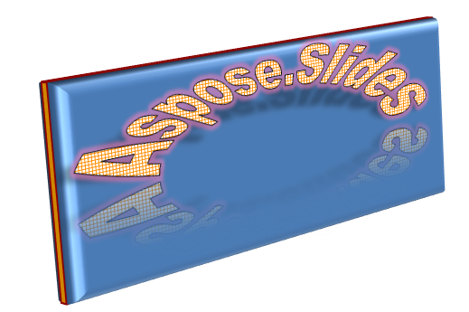

## **Επισκόπηση**

Τα εφέ WordArt σάς επιτρέπουν να προσθέσετε οπτικά ελκυστικό, στυλιζαρισμένο κείμενο στις παρουσιάσεις PowerPoint. Με το Aspose.Slides, προγραμματιστές μπορούν προγραμματιστικά να δημιουργήσουν, προσαρμόσουν και διαχειριστούν WordArt όπως στο Microsoft PowerPoint—χωρίς να χρειάζεται εγκατεστημένο Office. Αυτό το άρθρο παρέχει μια επισκόπηση της εργασίας με WordArt, συμπεριλαμβανομένου του πώς να εφαρμόζετε μετασχηματισμούς κειμένου, στιλ γεμίσματος, περιγράμματα, σκιάσεις και άλλες επιλογές μορφοποίησης ώστε το περιεχόμενο της παρουσίασής σας να είναι πιο εκφραστικό και καθηλωτικό. Το WordArt σας επιτρέπει να αντιμετωπίζετε το κείμενο ως γραφικό αντικείμενο. Αποτελείται από εφέ ή ειδικές τροποποιήσεις που εφαρμόζονται στο κείμενο για να το κάνουν πιο ελκυστικό ή αξιοσημείωτο.

## **Δημιουργία Απλού Προτύπου WordArt και Εφαρμογή του σε Κείμενο**

**Χρήση Aspose.Slides**

Πρώτα, δημιουργούμε απλό κείμενο με αυτόν τον κώδικα Python:

```python
import jpype
import asposeslides

if not jpype.isJVMStarted():
    jpype.startJVM()

from asposeslides.api import Presentation, ShapeType

presentation = Presentation()
try:
    slide = presentation.getSlides().get_Item(0)
    auto_shape = slide.getShapes().addAutoShape(ShapeType.Rectangle, 200, 200, 400, 200)
    text_frame = auto_shape.getTextFrame()

    portion = text_frame.getParagraphs().get_Item(0).getPortions().get_Item(0)
    portion.setText("Aspose.Slides")
finally:
    presentation.dispose()
```
Στη συνέχεια, αυξάνουμε το μέγεθος γραμματοσειράς ώστε το εφέ να είναι πιο εμφανές:

```python
import jpype
import asposeslides

if not jpype.isJVMStarted():
    jpype.startJVM()

from asposeslides.api import FontData, Presentation, ShapeType

presentation = Presentation()
try:
    slide = presentation.getSlides().get_Item(0)
    auto_shape = slide.getShapes().addAutoShape(ShapeType.Rectangle, 200, 200, 400, 200)
    text_frame = auto_shape.getTextFrame()
    portion = text_frame.getParagraphs().get_Item(0).getPortions().get_Item(0)
    portion.setText("Aspose.Slides")

    font_data = FontData("Arial Black")
    portion_format = portion.getPortionFormat()
    portion_format.setLatinFont(font_data)
    portion_format.setFontHeight(36)
finally:
    presentation.dispose()
```

**Χρήση Microsoft PowerPoint**

Μεταβείτε στο μενού εφέ WordArt στο Microsoft PowerPoint:


Από το δεξιό μενού, μπορείτε να επιλέξετε ένα προεπιλεγμένο εφέ WordArt. Από το αριστερό μενού, μπορείτε να ορίσετε τις ρυθμίσεις για νέο WordArt.

Αυτά είναι μερικά από τα διαθέσιμα παραμέτρους ή επιλογές:


**Χρήση Aspose.Slides**

Εδώ, εφαρμόζουμε το [PatternStyle.SmallGrid](https://reference.aspose.com/slides/el/python-java/aspose.slides/patternstyle/#SmallGrid) γέμισμα μοτίβου στο κείμενο και προσθέτουμε μαύρο περίγραμμα κειμένου με τον παρακάτω κώδικα:

```python
import jpype
import asposeslides

if not jpype.isJVMStarted():
    jpype.startJVM()

from asposeslides.api import FillType, PatternStyle, Presentation, ShapeType
from java.awt import Color

presentation = Presentation()
try:
    slide = presentation.getSlides().get_Item(0)
    auto_shape = slide.getShapes().addAutoShape(ShapeType.Rectangle, 200, 200, 400, 200)
    text_frame = auto_shape.getTextFrame()
    portion = text_frame.getParagraphs().get_Item(0).getPortions().get_Item(0)
    portion.setText("Aspose.Slides")

    portion_format = portion.getPortionFormat()
    portion_format.getFillFormat().setFillType(FillType.Pattern)
    pattern_format = portion_format.getFillFormat().getPatternFormat()
    pattern_format.getForeColor().setColor(Color.ORANGE)
    pattern_format.getBackColor().setColor(Color.WHITE)
    pattern_format.setPatternStyle(PatternStyle.SmallGrid)

    line_format = portion_format.getLineFormat()
    line_format.getFillFormat().setFillType(FillType.Solid)
    line_format.getFillFormat().getSolidFillColor().setColor(Color.BLACK)
finally:
    presentation.dispose()
```

Το αποτέλεσμα:


## **Εφαρμογή Άλλων Εφέ WordArt**

**Χρήση Microsoft PowerPoint**

Από τη διεπαφή του προγράμματος, μπορείτε να εφαρμόσετε αυτά τα εφέ σε κείμενο, μπλοκάκι κειμένου, σχήμα ή παρόμοιο στοιχείο:


Για παράδειγμα, τα εφέ Σκιά, Αντανάκλαση και Λάμψη μπορούν να εφαρμοστούν σε κείμενο· τα εφέ 3D Μορφή και 3D Περιστροφή μπορούν να εφαρμοστούν σε μπλοκάκι κειμένου· το εφέ Μαλακές Άκρες μπορεί να εφαρμοστεί σε σχήμα (παράγεται εφέ ακόμη και όταν δεν έχει οριστεί εφέ 3D Μορφή).

### **Εφαρμογή Εφέ Σκιάς**

Ο παρακάτω κώδικας Python εφαρμόζει ένα εφέ σκιάς μόνο στο κείμενο:

```python
import jpype
import asposeslides

if not jpype.isJVMStarted():
    jpype.startJVM()

from asposeslides.api import ColorTransformOperation, Presentation, ShapeType
from java.awt import Color

presentation = Presentation()
try:
    slide = presentation.getSlides().get_Item(0)
    auto_shape = slide.getShapes().addAutoShape(ShapeType.Rectangle, 200, 200, 400, 200)
    text_frame = auto_shape.getTextFrame()
    portion = text_frame.getParagraphs().get_Item(0).getPortions().get_Item(0)
    portion.setText("Aspose.Slides")

    portion_format = portion.getPortionFormat()
    portion_format.getEffectFormat().enableOuterShadowEffect()
    outer_shadow = portion_format.getEffectFormat().getOuterShadowEffect()
    outer_shadow.getShadowColor().setColor(Color.BLACK)
    outer_shadow.setScaleHorizontal(100)
    outer_shadow.setScaleVertical(65)
    outer_shadow.setBlurRadius(4.73)
    outer_shadow.setDirection(230)
    outer_shadow.setDistance(2)
    outer_shadow.setSkewHorizontal(30)
    outer_shadow.setSkewVertical(0)
    outer_shadow.getShadowColor().getColorTransform().add(ColorTransformOperation.SetAlpha, 0.32)
finally:
    presentation.dispose()
```

Το API Aspose.Slides υποστηρίζει τρεις τύπους σκιών: [OuterShadow](https://reference.aspose.com/slides/el/python-java/aspose.slides/outershadow/), [InnerShadow](https://reference.aspose.com/slides/el/python-java/aspose.slides/innershadow/), και [PresetShadow](https://reference.aspose.com/slides/el/python-java/aspose.slides/presetshadow/).

Με το [PresetShadow](https://reference.aspose.com/slides/el/python-java/aspose.slides/presetshadow/), μπορείτε να εφαρμόσετε σκιά σε κείμενο χρησιμοποιώντας προρυθμισμένες τιμές.

**Χρήση Microsoft PowerPoint**

Στο PowerPoint, μπορείτε να χρησιμοποιήσετε έναν τύπο σκιάς. Δείτε ένα παράδειγμα:


**Χρήση Aspose.Slides**

Το Aspose.Slides επιτρέπει στην πραγματικότητα την ταυτόχρονη εφαρμογή δύο τύπων σκιών: [InnerShadow](https://reference.aspose.com/slides/el/python-java/aspose.slides/innershadow/) και [PresetShadow](https://reference.aspose.com/slides/el/python-java/aspose.slides/presetshadow/).

**Σημειώσεις:**

- Όταν χρησιμοποιούνται ταυτόχρονα [OuterShadow](https://reference.aspose.com/slides/el/python-java/aspose.slides/outershadow/) και [PresetShadow](https://reference.aspose.com/slides/el/python-java/aspose.slides/presetshadow/), εφαρμόζεται μόνο το εφέ [OuterShadow](https://reference.aspose.com/slides/el/python-java/aspose.slides/outershadow/).
- Αν χρησιμοποιηθούν ταυτόχρονα [OuterShadow](https://reference.aspose.com/slides/el/python-java/aspose.slides/outershadow/) και [InnerShadow](https://reference.aspose.com/slides/el/python-java/aspose.slides/innershadow/), το αποτέλεσμα ή το εφαρμόζόμενο εφέ εξαρτάται από την έκδοση του PowerPoint. Για παράδειγμα, στο PowerPoint 2013, το εφέ διπλασιάζεται. Στο PowerPoint 2007, εφαρμόζεται το εφέ [OuterShadow](https://reference.aspose.com/slides/el/python-java/aspose.slides/outershadow/).

### **Εφαρμογή Αντανάκλασης σε Κείμενο**

Προσθέτουμε αντανάκλαση στο κείμενο μέσω αυτού του δείγματος κώδικα Python μέσω Java:

```python
import jpype
import asposeslides

if not jpype.isJVMStarted():
    jpype.startJVM()

from asposeslides.api import Presentation, RectangleAlignment, ShapeType

presentation = Presentation()
try:
    slide = presentation.getSlides().get_Item(0)
    auto_shape = slide.getShapes().addAutoShape(ShapeType.Rectangle, 200, 200, 400, 200)
    text_frame = auto_shape.getTextFrame()
    portion = text_frame.getParagraphs().get_Item(0).getPortions().get_Item(0)
    portion.setText("Aspose.Slides")

    portion_format = portion.getPortionFormat()
    portion_format.getEffectFormat().enableReflectionEffect()
    reflection = portion_format.getEffectFormat().getReflectionEffect()
    reflection.setBlurRadius(0.5)
    reflection.setDistance(4.72)
    reflection.setStartPosAlpha(0)
    reflection.setEndPosAlpha(60)
    reflection.setDirection(90)
    reflection.setScaleHorizontal(100)
    reflection.setScaleVertical(-100)
    reflection.setStartReflectionOpacity(60)
    reflection.setEndReflectionOpacity(0.9)
    reflection.setRectangleAlign(RectangleAlignment.BottomLeft)
finally:
    presentation.dispose()
```

### **Εφαρμογή Εφέ Λάμψης σε Κείμενο**

Εφαρμόζουμε το εφέ λάμψης στο κείμενο ώστε να λάμπει ή να ξεχωρίζει με τον ακόλουθο κώδικα:

```python
import jpype
import asposeslides

if not jpype.isJVMStarted():
    jpype.startJVM()

from asposeslides.api import ColorTransformOperation, Presentation, ShapeType

presentation = Presentation()
try:
    slide = presentation.getSlides().get_Item(0)
    auto_shape = slide.getShapes().addAutoShape(ShapeType.Rectangle, 200, 200, 400, 200)
    text_frame = auto_shape.getTextFrame()
    portion = text_frame.getParagraphs().get_Item(0).getPortions().get_Item(0)
    portion.setText("Aspose.Slides")

    portion_format = portion.getPortionFormat()
    portion_format.getEffectFormat().enableGlowEffect()
    glow = portion_format.getEffectFormat().getGlowEffect()
    glow.getColor().setR(jpype.JByte(-1))
    glow.getColor().getColorTransform().add(ColorTransformOperation.SetAlpha, 0.54)
    glow.setRadius(7)
finally:
    presentation.dispose()
```

Το αποτέλεσμα της λειτουργίας:


{}

Μπορείτε να αλλάξετε τις παραμέτρους για σκιά, αντανάκλαση και λάμψη. Οι ιδιότητες των εφέ ορίζονται χωριστά για κάθε τμήμα του κειμένου.

{}

### **Χρήση Μετασχηματισμών στο WordArt**

Χρησιμοποιήστε [TextFrameFormat.setTransform](https://reference.aspose.com/slides/el/python-java/aspose.slides/textframeformat/#setTransform) για να μετατρέψετε ολόκληρο το μπλοκάκι κειμένου:

```python
import jpype
import asposeslides

if not jpype.isJVMStarted():
    jpype.startJVM()

from asposeslides.api import Presentation, ShapeType, TextShapeType

presentation = Presentation()
try:
    slide = presentation.getSlides().get_Item(0)
    auto_shape = slide.getShapes().addAutoShape(ShapeType.Rectangle, 200, 200, 400, 200)
    text_frame = auto_shape.getTextFrame()
    text_frame.setText("Aspose.Slides")

    text_frame.getTextFrameFormat().setTransform(TextShapeType.ArchUpPour)
finally:
    presentation.dispose()
```

Το αποτέλεσμα:


{}

Τanto το Microsoft PowerPoint όσο και το Aspose.Slides για Python μέσω Java παρέχουν έναν ορισμένο αριθμό προεπιλεγμένων τύπων μετασχηματισμού.

{}

**Χρήση PowerPoint**

Για πρόσβαση στους προεπιλεγμένους τύπους μετασχηματισμού, μεταβείτε σε: **Format** -> **TextEffect** -> **Transform**

**Χρήση Aspose.Slides**

Για να επιλέξετε τύπο μετασχηματισμού, χρησιμοποιήστε την απαρίθμηση [TextShapeType](https://reference.aspose.com/slides/el/python-java/aspose.slides/textshapetype/).

### **Εφαρμογή 3D Εφέ σε Κείμενο και Σχήματα**

Εφαρμόζουμε ένα 3D εφέ σε σχήμα κειμένου με αυτό το δείγμα κώδικα:

```python
import jpype
import asposeslides

if not jpype.isJVMStarted():
    jpype.startJVM()

from asposeslides.api import BevelPresetType, CameraPresetType, LightRigPresetType, LightingDirection, MaterialPresetType, Presentation, ShapeType
from java.awt import Color

presentation = Presentation()
try:
    slide = presentation.getSlides().get_Item(0)
    auto_shape = slide.getShapes().addAutoShape(ShapeType.Rectangle, 200, 200, 400, 200)
    auto_shape.getTextFrame().setText("Aspose.Slides")

    three_d_format = auto_shape.getThreeDFormat()
    three_d_format.getBevelBottom().setBevelType(BevelPresetType.Circle)
    three_d_format.getBevelBottom().setHeight(10.5)
    three_d_format.getBevelBottom().setWidth(10.5)

    three_d_format.getBevelTop().setBevelType(BevelPresetType.Circle)
    three_d_format.getBevelTop().setHeight(12.5)
    three_d_format.getBevelTop().setWidth(11)

    three_d_format.getExtrusionColor().setColor(Color.ORANGE)
    three_d_format.setExtrusionHeight(6)

    three_d_format.getContourColor().setColor(Color.RED)
    three_d_format.setContourWidth(1.5)

    three_d_format.setDepth(3)

    three_d_format.setMaterial(MaterialPresetType.Plastic)

    three_d_format.getLightRig().setDirection(LightingDirection.Top)
    three_d_format.getLightRig().setLightType(LightRigPresetType.Balanced)
    three_d_format.getLightRig().setRotation(0, 0, 40)

    three_d_format.getCamera().setCameraType(CameraPresetType.PerspectiveContrastingRightFacing)
finally:
    presentation.dispose()
```

Το προκύπτον κείμενο και το σχήμα του:



Εφαρμόζουμε 3D εφέ στο κείμενο με αυτόν τον κώδικα Python:

```python
import jpype
import asposeslides

if not jpype.isJVMStarted():
    jpype.startJVM()

from asposeslides.api import BevelPresetType, CameraPresetType, LightRigPresetType, LightingDirection, MaterialPresetType, Presentation, ShapeType
from java.awt import Color

presentation = Presentation()
try:
    slide = presentation.getSlides().get_Item(0)
    auto_shape = slide.getShapes().addAutoShape(ShapeType.Rectangle, 200, 200, 400, 200)
    text_frame = auto_shape.getTextFrame()
    text_frame.setText("Aspose.Slides")

    three_d_format = text_frame.getTextFrameFormat().getThreeDFormat()
    three_d_format.getBevelBottom().setBevelType(BevelPresetType.Circle)
    three_d_format.getBevelBottom().setHeight(3.5)
    three_d_format.getBevelBottom().setWidth(3.5)

    three_d_format.getBevelTop().setBevelType(BevelPresetType.Circle)
    three_d_format.getBevelTop().setHeight(4)
    three_d_format.getBevelTop().setWidth(4)

    three_d_format.getExtrusionColor().setColor(Color.ORANGE)
    three_d_format.setExtrusionHeight(6)

    three_d_format.getContourColor().setColor(Color.RED)
    three_d_format.setContourWidth(1.5)

    three_d_format.setDepth(3)

    three_d_format.setMaterial(MaterialPresetType.Plastic)

    three_d_format.getLightRig().setDirection(LightingDirection.Top)
    three_d_format.getLightRig().setLightType(LightRigPresetType.Balanced)
    three_d_format.getLightRig().setRotation(0, 0, 40)

    three_d_format.getCamera().setCameraType(CameraPresetType.PerspectiveContrastingRightFacing)
finally:
    presentation.dispose()
```

Το αποτέλεσμα της λειτουργίας:


{}

Η εφαρμογή 3D εφέ σε κείμενο ή τα σχήματά του και οι αλληλεπιδράσεις μεταξύ των εφέ βασίζονται σε ορισμένους κανόνες.

Θεωρήστε μια σκηνή για το κείμενο και το σχήμα που περιέχει το κείμενο. Το 3D εφέ περιλαμβάνει μια αναπαράσταση 3D αντικειμένου και τη σκηνή στην οποία το αντικείμενο τοποθετείται.

- Όταν η σκηνή έχει οριστεί τόσο για το σχήμα όσο και για το κείμενο, η σκηνή του σχήματος έχει προτεραιότητα· η σκηνή του κειμένου αγνοείται.
- Όταν το σχήμα δεν έχει τη δική του σκηνή αλλά έχει 3D αναπαράσταση, χρησιμοποιείται η σκηνή του κειμένου.
- Σε αντίθετη περίπτωση—όταν το σχήμα αρχικά δεν έχει 3D εφέ—το σχήμα παραμένει επίπεδο και το 3D εφέ εφαρμόζεται μόνο στο κείμενο.

Αυτοί οι κανόνες σχετίζονται με τις μεθόδους [ThreeDFormat.getLightRig](https://reference.aspose.com/slides/el/python-java/aspose.slides/threedformat/#getLightRig) και [ThreeDFormat.getCamera](https://reference.aspose.com/slides/el/python-java/aspose.slides/threedformat/#getCamera).

{}

## **Εφαρμογή Εφέ Εξωτερικής Σκιάς σε Κείμενο**

Το Aspose.Slides για Python μέσω Java παρέχει τις κλάσεις [OuterShadow](https://reference.aspose.com/slides/el/python-java/aspose.slides/outershadow/) και [InnerShadow](https://reference.aspose.com/slides/el/python-java/aspose.slides/innershadow/) που επιτρέπουν την εφαρμογή εφέ σκιάς σε κείμενο σε ένα [TextFrame](https://reference.aspose.com/slides/el/python-java/aspose.slides/textframe/). Ακολουθήστε τα παρακάτω βήματα:

1. Δημιουργήστε ένα στιγμιότυπο της κλάσης [Presentation](https://reference.aspose.com/slides/el/python-java/aspose.slides/presentation/).
2. Αποκτήστε την αναφορά σε μια διαφάνεια χρησιμοποιώντας το δείκτη της.
3. Προσθέστε ένα ορθογώνιο σχήμα στη διαφάνεια.
4. Πρόσβαση στο πλαίσιο κειμένου που σχετίζεται με το σχήμα.
5. Απενεργοποιήστε το γέμισμα του σχήματος.
6. Ενεργοποιήστε το εφέ εξωτερικής σκιάς.
7. Ορίστε την ακτίνα θολώματος της σκιάς.
8. Ορίστε την κατεύθυνση της σκιάς.
9. Ορίστε την απόσταση της σκιάς.
10. Στοίχνετε τη σκιά στην πάνω αριστερή γωνία.
11. Ορίστε το χρώμα της σκιάς σε μαύρο.
12. Αποθηκεύστε την παρουσίαση ως αρχείο [PPTX](https://docs.fileformat.com/presentation/pptx/).

Αυτός ο κώδικας δείγμα σε Python μέσω Java—μια υλοποίηση των παραπάνω βημάτων—δείχνει πώς να εφαρμόσετε το εφέ εξωτερικής σκιάς σε κείμενο:

```python
import jpype
import asposeslides

if not jpype.isJVMStarted():
    jpype.startJVM()

from asposeslides.api import FillType, Presentation, PresetColor, RectangleAlignment, SaveFormat, ShapeType

presentation = Presentation()
try:
    # Λάβετε την αναφορά της διαφάνειας
    slide = presentation.getSlides().get_Item(0)

    # Προσθέστε ένα AutoShape τύπου Rectangle
    auto_shape = slide.getShapes().addAutoShape(ShapeType.Rectangle, 150, 75, 150, 50)

    # Προσθέστε TextFrame στο Rectangle
    auto_shape.addTextFrame("Aspose TextBox")

    # Απενεργοποιήστε το γέμισμα του σχήματος σε περίπτωση που θέλουμε τη σκιά του κειμένου
    auto_shape.getFillFormat().setFillType(FillType.NoFill)

    # Προσθέστε εξωτερική σκιά και ορίστε όλες τις απαραίτητες παραμέτρους
    auto_shape.getEffectFormat().enableOuterShadowEffect()
    shadow = auto_shape.getEffectFormat().getOuterShadowEffect()
    shadow.setBlurRadius(4.0)
    shadow.setDirection(45)
    shadow.setDistance(3)
    shadow.setRectangleAlign(RectangleAlignment.TopLeft)
    shadow.getShadowColor().setPresetColor(PresetColor.Black)

    # Αποθηκεύστε την παρουσίαση στο δίσκο
    presentation.save("pres_out.pptx", SaveFormat.Pptx)
finally:
    presentation.dispose()
```

## **Εφαρμογή Εφέ Εσωτερικής Σκιάς σε Σχήματα**

Ακολουθήστε τα βήματα:

1. Δημιουργήστε ένα στιγμιότυπο της κλάσης [Presentation](https://reference.aspose.com/slides/el/python-java/aspose.slides/presentation/).
2. Λάβετε μια αναφορά στη διαφάνεια.
3. Προσθέστε ένα ορθογώνιο σχήμα.
4. Ενεργοποιήστε το εφέ εσωτερικής σκιάς.
5. Ορίστε όλες τις απαραίτητες παραμέτρους.
6. Ορίστε τον τύπο χρώματος σκιάς για χρήση χρώματος θέματος.
7. Ορίστε το χρώμα θέματος.
8. Αποθηκεύστε την παρουσίαση ως αρχείο [PPTX](https://docs.fileformat.com/presentation/pptx/).

Αυτός ο κώδικας δείγμα (βασισμένος στα παραπάνω βήματα) σας δείχνει πώς να εφαρμόσετε το εφέ εσωτερικής σκιάς στο κείμενο σε σχήμα σε Python μέσω Java:

```python
import jpype
import asposeslides

if not jpype.isJVMStarted():
    jpype.startJVM()

from asposeslides.api import ColorType, FillType, Presentation, SaveFormat, SchemeColor, ShapeType

presentation = Presentation()
try:
    # Λάβετε την αναφορά της διαφάνειας
    slide = presentation.getSlides().get_Item(0)

    # Προσθέστε ένα AutoShape τύπου Rectangle
    auto_shape = slide.getShapes().addAutoShape(ShapeType.Rectangle, 150, 75, 400, 300)
    auto_shape.getFillFormat().setFillType(FillType.NoFill)

    # Προσθέστε TextFrame στο Rectangle
    auto_shape.addTextFrame("Aspose TextBox")
    portion = auto_shape.getTextFrame().getParagraphs().get_Item(0).getPortions().get_Item(0)
    portion_format = portion.getPortionFormat()
    portion_format.setFontHeight(50)

    # Ενεργοποιήστε το InnerShadowEffect
    effect_format = portion_format.getEffectFormat()
    effect_format.enableInnerShadowEffect()

    # Ορίστε όλες τις απαραίτητες παραμέτρους
    inner_shadow = effect_format.getInnerShadowEffect()
    inner_shadow.setBlurRadius(8.0)
    inner_shadow.setDirection(90.0)
    inner_shadow.setDistance(6.0)
    inner_shadow.getShadowColor().setB(jpype.JByte(-67))

    # Ορίστε το ColorType ως Scheme
    inner_shadow.getShadowColor().setColorType(ColorType.Scheme)

    # Ορίστε το Scheme Color
    inner_shadow.getShadowColor().setSchemeColor(SchemeColor.Accent1)

    # Αποθηκεύστε την παρουσίαση
    presentation.save("WordArt_out.pptx", SaveFormat.Pptx)
finally:
    presentation.dispose()
```

## **Συχνές Ερωτήσεις**

**Μπορώ να χρησιμοποιήσω εφέ WordArt με διαφορετικές γραμματοσειρές ή συστήματα γραφής (π.χ. Αραβικά, Κινέζικα);**

Ναι, το Aspose.Slides υποστηρίζει Unicode και λειτουργεί με όλες τις κύριες γραμματοσειρές και συστήματα γραφής. Τα εφέ WordArt όπως σκιά, γέμισμα και περίγραμμα μπορούν να εφαρμοστούν ανεξαρτήτως γλώσσας, αν και η διαθεσιμότητα γραμματοσειρών και η απόδοση μπορεί να εξαρτώνται από τις γραμματοσειρές του συστήματος.

**Μπορώ να εφαρμόσω εφέ WordArt σε στοιχεία του master διαφάνειας;**

Ναι, μπορείτε να εφαρμόσετε εφέ WordArt σε σχήματα στις master διαφάνειες, συμπεριλαμβανομένων των εικονοτύπων τίτλου, υποσέλιδων ή κειμένου φόντου. Οι αλλαγές που γίνονται στη διάταξη του master αντικατοπτρίζονται σε όλες τις συσχετισμένες διαφάνειες.

**Οι εφέ WordArt επηρεάζουν το μέγεθος του αρχείου παρουσίασης;**

Λίγο. Εφέ WordArt όπως σκιές, λάμψεις και διαβαθμισμένα γέμισεα μπορούν να αυξήσουν ελαφρώς το μέγεθος του αρχείου λόγω προστιθέμενων μεταδεδομένων μορφοποίησης, όμως η διαφορά είναι συνήθως αμελητέα.

**Μπορώ να προεπισκοπήσω το αποτέλεσμα των εφέ WordArt χωρίς αποθήκευση της παρουσίασης;**

Ναι, μπορείτε να αποδώσετε διαφάνειες που περιέχουν WordArt σε εικόνες (π.χ. PNG, JPEG) χρησιμοποιώντας [Shape.getImage](https://reference.aspose.com/slides/el/python-java/aspose.slides/shape/#getImage) ή [Slide.getImage](https://reference.aspose.com/slides/el/python-java/aspose.slides/slide/#getImage). Αυτό σας επιτρέπει να προεπισκοπήσετε το αποτέλεσμα εντός μνήμης ή στην οθόνη πριν αποθηκεύσετε ή εξάγετε ολόκληρη την παρουσίαση.