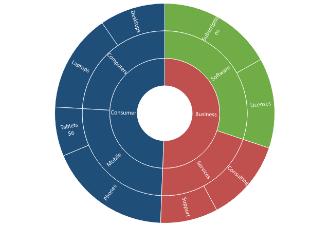

## **Επισκόπηση**

Τα διαγράμματα Treemap και Sunburst εμφανίζουν τον ίδιο τύπο ιεραρχικών δεδομένων, αλλά χρησιμοποιούν διαφορετικές διατάξεις. Ένα Treemap σχεδιάζει την ιεραρχία ως ένθετα ορθογώνια των οποίων οι περιοχές αντιπροσωπεύουν τις τιμές των φύλλων. Ένα Sunburst το απεικονίζει ως συγκεντρωτικούς δακτυλίους: οι ομάδες ανώτερου επιπέδου βρίσκονται κοντά στο κεντρικό σημείο, ενώ οι κατηγορίες φύλλων βρίσκονται στον εξωτερικό δακτύλιο.

Στο Aspose.Slides for Python via Java, κάθε αριθμητική τιμή είναι ένα [ChartDataPoint](https://reference.aspose.com/slides/el/python-java/aspose.slides/chartdatapoint/). Η μέθοδος [ChartDataPoint.getDataPointLevels](https://reference.aspose.com/slides/el/python-java/aspose.slides/chartdatapoint/#getDataPointLevels) παρέχει πρόσβαση στο φύλλο και στις γονικές του ομάδες. Αυτό το άρθρο εξηγεί αυτή τη χαρτογράφηψη και δείχνει πώς να δημιουργήσετε και να διαμορφώσετε και τους δύο τύπους διαγραμμάτων από τα ίδια δείγμα δεδομένων.




## **Κατανόηση Κατηγοριών, Σημείων Δεδομένων και Επιπέδων**

Το παρακάτω δείγμα περιλαμβάνει τρία επίπεδα κατηγοριών και μία αριθμητική σειρά:

| Κλάδος | Κόμβος | Φύλλο | Έσοδα |
| --- | --- | --- | ---: |
| Consumer | Computers | Laptops | 12 |
| Consumer | Computers | Desktops | 8 |
| Consumer | Mobile | Phones | 15 |
| Consumer | Mobile | Tablets | 6 |
| Business | Services | Consulting | 10 |
| Business | Services | Support | 7 |
| Business | Software | Licenses | 11 |
| Business | Software | Subscriptions | 14 |

Κάθε γραμμή δημιουργεί μία κατηγορία φύλλου και ένα σημείο δεδομένων. Τα επίπεδα ομαδοποίησης κατηγοριών περιγράφουν τη διαδρομή από αυτό το φύλλο προς τους γονείς του. Για την πρώτη γραμμή, η διαδρομή είναι `Consumer > Computers > Laptops`.

Οι δείκτες που επιστρέχονται από [ChartDataPoint.getDataPointLevels](https://reference.aspose.com/slides/el/python-java/aspose.slides/chartdatapoint/#getDataPointLevels) τρέχουν από το φύλλο προς τα πάνω:

| Δείκτης `getDataPointLevels()` | Λογικό επίπεδο | Αναπαράσταση Treemap | Αναπαράσταση Sunburst |
| ---: | --- | --- | --- |
| `0` | Φύλλο | Ορθογώνιο τιμής | Τμήμα εξωτερικού δακτυλίου |
| `1` | Κόμβος | Γονικό ορθογώνιο ή επικεφαλίδα | Τμήμα μεσαίου δακτυλίου |
| `2` | Κλάδος | Ανώτερη ορθογώνια ή επικεφαλίδα | Τμήμα εσωτερικού δακτυλίου |

Αυτή η σειρά είναι η ίδια για τους δύο τύπους διαγράμματος, παρόλο που οι οπτικές διατάξεις διαφέρουν. Ένα γονικό τμήμα μοιράζεται από πολλά φύλλα. Για να το μορφοποιήσετε, χρησιμοποιήστε το αντίστοιχο επίπεδο του πρώτου σημείου δεδομένων στην ομάδα. Για παράδειγμα, ο κλάδος `Consumer` ξεκινά με το σημείο `Laptops`, ενώ ο κόμβος `Software` ξεκινά με το σημείο `Licenses`. Η διατήρηση αναφορών σε αυτά τα σημεία είναι πιο σαφής και ασφαλής από τη χρήση άσχετων εκφράσεων όπως `data_points.get_Item(0)` ή `data_points.get_Item(6)`.

## **Δημιουργία και Προσαρμογή Και των Δύο Τύπων Διαγράμματος**

Το παρακάτω πλήρες παράδειγμα δημιουργεί ένα Treemap στην πρώτη διαφάνεια και ένα Sunburst στη δεύτερη διαφάνεια. Δημιουργεί την ιεραρχία, εμφανίζει την τιμή για `Tablets`, εφαρμόζει σταθερά χρώματα σε επιλεγμένα επίπεδα, μορφοποιεί ετικέτα κλάδου και αποθηκεύει την παρουσίαση.

```python
import jpype
import asposeslides

if not jpype.isJVMStarted():
    jpype.startJVM()

from asposeslides.api import ChartType, FillType, ParentLabelLayoutType, Presentation, SaveFormat
from java.awt import Color

presentation = Presentation()
try:
    worksheet_index = 0
    leaf_level_index = 0
    stem_level_index = 1
    branch_level_index = 2

    branch_names = [
        "Consumer", "Consumer", "Consumer", "Consumer",
        "Business", "Business", "Business", "Business"
    ]
    stem_names = [
        "Computers", "Computers", "Mobile", "Mobile",
        "Services", "Services", "Software", "Software"
    ]
    leaf_names = [
        "Laptops", "Desktops", "Phones", "Tablets",
        "Consulting", "Support", "Licenses", "Subscriptions"
    ]
    revenues = [12, 8, 15, 6, 10, 7, 11, 14]
    data_point_count = len(leaf_names)

    chart_types = [ChartType.Treemap, ChartType.Sunburst]
    layout_slide = presentation.getLayoutSlides().get_Item(0)

    for chart_index, chart_type in enumerate(chart_types):
        if chart_index == 0:
            slide = presentation.getSlides().get_Item(0)
        else:
            slide = presentation.getSlides().addEmptySlide(layout_slide)

        chart = slide.getShapes().addChart(chart_type, 40, 40, 640, 440)
        chart.setTitle(False)
        chart.setLegend(False)

        chart_data = chart.getChartData()
        chart_data.getCategories().clear()
        chart_data.getSeries().clear()

        workbook = chart_data.getChartDataWorkbook()
        workbook.clear(worksheet_index)

        # Προσθήκη των κατηγοριών φύλλων. Ένα στοιχείο ομαδοποίησης ορίζεται μόνο όταν αρχίζει νέα ομάδα· οι επόμενες κατηγορίες παραμένουν σε αυτήν την ομάδα μέχρι να οριστεί άλλο στοιχείο.
        for data_index in range(data_point_count):
            row_index = data_index + 1
            leaf_name = leaf_names[data_index]
            category_cell = workbook.getCell(worksheet_index, row_index, 2, leaf_name)
            category = chart_data.getCategories().add(category_cell)

            stem_name = stem_names[data_index]
            starts_new_stem = data_index == 0
            if data_index > 0:
                previous_stem_name = stem_names[data_index - 1]
                starts_new_stem = stem_name != previous_stem_name
            if starts_new_stem:
                category.getGroupingLevels().setGroupingItem(stem_level_index, stem_name)

            branch_name = branch_names[data_index]
            starts_new_branch = data_index == 0
            if data_index > 0:
                previous_branch_name = branch_names[data_index - 1]
                starts_new_branch = branch_name != previous_branch_name
            if starts_new_branch:
                category.getGroupingLevels().setGroupingItem(branch_level_index, branch_name)

        series_name_cell = workbook.getCell(worksheet_index, 0, 3, "Revenue")
        series = chart_data.getSeries().add(series_name_cell, chart_type)
        series.getLabels().getDefaultDataLabelFormat().setShowCategoryName(True)

        laptops_data_point = None
        tablets_data_point = None
        licenses_data_point = None

        for data_index in range(data_point_count):
            row_index = data_index + 1
            leaf_name = leaf_names[data_index]
            revenue = revenues[data_index]
            value_cell = workbook.getCell(worksheet_index, row_index, 3, jpype.JDouble(revenue))

            if chart_type == ChartType.Treemap:
                data_point = series.getDataPoints().addDataPointForTreemapSeries(value_cell)
            else:
                data_point = series.getDataPoints().addDataPointForSunburstSeries(value_cell)

            if leaf_name == "Laptops":
                laptops_data_point = data_point
            elif leaf_name == "Tablets":
                tablets_data_point = data_point
            elif leaf_name == "Licenses":
                licenses_data_point = data_point

        # Εμφάνιση της κατηγορίας και της τιμής στο φύλλο Tablets.
        tablets_leaf_level = tablets_data_point.getDataPointLevels().get_Item(leaf_level_index)
        tablets_label_format = tablets_leaf_level.getLabel().getDataLabelFormat()
        tablets_label_format.setShowCategoryName(True)
        tablets_label_format.setShowValue(True)
        tablets_label_format.setSeparator("\n")
        tablets_label_format.setNumberFormat("$0")

        # Μορφοποίηση του κλάδου Consumer μέσω του πρώτου φύλλου σε αυτόν τον κλάδο.
        consumer_branch_level = laptops_data_point.getDataPointLevels().get_Item(branch_level_index)
        consumer_branch_fill = consumer_branch_level.getFormat().getFill()
        consumer_branch_color = Color(31, 78, 121)
        consumer_branch_fill.setFillType(FillType.Solid)
        consumer_branch_fill.getSolidFillColor().setColor(consumer_branch_color)

        consumer_label_format = consumer_branch_level.getLabel().getDataLabelFormat()
        consumer_label_format.setShowCategoryName(True)
        consumer_label_format.setShowSeriesName(False)
        consumer_label_text_fill = consumer_label_format.getTextFormat().getPortionFormat().getFillFormat()
        consumer_label_text_fill.setFillType(FillType.Solid)
        consumer_label_text_fill.getSolidFillColor().setColor(Color.WHITE)

        # Μορφοποίηση του κόμβου Software μέσω του πρώτου φύλλου σε αυτόν τον κόμβο.
        software_stem_level = licenses_data_point.getDataPointLevels().get_Item(stem_level_index)
        software_stem_fill = software_stem_level.getFormat().getFill()
        software_stem_color = Color(112, 173, 71)
        software_stem_fill.setFillType(FillType.Solid)
        software_stem_fill.getSolidFillColor().setColor(software_stem_color)

        # Το ParentLabelLayout επηρεάζει τις ετικέτες γονέα του Treemap· το Sunburst χρησιμοποιεί τμήματα δακτυλίων.
        if chart_type == ChartType.Treemap:
            series.setParentLabelLayout(ParentLabelLayoutType.Overlapping)

    presentation.save("hierarchical-charts.pptx", SaveFormat.Pptx)
finally:
    presentation.dispose()
```

Τα κελιά κατηγορίας και τα κελιά τιμής χρησιμοποιούν την ίδια σειρά του φύλλου εργασίας, έτσι οι θέσεις των συλλογών τους παραμένουν ευθυγραμμισμένες. Όταν εργάζεστε με ένα υπάρχον διάγραμμα αντί να δημιουργήσετε ένα νέο, εξετάστε πρώτα τις σειρές κατηγορίας και αποθηκεύστε ονομαστικές αναφορές στα σημεία δεδομένων και στα επίπεδα που σκοπεύετε να μορφοποιήσετε.

## **Συμπεριφορά και Πρακτικές Σκέψεις**

### **Διαφορές μεταξύ Treemap και Sunburst**

- Ένα Treemap χρησιμοποιεί την περιοχή για να μεταδώσει την τιμή και τα ένθετα ορθογώνια για να μεταδώσει την ιεραρχία. Η μέθοδος [ChartSeries.setParentLabelLayout](https://reference.aspose.com/slides/el/python-java/aspose.slides/chartseries/#setParentLabelLayout) ελέγχει πώς εμφανίζονται οι ετικέτες γονέα σε αυτόν τον τύπο διαγράμματος.
- Ένα Sunburst χρησιμοποιεί τη γωνία για να μεταδώσει την τιμή και το βάθος του δακτυλίου για να μεταδώσει την ιεραρχία. Η [ChartSeries.setParentLabelLayout](https://reference.aspose.com/slides/el/python-java/aspose.slides/chartseries/#setParentLabelLayout) δεν ελέγχει τις ετικέτες των δακτυλίων του.
- Και οι δύο τύποι διαγραμμάτων χρησιμοποιούν τα ίδια επίπεδα ομαδοποίησης κατηγοριών και την ίδια σειρά φύλλου‑προς‑γονέα που επιστρέφει η [ChartDataPoint.getDataPointLevels](https://reference.aspose.com/slides/el/python-java/aspose.slides/chartdatapoint/#getDataPointLevels), επομένως ο κώδικας δημιουργίας δεδομένων και μορφοποίησης επιπέδων μπορεί να μοιραστεί.
- Οι τιμές των γονέων υπολογίζονται από τα κατιόντα φύλλα τους. Μην προσθέτετε ξεχωριστά αριθμητικά σημεία για κλάδους ή κόμβους.

### **Ταξινόμηση και Σειρά Τμημάτων**

Η μηχανή διάταξης του διαγράμματος καθορίζει την τελική τοποθέτηση των ορθογωνίων και των τμημάτων δακτυλίων. Ομαδοποιήστε σχετικές σειρές κατηγοριών μαζί πριν τις προσθέσετε, αλλά μην βασίζεστε σε συγκεκριμένη θέση ορθογωνίου ή γωνία εκκίνησης. Εάν η σειρά έχει σημασία, συμπεριλάβετε την στις ετικέτες ή χρησιμοποιήστε τύπο διαγράμματος με ρητό άξονα κατηγορίας.

### **Θέμα και Σταθερά Χρώματα**

Τα μη μορφοποιημένα επίπεδα διαγράμματος κληρονομούν χρώματα από το θέμα της παρουσίασης. Το παράδειγμα χρησιμοποιεί ρητές γεμίσεις RGB για προβλέψιμο αποτέλεσμα. Εάν το διάγραμμα πρέπει να ακολουθεί αλλαγές θέματος, χρησιμοποιήστε χρώματα σχήματος αντί για σταθερές τιμές RGB και αποφύγετε την υπερίσχυση κάθε επιπέδου. Επίσης ελέγξτε την αντίθεση ετικετών μετά την αλλαγή γεμίματος κλάδου ή κόμβου.

### **Ετικέτες και Διαθέσιμοι Χώροι**

Το PowerPoint μπορεί να κρύψει ή να περικόψει ετικέτες όταν ένα τμήμα είναι πολύ μικρό. Η αύξηση του μεγέθους του διαγράμματος, η συντόμευση των ονομάτων κατηγοριών ή η εμφάνιση λιγότερων πεδίων ετικέτας συνήθως παράγει πιο ξεκάθαρο αποτέλεσμα. Μια ετικέτα μπορεί να συνδυάσει το όνομα κατηγορίας, το όνομα σειράς και την τιμή μέσω του [DataLabelFormat](https://reference.aspose.com/slides/el/python-java/aspose.slides/datalabelformat/), αλλά η ενεργοποίηση όλων των πεδίων συχνά δυσκολεύει την ανάγνωση ιεραρχικών διαγραμμάτων.

### **Εξαγωγή και Απόδοση**

Η αποθήκευση σε PPTX διατηρεί το διάγραμμα επεξεργάσιμο. Όταν το Aspose.Slides αποδίδει την παρουσίαση σε PDF ή εικόνα, οι υποστηριζόμενες γεμίσεις και ρυθμίσεις ετικετών αποτυπώνονται στο διάγραμμα. Η αντικατάσταση γραμματοσειρών και μικρές διαφορές στον διαθέσιμο χώρο διάταξης μπορεί να αλλάξουν τη σχηματισμό γραμμής ή την ορατότητα ετικετών, γι’ αυτό εγκαταστήστε τις απαιτούμενες γραμματοσειρές και επαληθεύστε τους σημαντικούς στόχους εξαγωγής.

## **Συχνές Ερωτήσεις**

**Γιατί η αλλαγή ενός επιπέδου γονέα επηρεάζει πολλά φύλλα;**

Ένας κλάδος ή κόμβος είναι ένα κοινόχρηστο οπτικό τμήμα. Το [ChartDataPointLevel](https://reference.aspose.com/slides/el/python-java/aspose.slides/chartdatapointlevel/) μπορεί να προσπελαστεί μέσω ενός κατιόντος φύλλου, αλλά η μορφοποίηση ανήκει στο κοινόχρηστο γονικό τμήμα, όχι μόνο σε εκείνο το φύλλο.

**Γιατί λείπει μια ετικέτα δεδομένων;**

Πρώτα ενεργοποιήστε τα απαιτούμενα πεδία στο αντικείμενο [DataLabelFormat](https://reference.aspose.com/slides/el/python-java/aspose.slides/datalabelformat/) της ετικέτας. Στη συνέχεια ελέγξτε αν το τμήμα διαθέτει επαρκή χώρο. Η διάταξη ετικετών γονέα Treemap, οι διαστάσεις του διαγράμματος, το μήκος της ετικέτας, το μέγεθος γραμματοσειράς και ο αριθμός ενεργοποιημένων πεδίων επηρεάζουν το αν μπορεί να εμφανιστεί μια ετικέτα.

**Μπορώ να ορίσω την ακριβή σειρά ή τις συντεταγμένες των τμημάτων;**

Μπορείτε να ελέγξετε τη σειρά των σειρών‑πηγής και να διατηρήσετε κάθε ομάδα συνεχή, αλλά δεν μπορείτε να ορίσετε ακριβείς ορθογώνιες Treemap ή γωνίες Sunburst. Η μηχανή διάταξης του διαγράμματος τα υπολογίζει από την ιεραρχία, τις τιμές και τον διαθέσιμο χώρο.

**Γιατί αλλάζουν τα χρώματα μετά την αλλαγή του θέματος παρουσίασης;**

Οι γεμίσεις βάσει θέματος σχεδιάζονται να ακολουθούν την παλέτα της παρουσίασης. Εφαρμόστε ρητά χρώματα RGB σε επίπεδα που πρέπει να παραμείνουν σταθερά, ή διατηρήστε χρώματα σχήματος όταν προτιμάται προσαρμογή σε νέο θέμα.

**Θα διατηρηθεί η προσαρμοσμένη μορφοποίηση σε εξαγωγές PDF και εικόνας;**

Ναι, οι υποστηριζόμενες γεμίσεις διαγράμματος και οι ρυθμίσεις ετικετών περιλαμβάνονται κατά την απόδοση. Για συνεπή αποτελέσματα σε διαφορετικά συστήματα, διασφαλίστε τη διαθεσιμότητα των απαιτούμενων γραμματοσειρών και δοκιμάστε το τελικό μέγεθος εξαγωγής, καθώς η προσαρμογή ετικετών εξαρτάται από τη διάταξη.

## **Δείτε επίσης**

- [Create Treemap charts](/slides/el/python-java/create-chart/#create-tree-map-charts)
- [Create Sunburst charts](/slides/el/python-java/create-chart/#create-sunburst-charts)
- [Export presentation charts](/slides/el/python-java/export-chart/)
- [Manage presentation themes](/slides/el/python-java/presentation-theme/)