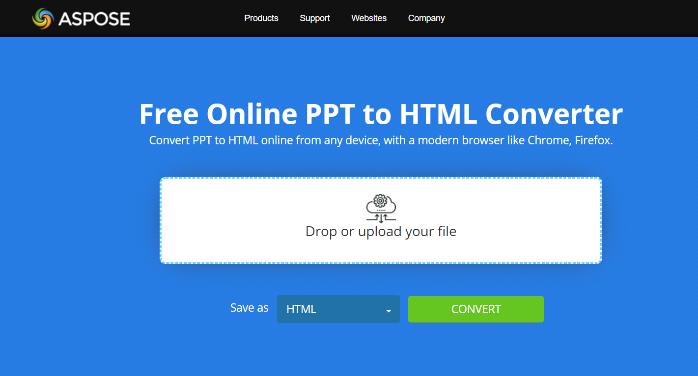

## **Overview**

This article explains how to convert PowerPoint Presentation in HTML format using Java. It covers the following topics.

- Convert PowerPoint to HTML in Java
- Convert PPT to HTML in Java
- Convert PPTX to HTML in Java
- Convert ODP to HTML in Java
- Convert PowerPoint Slide to HTML in Java

## **PowerPoint to HTML on Android**

For Java sample code to convert PowerPoint to HTML, please see the section below i.e. [Convert PowerPoint to HTML](#convert-powerpoint-to-html). The code can load number of formats like PPT, PPTX and ODP in Presentation object and save it to HTML format.

## **About PowerPoint to HTML Conversion**
Using [**Aspose.Slides for Android via Java**](https://products.aspose.com/slides/androidjava/), applications and developers can convert a PowerPoint presentation to HTML: **PPTX to HTML** or **PPT to HTML**.

**Aspose.Slides** provides many options (mostly from the [**HtmlOptions**](https://reference.aspose.com/slides/androidjava/com.aspose.slides/HtmlOptions) class) that define the PowerPoint to HTML conversion process:

* Convert an entire PowerPoint presentation to HTML.
* Convert a specific slide in a PowerPoint presentation to HTML.
* Convert presentation media (images, videos, etc.) to HTML.
* Convert a PowerPoint presentation to responsive HTML. 
* Convert a PowerPoint presentation to HTML with speaker notes included or excluded. 
* Convert a PowerPoint presentation to HTML with comments included or excluded. 
* Convert a PowerPoint presentation to HTML with original or embedded fonts. 
* Convert a PowerPoint presentation to HTML while using the new CSS style. 

{} 

Using its own API, Aspose developed free [presentation to HTML](https://products.aspose.app/slides/conversion/powerpoint-to-html) converters: [PPT to HTML](https://products.aspose.app/slides/conversion/ppt-to-html), [PPTX to HTML](https://products.aspose.app/slides/conversion/pptx-to-html), [ODP to HTML](https://products.aspose.app/slides/conversion/odp-to-html), etc. 

[](https://products.aspose.app/slides/conversion/ppt-to-html)

You may want to check out other [free converters from Aspose](https://products.aspose.app/slides/conversion).

{} 

{} 

Besides the conversion processes described here, Aspose.Slides also supports these conversion operations involving the HTML format: 

* [HTML to image](https://products.aspose.com/slides/androidjava/conversion/html-to-image/)
* [HTML to JPG](https://products.aspose.com/slides/androidjava/conversion/html-to-jpg/)
* [HTML to XML](https://products.aspose.com/slides/androidjava/conversion/html-to-xml/)
* [HTML to TIFF](https://products.aspose.com/slides/androidjava/conversion/html-to-tiff/)

{}


## **Convert PowerPoint to HTML**
Using Aspose.Slides, you can convert an entire PowerPoint presentation to HTML this way:

1. Create an instance of the [Presentation](https://reference.aspose.com/slides/androidjava/com.aspose.slides/Presentation) class.
1. Use the [Save](https://reference.aspose.com/slides/androidjava/com.aspose.slides/Presentation#save-java.lang.String-int-com.aspose.slides.ISaveOptions-) method to save the object as an HTML file.

This code shows you how to convert a PowerPoint to HTML in Java:

```java
// Instantiate a Presentation object that represents a presentation file
Presentation pres = new Presentation("Convert_HTML.pptx");
try {
    HtmlOptions htmlOpt = new HtmlOptions();
	
    htmlOpt.getNotesCommentsLayouting().setNotesPosition(NotesPositions.BottomFull);
	
    htmlOpt.setHtmlFormatter(HtmlFormatter.createDocumentFormatter("", false));

    // Saving the presentation to HTML
    pres.save("ConvertWholePresentationToHTML_out.html", SaveFormat.Html, htmlOpt);
} finally {
    if (pres != null) pres.dispose();
}
```


## **Convert PowerPoint to Responsive HTML**
Aspose.Slides provides the [ResponsiveHtmlController](https://reference.aspose.com/slides/androidjava/com.aspose.slides/ResponsiveHtmlController) class that allows you to generate responsive HTML files. This code shows you how to convert a PowerPoint presentation to responsive HTML in Java:

```java
// Instantiate a Presentation object that represents a presentation file
Presentation pres = new Presentation("Convert_HTML.pptx");
try {
    ResponsiveHtmlController controller = new ResponsiveHtmlController();
    HtmlOptions htmlOptions = new HtmlOptions();
    htmlOptions.setHtmlFormatter(HtmlFormatter.createCustomFormatter(controller));

    // Saving the presentation to HTML
    pres.save("ConvertPresentationToResponsiveHTML_out.html", SaveFormat.Html, htmlOptions);
} finally {
    if (pres != null) pres.dispose();
}
```

## **Convert PowerPoint to HTML with Notes**
This code shows you how to convert a PowerPoint to HTML with notes in Java:

```java
Presentation pres = new Presentation("Presentation.pptx");
try {
    HtmlOptions opt = new HtmlOptions();
	
    INotesCommentsLayoutingOptions options = opt.getNotesCommentsLayouting();
    options.setNotesPosition(NotesPositions.BottomFull);

    // Saving notes pages
    pres.save("Output.html", SaveFormat.Html, opt);
} finally {
    if (pres != null) pres.dispose();
}
```

## **Convert PowerPoint to HTML with Original Fonts**

Aspose.Slides provides the [EmbedAllFontsHtmlController](https://reference.aspose.com/slides/androidjava/com.aspose.slides/EmbedAllFontsHtmlController) class that allows you to embed all the fonts in a presentation while converting the presentation to HTML.

To prevent certain fonts from being embedded, you can pass an array of font names to a parameterized constructor from the [EmbedAllFontsHtmlController](https://reference.aspose.com/slides/androidjava/com.aspose.slides/EmbedAllFontsHtmlController) class. Popular fonts, such as Calibri or Arial, when used in a presentation, do not have to be embedded because most systems already contain such fonts. When those fonts are embedded, the resulting HTML document becomes unnecessarily large.

The [EmbedAllFontsHtmlController](https://reference.aspose.com/slides/androidjava/com.aspose.slides/EmbedAllFontsHtmlController) class supports inheritance and provides the [WriteFont](https://reference.aspose.com/slides/androidjava/com.aspose.slides/EmbedAllFontsHtmlController#writeFont-com.aspose.slides.IHtmlGenerator-com.aspose.slides.IFontData-com.aspose.slides.IFontData-java.lang.String-java.lang.String-byte:A-) method, which is meant to be overwritten.

```java
Presentation pres = new Presentation("input.pptx");
try {
    // exclude default presentation fonts
    String[] fontNameExcludeList = { "Calibri", "Arial" };

    EmbedAllFontsHtmlController embedFontsController = new EmbedAllFontsHtmlController(fontNameExcludeList);

    HtmlOptions htmlOptionsEmbed = new HtmlOptions();
    htmlOptionsEmbed.setHtmlFormatter(HtmlFormatter.createCustomFormatter(embedFontsController));

    pres.save("input-PFDinDisplayPro-Regular-installed.html", SaveFormat.Html, htmlOptionsEmbed);
} finally {
    if (pres != null) pres.dispose();
}
```

## **Convert PowerPoint to HTML with High-quality Images**

By default, when you convert PowerPoint to HTML, Aspose.Slides outputs small HTML with images at 72 DPI and deleted cropped areas. To obtain HTML files with higher quality images, you have to set the `PicturesCompression` property (from the `HtmlOptions` class) to 96 (i.e., `PicturesCompression.Dpi96`) or higher [values](https://reference.aspose.com/slides/androidjava/com.aspose.slides/PicturesCompression).

This Java code shows you how to convert a PowerPoint presentation to HTML while obtaining high quality images at 150 DPI (i.e. `PicturesCompression.Dpi150`):

```java
Presentation pres = new Presentation("InputDoc.pptx");
try {
    HtmlOptions htmlOpts = new HtmlOptions();
    htmlOpts.setPicturesCompression(PicturesCompression.Dpi150);
    
    pres.save("OutputDoc-dpi150.html", SaveFormat.Html, htmlOpts);
} finally {
    if (pres != null) pres.dispose();
}
```

This code in Java shows you how to output HTML with full quality images:

```java
Presentation pres = new Presentation("InputDoc.pptx");
try {
    HtmlOptions htmlOpts = new HtmlOptions();
    htmlOpts.setDeletePicturesCroppedAreas(false);

    pres.save("Outputdoc-noCrop.html", SaveFormat.Html, htmlOpts);
} finally {
    if (pres != null) pres.dispose();
}
```

## **Convert a Slide to HTML**
To convert a specific slide in a PowerPoint to HTML, you have to instantiate the same [Presentation](https://reference.aspose.com/slides/androidjava/com.aspose.slides/Presentation) class (used to convert entire presentations to HTML) and then use the [Save](https://reference.aspose.com/slides/androidjava/com.aspose.slides/Presentation#save-java.lang.String-int-com.aspose.slides.ISaveOptions-) method to save the file as HTML. The [HtmlOptions](https://reference.aspose.com/slides/androidjava/com.aspose.slides/HtmlOptions) class can be used to specify additional conversion options:

This Java code shows you how to convert a slide in a PowerPoint presentation to HTML:

```java
Presentation pres = new Presentation("Individual-Slide.pptx");
try {
    HtmlOptions htmlOptions = new HtmlOptions();
    htmlOptions.getNotesCommentsLayouting().setNotesPosition(NotesPositions.BottomFull);
	
    htmlOptions.setHtmlFormatter(HtmlFormatter.createCustomFormatter(new CustomFormattingController()));

    // Saving File
    for (int i = 0; i < pres.getSlides().size(); i++)
        pres.save("Individual Slide" + (i + 1) + "_out.html", new int[]{i + 1},SaveFormat.Html, htmlOptions);
} finally {
    if (pres != null) pres.dispose();
}
```
```java
public class CustomFormattingController implements IHtmlFormattingController
{
    @Override
    public void writeDocumentStart(IHtmlGenerator generator, IPresentation presentation) { }

    @Override
    public void writeDocumentEnd(IHtmlGenerator generator, IPresentation presentation) { }

    @Override
    public void writeSlideStart(IHtmlGenerator generator, ISlide slide) 
	{
        generator.addHtml(String.format(SlideHeader, generator.getSlideIndex() + 1));
    }

    @Override
    public void writeSlideEnd(IHtmlGenerator generator, ISlide slide) 
	{
        generator.addHtml(SlideFooter);
    }

    @Override
    public void writeShapeStart(IHtmlGenerator generator, IShape shape) { }

    @Override
    public void writeShapeEnd(IHtmlGenerator generator, IShape shape) { }

    private final String SlideHeader = "<div class=\"slide\" name=\"slide\" id=\"slide%d\">";
    private final String SlideFooter = "</div>";
}
```


## **Save CSS and Images When Exporting To HTML**
Using new CSS style files, you can easily change the style of the HTML file resulting from the PowerPoint to HTML conversion process. 

The Java code in this example shows you how to use overridable methods to create a custom HTML document with a link to a CSS file:

```java
Presentation pres = new Presentation("pres.pptx");
try {
    CustomHeaderAndFontsController htmlController = new CustomHeaderAndFontsController("styles.css");
    HtmlOptions options = new HtmlOptions();
    options.setHtmlFormatter(HtmlFormatter.createCustomFormatter(htmlController));

    pres.save("pres.html", SaveFormat.Html, options);
} finally {
    if (pres != null) pres.dispose();
}
```

```java
public class CustomHeaderAndFontsController extends EmbedAllFontsHtmlController
{
    private final int m_basePath = 0;

    // Custom header template
    final static String Header = "<!DOCTYPE html>\n" +
            "<html>\n" +
            "<head>\n" +
            "<meta http-equiv=\"Content-Type\" content=\"text/html; charset=UTF-8\">\n" +
            "<meta http-equiv=\"X-UA-Compatible\" content=\"IE=9\">\n" +
            "<link rel=\"stylesheet\" type=\"text/css\" href=\"%s\">\n" +
            "</head>";

    private final String m_cssFileName;

    public CustomHeaderAndFontsController(String cssFileName) 
    {
        m_cssFileName = cssFileName;
    }

    public void writeDocumentStart(IHtmlGenerator generator, IPresentation presentation) 
    {
        generator.addHtml(String.format(Header, m_cssFileName));
        writeAllFonts(generator, presentation);
    }

    public void writeAllFonts(IHtmlGenerator generator, IPresentation presentation) 
    {
        generator.addHtml("<!-- Embedded fonts -->");
        super.writeAllFonts(generator, presentation);
    }
}
```

## **Link All Fonts When Converting a Presentation to HTML**

If you do not want to embed fonts (to avoid increasing the size of the resulting HTML), you can link all fonts by implementing your own  `LinkAllFontsHtmlController` version. 

This Java code shows you how to convert a PowerPoint to HTML while linking all fonts and excluding "Calibri" and "Arial" (since they already exist in the system): 

```java
Presentation pres = new Presentation("pres.pptx");
try
{
    //Exclude default presentation fonts
    String[] fontNameExcludeList = { "Calibri", "Arial" };

    LinkAllFontsHtmlController linkcont = new LinkAllFontsHtmlController(fontNameExcludeList,"C:/Windows/Fonts/");

    HtmlOptions htmlOptionsEmbed = new HtmlOptions();
    htmlOptionsEmbed.setHtmlFormatter(HtmlFormatter.createCustomFormatter((IHtmlFormattingController) linkcont));

    pres.save("pres.html", SaveFormat.Html, htmlOptionsEmbed);
}
finally {
    if (pres != null) pres.dispose();
}
```

This Java code shows you how `LinkAllFontsHtmlController` is implemented:

```java
public class LinkAllFontsHtmlController extends EmbedAllFontsHtmlController
{
    private final String m_basePath;

    public LinkAllFontsHtmlController(String[] fontNameExcludeList, String basePath)
    {
        super(fontNameExcludeList);
        m_basePath = basePath;
    }

    public void writeFont
    (
            IHtmlGenerator generator,
            IFontData originalFont,
            IFontData substitutedFont,
            String fontStyle,
            String fontWeight,
            byte[] fontData)
    {
        try {
            String fontName = substitutedFont == null ? originalFont.getFontName() : substitutedFont.getFontName();
            String path = fontName + ".woff"; // some path sanitaze may be needed
            Files.write(new File(m_basePath + path).toPath(), fontData, StandardOpenOption.CREATE);

            generator.addHtml("<style>");
            generator.addHtml("@font-face { ");
            generator.addHtml("font-family: '" + fontName + "'; ");
            generator.addHtml("src: url('" + path + "')");

            generator.addHtml(" }");
            generator.addHtml("</style>");
        } catch (IOException ex) {
            ex.printStackTrace();
        }
    }
}
```

## **Convert PowerPoint to Responsive HTML**
This Java code shows you how to convert a PowerPoint presentation to responsive HTML:

```java
Presentation pres = new Presentation("SomePresentation.pptx");
try {
    HtmlOptions saveOptions = new HtmlOptions();
    saveOptions.setSvgResponsiveLayout(true);
    pres.save("SomePresentation-out.html", SaveFormat.Html, saveOptions);
} finally {
    if (pres != null) pres.dispose();
}
```


## **Export Media Files to HTML**
Using Aspose.Slides for Android via Java, you can export media files this way:

1. Create an instance of the [Presentation](https://reference.aspose.com/slides/androidjava/com.aspose.slides/Presentation) class.
1. Get a reference to the slide.
1. Add a video to the slide.
1. Write the presentation as a HTML file.

This Java code shows you how to add a video to the presentation and then save it as HTML: 

```java
// Loading a presentation
Presentation pres = new Presentation();
try {
    String path = "./out/";
    final String fileName = "ExportMediaFiles_out.html";
    final String baseUri = "http://www.example.com/";

    byte[] videoData = Files.readAllBytes(Paths.get("my_video.avi"));
    IVideo video = pres.getVideos().addVideo(videoData);
    pres.getSlides().get_Item(0).getShapes().addVideoFrame(10, 10, 100, 100, video);

    VideoPlayerHtmlController controller = new VideoPlayerHtmlController(path, fileName, baseUri);

    // Setting HTML options
    HtmlOptions htmlOptions = new HtmlOptions(controller);
    SVGOptions svgOptions = new SVGOptions(controller);

    htmlOptions.setHtmlFormatter(HtmlFormatter.createCustomFormatter(controller));
    htmlOptions.setSlideImageFormat(SlideImageFormat.svg(svgOptions));

    // Saving the file
    pres.save(fileName, SaveFormat.Html, htmlOptions);
} catch(Exception e) {
} finally {
    if (pres != null) pres.dispose();
}
```

## **FAQ**

**What is the performance of Aspose.Slides when converting multiple presentations to HTML?**

Performance depends on the size and complexity of presentations. Aspose.Slides is highly efficient and scalable for batch operations. To achieve optimal performance when converting many presentations, it’s recommended to use multithreading or parallel processing whenever possible.

**Does Aspose.Slides support exporting hyperlinks to HTML?**

Yes, Aspose.Slides fully supports exporting embedded hyperlinks to HTML. When you convert presentations to HTML format, hyperlinks are preserved automatically and remain clickable.

**Is there any limit on the number of slides when converting presentations to HTML?**

There is no limit on the number of slides when using Aspose.Slides. You can convert presentations of any size. However, for presentations containing a very large number of slides, performance may depend on the available resources of your server or system.
