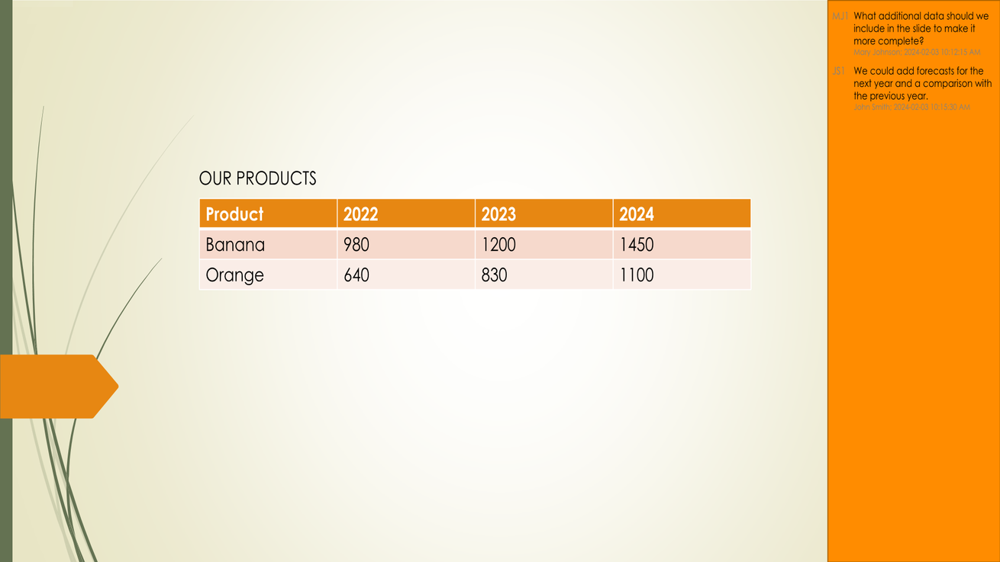

## **Overview**

Converting PowerPoint and OpenDocument presentations to JPG images helps with sharing slides, optimizing performance, and embedding content into websites or applications. Aspose.Slides for Android via Java allows you to transform PPTX, PPT, and ODP files into high-quality JPEG images. This guide explains different methods for conversion.

With these features, it's easy to implement your own presentation viewer and create a thumbnail for every slide. This may be useful if you want to protect presentation slides from copying or demonstrate the presentation in read-only mode. Aspose.Slides allows you to convert the whole presentation or a specific slide into image formats.

## **Convert Presentation Slides to JPG Images**

Here are the steps to convert a PPT, PPTX, or ODP file to JPG:

1. Create an instance of the [Presentation](https://reference.aspose.com/slides/androidjava/com.aspose.slides/presentation/) class.
1. Get the slide object of type [ISlide](https://reference.aspose.com/slides/androidjava/com.aspose.slides/islide/) from the collection returned by the [Presentation.getSlides()](https://reference.aspose.com/slides/androidjava/com.aspose.slides/presentation/#getSlides--) method.
1. Create an image of the slide using the [ISlide.getImage(float, float)](https://reference.aspose.com/slides/androidjava/com.aspose.slides/islide/#getImage-float-float-) method.
1. Call the [IImage.save(string, ImageFormat)](https://reference.aspose.com/slides/androidjava/com.aspose.slides/iimage/#save-java.lang.String-int-) method on the image object. Pass the output file name and image format as arguments.

{} 

**Note:** PPT, PPTX, or ODP to JPG conversion differs from conversion to other formats in the Aspose.Slides Android via Java API. For other formats, you typically use the [IPresentation.save(String, SaveFormat, ISaveOptions)](https://reference.aspose.com/slides/androidjava/com.aspose.slides/ipresentation/#save-java.lang.String-int-com.aspose.slides.ISaveOptions-) method. However, for JPG conversion, you need to use the [IImage.save(string, ImageFormat)](https://reference.aspose.com/slides/androidjava/com.aspose.slides/iimage/#save-java.lang.String-int-) method.

{} 

```java
int scaleX = 1;
int scaleY = scaleX;

Presentation presentation = new Presentation("PowerPoint_Presentation.pptx");
try {
    for (ISlide slide : presentation.getSlides()) {
        // Create a slide image of the specified scale.
        IImage slideImage = slide.getImage(scaleX, scaleY);

        try {
            // Save the image to disk in JPEG format.
            String fileName = String.format("Slide_%d.jpg", slide.getSlideNumber());
            slideImage.save(fileName, ImageFormat.Jpeg);
        } finally {
            slideImage.dispose();
        }
    }
} finally {
    presentation.dispose();
}
```

## **Convert Slides to JPG with Customized Dimensions**

To change the dimensions of the resulting JPG images, you can set the image size by passing it into the [ISlide.getImage(Size)](https://reference.aspose.com/slides/androidjava/com.aspose.slides/islide/#getImage-com.aspose.slides.android.Size-) method. This allows you to generate images with specific width and height values, ensuring that the output meets your requirements for resolution and aspect ratio. This flexibility is particularly useful when generating images for web applications, reports, or documentation, where precise image dimensions are required.

```java
Size imageSize = new Size(1200, 800);

Presentation presentation = new Presentation("PowerPoint_Presentation.pptx");
try {
    for (ISlide slide : presentation.getSlides()) {
        // Create a slide image of the specified size.
        IImage slideImage = slide.getImage(imageSize);

        try {
            // Save the image to disk in JPEG format.
            String fileName = String.format("Slide_%d.jpg", slide.getSlideNumber());
            slideImage.save(fileName, ImageFormat.Jpeg);
        } finally {
            slideImage.dispose();
        }
    }
} finally {
    presentation.dispose();
}
```

## **Render Comments when Saving Slides as Images**

Aspose.Slides for Android via Java provides a feature that allows you to render comments on a presentation's slides when converting them into JPG images. This functionality is particularly useful for preserving annotations, feedback, or discussions added by collaborators in PowerPoint presentations. By enabling this option, you ensure that comments are visible in the generated images, making it easier to review and share feedback without needing to open the original presentation file.

Let's say we have a presentation file, "sample.pptx," with a slide that contains comments:


The following Java code converts the slide to a JPG image while preserving the comments:

```java
int scaleX = 2;
int scaleY = scaleX;

Presentation presentation = new Presentation("sample.pptx");
try {
    NotesCommentsLayoutingOptions commentsOptions = new NotesCommentsLayoutingOptions();
    commentsOptions.setCommentsPosition(CommentsPositions.Right);
    commentsOptions.setCommentsAreaWidth(200);
    commentsOptions.setCommentsAreaColor(Color.rgb(255, 140, 0));

    IRenderingOptions options = new RenderingOptions();
    options.setSlidesLayoutOptions(commentsOptions);

    // Convert the first slide to an image.
    IImage slideImage = presentation.getSlides().get_Item(0).getImage(options, scaleX, scaleY);
    try {
        slideImage.save("Slide_1.jpg", ImageFormat.Jpeg);
    } finally {
        slideImage.dispose();
    }
} finally {
    presentation.dispose();
}
```

The result:



## **See also**

See other options for converting PPT, PPTX, or ODP to images, such as:

- [Convert PowerPoint to GIF](/slides/androidjava/convert-powerpoint-to-animated-gif/)
- [Convert PowerPoint to PNG](/slides/androidjava/convert-powerpoint-to-png/)
- [Convert PowerPoint to TIFF](/slides/androidjava/convert-powerpoint-to-tiff/)
- [Convert PowerPoint to SVG](/slides/androidjava/render-a-slide-as-an-svg-image/)

{} 

To see how Aspose.Slides converts PowerPoint presentations to JPG images, try these free online converters: PowerPoint [PPTX to JPG](https://products.aspose.app/slides/conversion/pptx-to-jpg) and [PPT to JPG](https://products.aspose.app/slides/conversion/ppt-to-jpg). 

{} 


{}

Aspose provides a [FREE Collage web app](https://products.aspose.app/slides/collage). Using this online service, you can merge [JPG to JPG](https://products.aspose.app/slides/collage/jpg) or PNG to PNG images, create [photo grids](https://products.aspose.app/slides/collage/photo-grid), and so on. 

Using the same principles described in this article, you can convert images from one format to another. For more information, see these pages: convert [image to JPG](https://products.aspose.com/slides/java/conversion/image-to-jpg/); convert [JPG to image](https://products.aspose.com/slides/java/conversion/jpg-to-image/); convert [JPG to PNG](https://products.aspose.com/slides/java/conversion/jpg-to-png/), convert [PNG to JPG](https://products.aspose.com/slides/java/conversion/png-to-jpg/); convert [PNG to SVG](https://products.aspose.com/slides/java/conversion/png-to-svg/), convert [SVG to PNG](https://products.aspose.com/slides/java/conversion/svg-to-png/).

{}

## **FAQs**

**Does this method support batch conversion?**

Yes, Aspose.Slides allows batch conversion of multiple slides to JPG in a single operation.

**Does the conversion support SmartArt, charts, and other complex objects?**

Yes, Aspose.Slides renders all content, including SmartArt, charts, tables, shapes, and more. However, the rendering accuracy may vary slightly compared to PowerPoint, especially when using custom or missing fonts.

**Are there any limitations on the number of slides that can be processed?**

Aspose.Slides itself does not impose any strict limits on the number of slides you can process. However, you may encounter out-of-memory error when working with large presentations or high-resolution images.
