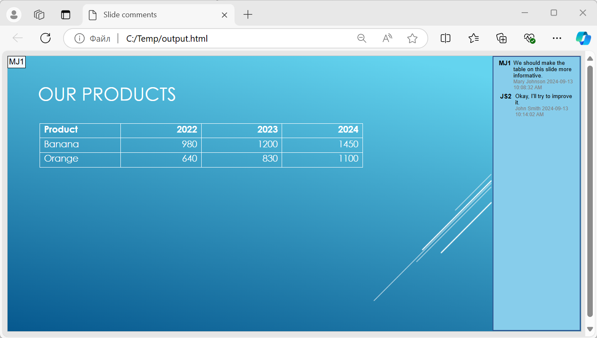

Aspose.Slides supports HTML5 export. The export to HTML5 process here allows you to convert PowerPoint to HTML without web extensions or dependencies. This way, using your own templates, you can apply very flexible options that define the export process and the resulting HTML, CSS, JavaScript, and animation attributes. 

## **Export PowerPoint to HTML5**

This Java code shows how you to export a presentation to HTML5 without web extensions and dependencies:

```java
Presentation pres = new Presentation("pres.pptx");
try {
    pres.save("pres.html", SaveFormat.Html5);
} finally {
    if (pres != null) pres.dispose();
}
```

{} 

In this case, you get clean HTML. 

{}

You may want to specify settings for shape animations and slide transitions this way:

```java
Presentation pres = new Presentation("pres.pptx");
try {
    Html5Options html5Options = new Html5Options();
    html5Options.setAnimateShapes(false);
    html5Options.setAnimateTransitions(false);
    
    pres.save("pres5.html", SaveFormat.Html5, html5Options);
} finally {
    if (pres != null) pres.dispose();
}
```

## **Export PowerPoint to HTML**

This Java demonstrates the standard PowerPoint to HTML process:

```java
Presentation pres = new Presentation("pres.pptx");
try {
    pres.save("pres.html", SaveFormat.Html);
} finally {
    if (pres != null) pres.dispose();
}
```

In this case, the presentation content is rendered through SVG in a form like this:

```html
<body>
<div class="slide" name="slide" id="slideslideIface1">
     <svg version="1.1">
         <g> THE SLIDE CONTENT GOES HERE </g>
     </svg>
</div>
</body>
```

{} 

When you use this method to export PowerPoint to HTML, due to the SVG rendering, you will not be to apply styles or animate specific elements. 

{}

## **Export PowerPoint to HTML5 Slide View**

**Aspose.Slides** allows you to convert a PowerPoint presentation to an HTML5 document in which the slides are presented in a slide view mode. In this case, when you open the resulting HTML5 file in a browser, you see the presentation in slide view mode on a web page. 

This Java code demonstrates the PowerPoint to HTML5 Slide View export process:

```java
Presentation pres = new Presentation("pres.pptx");
try {
    Html5Options html5Options = new Html5Options();
    html5Options.setAnimateShapes(true);
    html5Options.setAnimateTransitions(true);

    pres.save("HTML5-slide-view.html", SaveFormat.Html5, html5Options);
} finally {
    if (pres != null) pres.dispose();
}
```

## **Convert a Presentation to an HTML5 Document with Comments**

Comments in PowerPoint are a tool that allows users to leave notes or feedback on presentation slides. They are especially useful in collaborative projects, where multiple people can add their suggestions or remarks to specific slide elements without altering the main content. Each comment shows the author's name, making it easy to track who left the remark.

Let's say we have the following PowerPoint presentation saved in the "sample.pptx" file.


When you convert a PowerPoint presentation to an HTML5 document, you can easily specify whether to include comments from the presentation in the output document. To do this, you need to specify the display parameters for comments in the `getNotesCommentsLayouting` method of the [Html5Options](https://reference.aspose.com/slides/androidjava/com.aspose.slides/html5options/) class.

The following code example converts a presentation to an HTML5 document with comments displayed to the right of the slides.
```java
Html5Options html5Options = new Html5Options();
html5Options.getNotesCommentsLayouting().setCommentsPosition(CommentsPositions.Right);

Presentation presentation = new Presentation("sample.pptx");
presentation.save("output.html", SaveFormat.Html5, html5Options);
presentation.dispose();
```

The "output.html" document is shown in the image below.



## **FAQ**

**Can I control whether object animations and slide transitions will play in HTML5?**

Yes, HTML5 provides separate options to enable or disable [shape animations](https://reference.aspose.com/slides/androidjava/com.aspose.slides/html5options/#setAnimateShapes-boolean-) and [slide transitions](https://reference.aspose.com/slides/androidjava/com.aspose.slides/html5options/#setAnimateTransitions-boolean-).

**Is the output of comments supported, and where can they be placed relative to the slide?**

Yes, comments can be added in HTML5 and positioned (for example, to the right of the slide) through [layout settings](https://reference.aspose.com/slides/androidjava/com.aspose.slides/html5options/#setSlidesLayoutOptions-com.aspose.slides.ISlidesLayoutOptions-) for notes and comments.

**Can I skip links that invoke JavaScript for security or CSP reasons?**

Yes, there is a [setting](https://reference.aspose.com/slides/androidjava/com.aspose.slides/saveoptions/#setSkipJavaScriptLinks-boolean-) that allows you to skip hyperlinks with JavaScript calls during saving. This helps comply with strict security policies.
