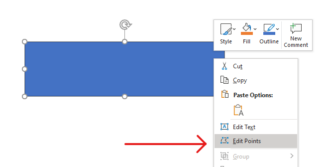

# Change a Shape Using Edit Points
Consider a square. In PowerPoint, using **edit points**, you can 

* move the square's corner in or out
* specify the curvature for a corner or point
* add new points to the square
* manipulate points on the square, etc. 

Essentially, you can perform the described tasks on any shape. Using edit points, you get to change a shape or create a new shape from an existing shape. 

## **Shape Editing Tips**



Before you start editing PowerPoint shapes through edit points, you might want to consider these points about shapes:

* A shape (or its path) can either be closed or open.
* When a shape is closed, it lacks a start or end point. When a shape is open, it has a beginning and end. 
* All shapes consist of at least 2 anchor points linked to each other by lines
* A line is either straight or curved. Anchor points determine the nature of the line. 
* Anchor points exist as corner points, straight points, or smooth points:
  * A corner point is a point where 2 straight lines join at an angle. 
  * A smooth point is a point where 2 handles exist in a straight line and the line's segments join in a smooth curve. In this case, all handles are separated from the anchor point by an equal distance. 
  * A straight point is a point where 2 handles exist in a straight line and that line's line segments joins in a smooth curve. In this case, the handles don't have to be separated from the anchor point by an equal distance. 
* By moving or editing anchor points (which changes the angle of lines), you can change the way a shape looks. 

To edit PowerPoint shapes through edit points, **Aspose.Slides** provides the [**GeometryPath**](https://reference.aspose.com/slides/androidjava/com.aspose.slides/GeometryPath) class and [**IGeometryPath**](https://reference.aspose.com/slides/androidjava/com.aspose.slides/IGeometryPath) interface.

* A [GeometryPath](https://reference.aspose.com/slides/androidjava/com.aspose.slides/GeometryPath) instance represents a geometry path of the [IGeometryShape](https://reference.aspose.com/slides/androidjava/com.aspose.slides/IGeometryShape) object.
* To retrieve the`GeometryPath` from the `IGeometryShape` instance, you can use the [IGeometryShape.getGeometryPaths](https://reference.aspose.com/slides/androidjava/com.aspose.slides/IGeometryShape#getGeometryPaths--) method.
* To set the `GeometryPath` for a shape, you can use these methods: [IGeometryShape.setGeometryPath](https://reference.aspose.com/slides/androidjava/com.aspose.slides/IGeometryShape#setGeometryPath-com.aspose.slides.IGeometryPath-) for *solid shapes* and [IGeometryShape.setGeometryPaths](https://reference.aspose.com/slides/androidjava/com.aspose.slides/IGeometryShape#setGeometryPaths-com.aspose.slides.IGeometryPath:A-) for *composite shapes*.
* To add segments, you can use the methods under [IGeometryPath](https://reference.aspose.com/slides/androidjava/com.aspose.slides/IGeometryPath).
* Using the [IGeometryPath.setStroke](https://reference.aspose.com/slides/androidjava/com.aspose.slides/IGeometryPath#setStroke-boolean-) and [IGeometryPath.setFillMode](https://reference.aspose.com/slides/androidjava/com.aspose.slides/IGeometryPath#setFillMode-byte-) methods, you can set the appearance for a geometry path.
* Using the [IGeometryPath.getPathData](https://reference.aspose.com/slides/androidjava/com.aspose.slides/IGeometryPath#getPathData--) method, you can retrieve the geometry path of a `GeometryShape` as an array of path segments.
* To access additional shape geometry customization options, you can convert [GeometryPath](https://reference.aspose.com/slides/androidjava/com.aspose.slides/GeometryPath) to [java.awt.Shape](https://docs.oracle.com/javase/7/docs/api/java/awt/Shape.html)
* Use [geometryPathToGraphicsPath](https://reference.aspose.com/slides/androidjava/com.aspose.slides/ShapeUtil#geometryPathToGraphicsPath-com.aspose.slides.IGeometryPath-) and [graphicsPathToGeometryPath](https://reference.aspose.com/slides/androidjava/com.aspose.slides/ShapeUtil#graphicsPathToGeometryPath-java.awt.Shape-) methods (from the [ShapeUtil](https://reference.aspose.com/slides/androidjava/com.aspose.slides/ShapeUtil) class) to convert [GeometryPath](https://reference.aspose.com/slides/androidjava/com.aspose.slides/GeometryPath) to [java.awt.Shape](https://docs.oracle.com/javase/7/docs/api/java/awt/Shape.html) back and forth.

## **Simple Editing Operations**

This Java code shows you how to

**Add a line** to the end of a path

``` java
public void lineTo(java.awt.geom.Point2D.Float point);
public void lineTo(float x, float y);
```
**Add a line** to a specified position on a path:

``` java    
public void lineTo(java.awt.geom.Point2D.Float point, long index);
public void lineTo(float x, float y, long index);
```
**Add a cubic Bezier curve** at the end of a path:

``` java
public void cubicBezierTo(java.awt.geom.Point2D.Float point1, java.awt.geom.Point2D.Float point2, java.awt.geom.Point2D.Float point3);
public void cubicBezierTo(float x1, float y1, float x2, float y2, float x3, float y3);
```
**Add a cubic Bezier curve** to the specified position on a path:

``` java
public void cubicBezierTo(java.awt.geom.Point2D.Float point1, java.awt.geom.Point2D.Float point2, java.awt.geom.Point2D.Float point3, long index);
public void cubicBezierTo(float x1, float y1, float x2, float y2, float x3, float y3, long index);
```
**Add a quadratic Bezier curve** at the end of a path:

``` java
public void quadraticBezierTo(java.awt.geom.Point2D.Float point1, java.awt.geom.Point2D.Float point2);
public void quadraticBezierTo(float x1, float y1, float x2, float y2);
```
**Add quadratic Bezier curve** to a specified position on a path:

``` java
public void quadraticBezierTo(java.awt.geom.Point2D.Float point1, java.awt.geom.Point2D.Float point2, long index);
public void quadraticBezierTo(float x1, float y1, float x2, float y2, long index);
```
**Append a given arc** to a path:

``` java
public void arcTo(float width, float heigth, float startAngle, float sweepAngle);
```
**Close the current figure** of a path:

``` java
public void closeFigure();
```
**Set the position for the next point**:

``` java
public void moveTo(java.awt.geom.Point2D.Float point);
public void moveTo(float x, float y);
```
**Remove the path segment** at a given index:

``` java
public void removeAt(int index);
```

## **Add Custom Points to Shape**
1. Create an instance of the [GeometryShape](https://reference.aspose.com/slides/androidjava/com.aspose.slides/GeometryShape) class and set the [ShapeType.Rectangle](https://reference.aspose.com/slides/androidjava/com.aspose.slides/ShapeType) type.
2. Get an instance of the [GeometryPath](https://reference.aspose.com/slides/androidjava/com.aspose.slides/GeometryPath) class from the shape.
3. Add a new point between the two top points on the path.
4. Add a new point between the two bottom points on the path.
5. Apply the path to the shape.

This Java code shows you how to add custom points to a shape:

``` java
Presentation pres = new Presentation();
try {
    GeometryShape shape = (GeometryShape) pres.getSlides().get_Item(0).
            getShapes().addAutoShape(ShapeType.Rectangle, 100, 100, 200, 100);
    IGeometryPath geometryPath = shape.getGeometryPaths()[0];

    geometryPath.lineTo(100, 50, 1);
    geometryPath.lineTo(100, 50, 4);
    shape.setGeometryPath(geometryPath);
} finally {
    if (pres != null) pres.dispose();
}
```


##  Remove Points From Shape

1. Create an instance of [GeometryShape](https://reference.aspose.com/slides/androidjava/com.aspose.slides/GeometryShape) class and set the [ShapeType.Heart](https://reference.aspose.com/slides/androidjava/com.aspose.slides/ShapeType) type.
2. Get an instance of the [GeometryPath](https://reference.aspose.com/slides/androidjava/com.aspose.slides/GeometryPath) class from the shape.
3. Remove the segment for the path.
4. Apply the path to the shape.

This Java code shows you how to remove points from a shape:

``` java
Presentation pres = new Presentation();
try {
    GeometryShape shape = (GeometryShape) pres.getSlides().get_Item(0).
            getShapes().addAutoShape(ShapeType.Heart, 100, 100, 300, 300);

    IGeometryPath path = shape.getGeometryPaths()[0];
    path.removeAt(2);
    shape.setGeometryPath(path);
} finally {
    if (pres != null) pres.dispose();
}
```


##  **Create Custom Shape**

1. Calculate the points for the shape.
2. Create an instance of the [GeometryPath](https://reference.aspose.com/slides/androidjava/com.aspose.slides/GeometryPath) class.
3. Fill the path with the points.
4. Create an instance of the [GeometryShape](https://reference.aspose.com/slides/androidjava/com.aspose.slides/GeometryShape) class.
5. Apply the path to the shape.

This Java shows you how to create a custom shape:

``` java
List<Point2D.Float> points = new ArrayList<Point2D.Float>();

float R = 100, r = 50;
int step = 72;

for (int angle = -90; angle < 270; angle += step)
{
    double radians = angle * (Math.PI / 180f);
    double x = R * Math.cos(radians);
    double y = R * Math.sin(radians);
    points.add(new Point2D.Float((float)x + R, (float)y + R));

    radians = Math.PI * (angle + step / 2) / 180.0;
    x = r * Math.cos(radians);
    y = r * Math.sin(radians);
    points.add(new Point2D.Float((float)x + R, (float)y + R));
}

GeometryPath starPath = new GeometryPath();
starPath.moveTo(points.get(0));

for (int i = 1; i < points.size(); i++)
{
    starPath.lineTo(points.get(i));
}

starPath.closeFigure();

Presentation pres = new Presentation();
try {
    GeometryShape shape = (GeometryShape) pres.getSlides().get_Item(0).
            getShapes().addAutoShape(ShapeType.Rectangle, 100, 100, R * 2, R * 2);

    shape.setGeometryPath(starPath);
} finally {
    if (pres != null) pres.dispose();
}

```


## **Create Composite Custom Shape**

  1. Create an instance of the [GeometryShape](https://reference.aspose.com/slides/androidjava/com.aspose.slides/GeometryShape) class.
  2. Create a first instance of the [GeometryPath](https://reference.aspose.com/slides/androidjava/com.aspose.slides/GeometryPath) class.
  3. Create a second instance of the [GeometryPath](https://reference.aspose.com/slides/androidjava/com.aspose.slides/GeometryPath) class.
  4. Apply the paths to the shape.

This Java code shows you to create a composite custom shape:

``` java
Presentation pres = new Presentation();
try {
    GeometryShape shape = (GeometryShape) pres.getSlides().get_Item(0).
            getShapes().addAutoShape(ShapeType.Rectangle, 100, 100, 200, 100);

    GeometryPath geometryPath0 = new GeometryPath();
    geometryPath0.moveTo(0, 0);
    geometryPath0.lineTo(shape.getWidth(), 0);
    geometryPath0.lineTo(shape.getWidth(), shape.getHeight()/3);
    geometryPath0.lineTo(0, shape.getHeight() / 3);
    geometryPath0.closeFigure();

    GeometryPath geometryPath1 = new GeometryPath();
    geometryPath1.moveTo(0, shape.getHeight()/3 * 2);
    geometryPath1.lineTo(shape.getWidth(), shape.getHeight() / 3 * 2);
    geometryPath1.lineTo(shape.getWidth(), shape.getHeight());
    geometryPath1.lineTo(0, shape.getHeight());
    geometryPath1.closeFigure();

    shape.setGeometryPaths(new GeometryPath[] { geometryPath0, geometryPath1});
} finally {
    if (pres != null) pres.dispose();
}
```


## **Create Custom Shape With Curved Corners**

This Java code shows you how to create a custom shape with curved corners (inwards);

```java
float shapeX = 20f;
float shapeY = 20f;
float shapeWidth = 300f;
float shapeHeight = 200f;

float leftTopSize = 50f;
float rightTopSize = 20f;
float rightBottomSize = 40f;
float leftBottomSize = 10f;

Presentation pres = new Presentation();
try {
    IAutoShape childShape = pres.getSlides().get_Item(0).getShapes().addAutoShape(
            ShapeType.Custom, shapeX, shapeY, shapeWidth, shapeHeight);

    GeometryPath geometryPath = new GeometryPath();

    Point2D.Float point1 = new Point2D.Float(leftTopSize, 0);
    Point2D.Float point2 = new Point2D.Float(shapeWidth - rightTopSize, 0);
    Point2D.Float point3 = new Point2D.Float(shapeWidth, shapeHeight - rightBottomSize);
    Point2D.Float point4 = new Point2D.Float(leftBottomSize, shapeHeight);
    Point2D.Float point5 = new Point2D.Float(0, leftTopSize);

    geometryPath.moveTo(point1);
    geometryPath.lineTo(point2);
    geometryPath.arcTo(rightTopSize, rightTopSize, 180, -90);
    geometryPath.lineTo(point3);
    geometryPath.arcTo(rightBottomSize, rightBottomSize, -90, -90);
    geometryPath.lineTo(point4);
    geometryPath.arcTo(leftBottomSize, leftBottomSize, 0, -90);
    geometryPath.lineTo(point5);
    geometryPath.arcTo(leftTopSize, leftTopSize, 90, -90);

    geometryPath.closeFigure();

    childShape.setGeometryPath(geometryPath);

    pres.save("output.pptx", SaveFormat.Pptx);
} finally {
    if (pres!= null) pres.dispose();
}
```

## **Find Out If a Shape Geometry Is Closed**

A closed shape is defined as one where all its sides connect, forming a single boundary without gaps. Such a shape can be a simple geometric form or a complex custom outline. The following code example shows how to check if a shape geometry is closed:

```java
boolean isGeometryClosed(IGeometryShape geometryShape)
{
    Boolean isClosed = null;

    for (IGeometryPath geometryPath : geometryShape.getGeometryPaths()) {
        int dataLength = geometryPath.getPathData().length;
        if (dataLength == 0)
            continue;

        IPathSegment lastSegment = geometryPath.getPathData()[dataLength - 1];
        isClosed = lastSegment.getPathCommand() == PathCommandType.Close;

        if (isClosed == false)
            return false;
    }

    return isClosed == true;
}
```

## **Convert GeometryPath to java.awt.Shape** 

1. Create an instance of the [GeometryShape](https://reference.aspose.com/slides/androidjava/com.aspose.slides/GeometryShape) class.
2. Create an instance of the [java.awt.Shape](https://docs.oracle.com/javase/7/docs/api/java/awt/Shape.html) class.
3. Convert the [java.awt.Shape](https://docs.oracle.com/javase/7/docs/api/java/awt/Shape.html) instance to the [GeometryPath](https://reference.aspose.com/slides/androidjava/com.aspose.slides/GeometryPath) instance using [ShapeUtil](https://reference.aspose.com/slides/androidjava/com.aspose.slides/ShapeUtil).
4. Apply the paths to the shape.

This Java code—an implementation of the steps above—demonstrates the **GeometryPath** to **GraphicsPath** conversion process:

``` java
Presentation pres = new Presentation();
try {
    // Create new shape
    GeometryShape shape = (GeometryShape)pres.getSlides().get_Item(0).
            getShapes().addAutoShape(ShapeType.Rectangle, 100, 100, 300, 100);

    // Get geometry path of the shape
    IGeometryPath originalPath = shape.getGeometryPaths()[0];
    originalPath.setFillMode(PathFillModeType.None);

    // Create new graphics path with text
    Shape graphicsPath;
    Font font = new java.awt.Font("Arial", Font.PLAIN, 40);
    String text = "Text in shape";
    BufferedImage img = new BufferedImage(100, 100, BufferedImage.TYPE_INT_ARGB);
    Graphics2D g2 = img.createGraphics();

    try
    {
        GlyphVector glyphVector = font.createGlyphVector(g2.getFontRenderContext(), text);
        graphicsPath = glyphVector.getOutline(20f, ((float) -glyphVector.getVisualBounds().getY()) + 10);
    }
    finally {
        g2.dispose();
    }

    // Convert graphics path to geometry path
    IGeometryPath textPath = ShapeUtil.graphicsPathToGeometryPath(graphicsPath);
    textPath.setFillMode(PathFillModeType.Normal);

    // Set combination of new geometry path and origin geometry path to the shape
    shape.setGeometryPaths(new IGeometryPath[] { originalPath, textPath });
} finally {
    if (pres != null) pres.dispose();
}
```

