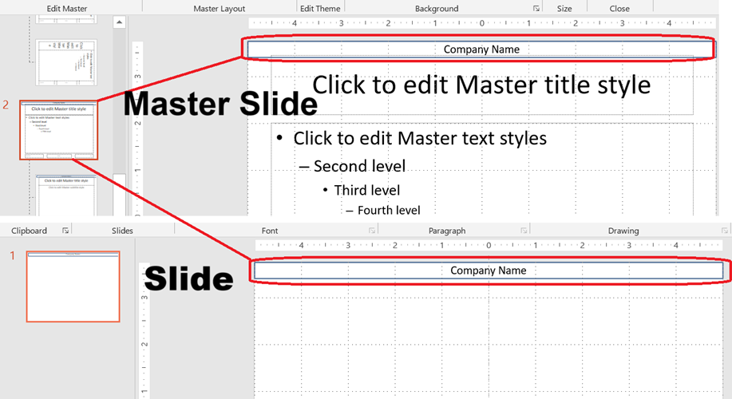

Master slides form the top level of the slide inheritance hierarchy in PowerPoint. A **master slide** defines common design elements such as backgrounds, logos, and text formatting. **Layout slides** inherit from master slides, and **normal slides** inherit from layout slides.

This article demonstrates how to create, modify, and manage master slides using Aspose.Slides for Android via Java.

## **Add a Master Slide**

This example shows how to create a new master slide by cloning the default one. It then adds a company name banner to all slides through layout inheritance.

```java
static void addMasterSlide() {
    Presentation presentation = new Presentation();
    try {
        // Clone the default master slide.
        IMasterSlide defaultMasterSlide = presentation.getMasters().get_Item(0);
        IMasterSlide newMasterSlide = presentation.getMasters().addClone(defaultMasterSlide);

        // Add a banner with company name to the top of the master slide.
        IAutoShape textBox = newMasterSlide.getShapes().addAutoShape(ShapeType.Rectangle, 0, 0, 720, 25);
        textBox.getTextFrame().setText("Company Name");
        IParagraph paragraph = textBox.getTextFrame().getParagraphs().get_Item(0);
        paragraph.getParagraphFormat().getDefaultPortionFormat().getFillFormat().setFillType(FillType.Solid);
        paragraph.getParagraphFormat().getDefaultPortionFormat().getFillFormat().getSolidFillColor().setColor(Color.BLACK);
        textBox.getFillFormat().setFillType(FillType.NoFill);

        // Assign the new master slide to a layout slide.
        ILayoutSlide layoutSlide = presentation.getLayoutSlides().get_Item(0);
        layoutSlide.setMasterSlide(newMasterSlide);

        // Assign the layout slide to the first slide in the presentation.
        presentation.getSlides().get_Item(0).setLayoutSlide(layoutSlide);
    } finally {
        presentation.dispose();
    }
}
```

> 💡 **Note 1:** Master slides provide a way to apply consistent branding or shared design elements across all slides. Any changes made to the master will automatically reflect on dependent layout and normal slides.

> 💡 **Note 2:** Any shapes or formatting added to a master slide are inherited by layout slides and, in turn, all normal slides using those layouts.
> The image below illustrates how a text box added on a master slide is automatically rendered on the final slide.



## **Access a Master Slide**

You can access master slides using the presentation master collection. Here’s how to retrieve and work with them:

```java
static void accessMasterSlide() {
    Presentation presentation = new Presentation();
    try {
        IMasterSlide firstMasterSlide = presentation.getMasters().get_Item(0);

        // Change the background type.
        firstMasterSlide.getBackground().setType(BackgroundType.OwnBackground);
    } finally {
        presentation.dispose();
    }
}
```

## **Remove a Master Slide**

Master slides can be removed either by index or by reference.

```java
static void removeMasterSlide() {
    Presentation presentation = new Presentation("sample.pptx");
    try {
        // Remove a master slide by index.
        presentation.getMasters().removeAt(0);

        // Remove a master slide by reference.
        IMasterSlide firstMasterSlide = presentation.getMasters().get_Item(0);
        presentation.getMasters().remove(firstMasterSlide);
    } finally {
        presentation.dispose();
    }
}
```

## **Remove Unused Master Slides**

Some presentations contain master slides that are not in use. Removing these slides can help reduce file size.

```java
static void removeUnusedMasterSlide() {
    Presentation presentation = new Presentation();
    try {
        // Remove all unused master slides (even those marked as Preserve).
        presentation.getMasters().removeUnused(true);
    } finally {
        presentation.dispose();
    }
}
```
