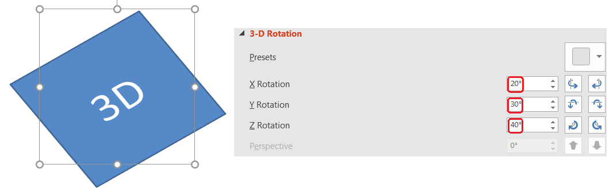
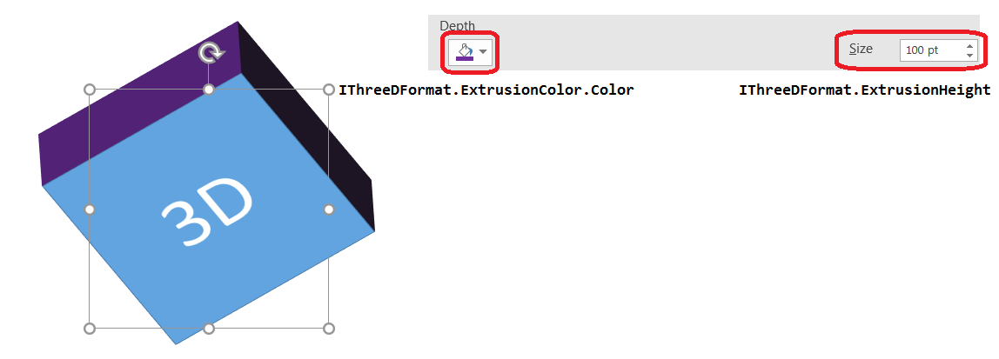
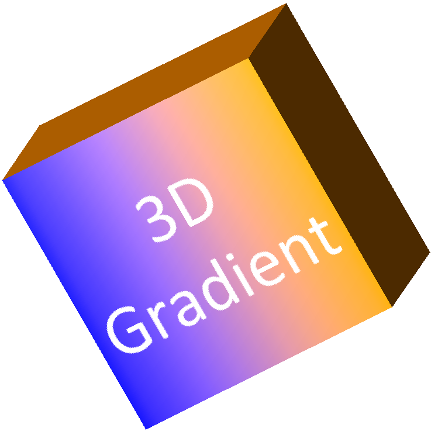
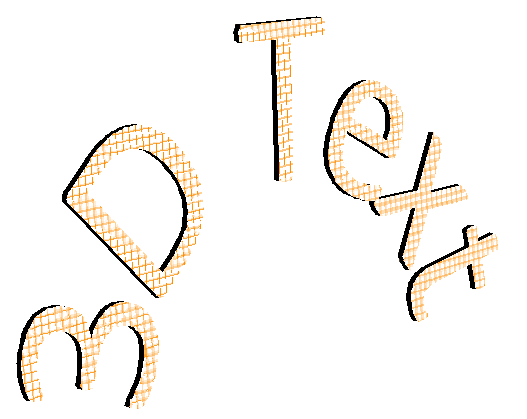

## **Overview**
Since Aspose.Slides 20.9 its possible to create and modify PowerPoint 3D models. This can be achieved by bringing 2D shapes a set of 3D effects. By creating a camera 
view on the shape, you may rotate it by the axis. Create an extrusion or depth on the shape, which will transform the shape from a 2d shape to a 3D model. 
Setting the light effect on the 3D shape or changing the materials can make it look more alive. Changing the colors of 3D models to a 3D gradient, 
modifying shapes contour, adding a bevel make 3D model more volume. All the 3D effects can be applied on both PowerPoint 3D models and texts.

Let us observe the first example of creating 3D models, which includes all the abovementioned features:
``` cpp
using namespace Aspose::Slides;
using namespace Aspose::Slides::Export;

auto imageScale = 2;

auto presentation = System::MakeObject<Presentation>();
auto slide = presentation->get_Slide(0);

auto shape = slide->get_Shapes()->AddAutoShape(ShapeType::Rectangle, 200.0f, 150.0f, 200.0f, 200.0f);
shape->get_TextFrame()->set_Text(u"3D");
shape->get_TextFrame()->get_Paragraphs()->idx_get(0)->get_ParagraphFormat()->get_DefaultPortionFormat()->set_FontHeight(64.0f);

shape->get_ThreeDFormat()->get_Camera()->set_CameraType(CameraPresetType::OrthographicFront);
shape->get_ThreeDFormat()->get_Camera()->SetRotation(20.0f, 30.0f, 40.0f);
shape->get_ThreeDFormat()->get_LightRig()->set_LightType(LightRigPresetType::ThreePt);
shape->get_ThreeDFormat()->get_LightRig()->set_Direction(LightingDirection::Top);
shape->get_ThreeDFormat()->set_Material(MaterialPresetType::Matte);
shape->get_ThreeDFormat()->set_ExtrusionHeight(100);
shape->get_ThreeDFormat()->get_ExtrusionColor()->set_Color(System::Drawing::Color::get_Blue());

auto thumbnail = slide->GetImage(imageScale, imageScale);
thumbnail->Save(u"sample_3d.png");
thumbnail->Dispose();

presentation->Save(u"sandbox_3d.pptx", Export::SaveFormat::Pptx);
presentation->Dispose();
```

The resulting PowerPoint 3D model:


## **3D Rotation**
In PowerPoint shape rotation is available via:



To rotate PowerPoint 3D models, it is necessary to create a camera view on the shape. This is done with [IThreeDFormat.get_Camera()](https://reference.aspose.com/slides/cpp/class/aspose.slides.three_d_format#ad2f989bd1fd64fd4136e1f17660035d4) 
method. The rotation method is called from the camera class as if you would be 
rotating the camera. In fact, when you rotate the camera relatively to the shape, you rotate the shape on the 3D plane.

``` cpp
auto shape = slide->get_Shapes()->AddAutoShape(ShapeType::Rectangle, 200.0f, 150.0f, 200.0f, 200.0f);
shape->get_ThreeDFormat()->get_Camera()->SetRotation(20.0f, 30.0f, 40.0f);
// ... set other 3D scene parameters

auto thumbnail = slide->GetImage(imageScale, imageScale);
thumbnail->Save(u"sample_3d.png");
thumbnail->Dispose();
```

## **3D Depth and Extrusion**
To add depth and extrusion for a PowerPoint 3D model use 
[IThreeDFormat.set_ExtrusionHeight()](https://reference.aspose.com/slides/cpp/class/aspose.slides.three_d_format#adf0bad4894b1c36d9e4b044ef4978295) method.
For modifying extrusion color use 
[IThreeDFormat.get_ExtrusionColor()](https://reference.aspose.com/slides/cpp/class/aspose.slides.three_d_format#aa7db8859d23a9b4eb2f35f3a42025e9e) method:

``` cpp
auto shape = slide->get_Shapes()->AddAutoShape(ShapeType::Rectangle, 200.0f, 150.0f, 200.0f, 200.0f);
shape->get_ThreeDFormat()->get_Camera()->SetRotation(20.0f, 30.0f, 40.0f);
shape->get_ThreeDFormat()->set_ExtrusionHeight(100.0);
shape->get_ThreeDFormat()->get_ExtrusionColor()->set_Color(System::Drawing::Color::get_Purple());
// ... set other 3D scene parameters

auto thumbnail = slide->GetImage(imageScale, imageScale);
thumbnail->Save(u"sample_3d.png");
thumbnail->Dispose();
```

Depth menu in PowerPoint:




## **3D Gradient**
Drawing a 3D gradient on PowerPoint 3D model can be done via 
[Shape.get_FillFormat().get_GradientFormat()](https://reference.aspose.com/slides/cpp/class/aspose.slides.fill_format#a1f075336cb7a0e05cd5d7a706b6f4f58) 
method:

``` cpp
using namespace Aspose::Slides;

auto imageScale = 2;

auto presentation = System::MakeObject<Presentation>();
auto slide = presentation->get_Slide(0);

auto shape = slide->get_Shapes()->AddAutoShape(ShapeType::Rectangle, 200.0f, 150.0f, 250.0f, 250.0f);
shape->get_TextFrame()->set_Text(u"3D Gradient");
shape->get_TextFrame()->get_Paragraph(0)->get_ParagraphFormat()->get_DefaultPortionFormat()->set_FontHeight(64.0f);

shape->get_FillFormat()->set_FillType(FillType::Gradient);
shape->get_FillFormat()->get_GradientFormat()->get_GradientStops()->Add(0, System::Drawing::Color::get_Blue());
shape->get_FillFormat()->get_GradientFormat()->get_GradientStops()->Add(100.0f, System::Drawing::Color::get_Orange());

shape->get_ThreeDFormat()->get_Camera()->set_CameraType(CameraPresetType::OrthographicFront);
shape->get_ThreeDFormat()->get_Camera()->SetRotation(10.0f, 20.0f, 30.0f);
shape->get_ThreeDFormat()->get_LightRig()->set_LightType(LightRigPresetType::Flat);
shape->get_ThreeDFormat()->get_LightRig()->set_Direction(LightingDirection::Top);
shape->get_ThreeDFormat()->set_ExtrusionHeight(150.0);
shape->get_ThreeDFormat()->get_ExtrusionColor()->set_Color(System::Drawing::Color::get_DarkOrange());

auto thumbnail = slide->GetImage(imageScale, imageScale);
thumbnail->Save(u"sample_3d.png");
thumbnail->Dispose();
```

3D model with 3D gradient:


  
To create image gradient use 
[Shape.get_FillFormat().get_PictureFillFormat()](https://reference.aspose.com/slides/cpp/class/aspose.slides.fill_format#ac01c9a38197ddcd80c180aceeaf155cb) method:
``` cpp
auto imageData = System::IO::File::ReadAllBytes(u"image.jpg");
auto image = presentation->get_Images()->AddImage(imageData);

shape->get_FillFormat()->set_FillType(FillType::Picture);
shape->get_FillFormat()->get_PictureFillFormat()->get_Picture()->set_Image(image);
shape->get_FillFormat()->get_PictureFillFormat()->set_PictureFillMode(PictureFillMode::Stretch);
// .. setup 3D: Camera, LightRig, Extrusion

auto thumbnail = slide->GetImage(imageScale, imageScale);
thumbnail->Save(u"sample_3d.png");
thumbnail->Dispose();
```


3d model with image gradient:


## **3D Text (WordArt)**
To apply rotation, extrusion, light, gradient on text and make it a 3D text(WordArt), you need to access [IAutoShape.get_TextFrame().get_TextFrameFormat().get_ThreeDFormat()](https://reference.aspose.com/slides/cpp/class/aspose.slides.i_text_frame_format#a5e681109403c2e57aa76a500fe508b30) method:

``` cpp
using namespace Aspose::Slides;
using namespace Aspose::Slides::Export;

auto imageScale = 2;

auto presentation = System::MakeObject<Presentation>();
auto slide = presentation->get_Slide(0);

auto shape = slide->get_Shapes()->AddAutoShape(ShapeType::Rectangle, 200.0f, 150.0f, 250.0f, 250.0f);
shape->get_FillFormat()->set_FillType(FillType::NoFill);
shape->get_LineFormat()->get_FillFormat()->set_FillType(FillType::NoFill);
shape->get_TextFrame()->set_Text(u"3D Text");

auto portion = shape->get_TextFrame()->get_Paragraph(0)->get_Portion(0);
portion->get_PortionFormat()->get_FillFormat()->set_FillType(FillType::Pattern);
portion->get_PortionFormat()->get_FillFormat()->get_PatternFormat()->get_ForeColor()->set_Color(System::Drawing::Color::get_DarkOrange());
portion->get_PortionFormat()->get_FillFormat()->get_PatternFormat()->get_BackColor()->set_Color(System::Drawing::Color::get_White());
portion->get_PortionFormat()->get_FillFormat()->get_PatternFormat()->set_PatternStyle(PatternStyle::LargeGrid);

shape->get_TextFrame()->get_Paragraph(0)->get_ParagraphFormat()->get_DefaultPortionFormat()->set_FontHeight(128.0f);

auto textFrameFormat = shape->get_TextFrame()->get_TextFrameFormat();
// setup "Arch Up" WordArt transform effect
textFrameFormat->set_Transform(TextShapeType::ArchUp);

textFrameFormat->get_ThreeDFormat()->set_ExtrusionHeight(3.5);
textFrameFormat->get_ThreeDFormat()->set_Depth(3.0);
textFrameFormat->get_ThreeDFormat()->set_Material(MaterialPresetType::Plastic);
textFrameFormat->get_ThreeDFormat()->get_LightRig()->set_Direction(LightingDirection::Top);
textFrameFormat->get_ThreeDFormat()->get_LightRig()->set_LightType(LightRigPresetType::Balanced);
textFrameFormat->get_ThreeDFormat()->get_LightRig()->SetRotation(0.0f, 0.0f, 40.0f);

textFrame->get_TextFrameFormat()->get_ThreeDFormat()->get_Camera()->set_CameraType(CameraPresetType::PerspectiveContrastingRightFacing);

auto thumbnail = slide->GetImage(imageScale, imageScale);
thumbnail->Save(u"text3d.png");
thumbnail->Dispose();

presentation->Save(u"text3d.pptx", SaveFormat::Pptx);
presentation->Dispose();
```

An example of 3D text (WordArt):



## **FAQ**

**Will 3D effects be preserved when exporting a presentation to images/PDF/HTML?**

Yes. The Slides 3D engine renders 3D effects when exporting to supported formats ([images](/slides/cpp/convert-powerpoint-to-png/), [PDF](/slides/cpp/convert-powerpoint-to-pdf/), [HTML](/slides/cpp/convert-powerpoint-to-html/), etc.).

**Can I retrieve the "effective" (final) 3D parameter values that account for themes, inheritance, etc.?**

Yes. Slides provides APIs to [read effective values](/slides/cpp/shape-effective-properties/) (including for 3D—lighting, bevels, etc.) so you can see the final applied settings.

**Do 3D effects work when converting a presentation to video?**

Yes. When [generating frames for the video](/slides/cpp/convert-powerpoint-to-video/), 3D effects are rendered just as they are for [exported images](/slides/cpp/convert-powerpoint-to-png/).
