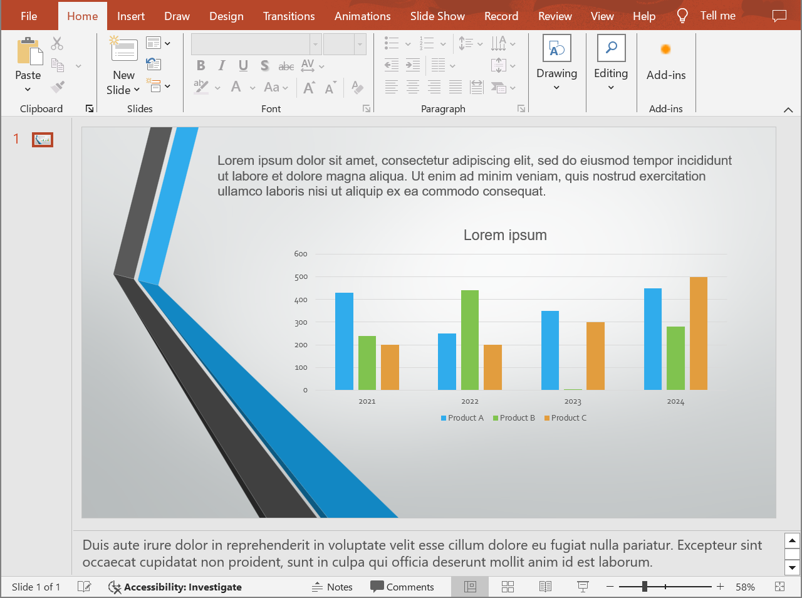
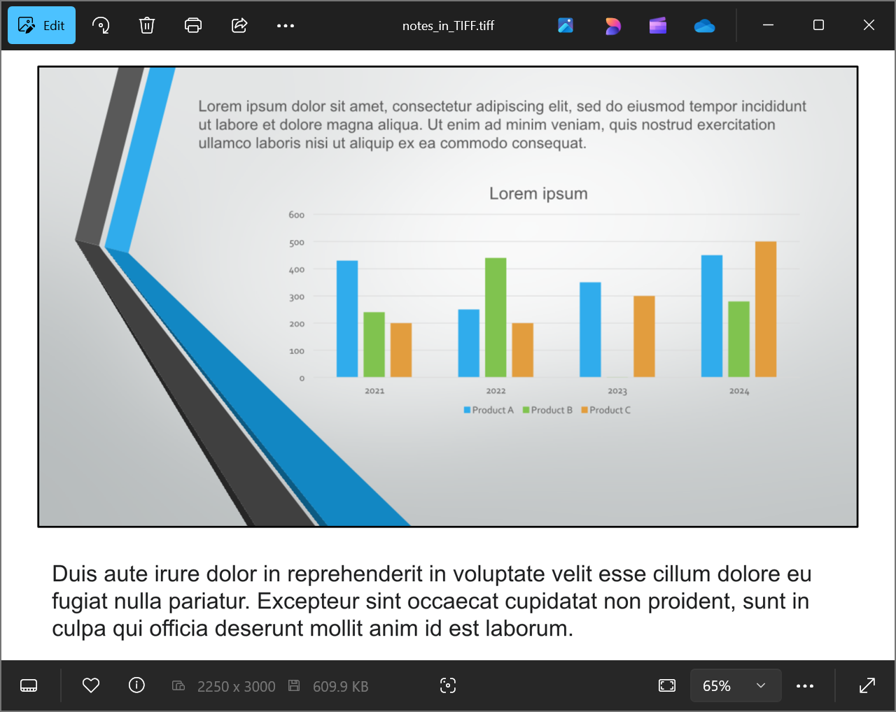

## **Overview**

Aspose.Slides for C++ provides a simple solution for converting PowerPoint and OpenDocument presentations (PPT, PPTX, and ODP) with notes to the TIFF format. This format is widely used for high-quality image storage, printing, and document archiving. With Aspose.Slides, you can not only export entire presentations with speaker notes but also generate slide thumbnails in the Notes Slide view. The conversion process is simple and efficient, utilizing the `Save` method of the [Presentation](https://reference.aspose.com/slides/cpp/aspose.slides/presentation/) class to transform the entire presentation into a series of TIFF images while preserving the notes and layout.

## **Convert a Presentation to TIFF with Notes**

Saving a PowerPoint or OpenDocument presentation to TIFF with notes using Aspose.Slides for C++ involves the following steps:

1. Instantiate the [Presentation](https://reference.aspose.com/slides/cpp/aspose.slides/presentation/) class: Load a PowerPoint or OpenDocument file.
1. Configure the output layout options: Use the [NotesCommentsLayoutingOptions](https://reference.aspose.com/slides/cpp/aspose.slides.export/notescommentslayoutingoptions/) class to specify how notes and comments should be displayed.
1. Save the presentation to TIFF: Pass the configured options to the [Save](https://reference.aspose.com/slides/cpp/aspose.slides/presentation/save/) method.

Let's say we have a "speaker_notes.pptx" file with the following slide:



The code snippet below demonstrates how to convert the presentation to a TIFF image in Notes Slide view using the [set_SlidesLayoutOptions](https://reference.aspose.com/slides/cpp/aspose.slides.export/tiffoptions/set_slideslayoutoptions/) method.

```cpp
// Instantiate the Presentation class that represents a presentation file.
auto presentation = MakeObject<Presentation>(u"speaker_notes.pptx");

auto notesOptions = MakeObject<NotesCommentsLayoutingOptions>();
notesOptions->set_NotesPosition(NotesPositions::BottomFull); // Display the notes below the slide.

// Configure the TIFF options with Notes layouting.
auto tiffOptions = MakeObject<TiffOptions>();
tiffOptions->set_DpiX(300);
tiffOptions->set_DpiY(300);
tiffOptions->set_SlidesLayoutOptions(notesOptions);

// Save the presentation to TIFF with the speaker notes.
presentation->Save(u"TIFF_with_notes.tiff", SaveFormat::Tiff, tiffOptions);

presentation->Dispose();
```

The result:



{}

Check out Aspose [Free PowerPoint to Poster Converter](https://products.aspose.app/slides/conversion/convert-ppt-to-poster-online).

{}
