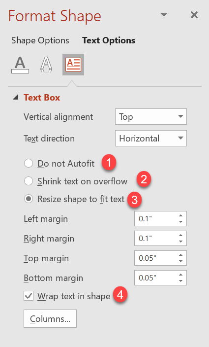
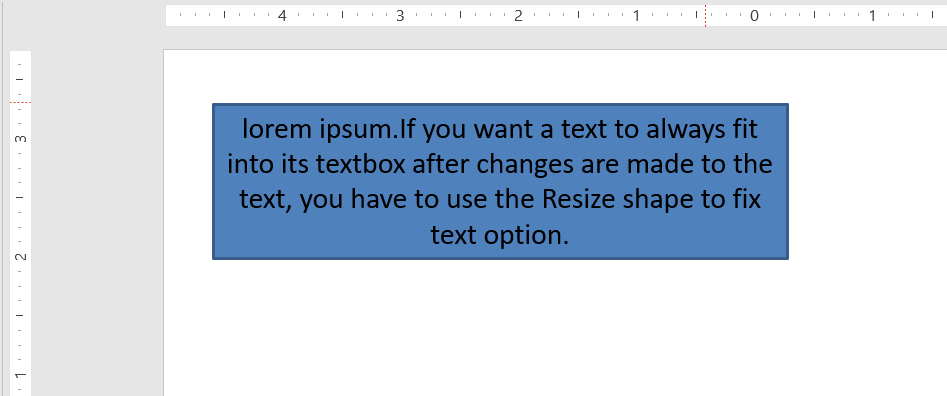
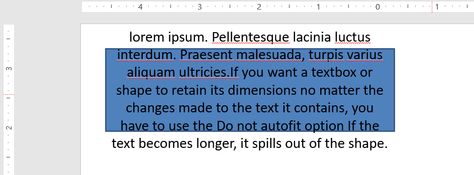

By default, when you add a textbox, Microsoft PowerPoint uses the **Resize shape to fix text** setting for the textbox—it automatically resizes the textbox to ensure its text always fits into it. 


* When the text in the textbox becomes longer or bigger, PowerPoint automatically enlarges the textbox—increases its height—to allow it to hold more text. 
* When the text in the textbox becomes shorter or smaller, PowerPoint automatically reduces the textbox—decreases its height—to clear redundant space. 

In PowerPoint, these are the 4 important parameters or options that control the autofit behavior for a textbox: 

* **Do not Autofit**
* **Shrink text on overflow**
* **Resize shape to fit text**
* **Wrap text in shape.**



Aspose.Slides for C++ provides similar options—some methods under the [TextFrameFormat](https://reference.aspose.com/slides/cpp/class/aspose.slides.text_frame_format) class—that allow you to control the autofit behavior for textboxes in presentations. 

## **Resize Shape to Fit Text**

If you want the text in a box to always fit into that box after changes are made to the text, you have to use the **Resize shape to fix text** option. To specify this setting, set the [AutofitType](https://reference.aspose.com/slides/cpp/class/aspose.slides.text_frame_format#acc706fb4d991d137831a6d50eea05e73) property (from the [TextFrameFormat](https://reference.aspose.com/slides/cpp/class/aspose.slides.text_frame_format) class) to `Shape`.



This C++ code shows you how to specify that a text must always fit into its box in a PowerPoint presentation:

```cpp
auto pres = System::MakeObject<Presentation>();
auto slide = pres->get_Slides()->idx_get(0);
auto autoShape = slide->get_Shapes()->AddAutoShape(ShapeType::Rectangle, 30.0f, 30.0f, 350.0f, 100.0f);
auto textFrame = autoShape->get_TextFrame();

auto portion = System::MakeObject<Portion>(u"lorem ipsum...");
auto fillFormat = portion->get_PortionFormat()->get_FillFormat();
fillFormat->get_SolidFillColor()->set_Color(Color::get_Black());
fillFormat->set_FillType(FillType::Solid);
textFrame->get_Paragraphs()->idx_get(0)->get_Portions()->Add(portion);

auto textFrameFormat = textFrame->get_TextFrameFormat();
textFrameFormat->set_AutofitType(TextAutofitType::Shape);

pres->Save(u"Output-presentation.pptx", SaveFormat::Pptx);
```

If the text becomes longer or bigger, the textbox will be automatically resized (increase in height) to ensure all the text fits into it. If the text becomes shorter, the reverse occurs. 

## **Do Not Autofit**

If you want a textbox or shape to retain its dimensions no matter the changes made to the text it contains, you have to use the **Do not Autofit** option. To specify this setting, set the [AutofitType](https://reference.aspose.com/slides/cpp/class/aspose.slides.text_frame_format#acc706fb4d991d137831a6d50eea05e73) property (from the [TextFrameFormat](https://reference.aspose.com/slides/cpp/class/aspose.slides.text_frame_format) class) to `None`. 



This C++ code shows you how to specify that a textbox must always retain its dimensions in a PowerPoint presentation:

```cpp
auto pres = System::MakeObject<Presentation>();
auto slide = pres->get_Slides()->idx_get(0);
auto autoShape = slide->get_Shapes()->AddAutoShape(ShapeType::Rectangle, 30.0f, 30.0f, 350.0f, 100.0f);
auto textFrame = autoShape->get_TextFrame();

auto portion = System::MakeObject<Portion>(u"lorem ipsum...");
auto fillFormat = portion->get_PortionFormat()->get_FillFormat();
fillFormat->get_SolidFillColor()->set_Color(Color::get_Black());
fillFormat->set_FillType(FillType::Solid);
textFrame->get_Paragraphs()->idx_get(0)->get_Portions()->Add(portion);

auto textFrameFormat = textFrame->get_TextFrameFormat();
textFrameFormat->set_AutofitType(TextAutofitType::None);

pres->Save(u"Output-presentation.pptx", SaveFormat::Pptx);
```

When the text becomes too long for its box, it spills out. 

## **Shrink Text on Overflow**

If a text becomes too long for its box, through the **Shrink text on overflow** option, you can specify that the text's size and spacing must be reduced to make it fit into its box. To specify this setting, set the [AutofitType](https://reference.aspose.com/slides/cpp/class/aspose.slides.text_frame_format#acc706fb4d991d137831a6d50eea05e73) property (from the [TextFrameFormat](https://reference.aspose.com/slides/cpp/class/aspose.slides.text_frame_format) class) to `Normal`.


This C++ code shows you how to specify that a text must be shrunk on overflow in a PowerPoint presentation:

```cpp
auto pres = System::MakeObject<Presentation>();
auto slide = pres->get_Slides()->idx_get(0);
auto autoShape = slide->get_Shapes()->AddAutoShape(ShapeType::Rectangle, 30.0f, 30.0f, 350.0f, 100.0f);
auto textFrame = autoShape->get_TextFrame();

auto portion = System::MakeObject<Portion>(u"lorem ipsum...");
auto fillFormat = portion->get_PortionFormat()->get_FillFormat();
fillFormat->get_SolidFillColor()->set_Color(Color::get_Black());
fillFormat->set_FillType(FillType::Solid);
textFrame->get_Paragraphs()->idx_get(0)->get_Portions()->Add(portion);

auto textFrameFormat = textFrame->get_TextFrameFormat();
textFrameFormat->set_AutofitType(TextAutofitType::Normal);

pres->Save(u"Output-presentation.pptx", SaveFormat::Pptx);
```

{}

When the **Shrink text on overflow** option is used, the setting gets applied only when the text becomes too long for its box. 

{}

## **Wrap Text**

If you want the text in a shape to get wrapped inside that shape when the text goes beyond the shape's border (width only), you have to use the **Wrap text in shape** parameter. To specify this setting, you have to set the [WrapText](https://reference.aspose.com/slides/cpp/class/aspose.slides.text_frame_format#aecc980adb13e3cf7162d09f99b5bbfd1) property (from the [TextFrameFormat](https://reference.aspose.com/slides/cpp/class/aspose.slides.text_frame_format) class) to `true`. 

This C++ code shows you how to use the Wrap Text setting in a PowerPoint presentation:

```cpp
auto pres = System::MakeObject<Presentation>();
auto slide = pres->get_Slides()->idx_get(0);
auto autoShape = slide->get_Shapes()->AddAutoShape(ShapeType::Rectangle, 30.0f, 30.0f, 350.0f, 100.0f);
auto textFrame = autoShape->get_TextFrame();

auto portion = System::MakeObject<Portion>(u"lorem ipsum...");
auto fillFormat = portion->get_PortionFormat()->get_FillFormat();
fillFormat->get_SolidFillColor()->set_Color(Color::get_Black());
fillFormat->set_FillType(FillType::Solid);
textFrame->get_Paragraphs()->idx_get(0)->get_Portions()->Add(portion);

auto textFrameFormat = textFrame->get_TextFrameFormat();
textFrameFormat->set_WrapText(NullableBool::True);

pres->Save(u"Output-presentation.pptx", SaveFormat::Pptx);
```

{} 

If you set the `WrapText` property to `False` for a shape, when the text inside the shape becomes longer than the shape's width, the text gets extended beyond the shape's borders along a single line. 

{}


