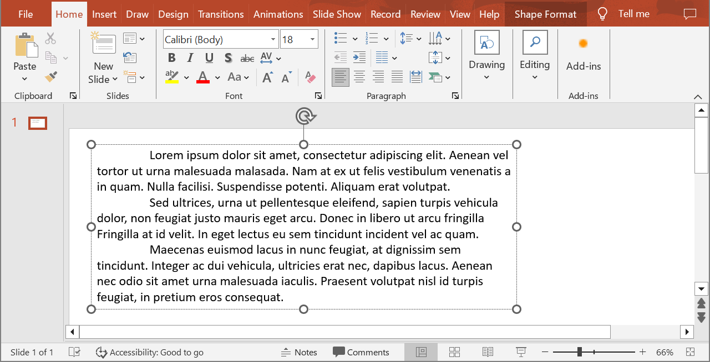
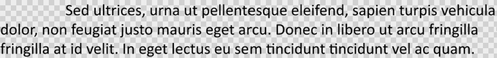

Aspose.Slides provides all the interfaces and classes you need to work with PowerPoint texts, paragraphs, and portions in C++.

* Aspose.Slides provides the [ITextFrame](https://reference.aspose.com/slides/cpp/aspose.slides/itextframe/) interface to allow you to add objects that represent a paragraph. An `ITextFame` object can have one or multiple paragraphs (each paragraph is created through a carriage return).
* Aspose.Slides provides the [IParagraph](https://reference.aspose.com/slides/cpp/aspose.slides/iparagraph/) interface to allow you to add objects that represent portions. An `IParagraph` object can have one or multiple portions (collection of iPortions objects).
* Aspose.Slides provides [IPortion](https://reference.aspose.com/slides/cpp/aspose.slides/iportion/) interface to allow you to add objects that represent texts and their formatting properties. 

An `IParagraph` object is capable of handling texts with different formatting properties through its underlying `IPortion` objects.

## **Add Multiple Paragraphs Containing Multiple Portions**

These steps show you how to add a text frame containing 3 paragraphs and each paragraph containing 3 portions:

1. Create an instance of the [Presentation](https://reference.aspose.com/slides/cpp/aspose.slides/presentation/) class.
2. Access the relevant slide's reference through its index.
3. Add a Rectangle [IAutoShape](https://reference.aspose.com/slides/cpp/aspose.slides/iautoshape/) to the slide.
4. Get the ITextFrame associated with the [IAutoShape](https://reference.aspose.com/slides/cpp/aspose.slides/iautoshape/).
5. Create two [IParagraph](https://reference.aspose.com/slides/cpp/aspose.slides/iparagraph/) objects and add them to the `IParagraphs` collection of the [ITextFrame](https://reference.aspose.com/slides/cpp/aspose.slides/itextframe/).
6. Create three [IPortion](https://reference.aspose.com/slides/cpp/aspose.slides/iportion/) objects for each new `IParagraph` (two Portion objects for default Paragraph) and add each `IPortion` object to the IPortion collection of each `IParagraph`.
7. Set some text for each portion.
8. Apply your preferred formatting features to each portion using the formatting properties exposed by the `IPortion` object.
9. Save the modified presentation.

This C++ code is an implementation of the steps for adding paragraphs containing portions: 

```c++
// The path to the documents directory.
const String outPath = u"../out/MultipleParagraphs_out.pptx";


// Load the desired the presentation
SharedPtr<Presentation> pres = MakeObject<Presentation>();

// Access first slide
SharedPtr<ISlide> sld = pres->get_Slides()->idx_get(0);

// Add an AutoShape of Rectangle type
SharedPtr<IAutoShape>  ashp = sld->get_Shapes()->AddAutoShape(ShapeType::Rectangle, 150, 75, 150, 50);

// Add TextFrame to the Rectangle
SharedPtr<ITextFrame> tf=ashp->AddTextFrame(u" ");


// Accessing the first Paragraph
SharedPtr<IParagraph> para0 = tf->get_Paragraphs()->idx_get(0);
	
SharedPtr<Portion> port01 = MakeObject<Portion>();
SharedPtr<Portion> port02 = MakeObject<Portion>();
para0->get_Portions()->Add(port01);
para0->get_Portions()->Add(port02);

// Adding second Paragraph
SharedPtr<Paragraph> para1 = MakeObject<Paragraph>();
tf->get_Paragraphs()->Add(para1);
SharedPtr<Portion> port10 = MakeObject<Portion>();
SharedPtr<Portion> port11 = MakeObject<Portion>();
SharedPtr<Portion> port12 = MakeObject<Portion>();
para1->get_Portions()->Add(port10);
para1->get_Portions()->Add(port11);
para1->get_Portions()->Add(port12);

// Adding third Paragraph
SharedPtr<Paragraph> para2 = MakeObject<Paragraph>();
tf->get_Paragraphs()->Add(para2);
SharedPtr<Portion> port20 = MakeObject<Portion>();
SharedPtr<Portion> port21 = MakeObject<Portion>();
SharedPtr<Portion> port22 = MakeObject<Portion>();
para2->get_Portions()->Add(port20);
para2->get_Portions()->Add(port21);
para2->get_Portions()->Add(port22);


for (int i = 0; i < 3; i++)
{
	for (int j = 0; j < 3; j++)
	{
		tf->get_Paragraphs()->idx_get(i)->get_Portions()->idx_get(j)->set_Text(u"Portion_"+j);
		SharedPtr<IPortionFormat>format = tf->get_Paragraphs()->idx_get(i)->get_Portions()->idx_get(j)->get_PortionFormat();

		if (j == 0)
		{
			format->get_FillFormat()->set_FillType(FillType::Solid);
			format->get_FillFormat()->get_SolidFillColor()->set_Color(Color::get_Red());
			format->set_FontBold(NullableBool::True);
			format->set_FontHeight(15);
		}
		else if (j == 1)
		{
			format->get_FillFormat()->set_FillType(FillType::Solid);
			format->get_FillFormat()->get_SolidFillColor()->set_Color(Color::get_Blue());
			format->set_FontBold(NullableBool::True);
			format->set_FontHeight(18);
		}
	}

}

// Save PPTX to Disk
pres->Save(outPath, Aspose::Slides::Export::SaveFormat::Pptx);

```


## **Manage Paragraph Bullets**

Bullet lists help you to organize and present information quickly and efficiently. Bulleted paragraphs are always easier to read and understand.

1. Create an instance of the [Presentation](https://reference.aspose.com/slides/cpp/aspose.slides/presentation/) class.
2. Access the relevant slide's reference through its index.
3. Add an [autoshape](https://reference.aspose.com/slides/cpp/aspose.slides/iautoshape/) to the selected slide.
4. Access the autoshape's [TextFrame](https://reference.aspose.com/slides/cpp/aspose.slides/itextframe/). 
5. Remove the default paragraph in the `TextFrame`.
6. Create the first paragraph instance using the [Paragraph](https://reference.aspose.com/slides/cpp/aspose.slides/paragraph/) class.
7. Set the bullet `Type` for the paragraph to `Symbol` and set the bullet character.
8. Set the paragraph `Text`.
9. Set the paragraph `Indent` for the bullet.
10. Set a color for the bullet.
11. Set a height of the bullet.
12. Add the new paragraph to the `TextFrame` paragraph collection.
13. Add the second paragraph and repeat the process given in steps 7 to 13.
14. Save the presentation.

This C++ code shows you how to add a paragraph bullet:

```c++
// The path to the documents directory.
const String outPath = u"../out/ParagraphBullets_out.pptx";
const String templatePath = u"../templates/DefaultFonts.pptx";
const String ImagePath = u"../templates/Tulips.jpg";

// Load the desired the presentation
SharedPtr<Presentation> pres = MakeObject<Presentation>();

// Access first slide
SharedPtr<ISlide> sld = pres->get_Slides()->idx_get(0);

// Add an AutoShape of Rectangle type
SharedPtr<IAutoShape>  ashp = sld->get_Shapes()->AddAutoShape(ShapeType::Rectangle, 150, 75, 150, 50);

// Add TextFrame to the Rectangle
ashp->AddTextFrame(u"");

// Accessing the text frame
SharedPtr<ITextFrame>  txtFrame = ashp->get_TextFrame();
txtFrame->get_Paragraphs()->Clear();

// Create the Paragraph object for text frame
SharedPtr<Paragraph> paragraph = MakeObject<Paragraph>();

//Setting Text
paragraph->set_Text(u"Welcome to Aspose.Slides");

// Setting bullet indent
paragraph->get_ParagraphFormat()->set_Indent (25);

// Setting bullet color
paragraph->get_ParagraphFormat()->get_Bullet()->get_Color()->set_ColorType ( ColorType::RGB);
paragraph->get_ParagraphFormat()->get_Bullet()->get_Color()->set_Color(Color::get_Black());
	
// set IsBulletHardColor to true to use own bullet color
paragraph->get_ParagraphFormat()->get_Bullet()->set_IsBulletHardColor(NullableBool::True); 
																					
// Setting Bullet Height
paragraph->get_ParagraphFormat()->get_Bullet()->set_Height(100);

// Adding Paragraph to text frame
txtFrame->get_Paragraphs()->Add(paragraph);

// Creating second paragraph
// Create the Paragraph object for text frame
SharedPtr<Paragraph> paragraph2 = MakeObject<Paragraph>();

//Setting Text
paragraph2->set_Text(u"This is numbered bullet");

// Setting paragraph bullet type and style
paragraph2->get_ParagraphFormat()->get_Bullet()->set_Type ( BulletType::Numbered);
paragraph2->get_ParagraphFormat()->get_Bullet()->set_NumberedBulletStyle ( NumberedBulletStyle::BulletCircleNumWDBlackPlain);

// Setting bullet indent
paragraph2->get_ParagraphFormat()->set_Indent(25);

// Setting bullet color
paragraph2->get_ParagraphFormat()->get_Bullet()->get_Color()->set_ColorType(ColorType::RGB);
paragraph2->get_ParagraphFormat()->get_Bullet()->get_Color()->set_Color(Color::get_Black());

// set IsBulletHardColor to true to use own bullet color
paragraph2->get_ParagraphFormat()->get_Bullet()->set_IsBulletHardColor(NullableBool::True);

// Setting Bullet Height
paragraph2->get_ParagraphFormat()->get_Bullet()->set_Height(100);

// Adding Paragraph to text frame
txtFrame->get_Paragraphs()->Add(paragraph2);


// Save PPTX to Disk
pres->Save(outPath, Aspose::Slides::Export::SaveFormat::Pptx);
```


## **Manage Picture Bullets**

Bullet lists help you to organize and present information quickly and efficiently. Picture paragraphs are easy to read and understand.

1. Create an instance of the [Presentation](https://reference.aspose.com/slides/cpp/aspose.slides/presentation/) class.
2. Access the relevant slide's reference through its index.
3. Add an [autoshape](https://reference.aspose.com/slides/cpp/aspose.slides/iautoshape/) to the slide.
4. Access the autoshape's [TextFrame](https://reference.aspose.com/slides/cpp/aspose.slides/itextframe/). 
5. Remove the default paragraph in the `TextFrame`.
6. Create the first paragraph instance using the [Paragraph](https://reference.aspose.com/slides/cpp/aspose.slides/paragraph/) class.
7. Load the image in [IPPImage](https://reference.aspose.com/slides/cpp/aspose.slides/ippimage/).
8. Set the bullet type to [Picture](https://reference.aspose.com/slides/cpp/aspose.slides/ippimage/) and set the image.
9. Set the Paragraph `Text`.
10. Set the Paragraph `Indent` for the bullet.
11. Set a color for the bullet.
12. Set a height for the bullet.
13. Add the new paragraph to the `TextFrame` paragraph collection.
14. Add the second paragraph and repeat the process based on the previous steps.
15. Save the modified presentation.

This C++ code shows you how to add and manage picture bullets:

```c++
// Instantiates a Presentation class that represents a PPTX file
System::SharedPtr<Presentation> presentation = System::MakeObject<Presentation>();

// Accesses the first slide
System::SharedPtr<ISlide> slide = presentation->get_Slide(0);

// Instantiates the image for bullets
System::SharedPtr<IImage> image = Images::FromFile(u"bullets.png");
System::SharedPtr<IPPImage> ippxImage = presentation->get_Images()->AddImage(image);

// Adds and accesses Autoshape
System::SharedPtr<IAutoShape> autoShape = slide->get_Shapes()->AddAutoShape(ShapeType::Rectangle, 200.0f, 200.0f, 400.0f, 200.0f);

// Accesses the autoshape textframe
System::SharedPtr<ITextFrame> textFrame = autoShape->get_TextFrame();

// Removes the default paragraph
System::SharedPtr<IParagraphCollection> paragraphs = textFrame->get_Paragraphs();
paragraphs->RemoveAt(0);

// Creates a new paragraph
System::SharedPtr<Paragraph> paragraph = System::MakeObject<Paragraph>();
paragraph->set_Text(u"Welcome to Aspose.Slides");

// Sets paragraph bullet style and image
paragraph->get_ParagraphFormat()->get_Bullet()->set_Type(BulletType::Picture);
paragraph->get_ParagraphFormat()->get_Bullet()->get_Picture()->set_Image(ippxImage);

// Sets bullet Height
paragraph->get_ParagraphFormat()->get_Bullet()->set_Height(100.0f);

// Adds paragraph to text frame
paragraphs->Add(paragraph);

// Writes the presentation as a PPTX file
presentation->Save(u"ParagraphPictureBulletsPPTX_out.pptx", SaveFormat::Pptx);

// Writes the presentation as a PPT file
presentation->Save(u"ParagraphPictureBulletsPPT_out.ppt", SaveFormat::Ppt);
```


## **Manage Multilevel Bullets**

Bullet lists help you to organize and present information quickly and efficiently. Multilevel bullets are easy to read and understand.

1. Create an instance of the [Presentation](https://reference.aspose.com/slides/cpp/aspose.slides/presentation/) class.
2. Access the relevant slide's reference through its index.
3. Add an [autoshape](https://reference.aspose.com/slides/cpp/aspose.slides/iautoshape/) in the new slide.
4. Access the autoshape's [TextFrame](https://reference.aspose.com/slides/cpp/aspose.slides/itextframe/). 
5. Remove the default paragraph in the `TextFrame`.
6. Create the first paragraph instance through the [Paragraph](https://reference.aspose.com/slides/cpp/aspose.slides/paragraph/) class and set the depth to 0.
7. Create the second paragraph instance through the `Paragraph` class and set the depth set to 1.
8. Create the third paragraph instance through the `Paragraph` class and set the depth set to 2.
9. Create the fourth paragraph instance through the `Paragraph` class and set the depth set to 3.
10. Add the new paragraphs to the `TextFrame` paragraph collection.
11. Save the modified presentation.

This C++ code shows you how to add and manage multilevel bullets:

```c++
// Instantiates a Presentation class that represents a PPTX file
System::SharedPtr<Presentation> pres = System::MakeObject<Presentation>();

// Accesses the first slide
System::SharedPtr<ISlide> slide = pres->get_Slide(0);

// Adds and accesses Autoshape
System::SharedPtr<IAutoShape> aShp = slide->get_Shapes()->AddAutoShape(ShapeType::Rectangle, 200.0f, 200.0f, 400.0f, 200.0f);

// Accesses the text frame of created autoshape
System::SharedPtr<ITextFrame> text = aShp->AddTextFrame(u"");

// Clears the default paragraph
text->get_Paragraphs()->Clear();

// Adds the first paragraph
System::SharedPtr<IParagraph> para1 = System::MakeObject<Paragraph>();
para1->set_Text(u"Content");
System::SharedPtr<IParagraphFormat> para1Format = para1->get_ParagraphFormat();
System::SharedPtr<IBulletFormat> bullet1Format = para1Format->get_Bullet();
bullet1Format->set_Type(BulletType::Symbol);
bullet1Format->set_Char(System::Convert::ToChar(8226));
System::SharedPtr<IFillFormat> defaultFillFormat1 = para1Format->get_DefaultPortionFormat()->get_FillFormat();
defaultFillFormat1->set_FillType(FillType::Solid);
defaultFillFormat1->get_SolidFillColor()->set_Color(System::Drawing::Color::get_Black());
// Sets the bullet level
para1Format->set_Depth(0);

// Adds the second paragraph
System::SharedPtr<IParagraph> para2 = System::MakeObject<Paragraph>();
para2->set_Text(u"Second Level");
System::SharedPtr<IParagraphFormat> para2Format = para2->get_ParagraphFormat();
System::SharedPtr<IBulletFormat> bullet2Format = para2Format->get_Bullet();
bullet2Format->set_Type(BulletType::Symbol);
bullet2Format->set_Char(u'-');
System::SharedPtr<IFillFormat> defaultFillFormat2 = para2Format->get_DefaultPortionFormat()->get_FillFormat();
defaultFillFormat2->set_FillType(FillType::Solid);
defaultFillFormat2->get_SolidFillColor()->set_Color(System::Drawing::Color::get_Black());
// Sets the bullet level
para2Format->set_Depth(1);

// Adds the third paragraph
System::SharedPtr<IParagraph> para3 = System::MakeObject<Paragraph>();
para3->set_Text(u"Third Level");
System::SharedPtr<IParagraphFormat> para3Format = para3->get_ParagraphFormat();
System::SharedPtr<IBulletFormat> bullet3Format = para3Format->get_Bullet();
bullet3Format->set_Type(BulletType::Symbol);
bullet3Format->set_Char(System::Convert::ToChar(8226));
System::SharedPtr<IFillFormat> defaultFillFormat3 = para3Format->get_DefaultPortionFormat()->get_FillFormat();
defaultFillFormat3->set_FillType(FillType::Solid);
defaultFillFormat3->get_SolidFillColor()->set_Color(System::Drawing::Color::get_Black());
// Sets the bullet level
para3Format->set_Depth(2);

// Adds the fourth paragraph
System::SharedPtr<IParagraph> para4 = System::MakeObject<Paragraph>();
para4->set_Text(u"Fourth Level");
System::SharedPtr<IParagraphFormat> para4Format = para4->get_ParagraphFormat();
System::SharedPtr<IBulletFormat> bullet4Format = para4Format->get_Bullet();
bullet4Format->set_Type(BulletType::Symbol);
bullet4Format->set_Char(u'-');
System::SharedPtr<IFillFormat> defaultFillFormat4 = para4Format->get_DefaultPortionFormat()->get_FillFormat();
defaultFillFormat4->set_FillType(FillType::Solid);
defaultFillFormat4->get_SolidFillColor()->set_Color(System::Drawing::Color::get_Black());
// Sets the bullet level
para4Format->set_Depth(3);

// Adds paragraphs to collection
System::SharedPtr<IParagraphCollection> paragraphs = text->get_Paragraphs();
paragraphs->Add(para1);
paragraphs->Add(para2);
paragraphs->Add(para3);
paragraphs->Add(para4);

// Writes the presentation as a PPTX file
pres->Save(u"MultilevelBullet.pptx", SaveFormat::Pptx);
```


## **Manage a Paragraph with a Custom Numbered List**

The [IBulletFormat](https://reference.aspose.com/slides/cpp/aspose.slides/ibulletformat/) interface provides the [NumberedBulletStartWith](https://reference.aspose.com/slides/cpp/aspose.slides/ibulletformat/set_numberedbulletstartwith/) property and others that allow you to manage paragraphs with custom numbering or formatting. 

1. Create an instance of the [Presentation](https://reference.aspose.com/slides/cpp/aspose.slides/presentation/) class.
2. Access the slide containing the paragraph.
3. Add an [autoshape](https://reference.aspose.com/slides/cpp/aspose.slides/iautoshape/) to the slide.
4. Access the autoshape [TextFrame](https://reference.aspose.com/slides/cpp/aspose.slides/itextframe/). 
5. Remove the default paragraph in the `TextFrame`.
6. Create the first paragraph instance through the [Paragraph](https://reference.aspose.com/slides/cpp/aspose.slides/paragraph/) class and set [NumberedBulletStartWith](https://reference.aspose.com/slides/cpp/aspose.slides/ibulletformat/set_numberedbulletstartwith/) to 2.
7. Create the second paragraph instance through the `Paragraph` class and set `NumberedBulletStartWith` to 3.
8. Create the third paragraph instance through the `Paragraph` class and set `NumberedBulletStartWith` to 7.
9. Add the new paragraphs to the `TextFrame` paragraph collection.
10. Save the modified presentation.

This C++ code shows you how to add and manage paragraphs with custom numbering or formatting:

```c++
auto presentation = System::MakeObject<Presentation>();

auto shape = presentation->get_Slide(0)->get_Shapes()->AddAutoShape(ShapeType::Rectangle, 200.0f, 200.0f, 400.0f, 200.0f);

// Accesses the text frame of created autoshape
System::SharedPtr<ITextFrame> textFrame = shape->get_TextFrame();

// Removes the default existing paragraph
textFrame->get_Paragraphs()->RemoveAt(0);

// First list
auto paragraph1 = System::MakeObject<Paragraph>();
paragraph1->set_Text(u"bullet 2");
auto paragraph1Format = paragraph1->get_ParagraphFormat();
paragraph1Format->set_Depth(4);
auto bullet1Format = paragraph1Format->get_Bullet();
bullet1Format->set_NumberedBulletStartWith(2);
bullet1Format->set_Type(BulletType::Numbered);
textFrame->get_Paragraphs()->Add(paragraph1);

auto paragraph2 = System::MakeObject<Paragraph>();
paragraph2->set_Text(u"bullet 3");
auto paragraph2Format = paragraph2->get_ParagraphFormat();
paragraph2Format->set_Depth(4);
auto bullet2Format = paragraph2Format->get_Bullet();
bullet2Format->set_NumberedBulletStartWith(3);
bullet2Format->set_Type(BulletType::Numbered);
textFrame->get_Paragraphs()->Add(paragraph2);

auto paragraph5 = System::MakeObject<Paragraph>();
paragraph5->set_Text(u"bullet 7");
auto paragraph5Format = paragraph5->get_ParagraphFormat();
paragraph5Format->set_Depth(4);
auto bullet5Format = paragraph5Format->get_Bullet();
bullet5Format->set_NumberedBulletStartWith(7);
bullet5Format->set_Type(BulletType::Numbered);
textFrame->get_Paragraphs()->Add(paragraph5);

presentation->Save(u"SetCustomBulletsNumber-slides.pptx", SaveFormat::Pptx);
```


## **Set Paragraph Indent**

1. Create an instance of [Presentation](https://reference.aspose.com/slides/cpp/aspose.slides/presentation/) class.
1. Access the relevant slide's reference through its index.
1. Add a rectangle [autoshape](https://reference.aspose.com/slides/cpp/aspose.slides/iautoshape/) to the slide.
1. Add a [TextFrame](https://reference.aspose.com/slides/cpp/aspose.slides/itextframe/) with three paragraphs to the rectangle autoshape.
1. Hide the rectangle lines.
1. Set the indent for each [Paragraph](https://reference.aspose.com/slides/cpp/aspose.slides/paragraph/) through their BulletOffset property.
1. Write the modified presentation as a PPT file.

This C++ code shows you how to set a paragraph indent: 

```c++
// The path to the documents directory.
const String outPath = u"../out/AddingSuperscriptAndSubscriptTextInTextFrame_out.pptx";
//const String templatePath = u"../templates/DefaultFonts.pptx";


// Load the desired the presentation
SharedPtr<Presentation> pres = MakeObject<Presentation>();

// Access first slide
SharedPtr<ISlide> sld = pres->get_Slides()->idx_get(0);

// Add an AutoShape of Rectangle type
SharedPtr<IAutoShape>  ashp = sld->get_Shapes()->AddAutoShape(ShapeType::Rectangle, 100, 100, 300, 300);

// Add TextFrame to the Rectangle
SharedPtr<ITextFrame> tf = ashp->AddTextFrame(String::Empty);

tf->get_Paragraphs()->Clear();

// Adding the first Paragraph
SharedPtr<Paragraph> superPar = MakeObject<Paragraph>();
SharedPtr<Portion> portion1 = MakeObject<Portion>(u"SlideTitle");
superPar->get_Portions()->Add(portion1);

SharedPtr<Portion> superPortion = MakeObject<Portion>();
superPortion->get_PortionFormat()->set_Escapement(30);
superPortion->set_Text(u"TM");
superPar->get_Portions()->Add(superPortion);


// Adding the first Paragraph
SharedPtr<Paragraph> subPar = MakeObject<Paragraph>();
SharedPtr<Portion> portion2 = MakeObject<Portion>(u"a");
subPar->get_Portions()->Add(portion2);

SharedPtr<Portion> subPortion = MakeObject<Portion>();
subPortion->get_PortionFormat()->set_Escapement(-25);
subPortion->set_Text(u"i");
subPar->get_Portions()->Add(subPortion);

//Adding to text frame
ashp->get_TextFrame()->get_Paragraphs()->Add(superPar);
ashp->get_TextFrame()->get_Paragraphs()->Add(subPar);


// Save PPTX to Disk
pres->Save(outPath, Aspose::Slides::Export::SaveFormat::Pptx);

```

## **Set Hanging Indent for a Paragraph**

This C++ code shows you how to set the hanging indent for a paragraph:

```c++
System::SharedPtr<Presentation> pres = System::MakeObject<Presentation>();

auto autoShape = pres->get_Slide(0)->get_Shapes()->AddAutoShape(ShapeType::Rectangle, 50.0f, 250.0f, 550.0f, 150.0f);

System::SharedPtr<Paragraph> para1 = System::MakeObject<Paragraph>();
para1->set_Text(u"Example");
System::SharedPtr<Paragraph> para2 = System::MakeObject<Paragraph>();
para2->set_Text(u"Set Hanging Indent for Paragraph");
System::SharedPtr<Paragraph> para3 = System::MakeObject<Paragraph>();
para3->set_Text(u"This C# code shows you how to set the hanging indent for a paragraph: ");

para2->get_ParagraphFormat()->set_MarginLeft(10.f);
para3->get_ParagraphFormat()->set_MarginLeft(20.f);

auto paragraphs = autoShape->get_TextFrame()->get_Paragraphs();
paragraphs->Add(para1);
paragraphs->Add(para2);
paragraphs->Add(para3);

pres->Save(u"pres.pptx", SaveFormat::Pptx);
```

## **Manage End Paragraph Run Properties**

1. Create an instance of [Presentation](https://reference.aspose.com/slides/cpp/aspose.slides/presentation/) class.
1. Get the reference for the slide containing the paragraph through its position.
1. Add a rectangle [autoshape](https://reference.aspose.com/slides/cpp/aspose.slides/iautoshape/) to the slide.
1. Add a [TextFrame](https://reference.aspose.com/slides/cpp/aspose.slides/itextframe/) with two paragraphs to the Rectangle.
1. Set the `FontHeight` and Font type for the paragraphs.
1. Set the End properties for the paragraphs.
1. Write the modified presentation as a PPTX file.

This C++ code shows you how to set the End properties for paragraphs in PowerPoint: 

```c++
// The path to the documents directory.
const String outPath = u"../out/EndParaGraphProperties_out.pptx";
//const String templatePath = u"../templates/DefaultFonts.pptx";


// Load the desired the presentation
SharedPtr<Presentation> pres = MakeObject<Presentation>();

// Access first slide
SharedPtr<ISlide> sld = pres->get_Slides()->idx_get(0);

// Add an AutoShape of Rectangle type
SharedPtr<IAutoShape>  ashp = sld->get_Shapes()->AddAutoShape(ShapeType::Rectangle, 100, 100, 300, 300);

// Add TextFrame to the Rectangle
SharedPtr<ITextFrame> tf = ashp->AddTextFrame(String::Empty);

// Adding the first Paragraph
//SharedPtr<IParagraph> para1 = tf->get_Paragraphs()->idx_get(0);

SharedPtr<Paragraph> para1 = MakeObject<Paragraph>();
SharedPtr<Portion> port01 = MakeObject<Portion>(u"Sample text");

para1->get_Portions()->Add(port01);

// Adding the second Paragraph
SharedPtr<Paragraph> para2 = MakeObject<Paragraph>();
SharedPtr<Portion> port02 = MakeObject<Portion>(u"Sample text 2");

para2->get_Portions()->Add(port02);


SharedPtr<PortionFormat> endParagraphPortionFormat = MakeObject< PortionFormat>();
endParagraphPortionFormat->set_FontHeight ( 48);
endParagraphPortionFormat->set_LatinFont ( MakeObject< FontData>(u"Times New Roman"));
para2->set_EndParagraphPortionFormat(endParagraphPortionFormat);

ashp->get_TextFrame()->get_Paragraphs()->Add(para1);
ashp->get_TextFrame()->get_Paragraphs()->Add(para2);


// Save PPTX to Disk
pres->Save(outPath, Aspose::Slides::Export::SaveFormat::Pptx);

```


## **Import HTML Text into Paragraphs**

Aspose.Slides provides enhanced support for importing HTML text into paragraphs.

1. Create an instance of the [Presentation](https://reference.aspose.com/slides/cpp/aspose.slides/presentation/) class.
2. Access the relevant slide's reference through its index.
3. Add an [autoshape](https://reference.aspose.com/slides/cpp/aspose.slides/iautoshape/) to the slide.
4. Add and access `autoshape` [ITextFrame](https://reference.aspose.com/slides/cpp/aspose.slides/itextframe/) 
5. Remove the default paragraph in the `ITextFrame`.
6. Read the source HTML file in a TextReader.
7. Create the first paragraph instance through the [Paragraph](https://reference.aspose.com/slides/cpp/aspose.slides/paragraph/) class.
8. Add the HTML file content in the read TextReader to the TextFrame's [ParagraphCollection](https://reference.aspose.com/slides/cpp/aspose.slides/paragraphcollection/).
9. Save the modified presentation.

This C++ code is an implementation of the steps for importing HTML texts in paragraphs: 

```c++
For complete examples and data files, please go to https://github.com/aspose-slides/Aspose.Slides-for-C
// The path to the documents directory.
const String outPath = u"../out/ImportingHTMLText_out.pptx";
const String sampleHtml = u"../templates/file.html";

	
// Load the desired the presentation
SharedPtr<Presentation> pres = MakeObject<Presentation>();

// Access first slide
SharedPtr<ISlide> sld = pres->get_Slides()->idx_get(0);

// Add an AutoShape of Rectangle type
SharedPtr<IAutoShape>  ashp = sld->get_Shapes()->AddAutoShape(ShapeType::Rectangle, 10, 10, 700, 500);
	
//Resetting default fill color
ashp->get_FillFormat()->set_FillType(FillType::NoFill);
	
// Add TextFrame to the Rectangle
ashp->AddTextFrame(u" ");

// Accessing the text frame
SharedPtr<ITextFrame>  txtFrame = ashp->get_TextFrame();

//GetParagraphs collection
SharedPtr<Aspose::Slides::IParagraphCollection>ParaCollection = txtFrame->get_Paragraphs();

// Clearing all paragraphs in added text frame
ParaCollection->Clear();

// Loading the HTML file using stream reader
SharedPtr<System::IO::StreamReader>  tr = MakeObject<System::IO::StreamReader>(sampleHtml);

// Adding text from HTML stream reader in text frame
ParaCollection->AddFromHtml(tr->ReadToEnd());


// Create the Paragraph object for text frame
SharedPtr<IParagraph> paragraph = txtFrame->get_Paragraphs()->idx_get(0);

// Create Portion object for paragraph
SharedPtr<IPortion> portion = paragraph->get_Portions()->idx_get(0);
portion->set_Text(u"Aspose TextBox");

//Get portion format
SharedPtr<IPortionFormat> pf = portion->get_PortionFormat();

// Set the Font for the Portion
pf->set_LatinFont(MakeObject<FontData>(u"Times New Roman"));

// Set Bold property of the Font
pf->set_FontBold(NullableBool::True);

// Set Italic property of the Font
pf->set_FontItalic(NullableBool::True);

// Set Underline property of the Font
pf->set_FontUnderline(TextUnderlineType::Single);

// Set the Height of the Font
pf->set_FontHeight(25);

// Set the color of the Font
pf->get_FillFormat()->set_FillType(FillType::Solid);
pf->get_FillFormat()->get_SolidFillColor()->set_Color(Color::get_Blue());

// Save PPTX to Disk
pres->Save(outPath, Aspose::Slides::Export::SaveFormat::Pptx);


```


## **Export Paragraph Text to HTML**

Aspose.Slides provides enhanced support for exporting texts (contained in paragraphs) to HTML.

1. Create an instance of the [Presentation](https://reference.aspose.com/slides/cpp/aspose.slides/presentation/) class and load the desired presentation.
2. Access the relevant slide's reference through its index.
3. Access the shape containing the text that will be exported to HTML.
4. Access the shape [TextFrame](https://reference.aspose.com/slides/cpp/aspose.slides/itextframe/).
5. Create an instance of `StreamWriter` and add the new HTML file.
6. Provide a starting index to StreamWriter and export your preferred paragraphs.

This C++ code shows you how to export PowerPoint paragraph texts to HTML: 

```c++
For complete examples and data files, please go to https://github.com/aspose-slides/Aspose.Slides-for-C
// The path to the documents directory.
const String outPath = u"../out/output.html";
const String tempplatePath = u"../templates/DefaultFonts.pptx";

// Load the desired the presentation
SharedPtr<Presentation> pres = MakeObject<Presentation>(tempplatePath);


// Acesss the default first slide of presentation
SharedPtr<ISlide> slide = pres->get_Slides()->idx_get(0);

// Desired index
int index = 0;

// Accessing the added shape
SharedPtr<IShape> shape = slide->get_Shapes()->idx_get(0);

SharedPtr<AutoShape> ashape = DynamicCast<Aspose::Slides::AutoShape>(shape);

// Extracting first paragraph as HTML
SharedPtr<System::IO::StreamWriter> sw = MakeObject<System::IO::StreamWriter>(outPath, false, Encoding::get_UTF8());
//	System::IO::StreamWriter^ sr = gcnew System::IO::StreamWriter("TestFile.txt", false, Encoding::get_UTF8());

//Writing Paragraphs data to HTML by providing paragraph starting index, total paragraphs to be copied
sw->Write(ashape->get_TextFrame()->get_Paragraphs()->ExportToHtml(0, ashape->get_TextFrame()->get_Paragraphs()->get_Count(), nullptr));

sw->Close();

```

## **Save a Paragraph as an Image**

In this section, we will explore two examples that demonstrate how to save a text paragraph, represented by the [IParagraph](https://reference.aspose.com/slides/cpp/aspose.slides/iparagraph/) interface, as an image. Both examples include obtaining the image of a shape containing the paragraph using the `GetImage` methods from the [IShape](https://reference.aspose.com/slides/cpp/aspose.slides/ishape/) interface, calculating the bounds of the paragraph within the shape, and exporting it as a bitmap image. These approaches allow you to extract specific parts of the text from PowerPoint presentations and save them as separate images, which can be useful for further use in various scenarios.

Let's assume we have a presentation file called sample.pptx with one slide, where the first shape is a text box containing three paragraphs.



**Example 1**

In this example, we obtain the second paragraph as an image. To do this, we extract the image of the shape from the first slide of the presentation and then calculate the bounds of the second paragraph in the shape's text frame. The paragraph is then redrawn onto a new bitmap image, which is saved in PNG format. This method is especially useful when you need to save a specific paragraph as a separate image while preserving the exact dimensions and formatting of the text.

```cpp
auto presentation = MakeObject<Presentation>(u"sample.pptx");
auto firstShape = ExplicitCast<IAutoShape>(presentation->get_Slide(0)->get_Shape(0));

// Save the shape in memory as a bitmap.
auto shapeImage = firstShape->GetImage();
auto shapeImageStream = MakeObject<MemoryStream>();
shapeImage->Save(shapeImageStream, ImageFormat::Png);
shapeImage->Dispose();

// Create a shape bitmap from memory.
shapeImageStream->set_Position(0);
auto shapeBitmap = MakeObject<Bitmap>(Image::FromStream(shapeImageStream));

// Calculate the boundaries of the second paragraph.
auto secondParagraph = firstShape->get_TextFrame()->get_Paragraph(1);
auto paragraphRectangle = secondParagraph->GetRect();

// Calculate the size for the output image (minimum size - 1x1 pixel).
auto imageWidth = std::max(1, (int)Math::Ceiling(paragraphRectangle.get_Width()));
auto imageHeight = std::max(1, (int)Math::Ceiling(paragraphRectangle.get_Height()));

// Prepare a bitmap for the paragraph.
auto paragraphBitmap = MakeObject<Bitmap>(imageWidth, imageHeight);

// Redraw the paragraph from the shape bitmap to the paragraph bitmap.
auto imageGraphics = Graphics::FromImage(paragraphBitmap.get());
RectangleF drawingRectangle(0, 0, paragraphRectangle.get_Width(), paragraphRectangle.get_Height());
imageGraphics->DrawImage(shapeBitmap.get(), drawingRectangle, paragraphRectangle, GraphicsUnit::Pixel);
imageGraphics->Dispose();

paragraphBitmap->Save(u"paragraph.png", Imaging::ImageFormat::get_Png());

presentation->Dispose();
```

The result:



**Example 2**

In this example, we extend the previous approach by adding scaling factors to the paragraph image. The shape is extracted from the presentation and saved as an image with a scaling factor of `2`. This allows for a higher resolution output when exporting the paragraph. The paragraph bounds are then calculated considering the scale. Scaling can be particularly useful when a more detailed image is needed, for example, for use in high-quality printed materials.

```cpp
auto imageScaleX = 2.0f;
auto imageScaleY = imageScaleX;

auto presentation = MakeObject<Presentation>(u"sample.pptx");
auto firstShape = ExplicitCast<IAutoShape>(presentation->get_Slide(0)->get_Shape(0));

// Save the shape in memory as a bitmap with scaling.
auto shapeImage = firstShape->GetImage(ShapeThumbnailBounds::Shape, imageScaleX, imageScaleY);
auto shapeImageStream = MakeObject<MemoryStream>();
shapeImage->Save(shapeImageStream, ImageFormat::Png);
shapeImage->Dispose();

// Create a shape bitmap from memory.
shapeImageStream->set_Position(0);
auto shapeBitmap = MakeObject<Bitmap>(Image::FromStream(shapeImageStream));

// Calculate the boundaries of the second paragraph.
auto secondParagraph = firstShape->get_TextFrame()->get_Paragraph(1);
auto paragraphRectangle = secondParagraph->GetRect();
paragraphRectangle.set_X(paragraphRectangle.get_X() * imageScaleX);
paragraphRectangle.set_Y(paragraphRectangle.get_Y() * imageScaleY);
paragraphRectangle.set_Width(paragraphRectangle.get_Width() * imageScaleX);
paragraphRectangle.set_Height(paragraphRectangle.get_Height() * imageScaleY);

// Calculate the size for the output image (minimum size - 1x1 pixel).
auto imageWidth = std::max(1, (int)Math::Ceiling(paragraphRectangle.get_Width()));
auto imageHeight = std::max(1, (int)Math::Ceiling(paragraphRectangle.get_Height()));

// Prepare a bitmap for the paragraph.
auto paragraphBitmap = MakeObject<Bitmap>(imageWidth, imageHeight);

// Redraw the paragraph from the shape bitmap to the paragraph bitmap.
auto imageGraphics = Graphics::FromImage(paragraphBitmap.get());
RectangleF drawingRectangle(0, 0, paragraphRectangle.get_Width(), paragraphRectangle.get_Height());
imageGraphics->DrawImage(shapeBitmap.get(), drawingRectangle, paragraphRectangle, GraphicsUnit::Pixel);
imageGraphics->Dispose();

paragraphBitmap->Save(u"paragraph.png", Imaging::ImageFormat::get_Png());

presentation->Dispose();
```

## **FAQ**

**Can I completely disable line wrapping inside a text frame?**

Yes. Use the text frame’s wrapping method ([set_WrapText](https://reference.aspose.com/slides/cpp/aspose.slides/textframeformat/set_wraptext/)) to turn wrapping off so lines won’t break at the frame’s edges.

**How can I get the exact on-slide bounds of a specific paragraph?**

You can retrieve the paragraph’s (and even a single portion’s) bounding rectangle to know its precise position and size on the slide.

**Where is paragraph alignment (left/right/center/justify) controlled?**

[Alignment](https://reference.aspose.com/slides/cpp/aspose.slides/paragraphformat/set_alignment/) is a paragraph-level setting in [ParagraphFormat](https://reference.aspose.com/slides/cpp/aspose.slides/paragraphformat/); it applies to the whole paragraph regardless of individual portion formatting.

**Can I set a spell-check language for just part of a paragraph (e.g., one word)?**

Yes. The language is set at the portion level using ([PortionFormat::set_LanguageId](https://reference.aspose.com/slides/cpp/aspose.slides/baseportionformat/set_languageid/)), so multiple languages can coexist within a single paragraph.
