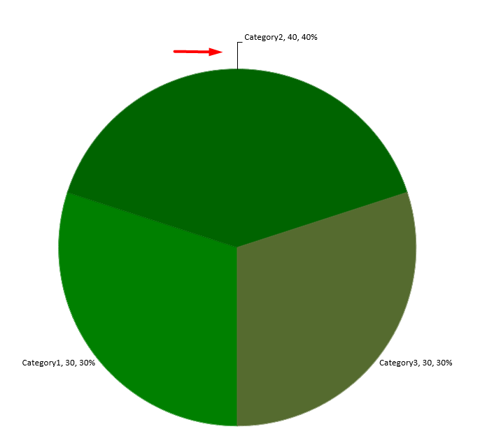

Data labels on a chart show details about the chart data series or individual data points. They allow readers to quickly identify data series and they also make charts easier to understand.

## **Set Data Precision in Chart Data Labels**

This C++ code shows you how to set the data precision in a chart data label:

```c++
	// The path to the documents directory
	const String outPath = u"../out/SettingPrecisionOfDataLabel_out.pptx";

	// Instantiates a Presentation class that represents a PPTX file
	SharedPtr<Presentation> pres = MakeObject<Presentation>();

	// Gets the first slide
	SharedPtr<ISlide> slide = pres->get_Slides()->idx_get(0);

	// Adds chart with default data
	SharedPtr<IChart> chart = slide->get_Shapes()->AddChart(Aspose::Slides::Charts::ChartType::Line, 0, 0, 500, 500);

	// Sets series number format
	chart->set_HasDataTable( true);
	chart->get_ChartData()->get_Series()->idx_get(0)->set_NumberFormatOfValues (u"#,##0.00");

	// Writes the presentation file to disk
	pres->Save(outPath, Aspose::Slides::Export::SaveFormat::Pptx);
```


## **Display Percentages as Labels**
Aspose.Slides for C++ allows you to set percentage labels on displayed charts. This C++ code demonstrates the operation:

```c++
	// The path to the documents directory
	const String outPath = u"../out/DisplayPercentageAsLabels_out.pptx";

	// Creates an instance of the Presentation class
	System::SharedPtr<Presentation> presentation = System::MakeObject<Presentation>();

	System::SharedPtr<ISlide> slide = presentation->get_Slides()->idx_get(0);
	System::SharedPtr<IChart> chart = slide->get_Shapes()->AddChart(Aspose::Slides::Charts::ChartType::StackedColumn, 20, 20, 400, 400);
	System::SharedPtr<IChartSeries> series = chart->get_ChartData()->get_Series()->idx_get(0);
	System::SharedPtr<IChartCategory> cat;
	System::ArrayPtr<double> total_for_Cat = System::MakeObject<System::Array<double>>(chart->get_ChartData()->get_Categories()->get_Count(), 0);
	for (int32_t k = 0; k < chart->get_ChartData()->get_Categories()->get_Count(); k++)
	{
		cat = chart->get_ChartData()->get_Categories()->idx_get(k);

		for (int32_t i = 0; i < chart->get_ChartData()->get_Series()->get_Count(); i++)
		{
			total_for_Cat[k] = total_for_Cat[k] + System::Convert::ToDouble(chart->get_ChartData()->get_Series()->idx_get(i)->get_DataPoints()->idx_get(k)->get_Value()->get_Data());
		}
	}

	double dataPontPercent = 0.f;

	for (int32_t x = 0; x < chart->get_ChartData()->get_Series()->get_Count(); x++)
	{
		series = chart->get_ChartData()->get_Series()->idx_get(x);
		series->get_Labels()->get_DefaultDataLabelFormat()->set_ShowLegendKey(false);

		for (int32_t j = 0; j < series->get_DataPoints()->get_Count(); j++)
		{
			System::SharedPtr<IDataLabel> lbl = series->get_DataPoints()->idx_get(j)->get_Label();
			dataPontPercent = (System::Convert::ToDouble(series->get_DataPoints()->idx_get(j)->get_Value()->get_Data()) / total_for_Cat[j]) * 100;

			System::SharedPtr<IPortion> port = System::MakeObject<Portion>();
			port->set_Text(System::String::Format(u"{0:F2} %", dataPontPercent));
			port->get_PortionFormat()->set_FontHeight(8.f);
			lbl->get_TextFrameForOverriding()->set_Text(u"");
			System::SharedPtr<IParagraph> para = lbl->get_TextFrameForOverriding()->get_Paragraphs()->idx_get(0);
			para->get_Portions()->Add(port);

			lbl->get_DataLabelFormat()->set_ShowSeriesName(false);
			lbl->get_DataLabelFormat()->set_ShowPercentage(false);
			lbl->get_DataLabelFormat()->set_ShowLegendKey(false);
			lbl->get_DataLabelFormat()->set_ShowCategoryName(false);
			lbl->get_DataLabelFormat()->set_ShowBubbleSize(false);

		}

	}

	// Saves the presentation containing the chart
	presentation->Save(outPath, Aspose::Slides::Export::SaveFormat::Pptx);
```


## **Set the Percentage Sign with Chart Data Labels**
This C++ code shows you to set the percentage sign for a chart data label:

```c++
	// The path to the documents directory.
	const String outPath = u"../out/DataLabelsPercentageSign_out.pptx";

	// Creates an instance of the Presentation class
	SharedPtr<Presentation> pres = MakeObject<Presentation>();

	// Gets a slide's reference through its index
	SharedPtr<ISlide> slide = pres->get_Slides()->idx_get(0);

	// Creates the PercentsStackedColumn chart on a slide
	SharedPtr<IChart> chart = slide->get_Shapes()->AddChart(Aspose::Slides::Charts::ChartType::PercentsStackedColumn, 0, 0, 500, 500);

	// Sets the NumberFormatLinkedToSource to false
	chart->get_Axes()->get_VerticalAxis()->set_IsNumberFormatLinkedToSource ( false);
	chart->get_Axes()->get_VerticalAxis()->set_NumberFormat(u"0.00%");


	// Sets the index of chart data sheet
	int defaultWorksheetIndex = 0;

	// Gets the chart data worksheet
	SharedPtr<IChartDataWorkbook> fact = chart->get_ChartData()->get_ChartDataWorkbook();


	// Deletes default generated series 
	chart->get_ChartData()->get_Series()->Clear();
	

	// Adds a new series
	chart->get_ChartData()->get_Series()->Add(fact->GetCell(defaultWorksheetIndex, 0, 2, ObjectExt::Box<System::String>(u"Series 2")), chart->get_Type());


	// Takes the first chart series
	SharedPtr<IChartSeries> series=chart->get_ChartData()->get_Series()->Add(fact->GetCell(defaultWorksheetIndex, 0, 1, ObjectExt::Box<System::String>(u"Red")), chart->get_Type());
	// Populates the series data
	series->get_DataPoints()->AddDataPointForBarSeries(fact->GetCell(defaultWorksheetIndex, 1, 1, ObjectExt::Box<double>(0.50)));
	series->get_DataPoints()->AddDataPointForBarSeries(fact->GetCell(defaultWorksheetIndex, 2, 1, ObjectExt::Box<double>(0.50)));
	series->get_DataPoints()->AddDataPointForBarSeries(fact->GetCell(defaultWorksheetIndex, 3, 1, ObjectExt::Box<double>(0.80)));
	series->get_DataPoints()->AddDataPointForBarSeries(fact->GetCell(defaultWorksheetIndex, 4, 1, ObjectExt::Box<double>(0.65)));

	// Sets fill color for series
	series->get_Format()->get_Fill()->set_FillType(FillType::Solid);
	series->get_Format()->get_Fill()->get_SolidFillColor()->set_Color(System::Drawing::Color::get_Red());

	// Sets LabelFormat properties
	series->get_Labels()->get_DefaultDataLabelFormat()->set_ShowValue(true);
	series->get_Labels()->get_DefaultDataLabelFormat()->set_IsNumberFormatLinkedToSource ( false);
	series->get_Labels()->get_DefaultDataLabelFormat()->set_NumberFormat (u"0.0%");
	series->get_Labels()->get_DefaultDataLabelFormat()->get_TextFormat()->get_PortionFormat()->set_FontHeight ( 10);
	series->get_Labels()->get_DefaultDataLabelFormat()->get_TextFormat()->get_PortionFormat()->get_FillFormat()->set_FillType(FillType::Solid);
	series->get_Labels()->get_DefaultDataLabelFormat()->get_TextFormat()->get_PortionFormat()->get_FillFormat()->get_SolidFillColor()->set_Color(System::Drawing::Color::get_White());
	series->get_Labels()->get_DefaultDataLabelFormat()->set_ShowValue(true);

	// Takes the second chart series
	SharedPtr<IChartSeries> series2 = chart->get_ChartData()->get_Series()->Add(fact->GetCell(defaultWorksheetIndex, 0, 2, ObjectExt::Box<System::String>(u"Blues")), chart->get_Type());
	// Populates series data
	series2->get_DataPoints()->AddDataPointForBarSeries(fact->GetCell(defaultWorksheetIndex, 1, 2, ObjectExt::Box<double>(0.70)));
	series2->get_DataPoints()->AddDataPointForBarSeries(fact->GetCell(defaultWorksheetIndex, 2, 2, ObjectExt::Box<double>(0.50)));
	series2->get_DataPoints()->AddDataPointForBarSeries(fact->GetCell(defaultWorksheetIndex, 3, 2, ObjectExt::Box<double>(0.20)));
	series2->get_DataPoints()->AddDataPointForBarSeries(fact->GetCell(defaultWorksheetIndex, 4, 2, ObjectExt::Box<double>(0.35)));

	// Sets fill color for series
	series2->get_Format()->get_Fill()->set_FillType(FillType::Solid);
	series2->get_Format()->get_Fill()->get_SolidFillColor()->set_Color(System::Drawing::Color::get_Blue());

	// Sets LabelFormat properties
	series2->get_Labels()->get_DefaultDataLabelFormat()->set_ShowValue(true);
	series2->get_Labels()->get_DefaultDataLabelFormat()->set_IsNumberFormatLinkedToSource(false);
	series2->get_Labels()->get_DefaultDataLabelFormat()->set_NumberFormat(u"0.0%");
	series2->get_Labels()->get_DefaultDataLabelFormat()->get_TextFormat()->get_PortionFormat()->set_FontHeight(10);
	series2->get_Labels()->get_DefaultDataLabelFormat()->get_TextFormat()->get_PortionFormat()->get_FillFormat()->set_FillType(FillType::Solid);
	series2->get_Labels()->get_DefaultDataLabelFormat()->get_TextFormat()->get_PortionFormat()->get_FillFormat()->get_SolidFillColor()->set_Color(System::Drawing::Color::get_White());
	series2->get_Labels()->get_DefaultDataLabelFormat()->set_ShowValue(true);

	// Writes the presentation file to disk
	pres->Save(outPath, Aspose::Slides::Export::SaveFormat::Pptx);

```


## **Set Label Distance from Axis**
This C++ code shows you how to set the label distance from a category axis when you are dealing with a chart plotted from axes:

```c++
	// The path to the documents directory
	const String outPath = u"../out/CategoryAxisLabelDistance_out.pptx";

	// Creates an instance of the Presentation class
	SharedPtr<Presentation> pres = MakeObject<Presentation>();

	// Gets a slide's reference
	SharedPtr<ISlide> slide = pres->get_Slides()->idx_get(0);

	// Creates a chart on the slide
	SharedPtr<IChart> chart = slide->get_Shapes()->AddChart(Aspose::Slides::Charts::ChartType::ClusteredColumn, 0, 0, 500, 500);


	// Gets the chart series collection
	SharedPtr<IChartSeriesCollection> seriesCollection = chart->get_ChartData()->get_Series();

	// Sets the label distance from an axis
	chart->get_Axes()->get_HorizontalAxis()->set_LabelOffset ( 500);

	// Writes the presentation file to disk
	pres->Save(outPath, Aspose::Slides::Export::SaveFormat::Pptx);
```

## **Adjust Label Location**

When you create a chart that does not rely on any axis such as a pie chart, the chart's data labels may end up being too close to its edge. In such a case, you have to adjust the location of the data label so that the leader lines get displayed clearly.

This C++ code shows you how to adjust the label location on a pie chart:

```c++
System::SharedPtr<Presentation> pres = System::MakeObject<Presentation>();

System::SharedPtr<IChart> chart = pres->get_Slide(0)->get_Shapes()->AddChart(ChartType::Pie, 50.0f, 50.0f, 200.0f, 200.0f);

System::SharedPtr<IChartSeriesCollection> series = chart->get_ChartData()->get_Series();
System::SharedPtr<IDataLabel> label = series->idx_get(0)->get_Label(0);
System::SharedPtr<IDataLabelFormat> dataLabelFormat = label->get_DataLabelFormat();

dataLabelFormat->set_ShowValue(true);
dataLabelFormat->set_Position(LegendDataLabelPosition::OutsideEnd);
label->set_X(0.71f);
label->set_Y(0.04f);

pres->Save(u"pres.pptx", SaveFormat::Pptx);
```



## **FAQ**

**How can I prevent data labels from overlapping on dense charts?**

Combine automatic label placement, leader lines, and reduced font size; if necessary, hide some fields (for example, the category) or show labels only for extreme/key points.

**How can I disable labels only for zero, negative, or empty values?**

Filter data points before enabling labels and turn off display for values of 0, negative values, or missing values according to a defined rule.

**How can I ensure a consistent label style when exporting to PDF/images?**

Explicitly set fonts (family, size) and verify that the font is available on the rendering side to avoid fallback.
