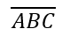

## **Overview**
In PowerPoint, it is possible to write a math equation or formula and display it in the presentation. To do that, various mathematical symbols are represented in PowerPoint and can be added to the text or equation. For that, the math equations constructor is used in PowerPoint, which helps to create complex formulas like:

- Math Fraction
- Math Radical
- Math Function
- Limits and log functions
- N-ary operations
- Matrix
- Large operators
- Sin, cos functions

To add a mathematical equation in PowerPoint, the *Insert -> Equation* menu is used:


This will create a mathematical text in XML that can be displayed in PowerPoint as following: 


PowerPoint supports plenty of mathematical symbols to create math equations. However, creating complicated math equations in PowerPoint often does not bring a good and professional-looking result. Users, who need to create mathematical presentations frequently, resort to the use of third-party solutions to create good-looking math formulas.

Using [**Aspose.Slide API**](https://products.aspose.com/slides/cpp/), you can work with math equations in the PowerPoint presentations programmatically in C++. Create new math expressions or edit previously created ones. The export of mathematical structures into images is also partially supported.


## **How to Create a Mathematical Equation**
Mathematical elements are used for building any mathematical constructions with any level of nesting. A linear collection of mathematical elements forms a mathematical block represented by the [**MathBlock**](https://reference.aspose.com/slides/cpp/aspose.slides.mathtext/mathblock/) class. [**MathBlock**](https://reference.aspose.com/slides/cpp/aspose.slides.mathtext/mathblock/) class essentially is a separated mathematical expression, formula, or equation. [**MathPortion**](https://reference.aspose.com/slides/cpp/aspose.slides.mathtext/mathportion/) is a mathematical portion, used to hold mathematical text (do not mix with [**Portion**](https://reference.aspose.com/slides/cpp/aspose.slides/portion/)). [**MathParagraph**](https://reference.aspose.com/slides/cpp/aspose.slides.mathtext/mathparagraph/) allows manipulating a set of math blocks. The abovementioned classes are the key to work with PowerPoint math equations via Aspose.Slides API.


Let's see how we can create the following mathematical equation via Aspose.Slides API:


To add a mathematical expression on the slide, first, add a shape that will contain the mathematical text:

``` cpp
auto pres = System::MakeObject<Presentation>();
auto mathShape = pres->get_Slides()->idx_get(0)->get_Shapes()->AddMathShape(0.0f, 0.0f, 720.0f, 150.0f);
``` 


After creating, the shape will already contain one paragraph with a mathematical portion by default. The [**MathPortion**](https://reference.aspose.com/slides/cpp/aspose.slides.mathtext/mathportion/) class is a portion that contains a mathematical text inside. To access mathematical content inside [**MathPortion**](https://reference.aspose.com/slides/cpp/aspose.slides.mathtext/mathportion/), refer to the [**MathParagraph**](https://reference.aspose.com/slides/cpp/aspose.slides.mathtext/mathparagraph/) variable:

``` cpp
 auto mathParagraph = (System::AsCast<MathPortion>(mathShape->get_TextFrame()->get_Paragraphs()->idx_get(0)->get_Portions()->idx_get(0)))->get_MathParagraph();
``` 


The [**MathParagraph**](https://reference.aspose.com/slides/cpp/aspose.slides.mathtext/mathparagraph/) class allows to read, add, edit and delete math blocks ([**MathBlock**](https://reference.aspose.com/slides/cpp/aspose.slides.mathtext/mathblock/)), that consist of a combination of mathematical elements. For example, create a fraction and place it in the presentation:

``` cpp
auto fraction = System::MakeObject<MathematicalText>(u"x")->Divide(u"y");
mathParagraph->Add(System::MakeObject<MathBlock>(fraction));
``` 


Each mathematical element is represented by some class that implements the [**IMathElement**](https://reference.aspose.com/slides/cpp/aspose.slides.mathtext/imathelement/) interface. This interface provides a lot of methods for easily creating mathematical expressions. You can create a fairly complex mathematical expression with a single line of code. For example, the Pythagorean theorem would look like this:

``` cpp
auto mathBlock = System::MakeObject<MathematicalText>(u"c")
  ->SetSuperscript(u"2")
  ->Join(u"=")
  ->Join(System::MakeObject<MathematicalText>(u"a")->SetSuperscript(u"2"))
  ->Join(u"+")
  ->Join(System::MakeObject<MathematicalText>(u"b")->SetSuperscript(u"2"));
``` 


Operations of the interface [**IMathElement**](https://reference.aspose.com/slides/cpp/aspose.slides.mathtext/imathelement/) are implemented in any type of element, including the [**MathBlock**](https://reference.aspose.com/slides/cpp/aspose.slides.mathtext/mathblock/).

The full source code sample:

``` cpp
auto pres = System::MakeObject<Presentation>();
auto mathShape = pres->get_Slides()->idx_get(0)->get_Shapes()->AddMathShape(0.0f, 0.0f, 720.0f, 150.0f);
auto mathParagraph = (System::AsCast<MathPortion>(mathShape->get_TextFrame()->get_Paragraphs()->idx_get(0)->get_Portions()->idx_get(0)))->get_MathParagraph();

auto fraction = System::MakeObject<MathematicalText>(u"x")->Divide(u"y");
mathParagraph->Add(System::MakeObject<MathBlock>(fraction));

auto mathBlock = System::MakeObject<MathematicalText>(u"c")
  ->SetSuperscript(u"2")
  ->Join(u"=")
  ->Join(System::MakeObject<MathematicalText>(u"a")->SetSuperscript(u"2"))
  ->Join(u"+")->Join(System::MakeObject<MathematicalText>(u"b")->SetSuperscript(u"2"));
mathParagraph->Add(mathBlock);

pres->Save(u"math.pptx", SaveFormat::Pptx);
``` 


## **Mathematical Element Types**
Mathematical expressions are formed from sequences of mathematical elements. The sequence of mathematical elements is represented by a mathematical block, and arguments of mathematical elements form a tree-like nesting.

There are a lot of mathematical element types that can be used to construct a mathematical block. Each of these elements can be included (aggregated) in another element. That is, elements are actually containers for others, forming a tree-like structure. The simplest type of element that does not contain other elements of the mathematical text.

Each type of math element implements the [**IMathElement**](https://reference.aspose.com/slides/cpp/aspose.slides.mathtext/imathelement/) interface, allowing the use of the common set of math operations on different types of math elements.
### **MathematicalText Class**
The [**MathematicalText**](https://reference.aspose.com/slides/cpp/aspose.slides.mathtext/mathematicaltext/) class represents a mathematical text - the underlying element of all mathematical constructions. Mathematical text may represent operands and operators, variables, and any other linear text.

Example: 𝑎=𝑏+𝑐
### **MathFraction Class**
[**MathFraction**](https://reference.aspose.com/slides/cpp/aspose.slides.mathtext/mathfraction/) class specifies the fraction object, consisting of a numerator and denominator separated by a fraction bar. The fraction bar can be horizontal or diagonal, depending on the fraction properties. The fraction object is also used to represent the stack function, which places one element above another, with no fraction bar.

Example:


### **MathRadical Class**
[**MathRadical**](https://reference.aspose.com/slides/cpp/aspose.slides.mathtext/mathradical/) class specifies the radical function (mathematical root), consisting of a base, and an optional degree.

Example:


### **MathFunction Class**
[**MathFunction**](https://reference.aspose.com/slides/cpp/aspose.slides.mathtext/mathfunction/) class specifies a function of an argument. Contains methods: [get_Name()](https://reference.aspose.com/slides/cpp/aspose.slides.mathtext/mathfunction/get_name/) - function name and [get_Base()](https://reference.aspose.com/slides/cpp/aspose.slides.mathtext/mathfunction/get_base/) - function argument.

Example:


### **MathNaryOperator Class**
[**MathNaryOperator**](https://reference.aspose.com/slides/cpp/aspose.slides.mathtext/mathnaryoperator/) class specifies an N-ary mathematical object, such as Summation and Integral. It consists of an operator, a base (or operand), and optional upper and lower limits. Examples of N-ary operators are Summation, Union, Intersection, Integral.

This class does not include simple operators such as addition, subtraction, and so on. They are represented by a single text element - [MathematicalText](https://reference.aspose.com/slides/cpp/aspose.slides.mathtext/mathematicaltext/).

Example:


### **MathLimit Class**
[**MathLimit**](https://reference.aspose.com/slides/cpp/aspose.slides.mathtext/mathlimit/) class creates the upper or lower limit. It specifies the limit object, consisting of text on the baseline and reduced-size text immediately above or below it. This element does not include the word “lim", but allows you to place text at the top or at the bottom of the expression. So, the expression 


is created using a combination of [**MathFunction**](https://reference.aspose.com/slides/cpp/aspose.slides.mathtext/mathfunction/) and [**MathLimit**](https://reference.aspose.com/slides/cpp/aspose.slides.mathtext/mathlimit/) elements this way:

``` cpp
auto funcName = System::MakeObject<MathLimit>(System::MakeObject<MathematicalText>(u"lim"), System::MakeObject<MathematicalText>(u"𝑥→∞"));
auto mathFunc = System::MakeObject<MathFunction>(funcName, System::MakeObject<MathematicalText>(u"𝑥"));
``` 


### **MathSubscriptElement, MathSuperscriptElement, MathRightSubSuperscriptElement, MathLeftSubSuperscriptElement Classes**
- [MathSubscriptElement](https://reference.aspose.com/slides/cpp/aspose.slides.mathtext/mathsubscriptelement/)
- [MathSuperscriptElement](https://reference.aspose.com/slides/cpp/aspose.slides.mathtext/mathsuperscriptelement/)
- [MathRightSubSuperscriptElement](https://reference.aspose.com/slides/cpp/aspose.slides.mathtext/mathrightsubsuperscriptelement/)
- [MathLeftSubSuperscriptElement](https://reference.aspose.com/slides/cpp/aspose.slides.mathtext/mathleftsubsuperscriptelement/)

The following classes specify a lower index or an upper index. You can set subscript and superscript at the same time on the left or on the right side of an argument, but single subscript or superscript is supported on the right side only. The [MathSubscriptElement](https://reference.aspose.com/slides/cpp/aspose.slides.mathtext/mathsubscriptelement/) can also be used to set the mathematical degree of a number.

Example: 


### **MathMatrix Class**
[**MathMatrix**](https://reference.aspose.com/slides/cpp/aspose.slides.mathtext/mathmatrix/) class specifies the Matrix object, consisting of child elements laid out in one or more rows and columns. It is important to note that matrixes do not have built-in delimiters. To place the matrix in the brackets you should use the delimiter object - [**IMathDelimiter**](https://reference.aspose.com/slides/cpp/aspose.slides.mathtext/imathdelimiter/). Null arguments can be used to create gaps in matrices.

Example: 


### **MathArray Class**
[**MathArray**](https://reference.aspose.com/slides/cpp/aspose.slides.mathtext/matharray/) class specifies a vertical array of equations or any mathematical objects.

Example: 


### **Formatting Mathematical Elements**
- [**MathBorderBox**](https://reference.aspose.com/slides/cpp/aspose.slides.mathtext/mathborderbox/) class: draws a rectangular or some other border around the [**IMathElement**](https://reference.aspose.com/slides/cpp/aspose.slides.mathtext/imathelement/).
  
  Example: 

- [**MathBox**](https://reference.aspose.com/slides/cpp/aspose.slides.mathtext/mathbox/) class: specifies the logical boxing (packaging) of the mathematical element. For example, a boxed object can serve as an operator emulator with or without an alignment point, serve as a line breakpoint, or be grouped such as not to allow line breaks within. For example, the "==" operator should be boxed to prevent line breaks.
- [**MathDelimiter**](https://reference.aspose.com/slides/cpp/aspose.slides.mathtext/mathdelimiter/) class: specifies the delimiter object, consisting of opening and closing characters (such as parentheses, braces, brackets, and vertical bars), and one or more mathematical elements inside, separated by a specified character. Examples: (𝑥2); [𝑥2|𝑦2].
  
  Example: 

- [**MathAccent**](https://reference.aspose.com/slides/cpp/aspose.slides.mathtext/mathaccent/) class: specifies the accent function, consisting of a base and a combining diacritical mark. 

  Example: 𝑎́.

- [**MathBar**](https://reference.aspose.com/slides/cpp/aspose.slides.mathtext/mathbar/) class: specifies the bar function, consisting of a base argument and an overbar or underbar.
  
  Example: 

- [**MathGroupingCharacter**](https://reference.aspose.com/slides/cpp/aspose.slides.mathtext/mathgroupingcharacter/) class: specifies a grouping symbol above or below an expression, usually to highlight the relationships between elements.
  
  Example: 


## **Mathematical Operations**
Each mathematical element and mathematical expression (via [**MathBlock**](https://reference.aspose.com/slides/cpp/aspose.slides.mathtext/mathblock/)) implements the [**IMathElement**](https://reference.aspose.com/slides/cpp/aspose.slides.mathtext/imathelement/) interface. It allows you to use operations on the existing structure and form more complex mathematical expressions. All operations have two parameter sets: either [**IMathElement**](https://reference.aspose.com/slides/cpp/aspose.slides.mathtext/imathelement/) or string as arguments. Instances of the [**MathematicalText**](https://reference.aspose.com/slides/cpp/aspose.slides.mathtext/mathematicaltext/) class are implicitly created from specified strings when string arguments are used. Math operations available in Aspose.Slides are listed below.
### **Join Method**
- [Join(String)](https://reference.aspose.com/slides/cpp/aspose.slides.mathtext/imathelement/join/#imathelementjoinsystemstring-method)
- [Join(IMathElement)](https://reference.aspose.com/slides/cpp/aspose.slides.mathtext/imathelement/join/#imathelementjoinsystemsharedptrimathelement-method)

Joins a mathematical element and forms a mathematical block. For example:

``` cpp
auto element1 = System::MakeObject<MathematicalText>(u"x");
    
auto element2 = System::MakeObject<MathematicalText>(u"y");

auto block = element1->Join(element2);
``` 


### **Divide Method**
- [Divide(String)](https://reference.aspose.com/slides/cpp/aspose.slides.mathtext/imathelement/divide/#imathelementdividesystemstring-method)
- [Divide(IMathElement)](https://reference.aspose.com/slides/cpp/aspose.slides.mathtext/imathelement/divide/#imathelementdividesystemsharedptrimathelement-method)
- [Divide(String, MathFractionTypes)](https://reference.aspose.com/slides/cpp/aspose.slides.mathtext/imathelement/divide/#imathelementdividesystemstring-mathfractiontypes-method)
- [Divide(IMathElement, MathFractionTypes)](https://reference.aspose.com/slides/cpp/aspose.slides.mathtext/imathelement/divide/#imathelementdividesystemsharedptrimathelement-mathfractiontypes-method)

Creates a fraction of the specified type with this numerator and specified denominator. For example:

``` cpp
auto numerator = System::MakeObject<MathematicalText>(u"x");
auto fraction = numerator->Divide(u"y", MathFractionTypes::Linear);
``` 
### **Enclose Method**
- [Enclose()](https://reference.aspose.com/slides/cpp/aspose.slides.mathtext/imathelement/enclose/#imathelementenclose-method)
- [Enclose(Char, Char)](https://reference.aspose.com/slides/cpp/aspose.slides.mathtext/imathelement/enclose/#imathelementenclosechar16_t-char16_t-method)

Encloses the element in specified characters such as parenthesis or another character as framing.

``` cpp
/// <summary>
/// Encloses a math element in parenthesis
/// </summary>
virtual System::SharedPtr<IMathDelimiter> Enclose() = 0;

/// <summary>
/// Encloses this element in specified characters such as parenthesis or another characters as framing
/// </summary>
virtual System::SharedPtr<IMathDelimiter> Enclose(char16_t beginningCharacter, char16_t endingCharacter) = 0;
``` 


For example:

``` cpp
auto delimiter = System::MakeObject<MathematicalText>(u"x")->Enclose(u'[', u']');
auto delimiter2 = System::ExplicitCast<IMathElement>(System::MakeObject<MathematicalText>(u"elem1")->Join(u"elem2"))->Enclose();
``` 

### **Function Method**
- [Function(String)](https://reference.aspose.com/slides/cpp/aspose.slides.mathtext/imathelement/function/#imathelementfunctionsystemstring-method)
- [Function(IMathElement)](https://reference.aspose.com/slides/cpp/aspose.slides.mathtext/imathelement/function/#imathelementfunctionsystemsharedptrimathelement-method)

Takes a function of an argument using the current object as the function name.

``` cpp
/// <summary>
/// Takes a function of an argument using this instance as the function name
/// </summary>
/// <param name="functionArgument">An argument of the function</param>

virtual System::SharedPtr<IMathFunction> Function(System::SharedPtr<IMathElement> functionArgument) = 0;

virtual System::SharedPtr<IMathFunction> Function(System::String functionArgument) = 0;
``` 


For example:

``` cpp
auto func = System::MakeObject<MathematicalText>(u"sin")->Function(u"x");
``` 
### **AsArgumentOfFunction Method**
- [AsArgumentOfFunction(String)](https://reference.aspose.com/slides/cpp/aspose.slides.mathtext/imathelement/asargumentoffunction/#imathelementasargumentoffunctionsystemstring-method)
- [AsArgumentOfFunction(IMathElement)](https://reference.aspose.com/slides/cpp/aspose.slides.mathtext/imathelement/asargumentoffunction/#imathelementasargumentoffunctionsystemsharedptrimathelement-method)
- [AsArgumentOfFunction(MathFunctionsOfOneArgument)](https://reference.aspose.com/slides/cpp/aspose.slides.mathtext/imathelement/asargumentoffunction/#imathelementasargumentoffunctionmathfunctionsofoneargument-method)
- [AsArgumentOfFunction(MathFunctionsOfTwoArguments, IMathElement)](https://reference.aspose.com/slides/cpp/aspose.slides.mathtext/imathelement/asargumentoffunction/#imathelementasargumentoffunctionmathfunctionsoftwoarguments-systemsharedptrimathelement-method)
- [AsArgumentOfFunction(MathFunctionsOfTwoArguments, String)](https://reference.aspose.com/slides/cpp/aspose.slides.mathtext/imathelement/asargumentoffunction/#imathelementasargumentoffunctionmathfunctionsoftwoarguments-systemstring-method)

Takes the specified function using the current instance as the argument. You can:

- specify a string as the function name, for example “cos”.
- select one of the predefined values of the enumerations [**MathFunctionsOfOneArgument**](https://reference.aspose.com/slides/cpp/aspose.slides.mathtext/mathfunctionsofoneargument/) or [**MathFunctionsOfTwoArguments**](https://reference.aspose.com/slides/cpp/aspose.slides.mathtext/mathfunctionsoftwoarguments/), for example **MathFunctionsOfOneArgument.ArcSin.**
- select the instance of the [**IMathElement**](https://reference.aspose.com/slides/cpp/aspose.slides.mathtext/imathelement/).

For example:

``` cpp

auto funcName = System::MakeObject<MathLimit>(System::MakeObject<MathematicalText>(u"lim"), System::MakeObject<MathematicalText>(u"𝑛→∞"));
    
auto func1 = System::MakeObject<MathematicalText>(u"2x")->AsArgumentOfFunction(funcName);

auto func2 = System::MakeObject<MathematicalText>(u"x")->AsArgumentOfFunction(u"sin");

auto func3 = System::MakeObject<MathematicalText>(u"x")->AsArgumentOfFunction(MathFunctionsOfOneArgument::Sin);

auto func4 = System::MakeObject<MathematicalText>(u"x")->AsArgumentOfFunction(MathFunctionsOfTwoArguments::Log, u"3");

``` 
### **SetSubscript, SetSuperscript, SetSubSuperscriptOnTheRight, SetSubSuperscriptOnTheLeft Methods**
- [SetSubscript(String)](https://reference.aspose.com/slides/cpp/aspose.slides.mathtext/imathelement/setsubscript/#imathelementsetsubscriptsystemstring-method)
- [SetSubscript(IMathElement)](https://reference.aspose.com/slides/cpp/aspose.slides.mathtext/imathelement/setsubscript/#imathelementsetsubscriptsystemsharedptrimathelement-method)
- [SetSuperscript(String)](https://reference.aspose.com/slides/cpp/aspose.slides.mathtext/imathelement/setsuperscript/#imathelementsetsuperscriptsystemstring-method)
- [SetSuperscript(IMathElement)](https://reference.aspose.com/slides/cpp/aspose.slides.mathtext/imathelement/setsuperscript/#imathelementsetsuperscriptsystemsharedptrimathelement-method)
- [SetSubSuperscriptOnTheRight(String, String)](https://reference.aspose.com/slides/cpp/aspose.slides.mathtext/imathelement/setsubsuperscriptontheright/#imathelementsetsubsuperscriptontherightsystemstring-systemstring-method)
- [SetSubSuperscriptOnTheRight(IMathElement, IMathElement)](https://reference.aspose.com/slides/cpp/aspose.slides.mathtext/imathelement/setsubsuperscriptontheright/#imathelementsetsubsuperscriptontherightsystemsharedptrimathelement-systemsharedptrimathelement-method)
- [SetSubSuperscriptOnTheLeft(String, String)](https://reference.aspose.com/slides/cpp/aspose.slides.mathtext/imathelement/setsubsuperscriptontheleft/#imathelementsetsubsuperscriptontheleftsystemstring-systemstring-method)
- [SetSubSuperscriptOnTheLeft(IMathElement, IMathElement)](https://reference.aspose.com/slides/cpp/aspose.slides.mathtext/imathelement/setsubsuperscriptontheleft/#imathelementsetsubsuperscriptontheleftsystemsharedptrimathelement-systemsharedptrimathelement-method)

Sets subscript and superscript. You can set subscript and superscript at the same time on the left or on the right side of the argument, but single subscript or superscript is supported only on the right side. The **Superscript** can also be used to set the mathematical degree of a number.

Example:

``` cpp
auto script = System::MakeObject<MathematicalText>(u"y")->SetSubSuperscriptOnTheLeft(u"2x", u"3z");
``` 
### **Radical Method**
- [Radical(String)](https://reference.aspose.com/slides/cpp/aspose.slides.mathtext/imathelement/radical/#imathelementradicalsystemstring-method)
- [Radical(IMathElement)](https://reference.aspose.com/slides/cpp/aspose.slides.mathtext/imathelement/radical/#imathelementradicalsystemsharedptrimathelement-method)

Specifies the mathematical root of the given degree from the specified argument.

Example:

``` cpp
auto radical = System::MakeObject<MathematicalText>(u"x")->Radical(u"3");
``` 
### **SetUpperLimit and SetLowerLimit Methods**
- [SetUpperLimit(String)](https://reference.aspose.com/slides/cpp/aspose.slides.mathtext/imathelement/setupperlimit/#imathelementsetupperlimitsystemstring-method)
- [SetUpperLimit(IMathElement)](https://reference.aspose.com/slides/cpp/aspose.slides.mathtext/imathelement/setupperlimit/#imathelementsetupperlimitsystemsharedptrimathelement-method)
- [SetLowerLimit(String)](https://reference.aspose.com/slides/cpp/aspose.slides.mathtext/imathelement/setlowerlimit/#imathelementsetlowerlimitsystemstring-method)
- [SetLowerLimit(IMathElement)](https://reference.aspose.com/slides/cpp/aspose.slides.mathtext/imathelement/setlowerlimit/#imathelementsetlowerlimitsystemsharedptrimathelement-method)

Takes the upper or lower limit. Here, the upper and bottom simply indicate the location of the argument relative to the base.

Let's consider an expression: 


Such expressions can be created through a combination of classes [MathFunction](https://reference.aspose.com/slides/cpp/aspose.slides.mathtext/mathfunction/) and [MathLimit](https://reference.aspose.com/slides/cpp/aspose.slides.mathtext/mathlimit/), and operations of the [IMathElement](https://reference.aspose.com/slides/cpp/aspose.slides.mathtext/imathelement/) as follows:

``` cpp
auto mathExpression = System::MakeObject<MathematicalText>(u"lim")->SetLowerLimit(u"x→∞")->Function(u"x");
``` 
### **Nary and Integral Methods**
- [Nary(MathNaryOperatorTypes, IMathElement, IMathElement)](https://reference.aspose.com/slides/cpp/aspose.slides.mathtext/imathelement/nary/#imathelementnarymathnaryoperatortypes-systemsharedptrimathelement-systemsharedptrimathelement-method)
- [Nary(MathNaryOperatorTypes, String, String)](https://reference.aspose.com/slides/cpp/aspose.slides.mathtext/imathelement/nary/#imathelementnarymathnaryoperatortypes-systemstring-systemstring-method)
- [Integral(MathIntegralTypes)](https://reference.aspose.com/slides/cpp/aspose.slides.mathtext/imathelement/integral/#imathelementintegralmathintegraltypes-method)
- [Integral(MathIntegralTypes, IMathElement, IMathElement)](https://reference.aspose.com/slides/cpp/aspose.slides.mathtext/imathelement/integral/#imathelementintegralmathintegraltypes-systemsharedptrimathelement-systemsharedptrimathelement-method)
- [Integral(MathIntegralTypes, String, String)](https://reference.aspose.com/slides/cpp/aspose.slides.mathtext/imathelement/integral/#imathelementintegralmathintegraltypes-systemstring-systemstring-method)
- [Integral(MathIntegralTypes, IMathElement, IMathElement, MathLimitLocations)](https://reference.aspose.com/slides/cpp/aspose.slides.mathtext/imathelement/integral/#imathelementintegralmathintegraltypes-systemsharedptrimathelement-systemsharedptrimathelement-mathlimitlocations-method)
- [Integral(MathIntegralTypes, String, String, MathLimitLocations)](https://reference.aspose.com/slides/cpp/aspose.slides.mathtext/imathelement/integral/#imathelementintegralmathintegraltypes-systemstring-systemstring-mathlimitlocations-method)

Both **Nary** and **Integral** methods create and return the N-ary operator represented by the [**IMathNaryOperator**](https://reference.aspose.com/slides/cpp/aspose.slides.mathtext/imathnaryoperator/) type. In Nary method, the [**MathNaryOperatorTypes**](https://reference.aspose.com/slides/cpp/aspose.slides.mathtext/mathnaryoperatortypes/) enumeration specifies the type of operator: summation, union, etc., not including integrals. In Integral method, there is the specialized operation Integral with the enumeration of integral types [**MathIntegralTypes**](https://reference.aspose.com/slides/cpp/aspose.slides.mathtext/mathintegraltypes/). 

Example:

``` cpp
auto baseArg = System::MakeObject<MathematicalText>(u"x")->Join(System::MakeObject<MathematicalText>(u"dx")->ToBox());
auto integral = baseArg->Integral(MathIntegralTypes::Simple, u"0", u"1");
``` 
### **ToMathArray Method**
[**ToMathArray**](https://reference.aspose.com/slides/cpp/aspose.slides.mathtext/imathelement/tomatharray/) puts elements in a vertical array. If this operation is called for a **MathBlock** instance, all child elements will be placed in the returned array.

Example:

``` cpp
auto arrayFunction = System::MakeObject<MathematicalText>(u"x")->Join(u"y")->ToMathArray();
``` 
### **Formatting Operations: Accent, Overbar, Underbar, Group, ToBorderBox, ToBox**
- [**Accent**](https://reference.aspose.com/slides/cpp/aspose.slides.mathtext/imathelement/accent/) method sets an accent mark (a character on the top of the element).
- [**Overbar**](https://reference.aspose.com/slides/cpp/aspose.slides.mathtext/imathelement/overbar/) and [**Underbar**](https://reference.aspose.com/slides/cpp/aspose.slides.mathtext/imathelement/underbar/) methods set a bar on the top or bottom.
- [**Group**](https://reference.aspose.com/slides/cpp/aspose.slides.mathtext/imathelement/group/) method places in a group using a grouping character such as a bottom curly bracket or another.
- [**ToBorderBox**](https://reference.aspose.com/slides/cpp/aspose.slides.mathtext/imathelement/toborderbox/) method places in a border-box.
- [**ToBox**](https://reference.aspose.com/slides/cpp/aspose.slides.mathtext/imathelement/tobox/) method places in a non-visual box (logical grouping).

Examples:

``` cpp
auto accent = System::MakeObject<MathematicalText>(u"x")->Accent(u'\u0303');
    
auto bar = System::MakeObject<MathematicalText>(u"x")->Overbar();

auto groupChr = System::MakeObject<MathematicalText>(u"x")->Join(u"y")->Join(u"z")->Group(u'\u23E1', MathTopBotPositions::Bottom, MathTopBotPositions::Top);

auto borderBox = System::MakeObject<MathematicalText>(u"x+y+z")->ToBorderBox();

auto boxedOperator = System::MakeObject<MathematicalText>(u":=")->ToBox();
``` 

## **FAQ**

**How can I add a mathematical equation to a PowerPoint slide?**

To add a mathematical equation, you need to create a math shape object, which automatically contains a mathematical portion. Then, you retrieve the [MathParagraph](https://reference.aspose.com/slides/cpp/aspose.slides.mathtext/mathparagraph/) from the [MathPortion](https://reference.aspose.com/slides/cpp/aspose.slides.mathtext/mathportion/) and add [MathBlock](https://reference.aspose.com/slides/cpp/aspose.slides.mathtext/mathblock/) objects to it.

**Is it possible to create complex nested mathematical expressions?**

Yes, Aspose.Slides allows you to create complex mathematical expressions by nesting MathBlocks. Each mathematical element implements the [IMathElement](https://reference.aspose.com/slides/cpp/aspose.slides.mathtext/imathelement/) interface, which allows you to apply operations (Join, Divide, Enclose, etc.) to combine elements into more complex structures.

**How can I update or modify an existing mathematical equation?**

To update an equation, you need to access the existing MathBlocks through the [MathParagraph](https://reference.aspose.com/slides/cpp/aspose.slides.mathtext/mathparagraph/). Then, by using methods such as Join, Divide, Enclose, and others, you can modify individual elements of the equation. After editing, save the presentation to apply the changes.
