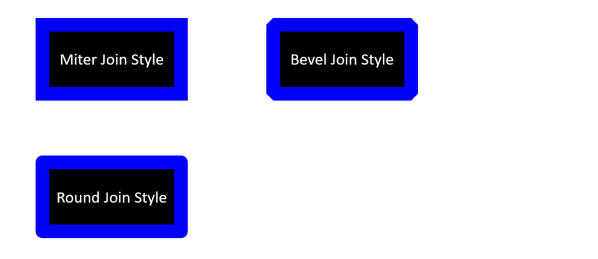
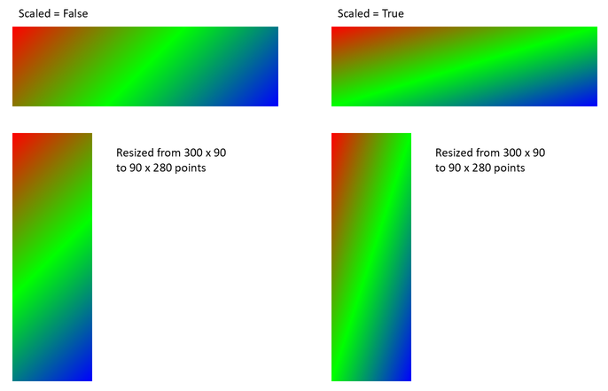

## **Introduction**

Format shapes in PowerPoint by adjusting their outlines, fills, and effects. Aspose.Slides for C++ lets you control these settings programmatically, including transparency, rotation, and 3D formatting.


Aspose.Slides for C++ provides interfaces and methods that allow you to format shapes using the same options available in PowerPoint.

## **Format Lines**

Use [IShape::get_LineFormat](https://reference.aspose.com/slides/cpp/aspose.slides/ishape/get_lineformat/) to control a shape’s outline. This example creates an unfilled rectangle with a blue, dashed outline. [ILineFormat::set_Style](https://reference.aspose.com/slides/cpp/aspose.slides/ilineformat/set_style/) selects a thick-thin compound line, while [ILineFormat::set_Width](https://reference.aspose.com/slides/cpp/aspose.slides/ilineformat/set_width/) sets its width to 7 points and [ILineFormat::set_DashStyle](https://reference.aspose.com/slides/cpp/aspose.slides/ilineformat/set_dashstyle/) selects the dash pattern.

```cpp
#include <DOM/FillType.h>
#include <DOM/IAutoShape.h>
#include <DOM/IColorFormat.h>
#include <DOM/IFillFormat.h>
#include <DOM/ILineFillFormat.h>
#include <DOM/ILineFormat.h>
#include <DOM/IShapeCollection.h>
#include <DOM/ISlide.h>
#include <DOM/LineDashStyle.h>
#include <DOM/LineStyle.h>
#include <DOM/Presentation.h>
#include <DOM/ShapeType.h>
#include <Export/SaveFormat.h>
#include <drawing/color.h>
#include <system/smart_ptr.h>

using namespace Aspose::Slides;
using namespace System;
using namespace Aspose::Slides::Export;
using namespace System::Drawing;

auto presentation = MakeObject<Presentation>();
auto slide = presentation->get_Slide(0);

auto shape = slide->get_Shapes()->AddAutoShape(ShapeType::Rectangle, 50, 50, 150, 75);
shape->get_FillFormat()->set_FillType(FillType::NoFill);
shape->get_LineFormat()->set_Style(LineStyle::ThickThin);
shape->get_LineFormat()->set_Width(7);
shape->get_LineFormat()->set_DashStyle(LineDashStyle::Dash);
shape->get_LineFormat()->get_FillFormat()->set_FillType(FillType::Solid);
shape->get_LineFormat()->get_FillFormat()->get_SolidFillColor()->set_Color(Color::get_Blue());

presentation->Save(u"formatted_lines.pptx", SaveFormat::Pptx);
presentation->Dispose();
```

The result:


## **Apply Sketch Effects to Shape Lines**

A sketch effect makes a shape line look hand-drawn. Use [IShape::get_LineFormat](https://reference.aspose.com/slides/cpp/aspose.slides/ishape/get_lineformat/) to access the line settings, [ILineFormat::get_SketchFormat](https://reference.aspose.com/slides/cpp/aspose.slides/ilineformat/get_sketchformat/) to access the sketch settings, and [ISketchFormat::set_SketchType](https://reference.aspose.com/slides/cpp/aspose.slides/isketchformat/set_sketchtype/) to select a value from the [LineSketchType](https://reference.aspose.com/slides/cpp/aspose.slides/linesketchtype/) enumeration.

The following C++ code shows how to apply a [LineSketchType::Curved](https://reference.aspose.com/slides/cpp/aspose.slides/linesketchtype/) effect, read the explicitly assigned value, and remove the effect with [LineSketchType::None](https://reference.aspose.com/slides/cpp/aspose.slides/linesketchtype/):

```cpp
#include <DOM/IAutoShape.h>
#include <DOM/ILineFormat.h>
#include <DOM/IShapeCollection.h>
#include <DOM/ISketchFormat.h>
#include <DOM/ISlide.h>
#include <DOM/LineSketchType.h>
#include <DOM/Presentation.h>
#include <DOM/ShapeType.h>
#include <system/console.h>
#include <system/smart_ptr.h>

using namespace Aspose::Slides;
using namespace System;

auto presentation = MakeObject<Presentation>();
auto slide = presentation->get_Slide(0);

auto shape = slide->get_Shapes()->AddAutoShape(ShapeType::Rectangle, 50, 50, 200, 100);

auto sketchFormat = shape->get_LineFormat()->get_SketchFormat();
sketchFormat->set_SketchType(LineSketchType::Curved);
auto explicitSketchType = sketchFormat->get_SketchType();
Console::WriteLine(u"Explicit sketch type: {0}", explicitSketchType);
sketchFormat->set_SketchType(LineSketchType::None);

presentation->Dispose();
```

The value returned by [ISketchFormat::get_SketchType](https://reference.aspose.com/slides/cpp/aspose.slides/isketchformat/get_sketchtype/) represents the setting assigned directly to the shape. If the line formatting can be inherited from a theme, master slide, or layout slide, use [ILineFormat::GetEffective](https://reference.aspose.com/slides/cpp/aspose.slides/ilineformat/geteffective/), access [ILineFormatEffectiveData::get_SketchFormat](https://reference.aspose.com/slides/cpp/aspose.slides/ilineformateffectivedata/get_sketchformat/), and read [ISketchFormatEffectiveData::get_SketchType](https://reference.aspose.com/slides/cpp/aspose.slides/isketchformateffectivedata/get_sketchtype/). The effective value reflects the formatting that is actually applied after inheritance is resolved. This example requires an existing presentation with at least one shape on its first slide and prints both values:

```cpp
#include <DOM/ILineFormat.h>
#include <DOM/ILineFormatEffectiveData.h>
#include <DOM/IShape.h>
#include <DOM/ISketchFormat.h>
#include <DOM/ISketchFormatEffectiveData.h>
#include <DOM/ISlide.h>
#include <DOM/LineSketchType.h>
#include <DOM/Presentation.h>
#include <system/console.h>
#include <system/smart_ptr.h>

using namespace Aspose::Slides;
using namespace System;

auto presentation = MakeObject<Presentation>(u"presentation.pptx");
auto shape = presentation->get_Slide(0)->get_Shape(0);

auto lineFormat = shape->get_LineFormat();
auto explicitSketchType = lineFormat->get_SketchFormat()->get_SketchType();
auto effectiveLineFormat = lineFormat->GetEffective();
auto effectiveSketchType = effectiveLineFormat->get_SketchFormat()->get_SketchType();

Console::WriteLine(u"Explicit sketch type: {0}", explicitSketchType);
Console::WriteLine(u"Effective sketch type: {0}", effectiveSketchType);
presentation->Dispose();
```

## **Format Join Styles**

Here are the three join type options:

* Round
* Miter
* Bevel

The join style controls how two outline segments meet at a corner. Use **Round** for rounded corners, **Miter** for sharp corners, or **Bevel** for flattened corners.



This example creates three black rectangles with blue outlines 15 points wide. It sets [ILineFormat::set_JoinStyle](https://reference.aspose.com/slides/cpp/aspose.slides/ilineformat/set_joinstyle/) to the miter, bevel, and round values of [LineJoinStyle](https://reference.aspose.com/slides/cpp/aspose.slides/linejoinstyle/), respectively, to compare how the corners are drawn.

```cpp
#include <DOM/FillType.h>
#include <DOM/IAutoShape.h>
#include <DOM/IColorFormat.h>
#include <DOM/IFillFormat.h>
#include <DOM/ILineFillFormat.h>
#include <DOM/ILineFormat.h>
#include <DOM/IShapeCollection.h>
#include <DOM/ISlide.h>
#include <DOM/ITextFrame.h>
#include <DOM/LineJoinStyle.h>
#include <DOM/Presentation.h>
#include <DOM/ShapeType.h>
#include <Export/SaveFormat.h>
#include <drawing/color.h>
#include <system/smart_ptr.h>

using namespace Aspose::Slides;
using namespace System;
using namespace Aspose::Slides::Export;
using namespace System::Drawing;

auto presentation = MakeObject<Presentation>();
auto slide = presentation->get_Slide(0);

auto miterShape = slide->get_Shapes()->AddAutoShape(ShapeType::Rectangle, 20, 20, 150, 75);
auto bevelShape = slide->get_Shapes()->AddAutoShape(ShapeType::Rectangle, 210, 20, 150, 75);
auto roundShape = slide->get_Shapes()->AddAutoShape(ShapeType::Rectangle, 20, 135, 150, 75);

miterShape->get_FillFormat()->set_FillType(FillType::Solid);
miterShape->get_FillFormat()->get_SolidFillColor()->set_Color(Color::get_Black());
bevelShape->get_FillFormat()->set_FillType(FillType::Solid);
bevelShape->get_FillFormat()->get_SolidFillColor()->set_Color(Color::get_Black());
roundShape->get_FillFormat()->set_FillType(FillType::Solid);
roundShape->get_FillFormat()->get_SolidFillColor()->set_Color(Color::get_Black());

miterShape->get_LineFormat()->set_Width(15);
bevelShape->get_LineFormat()->set_Width(15);
roundShape->get_LineFormat()->set_Width(15);

miterShape->get_LineFormat()->get_FillFormat()->set_FillType(FillType::Solid);
miterShape->get_LineFormat()->get_FillFormat()->get_SolidFillColor()->set_Color(Color::get_Blue());
bevelShape->get_LineFormat()->get_FillFormat()->set_FillType(FillType::Solid);
bevelShape->get_LineFormat()->get_FillFormat()->get_SolidFillColor()->set_Color(Color::get_Blue());
roundShape->get_LineFormat()->get_FillFormat()->set_FillType(FillType::Solid);
roundShape->get_LineFormat()->get_FillFormat()->get_SolidFillColor()->set_Color(Color::get_Blue());

miterShape->get_LineFormat()->set_JoinStyle(LineJoinStyle::Miter);
bevelShape->get_LineFormat()->set_JoinStyle(LineJoinStyle::Bevel);
roundShape->get_LineFormat()->set_JoinStyle(LineJoinStyle::Round);

miterShape->get_TextFrame()->set_Text(u"Miter Join Style");
bevelShape->get_TextFrame()->set_Text(u"Bevel Join Style");
roundShape->get_TextFrame()->set_Text(u"Round Join Style");

presentation->Save(u"join_styles.pptx", SaveFormat::Pptx);
presentation->Dispose();
```

## **Gradient Fill**

A gradient fill blends colors across a shape. This example fills an ellipse with a linear gradient at a 45-degree angle from red to purple using [IFillFormat::get_GradientFormat](https://reference.aspose.com/slides/cpp/aspose.slides/ifillformat/get_gradientformat/). The [IGradientStopCollection::Add](https://reference.aspose.com/slides/cpp/aspose.slides/igradientstopcollection/add/) method places the color stops at 0 and 1, the beginning and end of the gradient. Clearing the existing stops ensures that only these two colors are used.

```cpp
#include <DOM/FillType.h>
#include <DOM/GradientShape.h>
#include <DOM/IAutoShape.h>
#include <DOM/IColorFormat.h>
#include <DOM/IFillFormat.h>
#include <DOM/IGradientFormat.h>
#include <DOM/IGradientStopCollection.h>
#include <DOM/IShapeCollection.h>
#include <DOM/ISlide.h>
#include <DOM/Presentation.h>
#include <DOM/PresetColor.h>
#include <DOM/ShapeType.h>
#include <Export/SaveFormat.h>
#include <drawing/color.h>
#include <system/smart_ptr.h>

using namespace Aspose::Slides;
using namespace System;
using namespace Aspose::Slides::Export;
using namespace System::Drawing;

auto presentation = MakeObject<Presentation>();
auto slide = presentation->get_Slide(0);

auto shape = slide->get_Shapes()->AddAutoShape(ShapeType::Ellipse, 50, 50, 150, 75);
shape->get_FillFormat()->set_FillType(FillType::Gradient);
shape->get_FillFormat()->get_GradientFormat()->set_GradientShape(GradientShape::Linear);
shape->get_FillFormat()->get_GradientFormat()->set_LinearGradientAngle(45);
shape->get_FillFormat()->get_GradientFormat()->get_GradientStops()->Clear();
shape->get_FillFormat()->get_GradientFormat()->get_GradientStops()->Add(1.0f, PresetColor::Purple);
shape->get_FillFormat()->get_GradientFormat()->get_GradientStops()->Add(0.0f, PresetColor::Red);

presentation->Save(u"gradient_fill.pptx", SaveFormat::Pptx);
presentation->Dispose();
```

The result:


If a gradient looks different in an exported image than it does in PowerPoint, see [Choose a Gradient Rendering Style](/slides/cpp/convert-powerpoint-to-png/#choose-a-gradient-rendering-style). You can select a rendering style without changing the gradient fill stored in the presentation.

### **Set the Linear Gradient Angle**

Use [IGradientFormat::set_LinearGradientAngle](https://reference.aspose.com/slides/cpp/aspose.slides/igradientformat/set_lineargradientangle/) to control the orientation of a [GradientShape::Linear](https://reference.aspose.com/slides/cpp/aspose.slides/gradientshape/) fill. The angle is measured in degrees and increases clockwise: `0` runs from left to right, `90` from top to bottom, `180` from right to left, and `270` from bottom to top. Fractional angles are supported. Finite angles outside `[0, 360)` are normalized to one revolution; for example, `-45` becomes `315` and `360` becomes `0`.

This example creates six rectangles with identical red, green, and blue stops at positions `0`, `0.5`, and `1`. Scaling is disabled so that the angle can be compared independently of the rectangles' proportions. The angles, from left to right, are `0`, `45`, and `90` in the first row, and `135`, `180`, and `270` in the second row.

```cpp
#include <DOM/FillType.h>
#include <DOM/GradientShape.h>
#include <DOM/IAutoShape.h>
#include <DOM/IFillFormat.h>
#include <DOM/IGradientFormat.h>
#include <DOM/IGradientStopCollection.h>
#include <DOM/ILineFillFormat.h>
#include <DOM/ILineFormat.h>
#include <DOM/IShapeCollection.h>
#include <DOM/ISlide.h>
#include <DOM/ISlideSize.h>
#include <DOM/NullableBool.h>
#include <DOM/Presentation.h>
#include <DOM/ShapeType.h>
#include <DOM/SlideSizeScaleType.h>
#include <Export/SaveFormat.h>
#include <drawing/color.h>
#include <system/smart_ptr.h>
#include <array>

using namespace Aspose::Slides;
using namespace Aspose::Slides::Export;
using namespace System;
using namespace System::Drawing;

auto presentation = MakeObject<Presentation>();
presentation->get_SlideSize()->SetSize(720, 400, SlideSizeScaleType::DoNotScale);
auto slide = presentation->get_Slide(0);

const auto angles = std::array<float, 6>{ 0, 45, 90, 135, 180, 270 };

for (auto i = 0; i < angles.size(); i++)
{
    auto x = 30 + (i % 3) * 230;
    auto y = 30 + (i / 3) * 190;

    auto shape = slide->get_Shapes()->AddAutoShape(ShapeType::Rectangle, x, y, 200, 150);
    shape->get_LineFormat()->get_FillFormat()->set_FillType(FillType::NoFill);
    shape->get_FillFormat()->set_FillType(FillType::Gradient);

    auto gradient = shape->get_FillFormat()->get_GradientFormat();
    gradient->set_GradientShape(GradientShape::Linear);
    gradient->get_GradientStops()->Clear();
    gradient->get_GradientStops()->Add(0.0f, Color::get_Red());
    gradient->get_GradientStops()->Add(0.5f, Color::get_Lime());
    gradient->get_GradientStops()->Add(1.0f, Color::get_Blue());
    gradient->set_LinearGradientScaled(NullableBool::False);
    gradient->set_LinearGradientAngle(angles[i]);
}

presentation->Save(u"linear_gradient_angles.pptx", SaveFormat::Pptx);
presentation->Dispose();
```

The result in PowerPoint:


### **Scale a Linear Gradient with the Shape**

[IGradientFormat::set_LinearGradientScaled](https://reference.aspose.com/slides/cpp/aspose.slides/igradientformat/set_lineargradientscaled/) accepts a [NullableBool](https://reference.aspose.com/slides/cpp/aspose.slides/nullablebool/) value. Set it explicitly to `False` to keep the geometric gradient angle as the shape's proportions change, or to `True` to scale the gradient with the shape's width and height. With scaling enabled, the visible angle can differ from the assigned angle on a non-square shape.

The following example uses a `45`-degree angle and the same color stops as the angle comparison. The left column uses `False`; the right column uses `True`. Each column contains a wide rectangle above a tall rectangle. Both start with the same wide dimensions; changing the second rectangle's width and height demonstrates how the fill responds to resizing without changing its gradient settings.

```cpp
#include <DOM/FillType.h>
#include <DOM/GradientShape.h>
#include <DOM/IAutoShape.h>
#include <DOM/IFillFormat.h>
#include <DOM/IGradientFormat.h>
#include <DOM/IGradientStopCollection.h>
#include <DOM/ILineFillFormat.h>
#include <DOM/ILineFormat.h>
#include <DOM/IShapeCollection.h>
#include <DOM/ISlide.h>
#include <DOM/ISlideSize.h>
#include <DOM/NullableBool.h>
#include <DOM/Presentation.h>
#include <DOM/ShapeType.h>
#include <DOM/SlideSizeScaleType.h>
#include <Export/SaveFormat.h>
#include <drawing/color.h>
#include <system/smart_ptr.h>
#include <array>

using namespace Aspose::Slides;
using namespace Aspose::Slides::Export;
using namespace System;
using namespace System::Drawing;

auto presentation = MakeObject<Presentation>();
presentation->get_SlideSize()->SetSize(720, 460, SlideSizeScaleType::DoNotScale);
auto slide = presentation->get_Slide(0);

const auto scalingOptions = std::array<NullableBool, 2>{ NullableBool::False, NullableBool::True };

for (auto column = 0; column < scalingOptions.size(); column++)
{
    for (auto row = 0; row < 2; row++)
    {
        auto x = 30 + column * 360;
        auto y = row == 0 ? 30 : 150;

        auto shape = slide->get_Shapes()->AddAutoShape(ShapeType::Rectangle, x, y, 300, 90);
        shape->get_LineFormat()->get_FillFormat()->set_FillType(FillType::NoFill);
        shape->get_FillFormat()->set_FillType(FillType::Gradient);

        auto gradient = shape->get_FillFormat()->get_GradientFormat();
        gradient->set_GradientShape(GradientShape::Linear);
        gradient->get_GradientStops()->Clear();
        gradient->get_GradientStops()->Add(0.0f, Color::get_Red());
        gradient->get_GradientStops()->Add(0.5f, Color::get_Lime());
        gradient->get_GradientStops()->Add(1.0f, Color::get_Blue());
        gradient->set_LinearGradientAngle(45);
        gradient->set_LinearGradientScaled(scalingOptions[column]);

        if (row == 1)
        {
            shape->set_Width(90);
            shape->set_Height(280);
        }
    }
}

presentation->Save(u"linear_gradient_scaling.pptx", SaveFormat::Pptx);
presentation->Dispose();
```

The result in PowerPoint, with scaling disabled on the left and enabled on the right:



With scaling disabled, the diagonal color bands keep the same orientation in both rectangles. With scaling enabled, the bands stretch with the shape's proportions. This helps reproduce a template's gradient when adapting a shape to a different size. On a square, enabling scaling does not change the appearance of this `45`-degree gradient.

Both the angle and scaling settings apply to linear gradients. They do not control [GradientShape::Radial or GradientShape::Rectangle](https://reference.aspose.com/slides/cpp/aspose.slides/gradientshape/) fills.

### **Combine the Angle with Gradient Direction**

[IGradientFormat::set_GradientDirection](https://reference.aspose.com/slides/cpp/aspose.slides/igradientformat/set_gradientdirection/) selects a gradient style from the [GradientDirection](https://reference.aspose.com/slides/cpp/aspose.slides/gradientdirection/) enumeration; it is not a substitute for a numeric angle. For a linear gradient, the corner styles can change the area over which the colors are distributed without changing the angle assigned through [IGradientFormat::set_LinearGradientAngle](https://reference.aspose.com/slides/cpp/aspose.slides/igradientformat/set_lineargradientangle/). Keep the direction unchanged when comparing angles or scaling.

The following example applies the same settings in opposite orders. The two rectangles have the same appearance: assigning the direction before or after the angle does not change the result.

```cpp
#include <DOM/FillType.h>
#include <DOM/GradientDirection.h>
#include <DOM/GradientShape.h>
#include <DOM/IAutoShape.h>
#include <DOM/IFillFormat.h>
#include <DOM/IGradientFormat.h>
#include <DOM/IGradientStopCollection.h>
#include <DOM/ILineFillFormat.h>
#include <DOM/ILineFormat.h>
#include <DOM/IShapeCollection.h>
#include <DOM/ISlide.h>
#include <DOM/NullableBool.h>
#include <DOM/Presentation.h>
#include <DOM/ShapeType.h>
#include <Export/SaveFormat.h>
#include <drawing/color.h>
#include <system/smart_ptr.h>

using namespace Aspose::Slides;
using namespace Aspose::Slides::Export;
using namespace System;
using namespace System::Drawing;

auto presentation = MakeObject<Presentation>();
auto slide = presentation->get_Slide(0);

for (auto i = 0; i < 2; i++)
{
    auto shape = slide->get_Shapes()->AddAutoShape(ShapeType::Rectangle, 30, 30 + i * 140, 320, 100);
    shape->get_LineFormat()->get_FillFormat()->set_FillType(FillType::NoFill);
    shape->get_FillFormat()->set_FillType(FillType::Gradient);

    auto gradient = shape->get_FillFormat()->get_GradientFormat();
    gradient->set_GradientShape(GradientShape::Linear);
    gradient->get_GradientStops()->Clear();
    gradient->get_GradientStops()->Add(0.0f, Color::get_Red());
    gradient->get_GradientStops()->Add(0.5f, Color::get_Lime());
    gradient->get_GradientStops()->Add(1.0f, Color::get_Blue());
    gradient->set_LinearGradientScaled(NullableBool::True);

    if (i == 0)
    {
        gradient->set_GradientDirection(GradientDirection::FromCorner1);
        gradient->set_LinearGradientAngle(30);
    }
    else
    {
        gradient->set_LinearGradientAngle(30);
        gradient->set_GradientDirection(GradientDirection::FromCorner1);
    }
}

presentation->Save(u"linear_gradient_direction.pptx", SaveFormat::Pptx);
presentation->Dispose();
```

## **Pattern Fill**

A pattern fill applies a two-color design, such as dots, stripes, or checks. This example uses [IPatternFormat::set_PatternStyle](https://reference.aspose.com/slides/cpp/aspose.slides/ipatternformat/set_patternstyle/) to select a trellis pattern. [IPatternFormat::get_BackColor](https://reference.aspose.com/slides/cpp/aspose.slides/ipatternformat/get_backcolor/) supplies the light gray background, and [IPatternFormat::get_ForeColor](https://reference.aspose.com/slides/cpp/aspose.slides/ipatternformat/get_forecolor/) supplies the yellow pattern color.

```cpp
#include <DOM/FillType.h>
#include <DOM/IAutoShape.h>
#include <DOM/IColorFormat.h>
#include <DOM/IFillFormat.h>
#include <DOM/IPatternFormat.h>
#include <DOM/IShapeCollection.h>
#include <DOM/ISlide.h>
#include <DOM/PatternStyle.h>
#include <DOM/Presentation.h>
#include <DOM/ShapeType.h>
#include <Export/SaveFormat.h>
#include <drawing/color.h>
#include <system/smart_ptr.h>

using namespace Aspose::Slides;
using namespace System;
using namespace Aspose::Slides::Export;
using namespace System::Drawing;

auto presentation = MakeObject<Presentation>();
auto slide = presentation->get_Slide(0);

auto shape = slide->get_Shapes()->AddAutoShape(ShapeType::Rectangle, 50, 50, 150, 75);
shape->get_FillFormat()->set_FillType(FillType::Pattern);
shape->get_FillFormat()->get_PatternFormat()->set_PatternStyle(PatternStyle::Trellis);
shape->get_FillFormat()->get_PatternFormat()->get_BackColor()->set_Color(Color::get_LightGray());
shape->get_FillFormat()->get_PatternFormat()->get_ForeColor()->set_Color(Color::get_Yellow());

presentation->Save(u"pattern_fill.pptx", SaveFormat::Pptx);
presentation->Dispose();
```

The result:


## **Picture Fill**

A picture fill uses an image inside a shape. This example requires a local image and uses [Images::FromFile](https://reference.aspose.com/slides/cpp/aspose.slides/images/fromfile/) to load it into the presentation’s image collection. Setting [IPictureFillFormat::set_PictureFillMode](https://reference.aspose.com/slides/cpp/aspose.slides/ipicturefillformat/set_picturefillmode/) to the tiled mode repeats the image within the rectangle. The source image used here is shown below:


```cpp
#include <DOM/FillType.h>
#include <DOM/IAutoShape.h>
#include <DOM/IFillFormat.h>
#include <DOM/IImageCollection.h>
#include <DOM/IPictureFillFormat.h>
#include <DOM/IShapeCollection.h>
#include <DOM/ISlide.h>
#include <DOM/ISlidesPicture.h>
#include <DOM/PictureFillMode.h>
#include <DOM/Presentation.h>
#include <DOM/ShapeType.h>
#include <Export/SaveFormat.h>
#include <IImage.h>
#include <Util/Images.h>
#include <system/smart_ptr.h>

using namespace Aspose::Slides;
using namespace System;
using namespace Aspose::Slides::Export;

auto presentation = MakeObject<Presentation>();
auto slide = presentation->get_Slide(0);

auto shape = slide->get_Shapes()->AddAutoShape(ShapeType::Rectangle, 50, 50, 255, 130);
shape->get_FillFormat()->set_FillType(FillType::Picture);
shape->get_FillFormat()->get_PictureFillFormat()->set_PictureFillMode(PictureFillMode::Tile);

auto image = Images::FromFile(u"lotus.png");
auto presentationImage = presentation->get_Images()->AddImage(image);
shape->get_FillFormat()->get_PictureFillFormat()->get_Picture()->set_Image(presentationImage);

presentation->Save(u"picture_fill.pptx", SaveFormat::Pptx);
image->Dispose();
presentation->Dispose();
```

The result:


### **Tile Picture As Texture**

If you want to set a tiled picture as a texture and customize the tiling behavior, you can use the following methods of the [IPictureFillFormat](https://reference.aspose.com/slides/cpp/aspose.slides/ipicturefillformat/) interface and [PictureFillFormat](https://reference.aspose.com/slides/cpp/aspose.slides/picturefillformat/) class:

- [set_PictureFillMode](https://reference.aspose.com/slides/cpp/aspose.slides/ipicturefillformat/set_picturefillmode/): Sets the picture fill mode—either `Tile` or `Stretch`.
- [set_TileAlignment](https://reference.aspose.com/slides/cpp/aspose.slides/ipicturefillformat/set_tilealignment/): Specifies the alignment of the tiles within the shape.
- [set_TileFlip](https://reference.aspose.com/slides/cpp/aspose.slides/ipicturefillformat/set_tileflip/): Controls whether the tile is flipped horizontally, vertically, or both.
- [set_TileOffsetX](https://reference.aspose.com/slides/cpp/aspose.slides/ipicturefillformat/set_tileoffsetx/): Sets the horizontal offset of the tile (in points) from the shape’s origin.
- [set_TileOffsetY](https://reference.aspose.com/slides/cpp/aspose.slides/ipicturefillformat/set_tileoffsety/): Sets the vertical offset of the tile (in points) from the shape’s origin.
- [set_TileScaleX](https://reference.aspose.com/slides/cpp/aspose.slides/ipicturefillformat/set_tilescalex/): Defines the horizontal scale of the tile as a percentage.
- [set_TileScaleY](https://reference.aspose.com/slides/cpp/aspose.slides/ipicturefillformat/set_tilescaley/): Defines the vertical scale of the tile as a percentage.

This example requires a local image and configures [IPictureFillFormat](https://reference.aspose.com/slides/cpp/aspose.slides/ipicturefillformat/) to repeat it at 50% of its original size. Offsets of −32 points shift the tiles horizontally and vertically; bottom-right alignment and flipping in both directions determine how the repeated texture is arranged.

```cpp
#include <DOM/FillType.h>
#include <DOM/IAutoShape.h>
#include <DOM/IFillFormat.h>
#include <DOM/IImageCollection.h>
#include <DOM/IPictureFillFormat.h>
#include <DOM/IShapeCollection.h>
#include <DOM/ISlide.h>
#include <DOM/ISlidesPicture.h>
#include <DOM/PictureFillMode.h>
#include <DOM/Presentation.h>
#include <DOM/RectangleAlignment.h>
#include <DOM/ShapeType.h>
#include <DOM/TileFlip.h>
#include <Export/SaveFormat.h>
#include <IImage.h>
#include <Util/Images.h>
#include <system/smart_ptr.h>

using namespace Aspose::Slides;
using namespace System;
using namespace Aspose::Slides::Export;

auto presentation = MakeObject<Presentation>();
auto firstSlide = presentation->get_Slide(0);

auto shape = firstSlide->get_Shapes()->AddAutoShape(ShapeType::Rectangle, 50, 50, 190, 95);
shape->get_FillFormat()->set_FillType(FillType::Picture);

auto sourceImage = Images::FromFile(u"lotus.png");
auto presentationImage = presentation->get_Images()->AddImage(sourceImage);

auto pictureFillFormat = shape->get_FillFormat()->get_PictureFillFormat();
pictureFillFormat->get_Picture()->set_Image(presentationImage);
pictureFillFormat->set_PictureFillMode(PictureFillMode::Tile);
pictureFillFormat->set_TileOffsetX(-32);
pictureFillFormat->set_TileOffsetY(-32);
pictureFillFormat->set_TileScaleX(50);
pictureFillFormat->set_TileScaleY(50);
pictureFillFormat->set_TileAlignment(RectangleAlignment::BottomRight);
pictureFillFormat->set_TileFlip(TileFlip::FlipBoth);

presentation->Save(u"tile.pptx", SaveFormat::Pptx);
sourceImage->Dispose();
presentation->Dispose();
```

The result:


## **Solid Color Fill**

A solid fill gives a shape a single, uniform color. This example sets [IFillFormat::set_FillType](https://reference.aspose.com/slides/cpp/aspose.slides/ifillformat/set_filltype/) to the solid fill mode and assigns yellow through [IFillFormat::get_SolidFillColor](https://reference.aspose.com/slides/cpp/aspose.slides/ifillformat/get_solidfillcolor/), then saves the rectangle in a presentation.

```cpp
#include <DOM/FillType.h>
#include <DOM/IAutoShape.h>
#include <DOM/IColorFormat.h>
#include <DOM/IFillFormat.h>
#include <DOM/IShapeCollection.h>
#include <DOM/ISlide.h>
#include <DOM/Presentation.h>
#include <DOM/ShapeType.h>
#include <Export/SaveFormat.h>
#include <drawing/color.h>
#include <system/smart_ptr.h>

using namespace Aspose::Slides;
using namespace System;
using namespace Aspose::Slides::Export;
using namespace System::Drawing;

auto presentation = MakeObject<Presentation>();
auto slide = presentation->get_Slide(0);

auto shape = slide->get_Shapes()->AddAutoShape(ShapeType::Rectangle, 50, 50, 150, 75);
shape->get_FillFormat()->set_FillType(FillType::Solid);
shape->get_FillFormat()->get_SolidFillColor()->set_Color(Color::get_Yellow());

presentation->Save(u"solid_color_fill.pptx", SaveFormat::Pptx);
presentation->Dispose();
```

The result:


## **Use the Slide Background as a Shape Fill**

Use [IAutoShape::set_UseBackgroundFill](https://reference.aspose.com/slides/cpp/aspose.slides/iautoshape/set_usebackgroundfill/) when a shape should match the slide background, for example in a presentation template. Set [IFillFormat::set_FillType](https://reference.aspose.com/slides/cpp/aspose.slides/ifillformat/set_filltype/) to [FillType::NotDefined](https://reference.aspose.com/slides/cpp/aspose.slides/filltype/) first to remove any explicit fill. With this combination, the shape uses the slide background instead of its style fill. Enabling the flag alone does not remove an existing explicit fill.

This differs from [FillType::NoFill](https://reference.aspose.com/slides/cpp/aspose.slides/filltype/): background fill covers objects behind the shape with the corresponding area of the slide background, while no fill leaves those objects visible. A gradient remains aligned with the slide rather than restarting inside each shape.

The following example creates a master background inherited by the slide and places a magenta band behind three rectangles. The left rectangle uses the background, the middle rectangle has no fill, and the right rectangle switches from background fill to an explicit orange fill.

```cpp
#include <DOM/BackgroundType.h>
#include <DOM/FillType.h>
#include <DOM/GradientShape.h>
#include <DOM/IAutoShape.h>
#include <DOM/IBackground.h>
#include <DOM/IColorFormat.h>
#include <DOM/IFillFormat.h>
#include <DOM/IGradientFormat.h>
#include <DOM/IGradientStopCollection.h>
#include <DOM/ILayoutSlide.h>
#include <DOM/ILineFillFormat.h>
#include <DOM/ILineFormat.h>
#include <DOM/IMasterSlide.h>
#include <DOM/IShapeCollection.h>
#include <DOM/ISlide.h>
#include <DOM/ISlideSize.h>
#include <DOM/Presentation.h>
#include <DOM/ShapeType.h>
#include <DOM/SlideSizeScaleType.h>
#include <Export/SaveFormat.h>
#include <drawing/color.h>
#include <system/smart_ptr.h>

using namespace Aspose::Slides;
using namespace System;
using namespace Aspose::Slides::Export;
using namespace System::Drawing;

auto presentation = MakeObject<Presentation>();
presentation->get_SlideSize()->SetSize(720, 400, SlideSizeScaleType::DoNotScale);
auto slide = presentation->get_Slide(0);

// Inherit the gradient from the master.
slide->get_Background()->set_Type(BackgroundType::NotDefined);
slide->get_LayoutSlide()->get_Background()->set_Type(BackgroundType::NotDefined);
auto background = slide->get_LayoutSlide()->get_MasterSlide()->get_Background();
background->set_Type(BackgroundType::OwnBackground);
background->get_FillFormat()->set_FillType(FillType::Gradient);
auto gradient = background->get_FillFormat()->get_GradientFormat();
gradient->set_GradientShape(GradientShape::Linear);
gradient->set_LinearGradientAngle(0);
gradient->get_GradientStops()->Clear();
gradient->get_GradientStops()->Add(0, Color::get_DarkBlue());
gradient->get_GradientStops()->Add(1, Color::get_LightSkyBlue());

// Add this object first so it appears behind the rectangles.
auto band = slide->get_Shapes()->AddAutoShape(ShapeType::Rectangle, 25, 150, 670, 100);
band->get_FillFormat()->set_FillType(FillType::Solid);
band->get_FillFormat()->get_SolidFillColor()->set_Color(Color::get_Magenta());
band->get_LineFormat()->get_FillFormat()->set_FillType(FillType::NoFill);

auto backgroundShape = slide->get_Shapes()->AddAutoShape(ShapeType::Rectangle, 50, 100, 160, 200);
backgroundShape->get_FillFormat()->set_FillType(FillType::NotDefined);
backgroundShape->set_UseBackgroundFill(true);

auto noFillShape = slide->get_Shapes()->AddAutoShape(ShapeType::Rectangle, 280, 100, 160, 200);
noFillShape->get_FillFormat()->set_FillType(FillType::NoFill);

auto explicitShape = slide->get_Shapes()->AddAutoShape(ShapeType::Rectangle, 510, 100, 160, 200);
explicitShape->get_FillFormat()->set_FillType(FillType::NotDefined);
explicitShape->set_UseBackgroundFill(true);

// Disable background fill before applying an explicit fill.
explicitShape->set_UseBackgroundFill(false);
explicitShape->get_FillFormat()->set_FillType(FillType::Solid);
explicitShape->get_FillFormat()->get_SolidFillColor()->set_Color(Color::get_Orange());

presentation->Save(u"background_fill.pptx", SaveFormat::Pptx);
presentation->Dispose();
```

The result, from left to right: **background fill**, **no fill**, and **explicit fill**. The magenta band is hidden by the left and right rectangles but remains visible through the middle rectangle.


The same behavior applies to a background defined directly on the slide or inherited from a layout. The shape uses the slide's resolved background; the example leaves both the slide and layout backgrounds undefined so the master supplies it.

## **Set Transparency**

For a solid fill, the color’s alpha component controls opacity: 0 is fully transparent and 255 is fully opaque. This example uses an alpha value of 128 for a yellow rectangle, making it approximately 50% transparent so the rectangle underneath remains visible. The color is assigned through [IFillFormat::get_SolidFillColor](https://reference.aspose.com/slides/cpp/aspose.slides/ifillformat/get_solidfillcolor/).

```cpp
#include <DOM/FillType.h>
#include <DOM/IAutoShape.h>
#include <DOM/IColorFormat.h>
#include <DOM/IFillFormat.h>
#include <DOM/IShapeCollection.h>
#include <DOM/ISlide.h>
#include <DOM/Presentation.h>
#include <DOM/ShapeType.h>
#include <Export/SaveFormat.h>
#include <drawing/color.h>
#include <system/smart_ptr.h>

using namespace Aspose::Slides;
using namespace System;
using namespace Aspose::Slides::Export;
using namespace System::Drawing;

const int alpha = 128;

auto presentation = MakeObject<Presentation>();
auto slide = presentation->get_Slide(0);

auto solidShape = slide->get_Shapes()->AddAutoShape(ShapeType::Rectangle, 50, 50, 150, 75);

auto transparentShape = slide->get_Shapes()->AddAutoShape(ShapeType::Rectangle, 80, 80, 150, 75);
transparentShape->get_FillFormat()->set_FillType(FillType::Solid);
transparentShape->get_FillFormat()->get_SolidFillColor()->set_Color(Color::FromArgb(alpha, Color::get_Yellow()));

presentation->Save(u"shape_transparency.pptx", SaveFormat::Pptx);
presentation->Dispose();
```

The result:


## **Rotate Shapes**

Use [IShape::set_Rotation](https://reference.aspose.com/slides/cpp/aspose.slides/ishape/set_rotation/) to rotate a shape in the slide plane. The angle is measured in degrees; this example rotates a rectangle 5 degrees clockwise and saves the presentation.

```cpp
#include <DOM/IAutoShape.h>
#include <DOM/IShapeCollection.h>
#include <DOM/ISlide.h>
#include <DOM/Presentation.h>
#include <DOM/ShapeType.h>
#include <Export/SaveFormat.h>
#include <system/smart_ptr.h>

using namespace Aspose::Slides;
using namespace System;
using namespace Aspose::Slides::Export;

auto presentation = MakeObject<Presentation>();
auto slide = presentation->get_Slide(0);

auto shape = slide->get_Shapes()->AddAutoShape(ShapeType::Rectangle, 50, 50, 150, 75);
shape->set_Rotation(5);

presentation->Save(u"shape_rotation.pptx", SaveFormat::Pptx);
presentation->Dispose();
```

The result:


## **Add 3D Bevel Effects**

Use [IShape::get_ThreeDFormat](https://reference.aspose.com/slides/cpp/aspose.slides/ishape/get_threedformat/) to give a shape depth and beveled edges. This example creates a green ellipse with an orange outline, sets [IThreeDFormat::set_Depth](https://reference.aspose.com/slides/cpp/aspose.slides/ithreedformat/set_depth/) to 4 points, and applies a circular top bevel with a width and height of 6 points through [IThreeDFormat::get_BevelTop](https://reference.aspose.com/slides/cpp/aspose.slides/ithreedformat/get_beveltop/). A front-facing orthographic camera and three-point lighting make the bevel visible.

```cpp
#include <DOM/BevelPresetType.h>
#include <DOM/CameraPresetType.h>
#include <DOM/FillType.h>
#include <DOM/IAutoShape.h>
#include <DOM/ICamera.h>
#include <DOM/IColorFormat.h>
#include <DOM/IFillFormat.h>
#include <DOM/ILightRig.h>
#include <DOM/ILineFillFormat.h>
#include <DOM/ILineFormat.h>
#include <DOM/IShapeBevel.h>
#include <DOM/IShapeCollection.h>
#include <DOM/ISlide.h>
#include <DOM/IThreeDFormat.h>
#include <DOM/LightRigPresetType.h>
#include <DOM/LightingDirection.h>
#include <DOM/Presentation.h>
#include <DOM/ShapeType.h>
#include <Export/SaveFormat.h>
#include <drawing/color.h>
#include <system/smart_ptr.h>

using namespace Aspose::Slides;
using namespace System;
using namespace Aspose::Slides::Export;
using namespace System::Drawing;

auto presentation = MakeObject<Presentation>();
auto slide = presentation->get_Slide(0);

auto shape = slide->get_Shapes()->AddAutoShape(ShapeType::Ellipse, 50, 50, 100, 100);
shape->get_FillFormat()->set_FillType(FillType::Solid);
shape->get_FillFormat()->get_SolidFillColor()->set_Color(Color::get_Green());
shape->get_LineFormat()->get_FillFormat()->set_FillType(FillType::Solid);
shape->get_LineFormat()->get_FillFormat()->get_SolidFillColor()->set_Color(Color::get_Orange());
shape->get_LineFormat()->set_Width(2.0);
shape->get_ThreeDFormat()->set_Depth(4);
shape->get_ThreeDFormat()->get_BevelTop()->set_BevelType(BevelPresetType::Circle);
shape->get_ThreeDFormat()->get_BevelTop()->set_Height(6);
shape->get_ThreeDFormat()->get_BevelTop()->set_Width(6);
shape->get_ThreeDFormat()->get_Camera()->set_CameraType(CameraPresetType::OrthographicFront);
shape->get_ThreeDFormat()->get_LightRig()->set_LightType(LightRigPresetType::ThreePt);
shape->get_ThreeDFormat()->get_LightRig()->set_Direction(LightingDirection::Top);

presentation->Save(u"3D_bevel_effect.pptx", SaveFormat::Pptx);
presentation->Dispose();
```

The result:


## **Add 3D Rotation Effects**

A shape’s 3D view is controlled by its camera settings. This example uses [ICamera::SetRotation](https://reference.aspose.com/slides/cpp/aspose.slides/icamera/setrotation/) with latitude, longitude, and revolution angles of 40, 35, and 20 degrees, respectively. It selects an isometric camera through [ICamera::set_CameraType](https://reference.aspose.com/slides/cpp/aspose.slides/icamera/set_cameratype/) and balanced lighting through [ILightRig::set_LightType](https://reference.aspose.com/slides/cpp/aspose.slides/ilightrig/set_lighttype/), then saves the formatted rectangle.

```cpp
#include <DOM/CameraPresetType.h>
#include <DOM/IAutoShape.h>
#include <DOM/ICamera.h>
#include <DOM/ILightRig.h>
#include <DOM/IShapeCollection.h>
#include <DOM/ISlide.h>
#include <DOM/ITextFrame.h>
#include <DOM/IThreeDFormat.h>
#include <DOM/LightRigPresetType.h>
#include <DOM/Presentation.h>
#include <DOM/ShapeType.h>
#include <Export/SaveFormat.h>
#include <system/smart_ptr.h>

using namespace Aspose::Slides;
using namespace System;
using namespace Aspose::Slides::Export;

auto presentation = MakeObject<Presentation>();
auto slide = presentation->get_Slide(0);

auto autoShape = slide->get_Shapes()->AddAutoShape(ShapeType::Rectangle, 50, 50, 150, 75);
autoShape->get_TextFrame()->set_Text(u"Hello, Aspose!");
autoShape->get_ThreeDFormat()->get_Camera()->set_CameraType(CameraPresetType::IsometricLeftUp);
autoShape->get_ThreeDFormat()->get_Camera()->SetRotation(40, 35, 20);
autoShape->get_ThreeDFormat()->get_LightRig()->set_LightType(LightRigPresetType::Balanced);

presentation->Save(u"3D_rotation_effect.pptx", SaveFormat::Pptx);
presentation->Dispose();
```

The result:


## **Control Black-and-White Rendering for Shapes**

The [IShape::set_BlackWhiteMode](https://reference.aspose.com/slides/cpp/aspose.slides/ishape/set_blackwhitemode/) method specifies how an individual shape is rendered when a presentation is viewed or processed in black-and-white mode. It does not enable black-and-white display by itself, and it does not change the shape's fill, line, or other formatting in normal color mode.

Use a value from the [BlackWhiteMode](https://reference.aspose.com/slides/cpp/aspose.slides/blackwhitemode/) enumeration to select the desired behavior. For example, `Automatic` lets the rendering application choose the conversion, `Gray` and `LightGray` use gray coloring, `BlackWhite` uses only black and white, `Black` and `White` force a single color, `Color` preserves normal coloring, and `Hidden` omits the shape in black-and-white mode. `NotDefined` means that no shape-level mode is assigned.

This example creates an orange rectangle and sets [IShape::set_BlackWhiteMode](https://reference.aspose.com/slides/cpp/aspose.slides/ishape/set_blackwhitemode/) to gray. The saved shape retains its orange fill for normal color display and requests gray coloring from applications that honor black-and-white display settings:

```cpp
#include <DOM/BlackWhiteMode.h>
#include <DOM/FillType.h>
#include <DOM/IAutoShape.h>
#include <DOM/IColorFormat.h>
#include <DOM/IFillFormat.h>
#include <DOM/IShapeCollection.h>
#include <DOM/ISlide.h>
#include <DOM/Presentation.h>
#include <DOM/ShapeType.h>
#include <Export/SaveFormat.h>
#include <drawing/color.h>
#include <system/smart_ptr.h>

using namespace Aspose::Slides;
using namespace System;
using namespace Aspose::Slides::Export;
using namespace System::Drawing;

auto presentation = MakeObject<Presentation>();
auto slide = presentation->get_Slide(0);

auto shape = slide->get_Shapes()->AddAutoShape(ShapeType::Rectangle, 50, 50, 200, 100);
shape->get_FillFormat()->set_FillType(FillType::Solid);
shape->get_FillFormat()->get_SolidFillColor()->set_Color(Color::get_Orange());
shape->set_BlackWhiteMode(BlackWhiteMode::Gray);

presentation->Save(u"shape_black_white_mode.pptx", SaveFormat::Pptx);
presentation->Dispose();
```

In normal color mode, the rectangle retains its orange fill. In a black-and-white display workflow, it uses gray coloring because its mode is set to `Gray`. This lets you preserve a full-color slide while defining a distinct appearance for printing, previewing, or other workflows that honor the presentation's black-and-white display settings.

## **Reset Formatting**

Use [ISlide::Reset](https://reference.aspose.com/slides/cpp/aspose.slides/islide/reset/) to restore the position, size, and formatting of slide placeholders from their corresponding layout placeholders. This example requires an existing presentation with layout-linked placeholders and resets every slide before saving. Shapes without corresponding layout placeholders are not reset.

```cpp
#include <DOM/ISlide.h>
#include <DOM/ISlideCollection.h>
#include <DOM/Presentation.h>
#include <Export/SaveFormat.h>
#include <system/enumerator_adapter.h>
#include <system/smart_ptr.h>

using namespace Aspose::Slides;
using namespace System;
using namespace Aspose::Slides::Export;

auto presentation = MakeObject<Presentation>(u"sample.pptx");
for (auto&& slide : IterateOver(presentation->get_Slides()))
{
    slide->Reset();
}

presentation->Save(u"reset_formatting.pptx", SaveFormat::Pptx);
presentation->Dispose();
```

## **FAQ**

**Does shape formatting affect the final presentation file size?**

Colors, line styles, and effect settings generally add little data compared with embedded images and media. Picture fills can increase the file size because their images are stored in the presentation.

**How can I detect shapes on a slide that share identical formatting so I can group them?**

Compare each shape’s key formatting properties—fill, line, and effect settings. If all corresponding values match, treat their styles as identical and logically group those shapes, which simplifies later style management.

**Can I save a set of custom shape styles to a separate file for reuse in other presentations?**

Yes. Store sample shapes with the desired styles in a template slide deck or a .POTX template file. When creating a new presentation, open the template, clone the styled shapes you need, and reapply their formatting wherever required.
