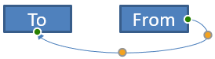
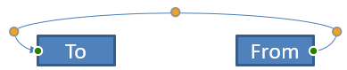
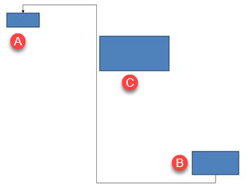

A PowerPoint connector is a special line that connects or links two shapes together and stays attached to shapes even when they are moved or repositioned on a given slide. 

Connectors are typically connected to *connection dots* (green dots), which exist on all shapes by default. Connection dots appear when a cursor comes close to them.

*Adjustment points* (orange dots), which exist only on certain connectors, are used to modify connectors' positions and shapes.

## **Types of Connectors**

In PowerPoint, you can use straight, elbow (angled), and curved connectors. 

Aspose.Slides provides these connectors:

| Connector                      | Image                                                        | Number of adjustment points |
| ------------------------------ | ------------------------------------------------------------ | --------------------------- |
| `ShapeType.Line`               |       | 0                           |
| `ShapeType.StraightConnector1` |  | 0                           |
| `ShapeType.BentConnector2`     |   | 0                           |
| `ShapeType.BentConnector3`     |     | 1                           |
| `ShapeType.BentConnector4`     |     | 2                           |
| `ShapeType.BentConnector5`     |     | 3                           |
| `ShapeType.CurvedConnector2`   |  | 0                           |
| `ShapeType.CurvedConnector3`   |  | 1                           |
| `ShapeType.CurvedConnector4`   |  | 2                           |
| `ShapeType.CurvedConnector5`   |  | 3                           |

## **Connect Shapes Using Connectors**

1. Create an instance of the [Presentation](https://reference.aspose.com/slides/cpp/class/aspose.slides.presentation/) class.
1. Get a slide's reference through its index.
1. Add two [AutoShape](https://reference.aspose.com/slides/cpp/class/aspose.slides.auto_shape) to the slide using the `AddAutoShape` method exposed by the `Shapes` object.
1. Add a connector using the `AddConnector` method exposed by the `Shapes` object by defining the connector type.
1. Connect the shapes using the connector. 
1. Call the `Reroute` method to apply the shortest connection path.
1. Save the presentation. 

This C++ code shows you how to add a connector (a bent connector) between two shapes (an ellipse and rectangle):

```c++
// The path to the documents directory.
	const String outPath = u"../out/ConnectShapesUsingConnectors_out.pptx";
	const String templatePath = u"../templates/ConnectorLineAngle.pptx";

	// Loads the desired the presentation
	SharedPtr<Presentation> pres = MakeObject<Presentation>();

	// Accesses the first slide
	SharedPtr<ISlide> slide = pres->get_Slides()->idx_get(0);

	// Accesses the shapes collection for a specific slide
	SharedPtr<IShapeCollection> shapes = slide->get_Shapes();

	// Adds an Ellipse autoshape
	SharedPtr<IAutoShape> ellipse = slide->get_Shapes()->AddAutoShape(ShapeType::Ellipse, 0, 100, 100, 100);

	// Adds a Rectangle autoshape
	SharedPtr<IAutoShape> rect = slide->get_Shapes()->AddAutoShape(ShapeType::Rectangle, 100, 300, 100, 100);

	// Adds a connector shape to the slide shape collection
	SharedPtr<IConnector> connector = shapes->AddConnector(ShapeType::BentConnector2, 0, 0, 10, 10);

	// Connects the shapes using the connector
	connector->set_StartShapeConnectedTo ( ellipse);
	connector->set_EndShapeConnectedTo (rect);

	// Calls reroute that sets the automatic shortest path between shapes
	connector->Reroute();
	
	// Saves the presentation
	pres->Save(outPath, Aspose::Slides::Export::SaveFormat::Pptx);
```

{} 

The `connector->Reroute` method reroutes a connector and forces it to take the shortest possible path between shapes. To achieve its aim, the method may change the `StartShapeConnectionSiteIndex` and `EndShapeConnectionSiteIndex` points. 

{} 

## **Specify Connection Dot**

If you want a connector to link two shapes using specific dots on the shapes, you have to specify your preferred connection dots this way:

1. Create an instance of the [Presentation](https://reference.aspose.com/slides/cpp/class/aspose.slides.presentation/) class.
1. Get a slide's reference through its index.
1. Add two  [AutoShape](https://reference.aspose.com/slides/cpp/class/aspose.slides.auto_shape) to the slide using the `AddAutoShape` method exposed by the `Shapes` object.
1. Add a connector using the `AddConnector` method exposed by the `Shapes` object by defining the connector type.
1. Connect the shapes using the connector. 
1. Set your preferred connection dots on the shapes. 
1. Save the presentation.

This C++ code demonstrates an operation where a preferred connection dot is specified:

```c++
	// The path to the documents directory.
	const String outPath = u"../out/ConnectShapeUsingConnectionSite_out.pptx";
	const String templatePath = u"../templates/ConnectorLineAngle.pptx";

	// Loads the desired presentation
	SharedPtr<Presentation> pres = MakeObject<Presentation>();

	// Accesses the first slide
	SharedPtr<ISlide> slide = pres->get_Slides()->idx_get(0);

	// Accesses the shapes collection for a specific slide
	SharedPtr<IShapeCollection> shapes = slide->get_Shapes();

	// Add an Ellipse autoshape
	SharedPtr<IAutoShape> ellipse = slide->get_Shapes()->AddAutoShape(ShapeType::Ellipse, 0, 100, 100, 100);

	// Add a Rectangle autoshape
	SharedPtr<IAutoShape> rect = slide->get_Shapes()->AddAutoShape(ShapeType::Rectangle, 100, 200, 100, 100);

	// Adds a connector shape to the slide's shape collection
	SharedPtr<IConnector> connector = shapes->AddConnector(ShapeType::BentConnector3, 0, 0, 10, 10);

	// Connects the shapes using the connector
	connector->set_StartShapeConnectedTo(ellipse);
	connector->set_EndShapeConnectedTo(rect);


	// Sets the preferred connection dot index on the Ellipse shape
	int wantedIndex = 6;

	// Checks whether the preferred index is less than the maximum site index count
	if (ellipse->get_ConnectionSiteCount() > wantedIndex)
	{
		// Sets the preferred connection dot on the Ellipse autoshape
		connector->set_StartShapeConnectionSiteIndex ( wantedIndex);
	}

	// Saves the presentation
	pres->Save(outPath, Aspose::Slides::Export::SaveFormat::Pptx);

```

## **Adjust Connector Point**

You can adjust an existing connector through its adjustment points. Only connectors with adjustment points can be altered in this manner. See the table under **[Types of connectors.](/slides/cpp/connector/#types-of-connectors)** 

#### **Simple Case**

Consider a case where a connector between two shapes (A and B) passes through a third shape (C):


Code:

```c++
auto pres = System::MakeObject<Presentation>();
auto slide = pres->get_Slides()->idx_get(0);
auto shapes = slide->get_Shapes();
auto shape = shapes->AddAutoShape(ShapeType::Rectangle, 300.0f, 150.0f, 150.0f, 75.0f);
auto shapeFrom = shapes->AddAutoShape(ShapeType::Rectangle, 500.0f, 400.0f, 100.0f, 50.0f);
auto shapeTo = shapes->AddAutoShape(ShapeType::Rectangle, 100.0f, 100.0f, 70.0f, 30.0f);

auto connector = shapes->AddConnector(ShapeType::BentConnector5, 20.0f, 20.0f, 400.0f, 300.0f);

auto lineFormat = connector->get_LineFormat();
lineFormat->set_EndArrowheadStyle(LineArrowheadStyle::Triangle);
auto lineFillFormat = lineFormat->get_FillFormat();
lineFillFormat->set_FillType(FillType::Solid);
lineFillFormat->get_SolidFillColor()->set_Color(System::Drawing::Color::get_Black());

connector->set_StartShapeConnectedTo(shapeFrom);
connector->set_EndShapeConnectedTo(shapeTo);
connector->set_StartShapeConnectionSiteIndex(2);
```

To avoid or bypass the third shape, we can adjust the connector by moving its vertical line to the left this way:



```c++
auto adj2 = connector->get_Adjustments()->idx_get(1);
adj2->set_RawValue(adj2->get_RawValue() + 10000);
```

### **Complex Cases** 

To perform more complicated adjustments, you have to take these things into account:

* A connector's adjustable point is strongly linked to a formula that calculates and determines its position. So changes to the point's location may alter the connector's shape.
* A connector's adjustment points are defined in a strict order in an array. The adjustment points are numbered from a connector's start point to its end.
* Adjustment point values reflect the percentage of a connector shape's width/height. 
  * The shape is bounded by the connector's start and end points multiplied by 1000. 
  * The first point, second point, and third point defines the percentage from the width, the percentage from the height, and the percentage from the width (again) respectively.
* For calculations that determine the coordinates of a connector's adjustment points, you have to take the connector's rotation and its reflection into account. **Note** that the rotation angle for all connectors shown under **[Types of connectors](/slides/cpp/connector/#types-of-connectors)** is 0.

#### **Case 1**

Consider a case where two text frame objects are linked together through a connector:


Code:

```c++
// Instantiates a presentation class that represents a PPTX file
auto pres = System::MakeObject<Presentation>();
// Gets the first slide in the presentation
auto slide = pres->get_Slides()->idx_get(0);
// Get shapes from first slide
auto shapes = slide->get_Shapes();
// Adds shapes that will be joined together through a connector
auto shapeFrom = shapes->AddAutoShape(ShapeType::Rectangle, 100.0f, 100.0f, 60.0f, 25.0f);
shapeFrom->get_TextFrame()->set_Text(u"From");
auto shapeTo = shapes->AddAutoShape(ShapeType::Rectangle, 500.0f, 100.0f, 60.0f, 25.0f);
shapeTo->get_TextFrame()->set_Text(u"To");
// Adds a connector
auto connector = shapes->AddConnector(ShapeType::BentConnector4, 20.0f, 20.0f, 400.0f, 300.0f);
auto lineFormat = connector->get_LineFormat();
// Specifies the connector's direction
lineFormat->set_EndArrowheadStyle(LineArrowheadStyle::Triangle);
// Specifies the thickness of the connector's line
lineFormat->set_Width(3);
// Specifies the connector's color
auto lineFillFormat = lineFormat->get_FillFormat();
lineFillFormat->set_FillType(Aspose::Slides::FillType::Solid);
lineFillFormat->get_SolidFillColor()->set_Color(System::Drawing::Color::get_Crimson());

// Links the shapes together with the connector
connector->set_StartShapeConnectedTo(shapeFrom);
connector->set_StartShapeConnectionSiteIndex(3);
connector->set_EndShapeConnectedTo(shapeTo);
connector->set_EndShapeConnectionSiteIndex(2);

// Gets adjustment points for the connector
auto adjustments = connector->get_Adjustments();
auto adjValue_0 = adjustments->idx_get(0);
auto adjValue_1 = adjustments->idx_get(1);
```

**Adjustment**

We can change the connector's adjustment point values by increasing the corresponding width and height percentage by 20% and 200%, respectively:

```c++
// Changes the values of the adjustment points
adjValue_0->set_RawValue(adjValue_0->get_RawValue() + 20000);
adjValue_1->set_RawValue(adjValue_1->get_RawValue() + 200000);
```

The result:


To define a model that allows us determine the coordinates and the shape of individual parts of the connector, let's create a shape that corresponds to the horizontal component of the connector at the connector.Adjustments[0] point:

```c++
// Draw the vertical component of the connector
float x = connector->get_X() + connector->get_Width() * adjValue_0->get_RawValue() / 100000;
float y = connector->get_Y();
float height = connector->get_Height() * adjValue_1->get_RawValue() / 100000;
shapes->AddAutoShape(ShapeType::Rectangle, x, y, 0.0f, height);
```

The result:


#### **Case 2**

In **Case 1**, we demonstrated a simple connector adjustment operation using basic principles. In normal situations, you have to take the connector rotation and its display (which are set by the connector.Rotation, connector.Frame.FlipH, and connector.Frame.FlipV) into account. We will now demonstrate the process.

First, let's add a new text frame object (**To 1**) to the slide (for connection purposes) and create a new (green) connector that connects it to the objects we already created.

```c++
// Creates a new binding object
auto shapeTo_1 = shapes->AddAutoShape(ShapeType::Rectangle, 100.0f, 400.0f, 60.0f, 25.0f);
shapeTo_1->get_TextFrame()->set_Text(u"To 1");
// Creates a new connector
connector = shapes->AddConnector(ShapeType::BentConnector4, 20.0f, 20.0f, 400.0f, 300.0f);
lineFormat->set_EndArrowheadStyle(LineArrowheadStyle::Triangle);
lineFormat->set_Width(3);
lineFillFormat->set_FillType(Aspose::Slides::FillType::Solid);
lineFillFormat->get_SolidFillColor()->set_Color(System::Drawing::Color::get_MediumAquamarine());
// Connects objects using the newly created connector
connector->set_StartShapeConnectedTo(shapeFrom);
connector->set_StartShapeConnectionSiteIndex(2);
connector->set_EndShapeConnectedTo(shapeTo_1);
connector->set_EndShapeConnectionSiteIndex(3);
// Gets the connector adjustment points
adjValue_0 = adjustments->idx_get(0);
adjValue_1 = adjustments->idx_get(1);
// Changes the values of the adjustment points
adjValue_0->set_RawValue(adjValue_0->get_RawValue() + 20000);
adjValue_1->set_RawValue(adjValue_1->get_RawValue() + 200000);
```


The result:


Second, let's create a shape that will correspond to the horizonal component of the connector that passes through the new connector's adjustment point connector.Adjustments[0]. We will use the values from the connector data for connector.Rotation, connector.Frame.FlipH, and connector.Frame.FlipV and apply the popular coordinate conversion formula for rotation round a given point x0:

X = (x — x0) * cos(alpha) — (y — y0) * sin(alpha) + x0;

Y = (x — x0) * sin(alpha) + (y — y0) * cos(alpha) + y0;

In our case, the object's angle of rotation is 90 degrees and the connector is displayed vertically, so this is the corresponding code:

```c++

```

The result:


We demonstrated calculations involving simple adjustments and complicated adjustment points (adjustment points with rotation angles). Using the knowledge acquired, you can develop your own model (or write a code) to get a `GraphicsPath` object or even set a connector's adjustment point values based on specific slide coordinates.

## **Find Angle of Connector Lines**

1. Create an instance of the [Presentation](https://reference.aspose.com/slides/cpp/class/aspose.slides.presentation/) class.
1. Get a slide's reference through its index.
1. Access the connector line shape.
1. Use the line width, height, shape frame height, and shape frame width to calculate the angle.

This C++ code demonstrates an operation in which we calculated the angle for a connector line shape:

```c++
void ConnectorLineAngle()
{

	// The path to the documents directory.
	const String outPath = u"../out/ConnectorLineAngle_out.pptx";
	const String templatePath = u"../templates/ConnectorLineAngle.pptx";

	// Loads the desired the presentation
	SharedPtr<Presentation> pres = MakeObject<Presentation>(templatePath);

	// Accesses the first slide
	SharedPtr<ISlide> slide = pres->get_Slides()->idx_get(0);

	for (int i = 0; i < slide->get_Shapes()->get_Count(); i++)
	{
		double dir = 0.0;
		// Accesses the shape collection of slides
		System::SharedPtr<IShape> shape = slide->get_Shapes()->idx_get(i);

		if (System::ObjectExt::Is<AutoShape>(shape))
		{
			SharedPtr<AutoShape> aShape = ExplicitCast<Aspose::Slides::AutoShape>(shape);
			if (aShape->get_ShapeType() == ShapeType::Line)
			{
//				dir = getDirection(aShape->get_Width(), aShape->get_Height(), Convert::ToBoolean(aShape->get_Frame()->get_FlipH()), Convert::ToBoolean(aShape->get_Frame()->get_FlipV()));
				dir = getDirection(aShape->get_Width(), aShape->get_Height(), aShape->get_Frame()->get_FlipH(), aShape->get_Frame()->get_FlipV());

			}
		}

		else if (System::ObjectExt::Is<Connector>(shape))
		{
				SharedPtr<Connector> aShape = ExplicitCast<Aspose::Slides::Connector>(shape);
//				dir = getDirection(aShape->get_Width(), aShape->get_Height(), Convert::ToBoolean(aShape->get_Frame()->get_FlipH()), Convert::ToBoolean(aShape->get_Frame()->get_FlipV()));
				dir = getDirection(aShape->get_Width(), aShape->get_Height(), aShape->get_Frame()->get_FlipH(),aShape->get_Frame()->get_FlipV());
		}

		Console::WriteLine(dir);
	
	}


}
//double ConnectorLineAngle::getDirection(float w, float h, NullableBool flipH, NullableBool flipV)
double getDirection(float w, float h, Aspose::Slides::NullableBool flipH, Aspose::Slides::NullableBool flipV)
{
	float endLineX = w;

	if (flipH == NullableBool::True)
		endLineX= endLineX * -1;
	else
		endLineX=endLineX *  1;
	//float endLineX = w * (flipH ? -1 : 1);
	float endLineY = h;
	if (flipV == NullableBool::True)
		endLineY = endLineY * -1;
	else
		endLineY = endLineY *  1;
//	float endLineY = h * (flipV ? -1 : 1);
	float endYAxisX = 0;
	float endYAxisY = h;
	double angle = (Math::Atan2(endYAxisY, endYAxisX) - Math::Atan2(endLineY, endLineX));
	if (angle < 0) angle += 2 * Math::PI;
	return angle * 180.0 / Math::PI;
}
```


