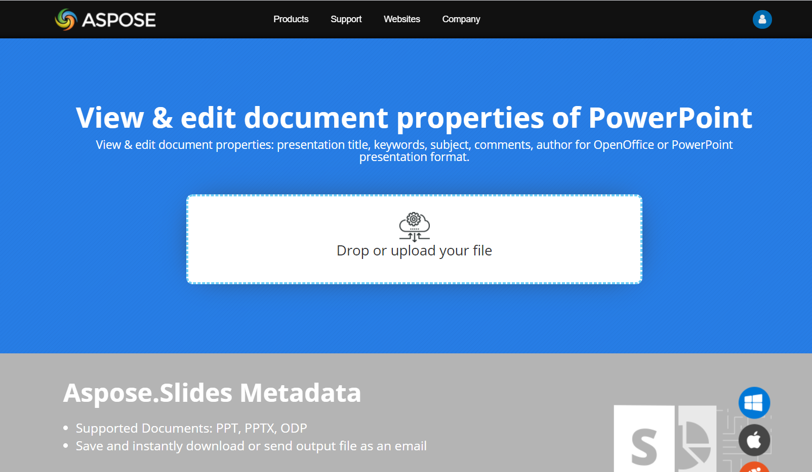

## **Access Presentation Properties**

As we have described earlier that Aspose.Slides for C++ supports two kinds of document properties, which are **Built-in** and **Custom** properties. So, developers can access both kinds of properties with the use of Aspose.Slides for C++ API. Aspose.Slides for C++ provides a class [IDocumentProperties](https://reference.aspose.com/slides/cpp/class/aspose.slides.i_document_properties) that represents the document properties associated with a presentation file through [Presentation::get_DocumentProperties()](https://reference.aspose.com/slides/cpp/class/aspose.slides.presentation#a40a03eb17a9904ff80063f6df714c402) method. Developers can use [get_DocumentProperties()](https://reference.aspose.com/slides/cpp/class/aspose.slides.presentation#a40a03eb17a9904ff80063f6df714c402) method exposed by **Presentation** object to access the document properties of the presentation files as described below:

{} 

Please note that you cannot set values against the **Application** and **Producer** fields, because Aspose Ltd. and Aspose.Slides for C++ x.x.x will be displayed against these fields.

{} 

Microsoft PowerPoint provides a feature to add some properties to the presentation files. These document properties allow some useful information to be stored along with the documents (presentation files). There are two kinds of document properties as follows

- System Defined (Built-in) Properties
- User Defined (Custom) Properties

**Built-in** properties contain general information about the document like document title, author's name, document statistics and so on. **Custom** properties are those ones, which are defined by the users as **Name/Value** pairs, where both name and value are defined by the user. Using Aspose.Slides for C++, developers can access and modify the values of built-in properties as well as custom properties. Microsoft PowerPoint 2007 allows managing the document properties of the presentation files. All you have to do is to click the Office icon and further **Prepare | Properties | Advanced Properties** menu item of the Microsoft PowerPoint 2007. After you select **Advanced Properties** menu item, a dialog would appear allowing you to manage the document properties of the PowerPoint file. In the **Properties Dialog**, you can see that there are many tab pages like **General, Summary, Statistics, Contents and Custom**. All these tab pages allow configuring different kinds of information related to the PowerPoint files. **Custom** tab is used to manage custom properties of the PowerPoint files.

## **Access Built-in Properties**

These properties as exposed by **IDocumentProperties** object include: **Creator(Author)**, **Description**, **KeyWords** **Created** (Creation Date), **Modified** Modification Date, **Printed** Last Print Date, **LastModifiedBy**, **Keywords**, **SharedDoc** (Is shared between different producers?), **PresentationFormat**, **Subject** and **Title**



## **Modify Built-in Properties**

Modifying the built-in properties of presentation files is as easy as that of accessing them. You can simply assign a string value to any desired property and the property value would be modified. In the example given below, we have demonstrated that how we can modify the built-in document properties of the presentation file.



## **Add Custom Presentation Properties**

Aspose.Slides for C++ also allows developers to add the custom the values for presentation Document properties. An example is given below that shows how to set the custom properties for a presentation.

``` cpp
// Instantiate the Presentation class
auto presentation = System::MakeObject<Presentation>();

// Getting Document Properties
auto documentProperties = presentation->get_DocumentProperties();

// Adding Custom properties
documentProperties->idx_set(u"New Custom", ObjectExt::Box<int32_t>(12));
documentProperties->idx_set(u"My Name", ObjectExt::Box<String>(u"Mudassir"));
documentProperties->idx_set(u"Custom", ObjectExt::Box<int32_t>(124));

// Getting property name at particular index
String getPropertyName = documentProperties->GetCustomPropertyName(2);

// Removing selected property
documentProperties->RemoveCustomProperty(getPropertyName);

// Saving presentation
presentation->Save(u"CustomDocumentProperties_out.pptx", SaveFormat::Pptx);
```

## **Access and Modify Custom Properties**

Aspose.Slides for C++ also allows developers to access the values of custom properties. An example is given below that shows how can you access and modify all of these custom properties for a presentation.



## **Set Proofing Language**

Aspose.Slides provides the [LanguageId](https://reference.aspose.com/slides/cpp/aspose.slides/baseportionformat/set_languageid/) property (exposed by the [PortionFormat](https://reference.aspose.com/slides/cpp/aspose.slides/portionformat/) class) to allow you to set the proofing language for a PowerPoint document. The proofing language is the language for which spellings and grammar in the PowerPoint are checked.

This C++ code shows you how to set the proofing language for a PowerPoint:

```c++
System::SharedPtr<Presentation> pres = System::MakeObject<Presentation>(pptxFileName);
System::SharedPtr<AutoShape> autoShape = System::ExplicitCast<AutoShape>(pres->get_Slide(0)->get_Shape(0));

System::SharedPtr<IParagraph> paragraph = autoShape->get_TextFrame()->get_Paragraph(0);
System::SharedPtr<IPortionCollection> portions = paragraph->get_Portions();
portions->Clear();

System::SharedPtr<Portion> newPortion = System::MakeObject<Portion>();

System::SharedPtr<IFontData> font = System::MakeObject<FontData>(u"SimSun");
System::SharedPtr<IPortionFormat> portionFormat = newPortion->get_PortionFormat();
portionFormat->set_ComplexScriptFont(font);
portionFormat->set_EastAsianFont(font);
portionFormat->set_LatinFont(font);

portionFormat->set_LanguageId(u"zh-CN");
// set the Id of a proofing language

newPortion->set_Text(u"1。");
portions->Add(newPortion);
```

## **Set Default Language**

This C++ code shows you how to set the default language for an entire PowerPoint presentation:

```c++
System::SharedPtr<LoadOptions> loadOptions = System::MakeObject<LoadOptions>();
loadOptions->set_DefaultTextLanguage(u"en-US");

System::SharedPtr<Presentation> pres = System::MakeObject<Presentation>(loadOptions);

// Adds a new rectangle shape with text
System::SharedPtr<IAutoShape> shp = pres->get_Slide(0)->get_Shapes()->AddAutoShape(ShapeType::Rectangle, 50.0f, 50.0f, 150.0f, 50.0f);
System::SharedPtr<ITextFrame> textFrame = shp->get_TextFrame();
textFrame->set_Text(u"New Text");

// Checks the first portion language
System::Console::WriteLine(textFrame->get_Paragraph(0)->get_Portion(0)->get_PortionFormat()->get_LanguageId());
```

## **Live Example**

Try [**Aspose.Slides Metadata**](https://products.aspose.app/slides/metadata) online app to see how to work with document properties via Aspose.Slides API:

[](https://products.aspose.app/slides/metadata)
