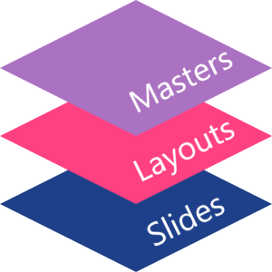

## **Overview**

A **slide master** defines shared design settings for a group of slides. It can contain common shapes, logos, backgrounds, text styles, theme settings, and footer settings. In PowerPoint, editing a slide master is the usual way to keep a presentation consistent without repeating the same formatting on every slide.

Aspose.Slides for C++ supports the same model. A presentation can contain one or more master slides, and each master slide can contain several layout slides. Normal slides do not usually refer to a master slide directly. Instead, a normal slide uses a layout slide, and that layout slide belongs to a master slide.

The hierarchy is:

1. **Slide master** - defines the shared design and theme.
1. **Layout slide** - defines a specific arrangement of placeholders and layout-level formatting.
1. **Normal slide** - contains the actual presentation content and uses one layout slide.



In Aspose.Slides, a slide master is represented by the [IMasterSlide](https://reference.aspose.com/slides/cpp/aspose.slides/imasterslide/) interface. All master slides in a presentation are available through the [Presentation::get_Masters](https://reference.aspose.com/slides/cpp/aspose.slides/presentation/get_masters/) collection, which implements [IMasterSlideCollection](https://reference.aspose.com/slides/cpp/aspose.slides/imasterslidecollection/).

{}

When the same property is defined at more than one level, the more specific level wins. For example, if a master slide and a layout slide both define a background, slides based on that layout use the layout background. For more information about layout slides, see [Apply or Change Slide Layouts](/slides/cpp/slide-layout/).

{}

## **Access Slide Masters**

In PowerPoint, you can open the Slide Master view from **View** > **Slide Master**.


In Aspose.Slides, use the `get_Masters()` collection to access master slides:

```cpp
auto presentation = System::MakeObject<Presentation>(u"presentation.pptx");

auto firstMasterSlide = presentation->get_Master(0);
auto masterSlideCount = presentation->get_Masters()->get_Count();
auto firstMasterLayoutSlideCount = firstMasterSlide->get_LayoutSlides()->get_Count();

System::Console::WriteLine(System::String(u"Master slides: ") + masterSlideCount);
System::Console::WriteLine(System::String(u"Layouts in the first master: ") + firstMasterLayoutSlideCount);

presentation->Dispose();
```

You can also get the master slide used by a normal slide through its layout:

```cpp
auto presentation = System::MakeObject<Presentation>(u"presentation.pptx");

auto slide = presentation->get_Slide(0);
auto layoutSlide = slide->get_LayoutSlide();
auto masterSlide = layoutSlide->get_MasterSlide();
auto masterSlideName = masterSlide->get_Name();

System::Console::WriteLine(masterSlideName);

presentation->Dispose();
```

## **What a Slide Master Contains**

A master slide is a slide-like object. It implements [IBaseSlide](https://reference.aspose.com/slides/cpp/aspose.slides/ibaseslide/), so it exposes many of the same slide properties used by normal and layout slides. Master-specific members are listed on the [IMasterSlide](https://reference.aspose.com/slides/cpp/aspose.slides/imasterslide/) API page.

Commonly used master slide members include:

| Member | Purpose |
| --- | --- |
| `get_Background()` | Sets the master-level slide background. |
| `get_Shapes()` | Stores shapes placed on the master, such as logos, picture frames, and shared text. |
| `get_LayoutSlides()` | Stores the layout slides that belong to the master. |
| `get_ThemeManager()` | Provides access to the master theme APIs. |
| `get_HeaderFooterManager()` | Controls headers, footers, dates, and slide numbers for the master and its child layouts. |
| `GetDependingSlides()` | Returns normal slides that depend on the master through their layouts. |

## **Add an Image to a Slide Master**

When you add an image to a master slide, it appears on slides that use layouts from that master. This is useful for logos, watermarks, decorative bands, and other repeated visual elements.

The following example adds a logo to the first master slide:

```cpp
auto presentation = System::MakeObject<Presentation>(u"presentation.pptx");

auto masterSlide = presentation->get_Master(0);
auto logoBytes = System::IO::File::ReadAllBytes(u"logo.png");
auto logoImage = presentation->get_Images()->AddImage(logoBytes);

masterSlide->get_Shapes()->AddPictureFrame(
    ShapeType::Rectangle,
    20.0f,
    20.0f,
    80.0f,
    80.0f,
    logoImage);

presentation->Save(u"presentation-with-logo.pptx", SaveFormat::Pptx);
presentation->Dispose();
```

For more information about picture frames, see [Picture Frame](/slides/cpp/picture-frame/).

## **Work with Placeholders**

Placeholders are normally defined on layout slides. The master slide provides the shared style and theme that those layouts inherit, while each layout decides which placeholders are available and where they are placed.

In PowerPoint, placeholder commands are available in Slide Master view.


To add new placeholders with Aspose.Slides, work with the layout slide that belongs to the master:

```cpp
auto presentation = System::MakeObject<Presentation>(u"presentation.pptx");

auto masterSlide = presentation->get_Master(0);
auto blankLayoutSlide = masterSlide->get_LayoutSlides()->GetByType(SlideLayoutType::Blank);

if (blankLayoutSlide == nullptr)
{
    blankLayoutSlide = masterSlide->get_LayoutSlides()->Add(SlideLayoutType::Blank, u"Blank");
}

blankLayoutSlide->get_PlaceholderManager()->AddTextPlaceholder(
    60.0f,
    120.0f,
    600.0f,
    80.0f);

presentation->get_Slides()->AddEmptySlide(blankLayoutSlide);
presentation->Save(u"presentation-with-placeholder.pptx", SaveFormat::Pptx);
presentation->Dispose();
```

You can also format placeholder shapes that already exist on a master slide. The following example finds the title placeholder and applies a linear gradient fill:

```cpp
auto presentation = System::MakeObject<Presentation>(u"presentation.pptx");

auto masterSlide = presentation->get_Master(0);
System::SharedPtr<IAutoShape> titlePlaceholder;

for (auto&& shape : masterSlide->get_Shapes())
{
    auto autoShape = System::AsCast<IAutoShape>(shape);

    if (autoShape != nullptr &&
        autoShape->get_Placeholder() != nullptr &&
        autoShape->get_Placeholder()->get_Type() == PlaceholderType::Title)
    {
        titlePlaceholder = autoShape;
        break;
    }
}

if (titlePlaceholder != nullptr)
{
    auto fillFormat = titlePlaceholder->get_FillFormat();
    fillFormat->set_FillType(FillType::Gradient);

    auto gradientFormat = fillFormat->get_GradientFormat();
    gradientFormat->set_GradientShape(GradientShape::Linear);

    auto gradientStops = gradientFormat->get_GradientStops();
    auto redGradientColor = System::Drawing::Color::FromArgb(255, 0, 0);
    auto purpleGradientColor = System::Drawing::Color::FromArgb(128, 0, 128);

    gradientStops->Add(0.0f, redGradientColor);
    gradientStops->Add(255.0f, purpleGradientColor);
}

presentation->Save(u"presentation-title-style.pptx", SaveFormat::Pptx);
presentation->Dispose();
```


For more placeholder and text formatting options, see [Set Prompt Text in Placeholder](/slides/cpp/manage-placeholder/) and [Text Formatting](/slides/cpp/text-formatting/).

## **Change a Slide Master Background**

A master background is inherited by layouts and slides that do not override it. The following example sets a solid background color for the first master slide:

```cpp
auto presentation = System::MakeObject<Presentation>(u"presentation.pptx");

auto masterSlide = presentation->get_Master(0);
auto masterBackgroundColor = System::Drawing::Color::get_ForestGreen();

masterSlide->get_Background()->set_Type(BackgroundType::OwnBackground);
masterSlide->get_Background()->get_FillFormat()->set_FillType(FillType::Solid);
masterSlide->get_Background()->get_FillFormat()->get_SolidFillColor()->set_Color(masterBackgroundColor);

presentation->Save(u"presentation-master-background.pptx", SaveFormat::Pptx);
presentation->Dispose();
```

For related topics, see [Presentation Background](/slides/cpp/presentation-background/) and [Presentation Theme](/slides/cpp/presentation-theme/).

## **Clone a Slide Master to Another Presentation**

Use [IMasterSlideCollection::AddClone](https://reference.aspose.com/slides/cpp/aspose.slides/imasterslidecollection/addclone/) to copy a master slide into another presentation. The copied master can then be used by layouts and slides in the destination presentation.

```cpp
auto sourcePresentation = System::MakeObject<Presentation>(u"source.pptx");
auto destinationPresentation = System::MakeObject<Presentation>(u"destination.pptx");

auto sourceMasterSlide = sourcePresentation->get_Master(0);
auto clonedMasterSlide = destinationPresentation->get_Masters()->AddClone(sourceMasterSlide);

destinationPresentation->Save(u"destination-with-master.pptx", SaveFormat::Pptx);
destinationPresentation->Dispose();
sourcePresentation->Dispose();
```

If you need to clone normal slides together with their master, see [Clone Slides](/slides/cpp/clone-slides/).

## **Add Multiple Slide Masters**

A presentation can contain multiple master slides. This is useful when different sections require different branding, page structure, or theme settings.


The following example clones the default master, gives the clone a different background, creates a layout under that cloned master, and adds a new slide based on that layout:

```cpp
auto presentation = System::MakeObject<Presentation>(u"presentation.pptx");

auto defaultMasterSlide = presentation->get_Master(0);
auto sectionMasterSlide = presentation->get_Masters()->AddClone(defaultMasterSlide);
auto sectionMasterBackgroundColor = System::Drawing::Color::get_LightSteelBlue();

sectionMasterSlide->get_Background()->set_Type(BackgroundType::OwnBackground);
sectionMasterSlide->get_Background()->get_FillFormat()->set_FillType(FillType::Solid);
sectionMasterSlide->get_Background()->get_FillFormat()->get_SolidFillColor()->set_Color(sectionMasterBackgroundColor);

auto sourceBlankLayout = defaultMasterSlide->get_LayoutSlides()->GetByType(SlideLayoutType::Blank);

if (sourceBlankLayout == nullptr)
{
    sourceBlankLayout = defaultMasterSlide->get_LayoutSlide(0);
}

auto sectionBlankLayout = sectionMasterSlide->get_LayoutSlides()->AddClone(sourceBlankLayout);

presentation->get_Slides()->AddEmptySlide(sectionBlankLayout);
presentation->Save(u"presentation-with-multiple-masters.pptx", SaveFormat::Pptx);
presentation->Dispose();
```

## **Compare Slide Masters**

Master slides can be compared with the `Equals` method inherited from [IBaseSlide](https://reference.aspose.com/slides/cpp/aspose.slides/ibaseslide/). The comparison checks structure and static content, such as shapes, text, formatting, animations, and other slide settings. It does not compare unique identifiers, such as slide IDs, or dynamic placeholder values, such as the current date.

```cpp
auto firstPresentation = System::MakeObject<Presentation>(u"first.pptx");
auto secondPresentation = System::MakeObject<Presentation>(u"second.pptx");
auto firstPresentationMasterCount = firstPresentation->get_Masters()->get_Count();
auto secondPresentationMasterCount = secondPresentation->get_Masters()->get_Count();

for (int32_t firstMasterIndex = 0;
     firstMasterIndex < firstPresentationMasterCount;
     firstMasterIndex++)
{
    for (int32_t secondMasterIndex = 0;
         secondMasterIndex < secondPresentationMasterCount;
         secondMasterIndex++)
    {
        auto firstMasterSlide = firstPresentation->get_Master(firstMasterIndex);
        auto secondMasterSlide = secondPresentation->get_Master(secondMasterIndex);
        auto areMasterSlidesEqual = firstMasterSlide->Equals(secondMasterSlide);

        if (areMasterSlidesEqual)
        {
            System::Console::WriteLine(
                System::String::Format(
                    u"first.pptx master #{0} equals second.pptx master #{1}",
                    firstMasterIndex,
                    secondMasterIndex));
        }
    }
}

secondPresentation->Dispose();
firstPresentation->Dispose();
```

For more information, see [Compare Presentation Slides](/slides/cpp/compare-slides/).

## **Set Slide Master View as the Default View**

Use the `set_LastView` method on [ViewProperties](https://reference.aspose.com/slides/cpp/aspose.slides/viewproperties/) to control the view that PowerPoint opens first. The following example opens the presentation in Slide Master view:

```cpp
auto presentation = System::MakeObject<Presentation>(u"presentation.pptx");

presentation->get_ViewProperties()->set_LastView(ViewType::SlideMasterView);
presentation->Save(u"presentation-master-view.pptx", SaveFormat::Pptx);
presentation->Dispose();
```

For more view settings, see [Save Presentation](/slides/cpp/save-presentation/).

## **Remove Unused Master Slides**

Presentations sometimes contain master slides that are no longer used by any normal slides. Removing unused masters can reduce file size and simplify template maintenance.

Use [MasterSlideCollection::RemoveUnused](https://reference.aspose.com/slides/cpp/aspose.slides/masterslidecollection/removeunused/) to remove unused masters from the `get_Masters()` collection:

```cpp
auto presentation = System::MakeObject<Presentation>(u"presentation.pptx");

presentation->get_Masters()->RemoveUnused(true);
presentation->Save(u"presentation-clean.pptx", SaveFormat::Pptx);
presentation->Dispose();
```

You can also use the low-code [Compress::RemoveUnusedMasterSlides](https://reference.aspose.com/slides/cpp/aspose.slides.lowcode/compress/removeunusedmasterslides/) method:

```cpp
auto presentation = System::MakeObject<Presentation>(u"presentation.pptx");

LowCode::Compress::RemoveUnusedMasterSlides(presentation);
presentation->Save(u"presentation-clean.pptx", SaveFormat::Pptx);
presentation->Dispose();
```

## **FAQ**

**What is the difference between a slide master and a layout slide?**

A slide master defines shared design settings such as theme, background, common shapes, and text styles. A layout slide belongs to a master slide and defines a specific arrangement of placeholders. A normal slide uses a layout slide, so it inherits from both the layout and the master.

**Can one presentation contain several slide masters?**

Yes. A presentation can contain several slide masters. Use multiple masters when different sections need different visual systems or branding.

**Should I add placeholders to a master slide or a layout slide?**

In most cases, add placeholders to layout slides. Put shared visual elements and shared formatting on the master slide, then put content placeholders on the layouts that normal slides will use.

**Can I delete a master slide that is still used?**

No. A master slide that has dependent slides cannot be safely removed directly. First move those slides to layouts under another master, or use an unused-master cleanup method that removes only masters that are not in use.
