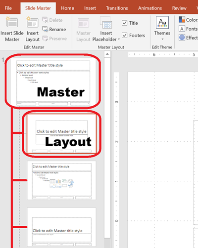

This article provides a series of examples that demonstrate how to work with slides using **Aspose.Slides for C++**. You’ll learn how to add, access, clone, reorder, and remove slides using the `Presentation` class.

Each example below includes a brief explanation followed by a code snippet in C++.

## **Add a Slide**

To add a new slide, you must first select a layout. In this example, we use the `Blank` layout and add an empty slide to the presentation.

```cpp
static void AddSlide()
{
    auto presentation = MakeObject<Presentation>();
    auto blankLayout = presentation->get_LayoutSlides()->GetByType(SlideLayoutType::Blank);

    presentation->get_Slides()->AddEmptySlide(blankLayout);

    presentation->Dispose();
}
```

> 💡 **Note:** Each slide layout is derived from a master slide, which defines the overall design and placeholder structure. The image below illustrates how master slides and their associated layouts are organized in PowerPoint.



## **Access Slides by Index**

You can access slides using their index, or find a slide’s index based on a reference. This is useful for iterating through or modifying specific slides.

```cpp
static void AccessSlide()
{
    auto presentation = MakeObject<Presentation>();

    // Add another empty slide.
    auto blankLayout = presentation->get_LayoutSlides()->GetByType(SlideLayoutType::Blank);
    presentation->get_Slides()->AddEmptySlide(blankLayout);

    // Access slides by index.
    auto firstSlide = presentation->get_Slide(0);
    auto secondSlide = presentation->get_Slide(1);

    // Get slide index from a reference, then access it by index.
    auto secondSlideIndex = presentation->get_Slides()->IndexOf(secondSlide);
    auto secondSlideByIndex = presentation->get_Slide(secondSlideIndex);

    presentation->Dispose();
}
```

## **Clone a Slide**

This example demonstrates how to clone an existing slide. The cloned slide is automatically added to the end of the slide collection.

```cpp
static void CloneSlide()
{
    auto presentation = MakeObject<Presentation>();
    auto firstSlide = presentation->get_Slide(0);

    auto clonedSlide = presentation->get_Slides()->AddClone(firstSlide);

    auto clonedSlideIndex = presentation->get_Slides()->IndexOf(clonedSlide);

    presentation->Dispose();
}
```

## **Reorder Slides**

You can change the order of slides by moving one to a new index. In this case, we move a cloned slide to the first position.

```cpp
static void ReorderSlide()
{
    auto presentation = MakeObject<Presentation>();
    auto firstSlide = presentation->get_Slide(0);

    auto clonedSlide = presentation->get_Slides()->AddClone(firstSlide);

    presentation->get_Slides()->Reorder(0, clonedSlide);

    presentation->Dispose();
}
```

## **Remove a Slide**

To remove a slide, simply reference it and call `Remove`. This example adds a second slide and then removes the original, leaving only the new one.

```cpp
static void RemoveSlide()
{
    auto presentation = MakeObject<Presentation>();

    auto blankLayout = presentation->get_LayoutSlides()->GetByType(SlideLayoutType::Blank);
    auto secondSlide = presentation->get_Slides()->AddEmptySlide(blankLayout);

    auto firstSlide = presentation->get_Slide(0);
    presentation->get_Slides()->Remove(firstSlide);

    presentation->Dispose();
}
```
