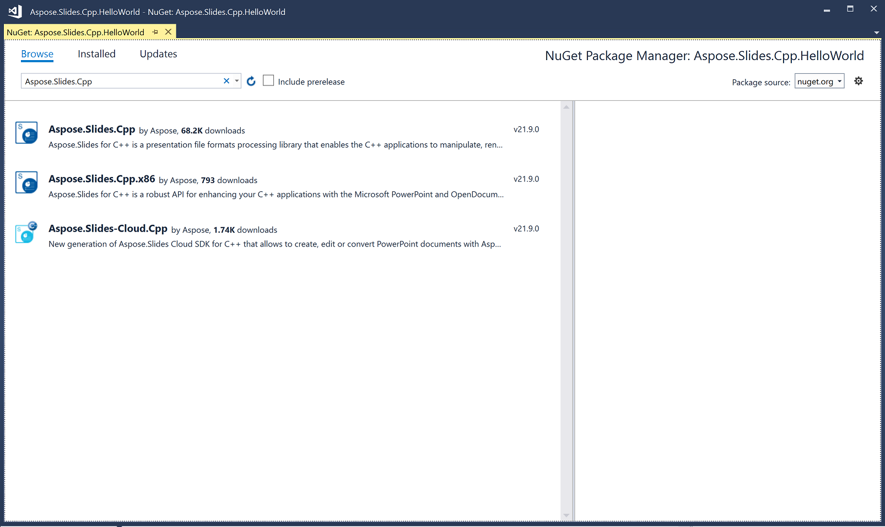
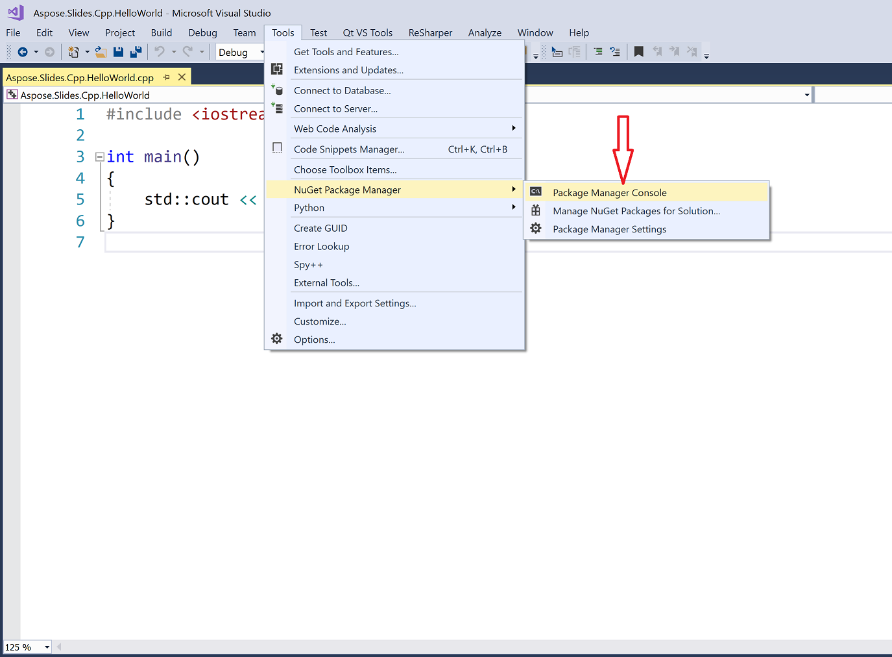
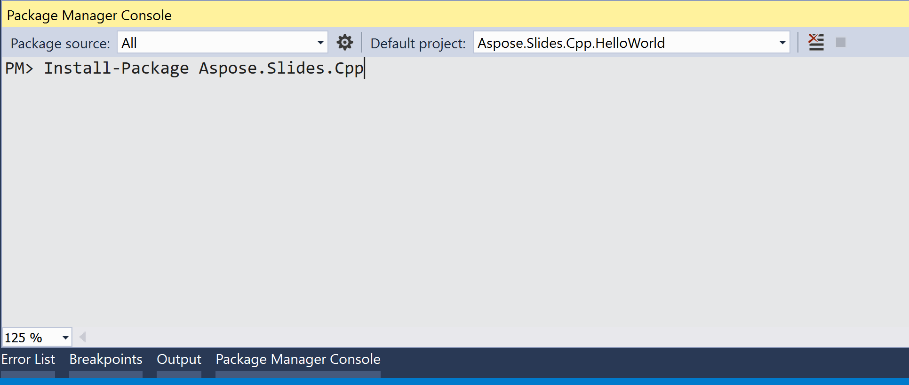
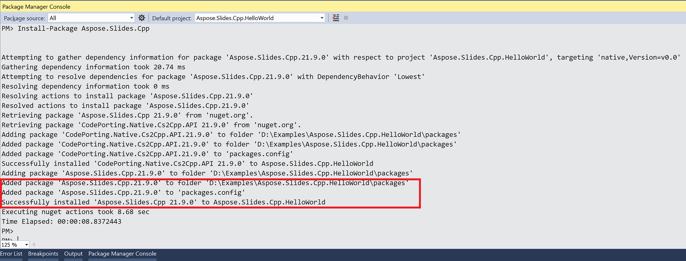

## **Windows**
NuGet provides the easiest path to downloading and installing Aspose APIs for C++ on PCs. 

### **Option One: Install or Update Aspose.Slides for C++ from the NuGet Package Manager**

1. Open Microsoft Visual Studio. 
2. Create a simple console app. Or you can open your preferred project. 
3. Go through **Tools** > **NuGet package manager**.
4. Under **Browse**, type *Aspose.Slides.Cpp* into the text field. 

3. Click on the version you need **Aspose.Slides.Cpp** and then click **Install**. 
   * If you want to update Aspose.Slides—which means you already have it installed—click **Update** instead. 

The selected API gets downloaded and referenced in your project.

### **Option 2: Install or Update Aspose.Slides Through the Package Manager Console**

To reference the [Aspose.Slides API](https://www.nuget.org/packages/Aspose.Slides.Cpp/) using the package manager console, do this:

1. Open your solution/project in Visual Studio.

1. Go through **Tools** > **NuGet Package Manager** > **Package Manager Console**. 

   The Package Manager Console opens. 

4. Type this command: `Install-Package Aspose.Slides.Cpp` 
> If you want to install the x86 version, use the Aspose.Slides.Cpp.x86 package: `Install-Package Aspose.Slides.Cpp.x86`

5. Press the Enter key.

   The latest full release gets installed into your application. 

   * Alternatively, you can add the `-prerelease` suffix to the command to specify that the latest release (including hotfixes) must be installed as well.

​	Once the download reaches completion, you should see some confirmation messages.  

If you are not familiar with [Aspose EULA](https://about.aspose.com/legal/eula), then you may want to read the license referenced in the URL. 

In the Package Manager Console, you can run the `Update-Package Aspose.Slides.Cpp` command to check for updates to the Aspose.Slides package. Updates (if found) get installed automatically. You can also use the `-prerelease` suffix to update the latest release.

### Using Include and lib Folders
1. [Download](https://downloads.aspose.com/slides/cpp) the latest Aspose.Slides for C++ version.
1. Unzip the folder to the production environment.
1. To use Aspose.Slides for C++, reference Include and lib folders in your project
