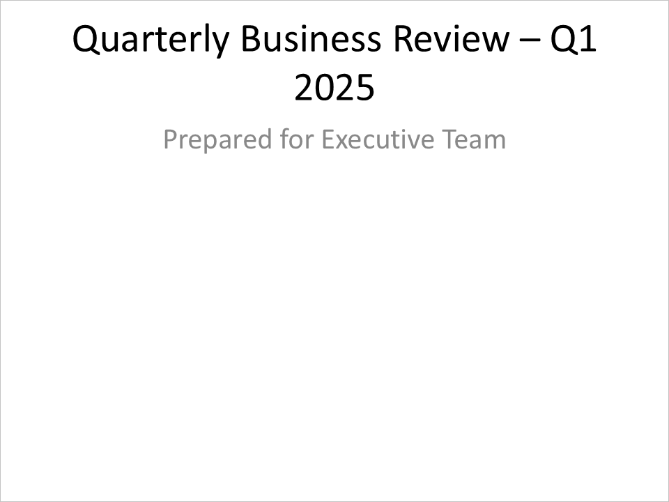

## **Introduction**

Creating PowerPoint presentations manually can be a time-consuming and repetitive task—especially when the content is based on dynamic data that frequently changes. Whether it's generating weekly business reports, assembling educational material, or producing client-ready sales decks, automation can save countless hours and ensure consistency across teams.

For C++ developers, automating the creation of PowerPoint presentations opens up powerful possibilities. You can integrate slide generation into web portals, deskt op tools, backend services, or cloud platforms to dynamically convert data into professional, branded presentations—on-demand.

In this article, we’ll explore the common use cases for automated PowerPoint generation in C++ apps (including deployments on cloud platforms) and why it's becoming an essential feature in modern solutions. From pulling real-time business data to converting text or images into slides, the goal is to transform raw content into structured, visual formats your audience can instantly understand.

## **Common Use Cases for PowerPoint Automation in C++**

Automating PowerPoint generation is especially useful in scenarios where presentation content needs to be dynamically assembled, personalized, or frequently updated. Some of the most common real-world use cases include:

- **Business Reports & Dashboards**
  Generate sales summaries, KPIs, or financial performance reports by pulling live data from databases or APIs.

- **Personalized Sales & Marketing Decks**
  Automatically create client-specific pitch decks using CRM or form data, ensuring quick turnaround and brand consistency.

- **Educational Content**
  Convert learning material, quizzes, or course summaries into structured slide decks for e-learning platforms.

- **Data & AI-Powered Insights**
  Use natural language processing or analytics engines to transform raw data or long-form text into summarized presentations.

- **Media-Based Slides**
  Assemble presentations from uploaded images, annotated screenshots, or video keyframes with supporting descriptions.

- **Document Conversion**
  Automatically convert Word documents, PDFs, or form inputs into visual presentations with minimal manual effort.

- **Developer and Technical Tools**
  Create tech demos, documentation overviews, or changelogs in slide format directly from code or markdown content.

By automating these workflows, organizations can scale their content creation, maintain consistency, and free up time for more strategic work.

## **Let's Code**

For this example, we’ve chosen **[Aspose.Slides for C++](https://products.aspose.com/slides/cpp/)** to demonstrate PowerPoint automation due to its comprehensive feature set and ease of use when working with presentations programmatically.

Unlike lower-level libraries, which require developers to work directly with the Open XML structure (often resulting in verbose and less readable code), Aspose.Slides provides a higher-level API. It abstracts away the complexity, allowing developers to focus on presentation logic—such as layout, formatting, and data binding—without needing to understand the PowerPoint file format in detail.

Although Aspose.Slides is a commercial library, it offers a [free trial](https://releases.aspose.com/slides/cpp/) version that is fully capable of running the examples provided in this article. For the purpose of demonstrating ideas, testing features, or building a proof of concept like the one we’re covering here, the trial is more than sufficient. This makes it a convenient option for experimenting with automated PowerPoint generation without needing to commit to a license upfront.

Ok, let’s walk through building a sample presentation using real-world content.

### **Create a Title Slide**

We'll begin by creating a new presentation and adding a title slide with a main heading and subtitle.

```cpp
auto presentation = MakeObject<Presentation>();

auto slide0 = presentation->get_Slide(0);

auto layoutSlide = presentation->get_LayoutSlides()->GetByType(SlideLayoutType::Title);
slide0->set_LayoutSlide(layoutSlide);

auto titleShape = ExplicitCast<IAutoShape>(slide0->get_Shape(0));
auto subtitleShape = ExplicitCast<IAutoShape>(slide0->get_Shape(1));

titleShape->get_TextFrame()->set_Text(u"Quarterly Business Review – Q1 2025");
subtitleShape->get_TextFrame()->set_Text(u"Prepared for Executive Team");
```



### **Add a Slide with a Column Chart**

Next, we’ll create a slide showing regional sales performance as a column chart.

```cpp
auto layoutSlide1 = presentation->get_LayoutSlides()->GetByType(SlideLayoutType::Blank);
auto slide1 = presentation->get_Slides()->AddEmptySlide(layoutSlide1);

auto chart = slide1->get_Shapes()->AddChart(ChartType::ClusteredColumn, 100, 100, 500, 350, false);
chart->get_Legend()->set_Position(LegendPositionType::Bottom);
chart->set_HasTitle(true);
chart->get_ChartTitle()->AddTextFrameForOverriding(u"Data from January – March 2025");
chart->get_ChartTitle()->set_Overlay(false);

auto workbook = chart->get_ChartData()->get_ChartDataWorkbook();
auto worksheetIndex = 0;

chart->get_ChartData()->get_Categories()->Add(workbook->GetCell(worksheetIndex, 1, 0, ObjectExt::Box<String>(u"North America")));
chart->get_ChartData()->get_Categories()->Add(workbook->GetCell(worksheetIndex, 2, 0, ObjectExt::Box<String>(u"Europe")));
chart->get_ChartData()->get_Categories()->Add(workbook->GetCell(worksheetIndex, 3, 0, ObjectExt::Box<String>(u"Asia Pacific")));
chart->get_ChartData()->get_Categories()->Add(workbook->GetCell(worksheetIndex, 4, 0, ObjectExt::Box<String>(u"Latin America")));
chart->get_ChartData()->get_Categories()->Add(workbook->GetCell(worksheetIndex, 5, 0, ObjectExt::Box<String>(u"Middle East")));

auto series = chart->get_ChartData()->get_Series()->Add(workbook->GetCell(worksheetIndex, 0, 1, ObjectExt::Box<String>(u"Sales ($K)")), chart->get_Type());
series->get_DataPoints()->AddDataPointForBarSeries(workbook->GetCell(worksheetIndex, 1, 1, ObjectExt::Box<int32_t>(480)));
series->get_DataPoints()->AddDataPointForBarSeries(workbook->GetCell(worksheetIndex, 2, 1, ObjectExt::Box<int32_t>(365)));
series->get_DataPoints()->AddDataPointForBarSeries(workbook->GetCell(worksheetIndex, 3, 1, ObjectExt::Box<int32_t>(290)));
series->get_DataPoints()->AddDataPointForBarSeries(workbook->GetCell(worksheetIndex, 4, 1, ObjectExt::Box<int32_t>(150)));
series->get_DataPoints()->AddDataPointForBarSeries(workbook->GetCell(worksheetIndex, 5, 1, ObjectExt::Box<int32_t>(120)));
```


### **Add a Slide with a Table**

We’ll now add a slide that presents key performance metrics in table format.

```cpp
auto layoutSlide2 = presentation->get_LayoutSlides()->GetByType(SlideLayoutType::Blank);
auto slide2 = presentation->get_Slides()->AddEmptySlide(layoutSlide2);

auto columnWidths = MakeArray<double>({ 200, 100 });
auto rowHeights = MakeArray<double>({ 40, 40, 40, 40, 40 });

auto table = slide2->get_Shapes()->AddTable(200, 200, columnWidths, rowHeights);
table->get_Column(0)->idx_get(0)->get_TextFrame()->set_Text(u"Metric");
table->get_Column(1)->idx_get(0)->get_TextFrame()->set_Text(u"Value");
table->get_Column(0)->idx_get(1)->get_TextFrame()->set_Text(u"Total Revenue");
table->get_Column(1)->idx_get(1)->get_TextFrame()->set_Text(u"$1.4M");
table->get_Column(0)->idx_get(2)->get_TextFrame()->set_Text(u"Gross Margin");
table->get_Column(1)->idx_get(2)->get_TextFrame()->set_Text(u"54%");
table->get_Column(0)->idx_get(3)->get_TextFrame()->set_Text(u"New Customers");
table->get_Column(1)->idx_get(3)->get_TextFrame()->set_Text(u"340");
table->get_Column(0)->idx_get(4)->get_TextFrame()->set_Text(u"Customer Retention");
table->get_Column(1)->idx_get(4)->get_TextFrame()->set_Text(u"87%");
```


### **Add a Summary Slide with Bullet Points**

Lastly, we’ll include a summary and action plan using a simple bullet list.

```cpp
static SharedPtr<IParagraph> CreateBulletParagraph(String text) {
    auto paragraph = MakeObject<Paragraph>();
    paragraph->get_ParagraphFormat()->get_Bullet()->set_Type(BulletType::Symbol);
    paragraph->get_ParagraphFormat()->set_Indent(15);
    paragraph->get_ParagraphFormat()->get_DefaultPortionFormat()->get_FillFormat()->set_FillType(FillType::Solid);
    paragraph->get_ParagraphFormat()->get_DefaultPortionFormat()->get_FillFormat()->get_SolidFillColor()->set_Color(Color::get_Black());
    paragraph->set_Text(text);
    return paragraph;
}
```
```cpp
auto layoutSlide3 = presentation->get_LayoutSlides()->GetByType(SlideLayoutType::Blank);
auto slide3 = presentation->get_Slides()->AddEmptySlide(layoutSlide3);

auto bulletList = slide3->get_Shapes()->AddAutoShape(ShapeType::Rectangle, 100, 50, 600, 200);
bulletList->get_FillFormat()->set_FillType(FillType::NoFill);
bulletList->get_LineFormat()->get_FillFormat()->set_FillType(FillType::NoFill);

bulletList->get_TextFrame()->get_Paragraphs()->Clear();
bulletList->get_TextFrame()->get_Paragraphs()->Add(CreateBulletParagraph(u"Strong performance in North America; growth opportunity in Asia Pacific"));
bulletList->get_TextFrame()->get_Paragraphs()->Add(CreateBulletParagraph(u"Improve marketing outreach in underperforming regions"));
bulletList->get_TextFrame()->get_Paragraphs()->Add(CreateBulletParagraph(u"Prepare new campaign strategy for Q2"));
bulletList->get_TextFrame()->get_Paragraphs()->Add(CreateBulletParagraph(u"Schedule follow-up review in early July"));
```


### **Save the Presentation**

Finally, we save the presentation to disk:

```java
presentation->Save(u"presentation.pptx", SaveFormat::Pptx);
```

## **Conclusion**

Automating PowerPoint generation in C++ applications offers clear benefits in saving time and reducing manual effort. By integrating dynamic content such as charts, tables, and text, developers can quickly produce consistent, professional presentations—ideal for business reports, client meetings, or educational content.

In this article, we've demonstrated how to automate the creation of a presentation from scratch, including adding a title slide, charts, and tables. This approach can be applied across various use cases where automated, data-driven presentations are needed.

By leveraging the right tools, C++ developers can efficiently automate PowerPoint creation, enhancing productivity and ensuring consistency across presentations.
