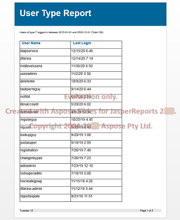

You can download Aspose.Slides for JasperReports for evaluation from the [download page](https://releases.aspose.com/slides/jasperreport/). The evaluation download is the same as the licensed one: it becomes licensed when you apply a license, as described in [Licensing](/slides/jasperreports/licensing/).

Without a license, the exporters still export every page of the report, but they place an evaluation watermark at the center of each slide or page. The watermark reads "Evaluation only.", "Created with Aspose.Slides for JasperReports" followed by the product version, and a copyright line. It appears in all four output formats: PPT, PPTX, PDF and HTML.

{}
To test Aspose.Slides for JasperReports without the evaluation watermark, request a 30-day [temporary license](https://purchase.aspose.com/temporary-license).
{}
