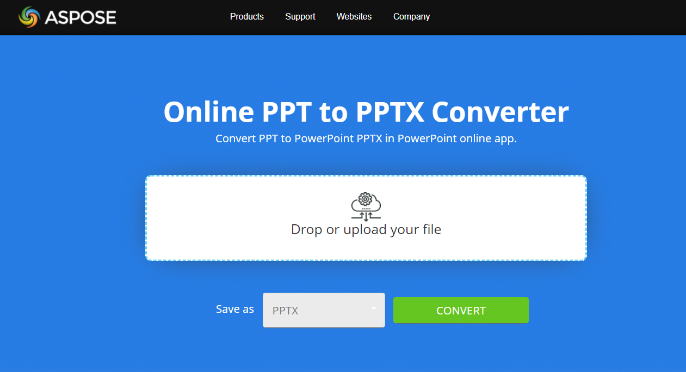

## **Overview**

This article explains how to convert PowerPoint Presentation in PPT format into PPTX format using Java and with online PPT to PPTX conversion app. The following topic is covered.

- Convert PPT to PPTX in Java

## **Java Convert PPT to PPTX**

For Java sample code to convert PPT to PPTX, please see the section below i.e. [Convert PPT to PPTX](#convert-ppt-to-pptx). It just loads the PPT file and saves in PPTX format. By specifiying different save formats, you can also save PPT file into many other formats like PDF, XPS, ODP, HTML etc. as disscussed in these articles.

- [Java Convert PPT to PDF](https://docs.aspose.com/slides/java/convert-powerpoint-to-pdf/)
- [Java Convert PPT to XPS](https://docs.aspose.com/slides/java/convert-powerpoint-to-xps/)
- [Java Convert PPT to HTML](https://docs.aspose.com/slides/java/convert-powerpoint-to-html/)
- [Java Convert PPT to ODP](https://docs.aspose.com/slides/java/save-presentation/)
- [Java Convert PPT to Image](https://docs.aspose.com/slides/java/convert-powerpoint-to-png/)

## **About PPT to PPTX Conversion**
Convert old PPT format to PPTX with Aspose.Slides API. If you need to convert thousands of PPT presentations to PPTX format, the best solution is to do it programmatically. With Aspose.Slides API its possible to do it just in few lines of code. The API supports full compatibility to convert PPT presentation to PPTX and its possible to:

- Convert complicated structures of masters, layouts and slides.
- Convert presentation with charts.
- Convert presentation with group shapes, auto-shapes (like rectangles and ellipses), shapes with custom geometry.
- Convert presentation, having textures and pictures fill styles for auto-shapes.
- Convert presentation with placeholders, text frames and text holders.

{} 

Take a look at [**Aspose.Slides PPT to PPTX Conversion**](https://products.aspose.app/slides/conversion/ppt-to-pptx) app:

[](https://products.aspose.app/slides/conversion/ppt-to-pptx)

[](https://products.aspose.app/slides/conversion/ppt-to-pptx)

This app is built based on [**Aspose.Slides API**](https://products.aspose.com/slides/java/), so you may see alive example of basic PPT to PPTX conversion capabilities. Aspose.Slides Conversion is a web app, which allows to drop presentation file in PPT format and download it converted to PPTX.

Find other live [**Aspose.Slides Conversion**](https://products.aspose.app/slides/conversion/) examples.
{} 

## **Convert PPT to PPTX**
Aspose.Slides for Java now facilitates the developers to access the PPT using [Presentation](https://reference.aspose.com/slides/java/com.aspose.slides/presentation) class instance and converting that to respective [PPTX](https://docs.fileformat.com/presentation/pptx/) format. Presently, it supports partial conversion of [PPT ](https://docs.fileformat.com/presentation/ppt/)to PPTX. For more details about what features are supported and unsupported in PPT to PPTX conversion, please proceed to this documentation [link](/slides/java/ppt-to-pptx-conversion/).

Aspose.Slides for Java offers [Presentation](https://reference.aspose.com/slides/java/com.aspose.slides/presentation) class that represents a **PPTX** presentation file. Presentation class can now also access **PPT** through Presentation when the object is instantiated. The following example shows how to convert a PPT presentation into PPTX Presentation.

```java
// Instantiate a Presentation object that represents a PPTX file
Presentation pres = new Presentation("Aspose.ppt");
try {
// Saving the PPTX presentation to PPTX format
    pres.save("ConvertedAspose.pptx", SaveFormat.Pptx);
} finally {
    if (pres != null) pres.dispose();
}
```

||
| :- |
|**Figure : Source PPT Presentation**|

The above code snippet generated the following PPTX presentation after conversion

||
| :- |
|**Figure: Generated PPTX presentation after conversion**|
