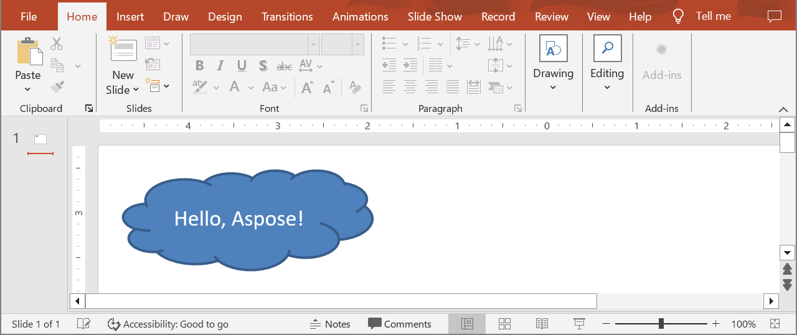

## **Overview**

Aspose.Slides for Java lets you build a brand‑new presentation file entirely in code. This article shows the core workflow—creating a [Presentation](https://reference.aspose.com/slides/java/com.aspose.slides/presentation/) object, grabbing the first slide, injecting a simple shape, and persisting the result—so you can see how little setup is required to generate a presentation without Microsoft Office. Because the same API writes PPT, PPTX, and ODP files, you can target both traditional PowerPoint and OpenDocument formats from a single code base. With its managed JAR and zero external dependencies, Aspose.Slides is suited to desktop, web, or server environments, giving your Java application an efficient starting point for adding richer content such as text, images, or charts once the initial slide deck is in place.

## **Create a Presentation**

Creating a PowerPoint file from scratch in Aspose.Slides for Java is as direct as instantiating the [Presentation](https://reference.aspose.com/slides/java/com.aspose.slides/presentation/) class. The constructor automatically supplies a blank deck with a single slide, giving you an immediate canvas for shapes, text, charts, or any other content your application needs. Once you modify that slide—or add new ones—you can persist the result to PPTX, legacy PPT, or even OpenDocument formats. The short code sample below illustrates this workflow by adding a simple shape onto the first slide.

1. Create an instance of the [Presentation](https://reference.aspose.com/slides/java/com.aspose.slides/presentation/) class.
1. Get a reference to the slide by its index.
1. Add an [IAutoShape](https://reference.aspose.com/slides/java/com.aspose.slides/iautoshape/) object of `Cloud` type using the `addAutoShape` method exposed by the `Shapes` collection.
1. Add text to the auto-shape.
1. Save the modified presentation as a PPTX file.

In the example below, a cloud shape is added to the first slide of the presentation.

```java
// Instantiate the Presentation class that represents a presentation file.
Presentation presentation = new Presentation();
try {
    // Get the first slide.
    ISlide slide = presentation.getSlides().get_Item(0);

    // Add an auto-shape of type Cloud.
    IAutoShape autoShape = slide.getShapes().addAutoShape(ShapeType.Cloud, 20, 20, 200, 80);
    autoShape.getTextFrame().setText("Hello, Aspose!");

    // Save the presentation as a PPTX file.
    presentation.save("new_presentation.pptx", SaveFormat.Pptx);
} finally {
    presentation.dispose();
}
```

The result:



## **FAQs**

**Can I create presentations without an Aspose.Slides license?**

Yes. The library runs in evaluation mode, but it stamps each slide with an "Evaluation Only" watermark and imposes limitations on certain operations. Load a valid license through the [License](https://reference.aspose.com/slides/java/com.aspose.slides/license/) class to lift these restrictions.

**How thread‑safe is the `Presentation` object?**

A single [Presentation](https://reference.aspose.com/slides/java/com.aspose.slides/presentation/) instance is not thread‑safe—simultaneous reads or writes from multiple threads can cause race conditions. Process separate presentations in separate threads, or clone the object before using it concurrently.

**Can I save the presentation directly to an `OutputStream` instead of the file system?**

Absolutely. Invoke `presentation.save(outputStream, SaveFormat.Pptx)` (or another format) to stream the document straight to a network socket, database, or cloud storage without ever writing a temporary file.
