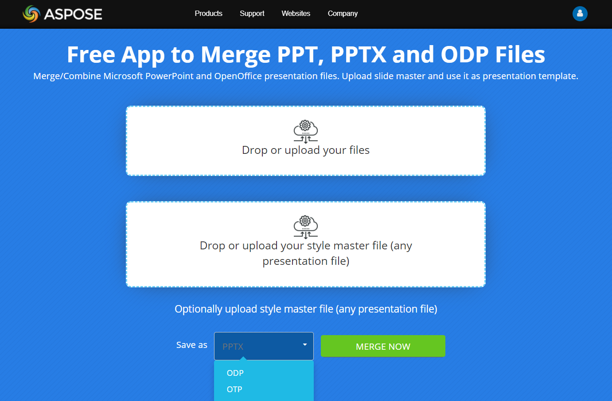

## **Overview**

Merging PowerPoint and OpenDocument presentations is a common task in many Java applications, especially when generating reports, compiling slides from different sources, or automating presentation workflows. Aspose.Slides for Java provides a powerful and easy-to-use API to combine multiple PPT, PPTX, or ODP files into a single presentation without installing Microsoft PowerPoint, LibreOffice, or OpenOffice.

In this guide, you'll learn how to merge PowerPoint and OpenDocument presentations using just a few lines of Java code. We'll provide ready-to-use examples, and show how to preserve slide formatting, layouts, and other presentation elements during the merge process.

Whether you're building an enterprise-grade application or a simple automation tool, Aspose.Slides makes merging presentations in Java fast, reliable, and scalable. Aspose.Slides for Java allows you to merge presentations in different ways. You can combine presentations with all their shapes, styles, text, formatting, comments, animations, and more—without worrying about loss of quality or data.

{}

See also: [Clone Slides](https://docs.aspose.com/slides/java/clone-slides/)

{}

### **What Can Be Merged?**

With Aspose.Slides, you can merge:

**Entire presentations** – all the slides from multiple presentations are combined into one.

**Specific slides** – only selected slides are merged into a single presentation.

**Presentations in the same format** (e.g., PPT to PPT, PPTX to PPTX) and **in different formats** (e.g., PPT to PPTX, PPTX to ODP).

### **Merging Options**

You can apply options that determine whether:

- Each slide in the output presentation retains its original style
- A specific style is applied to all slides in the output presentation

To merge presentations, Aspose.Slides provides the `AddClone` methods from the [ISlideCollection](https://reference.aspose.com/slides/java/com.aspose.slides/islidecollection/) interface. There are several `AddClone` method overloads that define how the merging process behaves. Each [Presentation](https://reference.aspose.com/slides/java/com.aspose.slides/presentation/) object has a Slides collection. So, you can call an `AddClone` method on the target presentation into which you want to merge slides.

The `AddClone` method returns an [ISlide](https://reference.aspose.com/slides/java/com.aspose.slides/islide/) object, which is a clone of the source slide. The resulting slides in the output presentation are simply copies of the original slides. This means you can safely modify the cloned slides—such as applying styles, formatting options, or layouts—without affecting the source presentation.

## **Merge Presentations** 

Aspose.Slides provides the [AddClone(ISlide)](https://reference.aspose.com/slides/java/com.aspose.slides/islidecollection/#addClone-com.aspose.slides.ISlide-) method, which allows you to combine slides while preserving their original layouts and styles (default behavior).

The following Java code shows how to merge presentations:

```java
Presentation presentation1 = new Presentation("presentation1.pptx");
Presentation presentation2 = new Presentation("presentation2.pptx");
try {
    for (ISlide slide : presentation2.getSlides()) {
        presentation1.getSlides().addClone(slide);
    }
    presentation1.save("combined.pptx", SaveFormat.Pptx);
} finally {
    presentation2.dispose();
    presentation1.dispose();
}
```

## **Merge Presentations with Slide Master**

Aspose.Slides provides the [AddClone(ISlide, IMasterSlide, boolean)](https://reference.aspose.com/slides/java/com.aspose.slides/islidecollection/#addClone-com.aspose.slides.ISlide-com.aspose.slides.IMasterSlide-boolean-) method, which allows you to combine slides while applying a slide master from a presentation template. This way, if needed, you can change the style of the slides in the output presentation.

The following Java code demonstrates this operation:

```java
Presentation presentation1 = new Presentation("presentation1.pptx");
Presentation presentation2 = new Presentation("presentation2.pptx");
try {
    for (ISlide slide : presentation2.getSlides()) {
        IMasterSlide masterSlide = presentation2.getMasters().get_Item(0);
        presentation1.getSlides().addClone(slide, masterSlide, true);
    }
    presentation1.save("combined.pptx", SaveFormat.Pptx);
} finally {
    presentation2.dispose();
    presentation1.dispose();
}
```

{}

The slide layout for the slide is determined automatically. When an appropriate layout can't be found, and the `allowCloneMissingLayout` boolean parameter of the `AddClone` method is set to `true`, the layout from the source slide is used. Otherwise, a [PptxEditException](https://reference.aspose.com/slides/java/com.aspose.slides/pptxeditexception/) is thrown.

{}

## **Merge Specific Slides from Presentations**

Merging specific slides from multiple presentations is useful for creating custom slide decks. Aspose.Slides for Java allows you to select and import only the slides you need. The API preserves formatting, layout, and design of the original slides.

The following Java code creates a new presentation, adds title slides from two other presentations, and saves the result to a file:

```java
Presentation presentation = new Presentation();
Presentation presentation1 = new Presentation("presentation1.pptx");
Presentation presentation2 = new Presentation("presentation2.pptx");
try {
    presentation.getSlides().removeAt(0);
    
    ISlide slide1 = getTitleSlide(presentation1);

    if (slide1 != null)
        presentation.getSlides().addClone(slide1);

    ISlide slide2 = getTitleSlide(presentation2);

    if (slide2 != null)
        presentation.getSlides().addClone(slide2);

    presentation.save("combined.pptx", SaveFormat.Pptx);
} finally {
    presentation2.dispose();
    presentation1.dispose();
    presentation.dispose();
}
```
```java
static ISlide getTitleSlide(IPresentation presentation) {
    for (ISlide slide : presentation.getSlides()) {
        if (slide.getLayoutSlide().getLayoutType() == SlideLayoutType.Title) {
            return slide;
        }
    }
    return null;
}
```

## **Merge Presentations with Slide Layout**

To apply a different slide layout to the output slides during merging, use the [AddClone(ISlide, ILayoutSlide)](https://reference.aspose.com/slides/java/com.aspose.slides/islidecollection/#addClone-com.aspose.slides.ISlide-com.aspose.slides.ILayoutSlide-) method instead.

The following Java code shows how to combine slides from multiple presentations while applying your preferred slide layout, resulting in a single output presentation:

```java
int layoutIndex = 0;

Presentation presentation1 = new Presentation("presentation1.pptx");
Presentation presentation2 = new Presentation("presentation2.pptx");
try {
    for (ISlide slide : presentation2.getSlides()) {
        ILayoutSlide layoutSlide = presentation2.getLayoutSlides().get_Item(layoutIndex);
        presentation1.getSlides().addClone(slide, layoutSlide);
    }
    presentation1.save("combined.pptx", SaveFormat.Pptx);
} finally {
    presentation2.dispose();
    presentation1.dispose();
}
```

## **Merge Presentations with Different Slide Sizes**

To merge two presentations with different slide sizes, you should resize one of them to match the slide size of the other presentation.

The following Java code demonstrates this operation:

```java
Presentation presentation1 = new Presentation("presentation1.pptx");
Presentation presentation2 = new Presentation("presentation2.pptx");
try {
    Dimension2D slideSize = presentation1.getSlideSize().getSize();
    float slideWidth = (float) slideSize.getWidth();
    float slideHeight = (float) slideSize.getHeight();
    
    presentation2.getSlideSize().setSize(slideWidth, slideHeight, SlideSizeScaleType.EnsureFit);

    for (ISlide slide : presentation2.getSlides()) {
        presentation1.getSlides().addClone(slide);
    }
    presentation1.save("combined.pptx", SaveFormat.Pptx);
} finally {
    presentation2.dispose();
    presentation1.dispose();
}
```

## **Merge Slides into a Presentation Section**

Merging slides into a specific presentation section helps organize content and improve slide navigation. Aspose.Slides for .NET allows you to merge slides to existing sections. This ensures a clear structure while preserving the original formatting of each slide.

The following Java code shows how to merge a specific slide into a section in a presentation:

```java
int sectionIndex = 0;

Presentation presentation1 = new Presentation("presentation1.pptx");
Presentation presentation2 = new Presentation("presentation2.pptx");
try {
    for (ISlide slide : presentation2.getSlides()) {
        ISection section = presentation1.getSections().get_Item(sectionIndex);
        presentation1.getSlides().addClone(slide, section);
    }
    presentation1.save("combined.pptx", SaveFormat.Pptx);
} finally {
    presentation2.dispose();
    presentation1.dispose();
}
```

The slide is added to the end of the section.

## **See Also**

Aspose provides a [FREE Online Collage Maker](https://products.aspose.app/slides/collage). Using this online service, you can merge [JPG to JPG](https://products.aspose.app/slides/collage/jpg) or PNG to PNG images, create [photo grids](https://products.aspose.app/slides/collage/photo-grid), and more.

Check out the [Aspose FREE Online Merger](https://products.aspose.app/slides/merger). It allows you to merge PowerPoint presentations in the same format (e.g., PPT to PPT, PPTX to PPTX) or across different formats (e.g., PPT to PPTX, PPTX to ODP).

[](https://products.aspose.app/slides/merger)

Besides presentations, Aspose.Slides allows you to merge other files:

- [**Images**](https://products.aspose.com/slides/java/merger/image-to-image/), such as [JPG to JPG](https://products.aspose.com/slides/java/merger/jpg-to-jpg/) or [PNG to PNG](https://products.aspose.com/slides/java/merger/png-to-png/)
- **Documents**, such as [PDF to PDF](https://products.aspose.com/slides/java/merger/pdf-to-pdf/) or [HTML to HTML](https://products.aspose.com/slides/java/merger/html-to-html/)
- **Mixed file types**, such as [image to PDF](https://products.aspose.com/slides/java/merger/image-to-pdf/), [JPG to PDF](https://products.aspose.com/slides/java/merger/jpg-to-pdf/), or [TIFF to PDF](https://products.aspose.com/slides/java/merger/tiff-to-pdf/)

## **FAQs**

**Are there any limitations on the number of slides when merging presentations?**

No strict limitations. Aspose.Slides can handle large files, but performance depends on the size and system resources. For very large presentations, it's recommended to use a 64-bit JVM and allocate sufficient heap memory.

**Can I merge presentations with embedded video or audio?**

Yes, Aspose.Slides preserves multimedia content embedded in slides, but the final presentation might become significantly larger.

**Will fonts be preserved when merging presentations?**

Yes. Fonts used in source presentations are preserved in the output file, assuming they are installed on the system or embedded.
